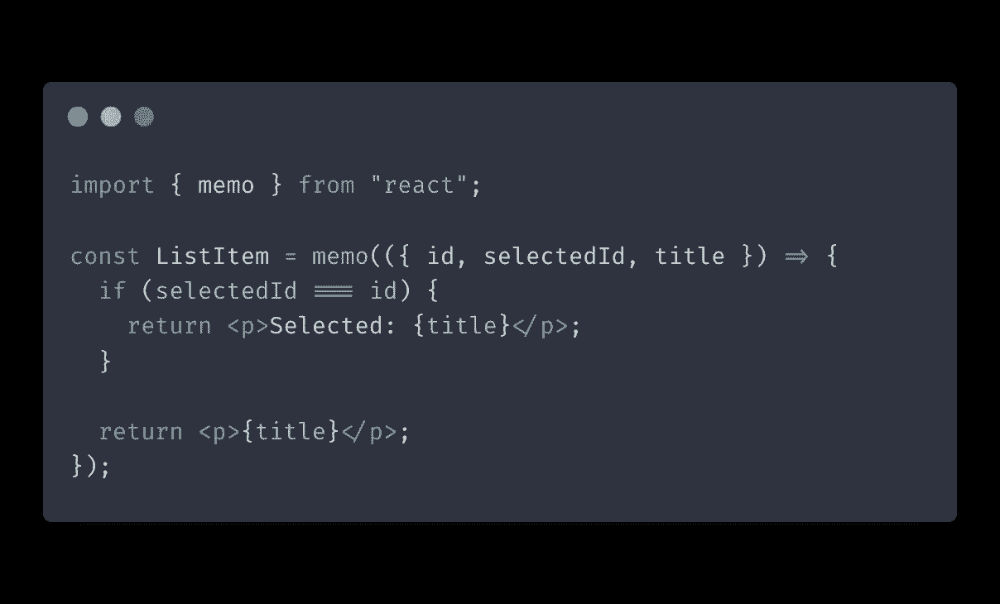
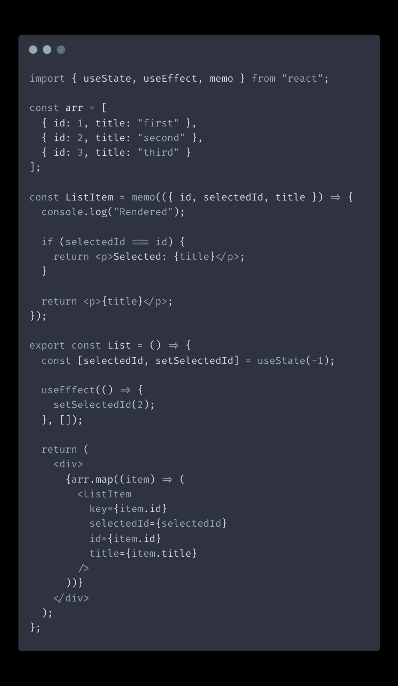
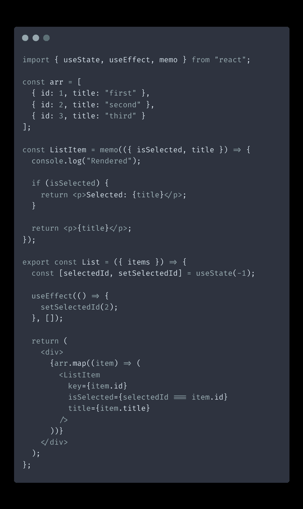
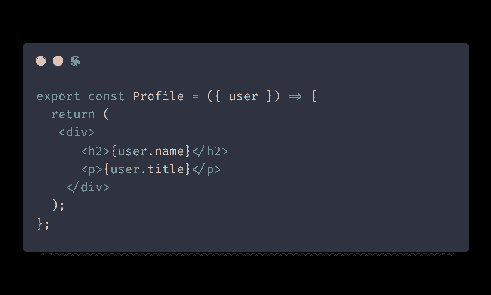
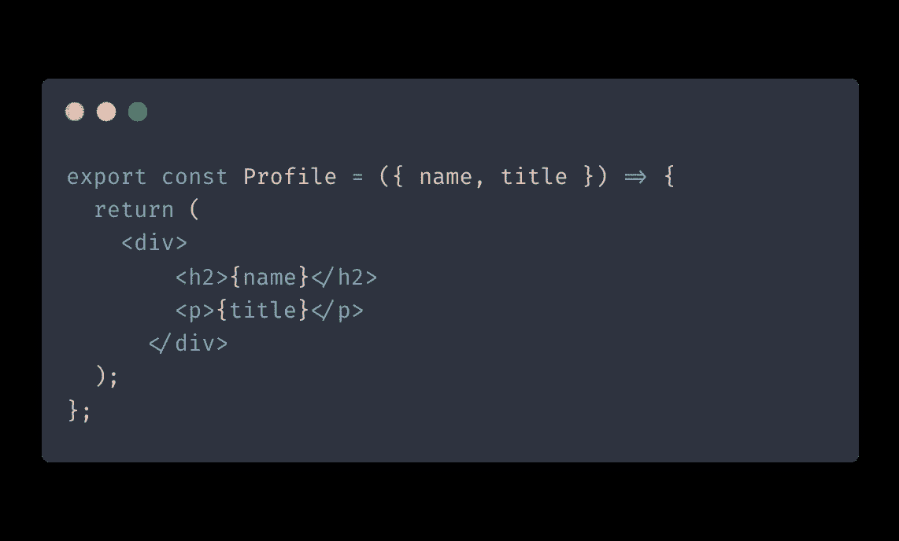
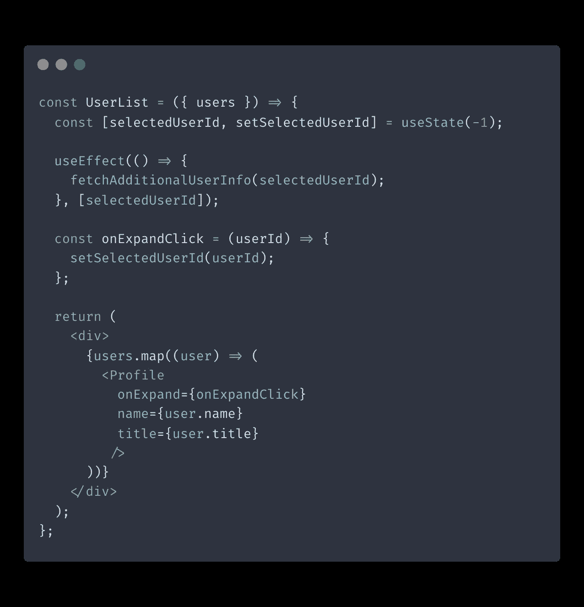
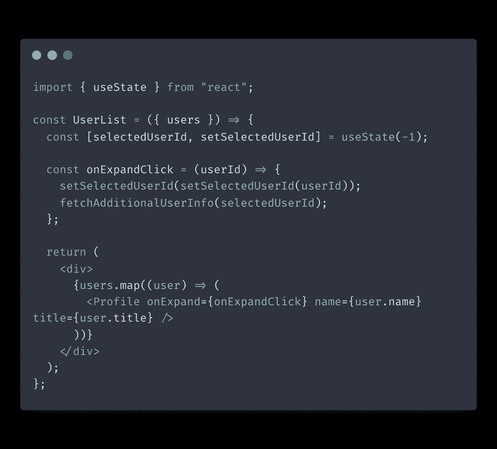

# 反应性能:如何避免冗余的重新渲染

> 原文：<https://itnext.io/react-performance-how-to-avoid-redundant-re-renders-6a33618d92a3?source=collection_archive---------3----------------------->

冗余重渲染是 React 中的常见问题。如果不认真对待，这个问题会迅速恶化您的应用程序的性能。

通过理解和实现这些实践，您可以避免该问题并保持渲染过程平稳运行。

# 备忘录和使用回拨

让我们先来看看你的主要工具箱，它可以减少重复渲染:`memo`和`useCallback`。您应该知道这些实用函数是如何工作的，以便能够优化 React 性能。

memo 是 React library 提供的一个实用方法，用来记忆组件的状态，使它们只在道具改变时才渲染。您需要做的就是用函数包装您的组件声明:

现在，`ListItem`组件将不再像它的父组件那样重新渲染。只有当传递给它的道具改变时，`ListItem`才会重新渲染。这在处理大型列表时尤其有用。每当父列表的状态发生变化时，列表项不会重新呈现。这种调整可以极大地提高用户界面的性能。

那么 [useCallback](https://reactjs.org/docs/hooks-reference.html#usecallback) 呢？在前面的例子中，我们的`ListItem`没有收到任何事件处理程序道具。然而，将事件处理程序从父级传递到子级是一种常见的模式，毫无疑问，在使用 React 时会经常用到。

然而，将事件处理程序传递给内存化组件有一个小问题。事件处理程序通常在父组件内部声明，这意味着它们将在每次父组件声明时重新呈现。这将使用`memo`包装我们的子组件变得无用，因为事件处理程序道具无论如何都会导致它每次都被重新渲染。

这就是`useCallback`的用武之地。这个实用程序方法返回它接收到的任何回调函数的记忆版本。只有当您提供的依赖项发生变化时，它才会重新计算您传递的函数值。

让我们看看如何使用`useCallback`向`ListItem`传递一个事件处理程序，而不会导致多余的重新呈现:

在上面的例子中，我们用`useCallback`包装了`handleClick`事件处理程序。`useCallback`将在初始渲染后记忆我们的处理函数。下一次我们的父列表重新呈现时`useCallback`将返回我们的处理函数的相同记忆版本。`ListItem`组件将因此避免多余的重新渲染，因为它的属性都没有改变。

**注意:**无论何时使用`memo`来减少组件的重渲染，一定要用`useCallback`包装组件接收的事件处理器属性。否则，你的努力是徒劳的。

# 对你的组件要决定的事情要有辨别力

无论何时创建 React 组件，都要记住所给上下文的范围。问问你自己，组件是否真的应该对某些事情做出决定。

例如，组件很少需要决定它们是否应该呈现自己。通常最好由父组件来做这个决定。

在呈现列表时，宁可严格提供列表项运行所需的道具。尽量避免将父级的任何状态变量传递给子级。传递父级的状态变量将导致所有列表项在变量每次更改时重新呈现。随着你的清单越来越大，这种负面影响会越来越大。

相反，尝试根据父对象的更新状态派生出一个基本道具。这样，子组件只需要在图元改变时重新渲染。

让我们来看一个例子:

这里我们有一个`ListItem`，用于显示`List`中的项目。`ListItem`接受`id`、`selectedId`和`title`属性。我们还在每次`ListItem`渲染时将“渲染”一词输出到控制台，以查看它渲染了多少次。请注意，我们还用`memo`包装了`ListItem`，以减少每个项目的重新渲染次数。

为了这个例子，我们在`useEffect`中设置`selectedItemId`到`2`。这样做将在初始渲染后触发父组件的另一次重新渲染。

运行上面的例子后，控制台将总共输出单词“Render”6 次:在每个列表项的初始呈现期间输出 3 次，在调用`setSelectedItemId`时再输出 3 次。

现在让我们看看如何避免多余的渲染:

在这个例子中，`ListItem`接收`isSelected`属性，让它知道项目是否被选中。现在由父`List`组件做出决定。因此，单词“Rendered”将只打印 4 次。这是因为没有选择的项目没有重新渲染，因为它们的道具都没有改变。

虽然将渲染数量从 6 个减少到 4 个似乎没什么大不了的，但是当您处理渲染大量数据并具有相当大的组件树的大型列表时，使用这种方法可以显著提高它们的性能。

# 使用扁平的道具和基本体

这条建议与前一条有关。当传递复杂的数据结构作为道具时，尽量传递扁平化和简化的版本，而不是整个对象。

更好的是，尝试从数据结构中提取组件需要的字段作为原始道具。这将使将来优化组件的性能变得更加容易。

让我告诉你我的意思。假设我们有一个显示用户信息的`Profile`组件:

这个组件没什么特别可怕的。但是，我们应该问自己:“我们真的需要整个传递整个用户对象吗？”

因为我们只使用了对象中的两个字段，所以我们可以接受它们作为原始道具:

如果`user`对象被重新创建，这很容易在组件的生命周期内发生多次，这不会导致我们的`Profile`组件被重新渲染。`Profile`不在乎`user`对象是否被重新创建，只要`title`和`name`字段的值保持不变。现在用`memo`包装`Profile`就容易多了。

# 小心使用效果

[使用效果](https://reactjs.org/docs/hooks-reference.html#useeffect)是你如何进入组件的生命周期。然而，我经常看到它被用在本可以避免的地方。我认为过度使用`useEffect`的主要问题是你的应用会充满意想不到的副作用，这可能会导致冗余的重新渲染，或者更糟糕的是，冗余的服务器调用。

让我们看一个例子。假设我们有一个显示用户资料的`UserList`组件。您可以展开每个配置文件以查看更多信息:

在上面的代码中，我们使用`useEffect`来跟踪何时应该获取额外的信息，但是这有必要吗？一个更简单、更经得起未来考验的解决方案是在扩展点击处理程序中获取附加信息:

这样做更好的主要原因是，随着组件复杂性的增加，你可能会引入其他逻辑来改变`selectedUserId`，但不一定需要请求额外的信息。如果您不小心，您可能会在不希望的情况下触发请求。

经常使用`useEffect`是合理的，甚至可能是唯一可行的解决方案。也就是说，如果你需要`useEffect`，我建议仔细检查一下。有时候你可以依靠其他更安全的触发器，比如用户动作。

# 结论

在这篇文章中，我们看了一些优化 React 渲染过程的实践。通过遵循这些提示，您可以避免不必要的重新渲染，并提高应用程序的性能。希望你觉得有用！

如果你想了解更多关于编写更好的 React 代码的技巧，可以看看我的另一篇文章“[编写干净 React 组件的简单技巧](https://isamatov.com/simple-tips-for-writing-clean-react-components/)”。

如果你想获得更多的网络开发、反馈和打字技巧，可以考虑[在 Twitter 上关注我，](https://twitter.com/IskanderSamatov)我在那里分享我学到的东西。
快乐编码！

*原载于 2022 年 1 月 30 日 https://isamatov.com***。**