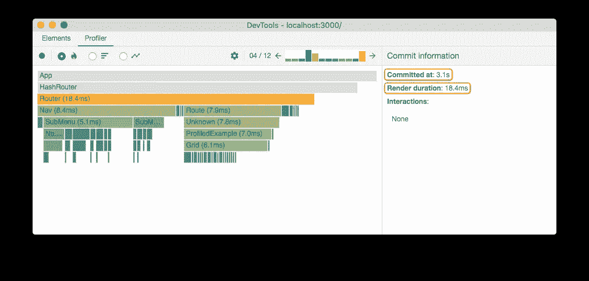
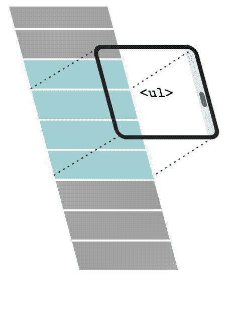

# React 性能优化:提高应用速度的 9 项技术

> 原文：<https://itnext.io/react-performance-optimization-9-techniques-to-boost-application-speed-223c6b73dcab?source=collection_archive---------1----------------------->


尽管 React 提供了许多优势，但优化 React 应用程序的性能可能很棘手。在本帖中，我们将介绍提高 React 应用程序速度的九种技术。

# 避免多余的渲染

冗余渲染是 React 中的一个典型问题，它会迅速降低应用程序的性能。

根据我的经验，务实地规划状态流在大多数时候有助于避免多余的渲染。在编写使用应用程序状态的组件时，需要记住以下几点。

## 尽可能使用派生状态

避免使用状态来存储您可以动态派生的数据。这样做可以简化数据同步，因为派生变量会在源发生变化时自动重新计算。

如果你想了解更多关于这个技巧的内容，可以看看我在[上发表的关于在 React](https://isamatov.com/react-derived-state/) 中派生状态的帖子。

## 对组件要决定的事情要有选择性

请记住您提供给组件的信息。您传递给它们的每个状态片段都可能导致重新呈现。因此，请确保只传递组件运行所需的信息。定期清理或重构你不使用的道具。

## 传递扁平的道具和基本体

不要提供整个对象作为道具，尝试传递扁平和简化的版本。提供复杂、深度嵌套的对象作为道具可能会导致意外的副作用和组件渲染。

使用展平的对象和基本体作为道具简化了将来组件性能的优化。

## 使用备忘录、使用备忘录和使用回调

`memo`、`useMemo`和`useCallback`是用于记忆组件和减少渲染数量的反应效用函数。这三个函数是优化 React 性能的主要工具。

但是要注意在代码中如何以及在哪里应用它们。有时，应用这些功能并没有什么好处。例如，如果您的重新渲染是由频繁更新的上下文引起的，那么用`memo`包装您的组件将无助于减少重新渲染的次数。

如果你想了解更多关于[优化 React 组件](https://isamatov.com/react-avoid-redundant-renders/)中冗余渲染数量的信息，请查看这篇文章。

# 有条件地呈现组件，而不是用 CSS 隐藏它们

这是我最常看到新 React 开发人员犯的错误。如果他们有需要对用户隐藏组件的用例，他们会使用 CSS 道具，比如`opacity`或`visibility`来实现这个目的。

```
const Sample = ({ hidden }) => {
  const visibility = hidden ? "hidden" : "visible"; return <div style={{ visibility }}>Hello there</div>;
};
```

然而，这样做在性能方面是次优的。即使对用户不可见，组件仍然存在于 DOM 中。相反，使用条件逻辑来避免完全呈现组件。

```
const Sample2 = ({ hidden }) => {
  if (hidden) return null; return <div>Hello there </div>;
};
```

# 使用 React 探查器

React Profiler 是一个性能工具，允许您收集有关组件的计时信息。

你可以通过安装 [React 开发工具](https://chrome.google.com/webstore/detail/react-developer-tools/fmkadmapgofadopljbjfkapdkoienihi?hl=en)来使用 React Profiler。
分析器将向你展示应用程序中每个组件渲染的频率以及每次渲染需要多长时间。



然后，您可以使用此信息来优化性能，方法是记住昂贵的组件或完全避免不必要的渲染。

要了解 React Profiler 的更多信息，请查看 React docs 中的[这篇文章。](https://reactjs.org/blog/2018/09/10/introducing-the-react-profiler.html)

# 本地状态 vs Redux

Redux 是一个用于管理应用程序状态的强大库。但是，注意不要过度使用。Redux 非常适合真正的全球数据，如用户会话或应用程序主题。

虽然 Redux 做了一些事情来优化它的性能，但如果你将它用于频繁的事件，如跟踪用户输入，它仍然会对你的应用程序产生影响。

全局状态总是比本地状态慢，所以尽可能使用本地状态。使用本地状态带来正确钻探问题通常可以通过组件组合来解决。如果你感兴趣，这里有一个帖子，我会更详细地介绍 React 的[组件组成。](https://isamatov.com/react-component-composition/)

# 乐观的回应

乐观的反应是当您不等待 API 响应将更改传播到您的 UI 时。这是提高应用程序感知性能的最佳方式之一。

主要思想是发出一个异步请求，同时更新本地状态数据，就好像已经收到了响应一样。

实现这种方法通常会增加状态管理的复杂性。所以首先要考虑复杂度和性能之间的权衡是否值得。

有些 API 库提供乐观响应特性，例如 [Apollo](https://www.apollographql.com/) 。Apollo 是一个 GraphQL 客户端，具有内置的状态管理和缓存功能。

# 网络工作者

Web Worker API 允许独立于主线程运行计算量大的操作。

假设您的应用程序需要运行一个繁重的序列化功能。由于 JavaScript 运行时的单线程特性，运行它会冻结或严重降低应用程序的性能。

相反，您可以使用 web worker 运行您的函数。

一个很好的例子就是处理媒体文件。通常，您希望在保存图像之前对其进行一些处理。也许你想在将用户头像上传到你的云存储之前减小它们的大小，以节省计算成本。像 [sharp](https://github.com/lovell/sharp) 这样强大的图像处理库经常会冻结你的主执行线程，所以最好在单独的 web worker 中运行它们。

# 虚拟列表

当处理大量表格数据时，虚拟列表特别有用。

虚拟列表背后的想法是只呈现需要在屏幕视图内的项目。把它想象成一个即时渲染:



即使你的列表包含数百个项目，应用程序一次也只会呈现十个，当用户滚动时，这些项目会在视图中出现和消失。

react-virtualized 是 react 中实现虚拟列表的一个流行选项。

# 动态导入

动态导入是如何将代码分割添加到应用程序中的。代码分割是一种性能优化技术，用于仅在需要时加载代码片段。代码分割由捆绑器处理，如 Webpack 或 Browserify。

动态导入的基本语法如下:

```
import("./math").then(math => {
  console.log(math.add(16, 26));
});console.log(add(16, 26));
```

当 Webpack 遇到这种语法时，它会自动开始对你的应用程序进行代码拆分。

您可以使用动态导入语法将 React 组件拆分成单独的包。这样，Webpack 将只加载需要在当前视图中呈现的组件。

`React.lazy`还提供了一种 React 特有的方式来对你的应用进行代码拆分。它允许按需延迟加载 React 组件，并暂停呈现组件，直到它们准备好被呈现。

决定在应用程序中的什么地方引入代码分割可能很棘手。您希望选择能够平均分割捆绑包但不会破坏用户体验的位置。

一个好的起点是路线。人们习惯了页面之间的等待时间。按路径分割代码将有助于减少页面加载时间，而不会对用户体验产生负面影响。

要了解关于代码分割和动态导入的更多信息，请查看 React docs 中关于代码分割的这篇文章[。](https://reactjs.org/docs/code-splitting.html)

# 使用片段

React 片段允许您对一系列子节点进行分组，而无需向 DOM 添加额外的节点。React 要求每个组件都有一个根节点。很多人默认使用 div 来实现这个目的，但这并不总是最好的选择。大量的 div 会阻碍你的应用程序的性能。

片段允许您将多个 React 节点分组，而无需向 DOM 添加额外的节点，从而让您避开了这个问题。React 在渲染过程中将片段合并到父 DOM 中。

# 结论

React 性能优化可能很棘手，但是遵循这些简单的技术将帮助您提高应用程序的速度。

如果你想获得更多的网络开发、反馈和打字技巧，可以考虑[在 Twitter](https://twitter.com/IskanderSamatov) 上关注我，我在那里分享我学到的东西。
编码快乐！

*原载于 2022 年 2 月 28 日*[](https://isamatov.com/react-optimizing-performance/)**。**