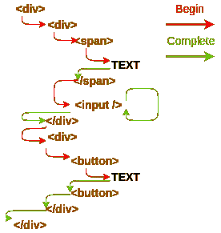
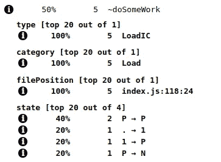
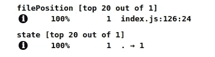

# 反应性能技巧

> 原文：<https://itnext.io/react-performance-tricks-why-is-it-so-fast-6ece8ade9762?source=collection_archive---------3----------------------->


## React 如何能够如此快速地执行，并且对开发人员来说仍然保持灵活性？

> *这篇文章需要关于形状和内联缓存的基本知识。如果你没有看过* [*V8 函数优化*](https://medium.com/@kemalpiro/v8-function-optimization-2a9c0ececf5e) *，可能很难跟上这一条。*

每当有人谈论 React 中的“性能”时，通常都是关于虚拟 DOM 的。这是 React 的重要部分，但我们今天将关注其他内容(仍然相关)。

# 纤维

在 2017 年 F8 会议上，React 宣布对其核心算法进行重大重写。这就是`Fiber`的由来。但是纤维到底是什么？

一个`Fiber`是一个组件上需要完成或者已经完成的工作。(另一个词“用于处理的包装”)。创建纤程有不同的方法，但它们都有相同的数据结构(这对我们很重要)。这些只是其中的一部分:

```
createWorkInProgress
createHostRootFiber
createFiberFromTypeAndProps
createFiberFromElement
createFiberFromFragment
...
```

> *你可以在这里* 查看纤维的外观[](https://github.com/facebook/react/blob/master/packages/react-reconciler/src/ReactFiber.js#L118)

*我们不打算深入讨论光纤内部结构(下次吧)。重要的是，React 使用这些容器，而不是直接操作组件。*

*现在让我们看看当我们返回 JSX 时 react 会做什么:*

```
*return <Layout>{children}</Layout>;*
```

*这就转化成了:*

```
*React.createElement(Layout, props, children);*
```

*创建了 ReactElement，这是另一种容器。*

# *简化 React 内部*

*我将稍微简化一下 React 的内部结构，以便更容易理解它的功能。除此之外，我将为`FiberNode`使用一个类而不是函数:*

```
*class Component {
  constructor() {
    this.name = 'Component';
  }

  render() {}
}

class MyComponent1 extends Component {
  render() {
    return '<span>Test 1</span>';
  }
}

class MyComponent2 extends Component {
  render() {
    return '<span>Test 2</span>';
  }
}

class MyComponent3 extends Component {
  render() {
    return '<span>Test 3</span>';
  }
}

function createElement(element, ...rest) {
  return {
    type: element,
  };
}*
```

*这是我们的组件类，看起来应该很熟悉，而`createElement`返回类似结构的元素(过于简化)。*

```
*const ReactWorkTags = {
  ClassComponent: 1,
  HostComponent: 5,
};

class FiberNode {
  constructor(tag, ...rest) {
    this.tag = tag;
    // Other important staff...
  }
}

const createFiberFromElement = function(element, ...rest) {
  // another simplification, there are different WorkTags
  const fiberTag =
    typeof element.type === 'string'
      ? ReactWorkTags.HostComponent
      : ReactWorkTags.ClassComponent;
  const fiber = new FiberNode(fiberTag, ...rest);
  fiber.type = element.type;

  return fiber;
};*
```

*这里我们有一个`FiberNode`的定义和一种创建它的方法。重要的是要知道，当传递我们的元素时，从该元素创建的 FiberNode 与任何其他 FiberNode 具有相同的形状(即使我们使用不同的组件类型)。*

```
*const comp1 = createElement(MyComponent1);
const comp2 = createElement(MyComponent2);
const comp3 = createElement(MyComponent3);
const comp4 = createElement('div');

const fiber1 = createFiberFromElement(comp1);
const fiber2 = createFiberFromElement(comp2);
const fiber3 = createFiberFromElement(comp3);
const fiber4 = createFiberFromElement(comp4);

console.log(%HaveSameMap(fiber1, fiber2)); // true
console.log(%HaveSameMap(fiber1, fiber3)); // true
console.log(%HaveSameMap(fiber1, fiber4)); // true
console.log(%HaveSameMap(fiber2, fiber3)); // true
console.log(%HaveSameMap(fiber2, fiber4)); // true
console.log(%HaveSameMap(fiber3, fiber4)); // true*
```

*如果您只是手动生成这些组件并为其分配附加属性，会发生什么情况？*

```
*const comp1 = new MyComponent1();
const comp2 = new MyComponent2();

console.log(%HaveSameMap(comp1, comp2)); // false*
```

# *这如何帮助我们更快地运行代码*

*正如您可能知道的那样，每次 React 发生变化时，它都必须经过协调过程。调和就是用纤程算出下一棵树。它是如何工作的？*

*在`ReactFiberWorkLoop`内部，一切都进入`workLoopSync`(或`workLoop`)。之后的`performUnitOfWork`被称为带“顶”的光纤。`performUnitOfWork`正在做三件事之一:*

*   *没有任何东西*
*   *用电流`unitOfWork`呼叫`beginWork`(光纤)*
*   *用电流`unitOfWork`调用`completeUnitOfWork`(也是光纤)*

*最后，它返回 null 或这两个函数之一的结果(令人惊讶的是…它是纤程)。*

*从这一点来看，协调器只是使用`performUnitOfWork`在所有纤维上循环，并等待直到`workInProgress`为空。*

*重要的是，React 不使用递归来遍历树。他们使用简单的 while 循环来避免大的堆栈(也许如果我们能把 PTC 放到 JS 中，那就不一样了)。*

```
*while(sthToDo !== null) {
    sthToDo = doSomeWork(sthToDo)
}*
```

**

> **React 对简单的“文本”节点进行了额外的优化，以避免创建额外的元素**

*这就是我们可以在 React 结构中找到优化的地方。*

*因为所有这些都足够复杂，所以让我们用简化的结构来检查函数被调用数千次时的行为:*

```
*function doSomeWork(unitOfWork) {
	let result = '';
    // I realize that is stupid but just to make a point of doing sth
	for(let i=0; i<1000; i += 1) {
		result += unitOfWork.name;
	}
	return unitOfWork.nextFiber;
}*
```

*我知道我们不是指返回的`unitOfWork`，但这只是运行`doSomeWork`多次。*

```
*// testComp.js
const N = 100000;

const startComp = Date.now();
for(let i=0; i<N; i += 1) {
	doSomeWork(comp1);
	doSomeWork(comp2);
	doSomeWork(comp3);
	doSomeWork(comp4);
	doSomeWork(comp5);
}
console.log("test with components:", Date.now() - startComp, "ms.");// testFiber.js
const N = 100000;

const startFiber = Date.now();
for(let i=0; i<N; i += 1) {
	doSomeWork(fiber1);
	doSomeWork(fiber2);
	doSomeWork(fiber3);
	doSomeWork(fiber4);
	doSomeWork(fiber5);
}
console.log("test with fibers:", Date.now() - startFiber, "ms.");*
```

*结果:*

```
*test with components: 4186 ms. 
test with fibers: 2431 ms.*
```

*为什么结果不一样？主要是因为`FiberNode` wrapper。每次调用函数 V8 都会创建一个名为`Inline Cache` (IC)的东西。当具有相同`Shape`的对象被传递给 IC 时，IC 用于优化函数执行。你可能还记得我们的纤维有相同的图谱:*

```
*console.log(%HaveSameMap(fiber1, fiber2)); // true*
```

*而我们的组件却没有*

```
*console.log(%HaveSameMap(comp1, comp2)); // false*
```

*因为这个简单的事情，V8 不能为组件优化`doSomeWork`*

**

*但对纤维来说可以*

**

*如果你看上面的截图，你会注意到第一次 V8 经历了`premonomorphic (.) -> monomorphic (1) -> polymorphic (P)-> megamorphic (N)`状态，但第二次停留在`premonomorphic (.) -> monomorphic (1)`状态。在我的[上一篇文章](https://erdem.pl/2019/08/v-8-function-optimization#back-to-our-function)中，我描述了优化在 V8 中是如何工作的。这里我们必须处理**巨形**函数，这意味着它不会被引擎优化，另一方面，我们有**单形**函数，它针对给定的形状(纤维的形状)进行优化。因此，即使有一个额外的层(更复杂的对象)，一个函数可能会执行得更快。*

# *结论*

*这只是 React codebase 内部进行的众多优化之一。描述这个的原因是因为它在 React 之外很有用。Angular 对一个叫做`View Nodes`的东西使用了同样的方法。您甚至可能希望在我们自己的应用程序中实现这种结构。*

*我必须为过分简化反应结构道歉。我真的鼓励你去看看，看看`workLoop`到底是如何工作的。我的观点是，即使您必须处理许多不同的组件，也有一种方法可以通过创建“特殊”容器而不是直接传递组件来加速函数的执行。*

*如果你想在你的机器上运行那个代码[看看这个要点](https://gist.github.com/burnpiro/fec834b8473ffecd439ae5c98855bc61)。随意修改组件或`FiberNode`实现，看看会发生什么。*

*ofc，祝你今天过得愉快:)*

**最初发布于*[*https://erdem . pl*](https://erdem.pl/2019/08/react-performance-tricks)*。**