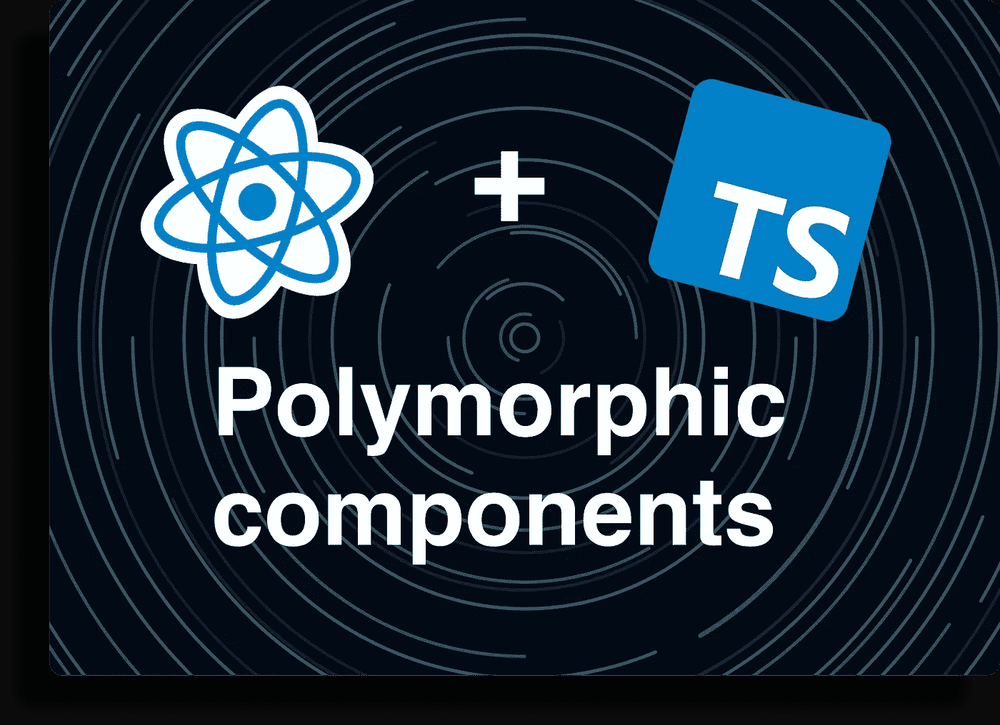
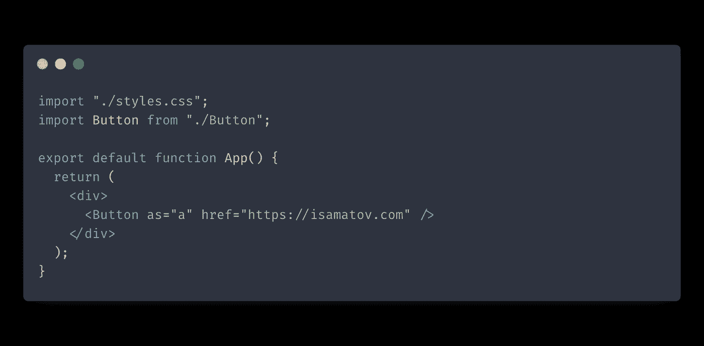
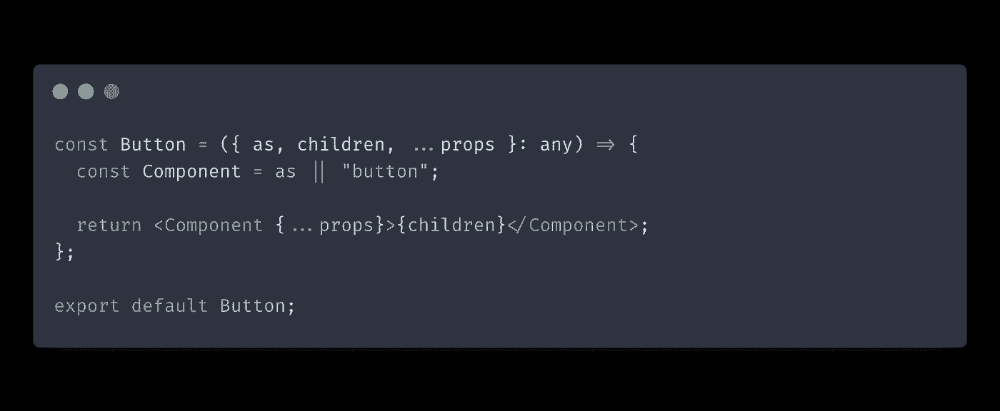
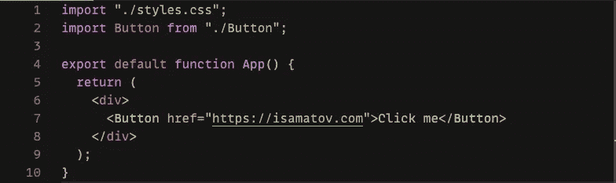
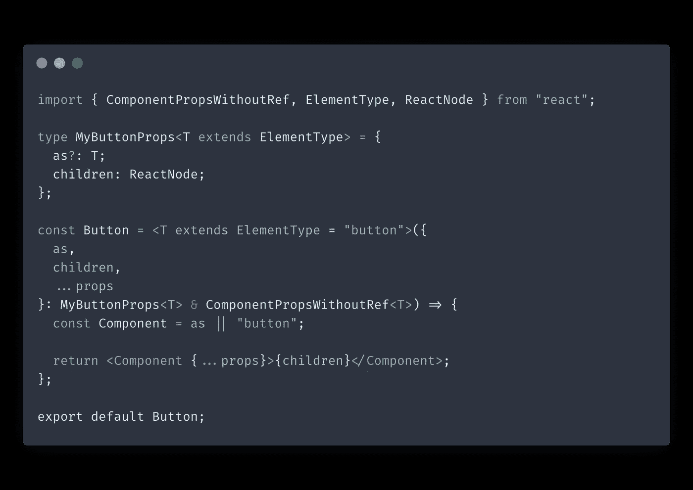
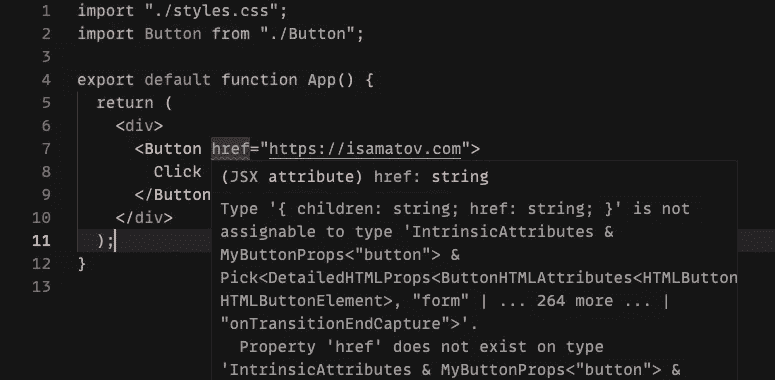
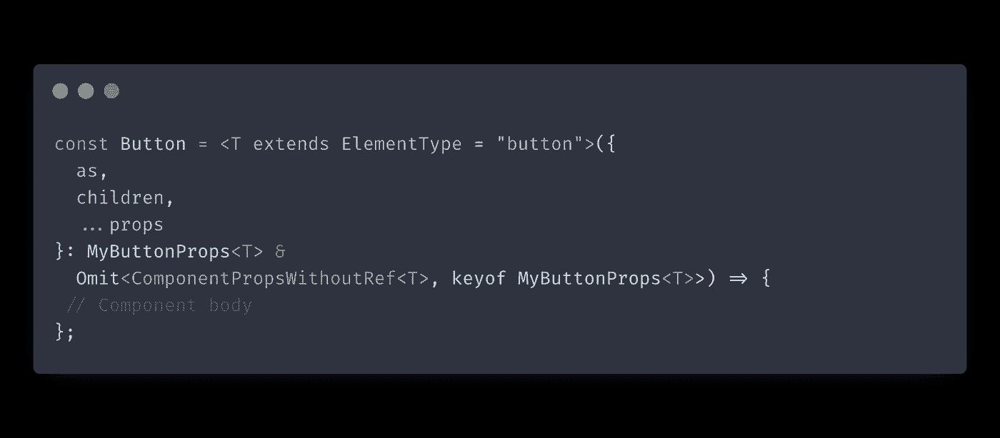

# 用类型脚本反应多态组件

> 原文：<https://itnext.io/react-polymorphic-components-with-typescript-f7ce72ea7af2?source=collection_archive---------2----------------------->

多态组件是一种流行的反应模式。即使您从未听说过它，您也很可能在代码中遇到过它。简而言之，该模式允许您指定使用哪个 HTML 标记来使用`as` prop 呈现组件。

多态组件的灵活性也使得它很容易被误用，这就是 TypeScript 可以帮助我们的地方。让我们看看如何使用 TypeScript 和泛型来编写强类型多态组件。

## 多态组件概述

首先，让我们看看如何使用多态组件。假设您有一个想要呈现为 HTML 链接的`Button`组件。如果`Button`是多态组件，可以这样写:

我们的按钮将呈现为`a`标签，并接受与`a`标签相同的道具，如`href`。

## 简单实现

现在让我们开始实现。如果没有类型检查，该模式很难实现:

在上面的例子中，我们通过将组件 props 类型设置为`any`来避免任何类型检查。

下面是让我们的模式工作的代码行:

`const Component = as || "button";`

我们使用`as`属性的值或者使用`button`标签作为后备来呈现我们的组件。这就是我们使这个实现工作所需的全部内容。

这种方法的问题是没有机制来防止客户端传递不正确的属性:

我们指定了属于`a`标签的`href`属性，而没有设置我们的`as`属性。理想情况下，TypeScript 会立即捕捉到这个错误，我们会看到一个错误。

## 使用 TypeScript 进行类型检查

我们的下一步是加强对组件的属性类型检查。

上面的代码引入了泛型。我们在下面的代码行中使我们的组件通用化:

`const Button = <T extends ElementType = "button">`

元素类型是 React 的一个实用类型。我们将泛型参数`T`设置为 ElementType，以确保我们的按钮只接受 HTML 标签和其他 React 组件类型。

我们将`T`传递给`MyButtonProps`类型，它存储我们手动定义的属性。在`MyButtonProps`中，我们将`as`道具的类型设置为`T`，这将它们粘合在一起。

`Button`道具的最终类型是`MyButtonProps<T> & ComponentPropsWithoutRef<T>`。这个类型是我们手动指定的道具和[ComponentPropsWithoutRef](https://react-typescript-cheatsheet.netlify.app/docs/advanced/patterns_by_usecase/#wrappingmirroring-a-html-element)的组合。`ComponentPropsWithoutRef`是 React 库中的一个类型，包含 React 组件的一组基本道具。

此时，我们的`Button`组件可以根据`as`的值动态计算它接受的道具。如果我们早点尝试我们的客户端示例，我们会看到一个我们应该看到的错误:

错误信息错综复杂，但重要的部分是:`Property 'href' does not exist on type 'IntrinsicAttributes & MyButtonProps<"button">`。

我们的`Button`组件不再接受`href`属性，因为它没有将自己呈现为链接。如果我们加上`as="a"`，误差就消失了。

## 避免名称冲突

我们的组件看起来不错，但是还有一点需要改进。我们要确保我们手动指定的道具和`ComponentPropsWithoutRef`提供的道具之间没有名称冲突。名称冲突会导致令人困惑的类型脚本警告。

修复错误很简单:我们需要做的就是调整组件道具的最终类型，以使用[省略](https://www.typescriptlang.org/docs/handbook/utility-types.html#omittype-keys):

`Omit`是一个 TypeScript 实用程序，它通过从`ComponentPropsWithoutRef`中排除`MyButtonProps`中的任何属性键来构造一个新类型。使用`Omit`，我们确保避免了两种类型之间的名称冲突。查看我的帖子，了解更多关于在 React 中有用的 [TypeScript 实用程序类型。](https://isamatov.com/typescript-utility-types-for-react)

现在我们的`Button`组件准备好了！

## 结论

在这篇文章中，我们学习了使用 TypeScript 和泛型来编写强类型多态组件。

一般来说，使用这种方法并在 React 中使用 TypeScript 肯定需要更多的前期工作。但最终这一切都是值得的，因为我们通过在代码中提供额外的保证来改善我们的开发体验。

感谢您的阅读。

*原载于 2021 年 8 月 22 日*[*【https://isamatov.com】*](https://isamatov.com/polymorphic-components-react-typescript/)*。*