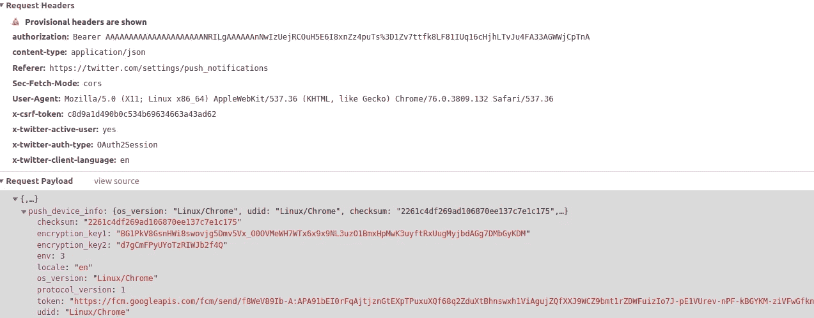
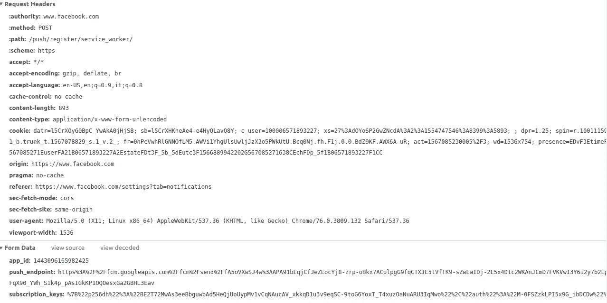
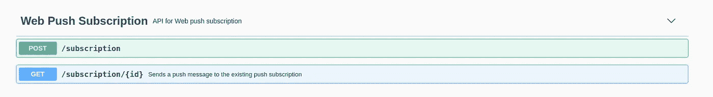
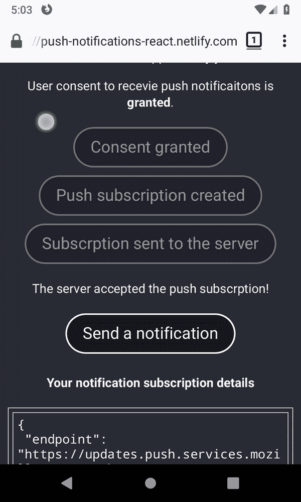

# 反应推送通知(带挂钩)

> 原文：<https://itnext.io/react-push-notifications-with-hooks-d293d36f4836?source=collection_archive---------0----------------------->

## react . js Javascript 推送通知入门指南

## 推送通知如何工作以及如何回应

这篇文章是使用*钩子*创建*推送通知*和*反应*的指南。结束时，您将创建一个有效的推送通知系统。在此期间，您可以玩[演示](https://push-notifications-react.netlify.app/)或浏览最终结果的[源代码](https://github.com/Spyna/push-notification-demo)。

我最近用普通 JavaScript 写了一篇关于 Web 推送通知的文章，这是 React 版本。如果你想知道推送通知的理论和流程，我建议你读一下那篇文章，这样我们就可以直接跳到代码了。

本文分为两部分:

1.  处理*推送通知*
2.  处理*反应 app*

# 处理推送通知


照片由[蒂姆·莫斯霍尔德](https://unsplash.com/@timmossholder?utm_source=medium&utm_medium=referral)在 [Unsplash](https://unsplash.com?utm_source=medium&utm_medium=referral) 上拍摄

要使用推送通知，您必须:

*   检查浏览器是否支持通知
*   注册服务人员
*   请求用户许可
*   (可选)创建一个*通知订阅*
*   (可选)将订阅发送到*推送服务器*
*   显示*推送通知*

好像很多东西，先说第一个吧。

## 检查浏览器是否支持通知

您希望仅在浏览器支持时使用通知。创建一个执行这项检查的函数。

```
function isPushNotificationSupported() {
  return "serviceWorker" in navigator && "PushManager" in window;
}
```

该函数检查`PushManager`和`serviceWorker`是否存在。它返回真或假；

我们需要一个`serviceWorker`来处理通知，所以接下来要做的就是注册一个。

## 注册服务人员

这个函数注册了一个文件`sw.js`，它应该在我们项目的根目录下，所以在我们的 react-app 的文件夹`public`中。就目前而言，它将是一个空文件。

```
function registerServiceWorker() {
  return navigator.serviceWorker.register("/sw.js");
}
```

该函数返回一个解决`serviceWorkerRegistration`的承诺。

## 请求用户许可

没有用户的同意不能发送通知，让我们创建一个询问许可的函数。

```
async function askUserPermission() {
  return await Notification.requestPermission();
}
```

该函数返回用户同意的结果，可以是:`default`、`denied`和`granted`中的一个。`default`表示用户没有给出任何响应。

如果这个函数的结果是`granted`，我们可以进入下一步。

## 推还是不推？

此时，我们正处于十字路口！我们必须决定是否要:

*   (只是)显示通知
*   (发送)推送通知


乔恩·泰森在 [Unsplash](https://unsplash.com?utm_source=medium&utm_medium=referral) 上的照片

推送通知是你可能在 Twitter、脸书、WhatsApp 和类似的应用上看到的那些。当你的朋友给你写消息时，你会收到通知，即使脸书或 WhatsApp 没有打开。

如果需要这种通知，继续阅读，否则可以跳过接下来的章节，直接阅读关于“发送通知”的部分。

## 创建通知订阅

要接收推送通知，您需要:

*   ***推送服务*** :管理和接收通知(浏览器提供推送服务)
*   一个 ***推送订阅*** :提供订阅 URL 端点，允许取消订阅推送服务。
*   a ***推送服务器*** :向推送订阅端点发送推送消息的服务器，由浏览器*推送服务处理。*

为了创建推送订阅，我们使用之前注册的服务工作者。

```
async function createNotificationSubscription() {
  //wait for service worker installation to be ready
  const serviceWorker = await navigator.serviceWorker.ready;
  // subscribe and return the subscription
  return await serviceWorker.pushManager.subscribe({
    userVisibleOnly: true,
    applicationServerKey: pushServerPublicKey
  });
}
```

指令`navigator.service.worker.ready`等待服务人员准备好使用，因为在我们注册后，它可能处于其他状态，如`waiting`、`installing`。如果注册失败，这个承诺永远无法解决。

我们使用`[PushManager](https://developer.mozilla.org/en-US/docs/Web/API/PushManager)`接口来创建订阅，并向方法`subscribe`传递两个参数:

*   `userVisibleOnly`:布尔值，表示返回的推送订阅将仅用于其效果对用户可见的消息。
*   `applicationServerKey`:一个 [ECDSA](https://en.wikipedia.org/wiki/Elliptic_Curve_Digital_Signature_Algorithm) (椭圆曲线数字签名算法)P-256 公钥，推送服务器将用它来认证你的应用。如果指定，来自应用程序服务器的所有消息都必须使用 [VAPID](https://tools.ietf.org/html/rfc8292) 身份验证方案，并包含用相应私钥签名的 JWT。这个密钥 ***与您用来加密数据的密钥*** 不同。

稍后我将向您展示如何为推送服务器(私有的)和应用程序(公共的)创建一个密钥对(私有的和公共的)。

该函数返回`PushSubscription`，一个包含推送服务器/服务的惟一端点的对象，以及一些其他信息。每个浏览器使用不同的推送服务，生成不同的端点。在 chrome 中，端点将类似于:

```
[https://fcm.googleapis.com/fcm/send/fXjr1iIPn00:.....](https://fcm.googleapis.com/fcm/send/fXjr1iIPn00:.....)
```

在 firefox 中

```
[https://updates.push.services.mozilla.com/wpush/v2/gAAAAABdZ80ZW5...](https://updates.push.services.mozilla.com/wpush/v2/gAAAAABdZ80ZW5...)
```

如果我们向该端点发送推送消息，我们会收到推送通知，因此不要将其发送给陌生人。端点和推送订阅的信息需要被发送到*推送服务器*，以便它可以使用它来发送消息。

## 将订阅发送到推送服务器

没有标准的方式将推送订阅发送到*推送服务器*。

Twitter 使用其 API 传递一个 JSON，如下所示:



Twitter 传递这些数据来订阅推送服务器。请注意身份验证标头

脸书使用了一种形式:



脸书用来向推送服务器发送订阅的网络请求

需要注意的是，它们都发送订阅端点，并且提交是安全的。

在本教程中，我们将使用一个我构建并部署在互联网上的演示推送服务器。我的推送服务器很虚设，没有认证，也不保存你的订阅数据。源代码是公开的，你可以在这里找到它。



演示推送服务器的 API

你可以在这个地址使用它[，它公开了两个端点:](https://push-notification-demo-server.herokuapp.com/api-docs/#/)

*   `POST /subscription`:领取订阅。
*   `GET /subscription/{id}`:触发所请求订阅的推送通知。

演示推送服务器是在 node 中用一个名为 [web-push](https://www.npmjs.com/package/web-push) 的库实现的，我用这个库创建了订阅的公钥。要知道如何自己创建一个，请看一下这个库。

让我们创建一个调用推送服务器的函数。

```
async function postSubscription(subscription) {
  const response = await fetch(`[https://push-notification-demo-server.herokuapp.com/subscription`](https://push-notification-demo-server.herokuapp.com/subscription`), {
    credentials: "omit",
    headers: { "content-type": "application/json;charset=UTF-8", "sec-fetch-mode": "cors" },
    body: JSON.stringify(subscription),
    method: "POST",
    mode: "cors"
  });
  return await response.json();
}
```

参数`subscription`正是我们之前创建的函数`createNotificationSubscription`的响应。

一旦你向*推送服务器*发送订阅，它就会向*推送服务*(浏览器的)发送*推送消息*。

## (发送推送消息)

推送服务器公开了`GET /subscription/{id}`端点，该端点触发通知并发送推送消息。服务器的代码是这样的:

```
...
sendNotification(
      pushSubscription,
      JSON.stringify({
        title: "New Product Available ",
        text: "HEY! Take a look at this brand new t-shirt!",
        image: "/images/jason-leung-HM6TMmevbZQ-unsplash.jpg",
        tag: "new-product",
        url: "/new-product-jason-leung-HM6TMmevbZQ-unsplash.html"
      })
    )
...
```

该代码片段向推送订阅的端点发送推送消息，该消息的有效负载包含一个对象的字符串表示，该对象具有:`title`、`text`、`image`、`url`、`tag`和`url`。所有这些信息都被插入到推送消息中并被发送。这意味着当推送服务(应用程序)收到消息时，它可以访问它们。

## 接收推送消息

当从*推送服务器*发送*推送消息*时，服务人员可以阅读该消息。要做到这一点，您必须在服务工作器中为推送事件创建一个监听器，让我们在服务工作器文件中完成这项工作。

```
function receivePushNotification(event) {
  console.log("[Service Worker] Push Received.");const { image, tag, url, title, text } = event.data.json();const options = {
    data: url,
    body: text,
    icon: image,
    vibrate: [200, 100, 200],
    tag: tag,
    image: image,
    badge: "[/favicon.ico](https://spyna.it/icons/favicon.ico)",
    actions: [{ action: "Detail", title: "View", icon: "[https://via.placeholder.com/128/ff0000](https://via.placeholder.com/128/ff0000)" }]
  };
  event.waitUntil(self.registration.showNotification(title, options));
}
self.addEventListener("push", receivePushNotification);
```

这个代码片段向`push`事件添加了一个`eventListener`。侦听器是一个使用推送事件的函数。方法`event.data.json()`将消息有效负载转换成一个对象。接下来，方法`selft.registration.showNotification`向用户设备显示通知。这些选项是不言自明的，你可以在这里找到它们。

用户可以点击通知。要接收用户点击，您需要在服务工作器中添加一个监听器:

```
function openPushNotification(event) {
  console.log("Notification click Received.",    event.notification.data);
   event.notification.close();
  //do something
}
self.addEventListener("notificationclick", openPushNotification);
```

# 把东西放在一起

我们已经学会了如何:

*   检查浏览器是否支持*推送通知*
*   注册服务人员
*   请求用户同意显示*推送通知*
*   创建*推送通知订阅*
*   向*推送服务器*发送*推送通知订阅*
*   在*服务器*中接收*推送消息*并显示
*   处理*通知点击*事件

下面是包含所有这些函数的代码:

这个脚本还包含返回当前推送通知订阅的函数`getUserSubscription`(如果有的话),我们将在本文的第二部分使用它。

这是服务人员的代码`sw.js`

推送通知部分到此为止，下面开始 React 部分。

# 创建 React 应用

第二步也是最后一步:创建一个 React 应用程序。


奥斯卡·伊尔迪兹在 [Unsplash](https://unsplash.com?utm_source=medium&utm_medium=referral) 拍摄的照片

创建 React 应用程序的最快方法是使用`create-react-app`，运行:

```
npm install -g create-react-app
# alternatively use npxcreate-react-app push-notifications
# npx create-react-app push-notificationscd push-notifications
npm run eject
```

可选地，你可以运行`eject`脚本，这允许你对应用程序有更多的控制。

接下来，我们将创建:

*   使用`push-notification.js`中定义的函数的自定义*反应钩子*
*   使用自定义钩子的*反应*表示*组件*。

## 钩子

创建一个名为`usePushNotifications.js`的文件，并将其放在 source 文件夹中。

这是完整的注释代码:

它的作用:

*   检查浏览器是否支持推送通知
*   如果支持推送通知，会注册服务人员
*   检索已注册服务工作线程是否有任何推送通知订阅
*   定义一个点击处理程序`onClickAskUserPermission`来询问用户权限，并将其导出，这样就可以在组件中使用了
*   定义并导出点击处理程序`onClickSubscribeToPushNotification`来创建推送通知订阅。
*   定义并导出一个点击处理程序`onClickSendSubscriptionToPushServer`，它将*推送订阅*发送到*推送服务器。*
*   定义并导出点击处理程序`onclickSendNotification`，它请求*推送服务器*发送*推送消息*。

这个钩子函数不接受任何参数，返回一个包含组件使用推送通知所需的所有内容的对象。

使用析构，你可以这样使用它:

```
const {
    userConsent,
    pushNotificationSupported,
    userSubscription,
    onClickAskUserPermission,
    onClickSusbribeToPushNotification,
    onClickSendSubscriptionToPushServer,
    pushServerSubscriptionId,
    onClickSendNotification,
    error,
    loading
  } = usePushNotifications();
```

相当于`const usePushNotifications = usePushNotifications()` `const userConsent = usePushNotifications.userConsent`。

## 反应组分

现在我们已经有了所有的“业务逻辑”,我们可以为演示创建一个 React 组件。

让我们从导入所有需要的东西开始:

```
import React from "react";
import usePushNotifications from "./usePushNotifications";export default function PushNotificationDemo() {
  const {
    userConsent,
    pushNotificationSupported,
    userSubscription,
    onClickAskUserPermission,
    onClickSusbribeToPushNotification,
    onClickSendSubscriptionToPushServer,
    pushServerSubscriptionId,
    onClickSendNotification,
    error,
    loading
  } = usePushNotifications();return <div></div>;
}
```

接下来，我们想要显示一个错误或者一个加载消息，当东西正在加载的时候，当有一个错误的时候。在`return <div></div>`之前增加以下内容:

```
if (**error**) {
  return  (
    <section className="app-error">
      <h2>{error.name}</h2>
      <p>Error message : {error.message}</p>
      <p>Error code : {error.code}</p>
    </section>)
}if (**loading**) {
  return "Loading, please stand by";
}
```

接下来，我们要展示的是同意是否被授予，以及推送通知是否被支持，以及询问用户同意的按钮。用以下内容替换`return <div></div>`:

```
return (
    <div>
      <p>Push notification are {!**pushNotificationSupported** && "NOT"} supported by your device.</p>
      <p>
        User consent to recevie push notificaitons is <strong>{**userConsent**}</strong>.
      </p>
      <button onClick={**onClickAskUserPermission**}>Ask user permission</button>
    </div>
  );
```

接下来，我们添加按钮来创建通知订阅:

```
<button onClick={**onClickSusbribeToPushNotification**}>Create Notification subscription</button>
```

接下来，轮到发送通知订阅的按钮了

```
<button onClick={**onClickSendSubscriptionToPushServer**}>Send subscription to push server</button>
```

最后是发送通知的按钮

```
<button onClick={**onClickSendNotification**}>Send a notification</button>
```

这是完整的代码:

在不到 40 行代码中，您就拥有了一个完整管理推送通知的干净组件。

添加一些风格和一些小的改进，我想出了这个演示，你可以在 https://push-notifications-react.netlify.app/的[玩。或者，如果你更喜欢阅读代码，它可在本次回购](https://push-notifications-react.netlify.app/)中[获得。](https://github.com/Spyna/push-notification-demo/tree/master/front-end-react)



最终结果是:推送通知起作用了

恭喜你！！😎你坚持到了最后。如果你喜欢👌这篇文章，点击下面按钮👏。这对我意义重大，也有助于其他人了解这个故事。

洛伦佐·斯皮纳的更多故事:

[](/an-introduction-to-web-push-notifications-a701783917ce) [## JavaScript 网页推送通知简介

### 如何实现 Web 推送通知，初学者入门，让推送通知简单易懂。与……

itnext.io](/an-introduction-to-web-push-notifications-a701783917ce) [](https://medium.com/@spyna/the-truth-about-amazon-job-interview-b940a2190585) [## 如何在亚马逊找到工作

### 我们听说了很多关于亚马逊招聘流程的故事，有些是真的，有些不是。我想分享我的…

medium.com](https://medium.com/@spyna/the-truth-about-amazon-job-interview-b940a2190585) 

感谢[艾迪刘](https://medium.com/u/bbd794a7fa3a?source=post_page-----d293d36f4836--------------------------------)的错别字纠正。