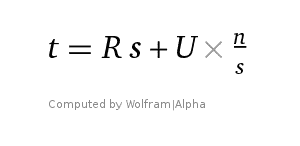
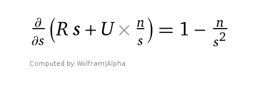
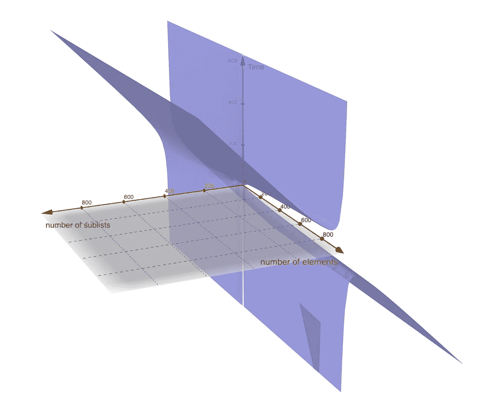

# 反应，还原和一点点数学。

> 原文：<https://itnext.io/react-redux-and-a-little-bit-of-math-fe2c9a4a477c?source=collection_archive---------6----------------------->

TLDR；在这个故事中，我想展示前端工程可以是非常理论化和精确的。

在 [Holloway](http://holloway.com/) ，我们试图在网上创造最好的长格式文本阅读体验，它包括在一页上一次性呈现整本书，因为我们想给用户在任何给定时间以任何方式“翻转”(滚动)我们的书的自由。

显然，具有交互性的非分页长阅读内容呈现起来有点困难。我们有很多工具提示、建议、书签，而且每周我们都会增加一些。

我今天要谈的一个挑战是让每个段落组件实例总是连接到 redux 状态。我们的新功能——高光需要它。

## 问题是

我们最小的指南之一，[股权补偿](https://www.holloway.com/g/equity-compensation/)，有 600 多个段落，用户可以添加书签，添加建议或高亮显示其中的任何一个，这是可能的，因为每个段落组件实例都连接到 redux 并准备接收更新。

但是，将每个段落连接到 redux 会大大降低页面性能，每个 redux 操作都会触发 600 多次连接组件检查往返。

高级连接有一点帮助，但仍然会有 600+稍微更快的每次商店更新的往返，我们不希望这样。

虚拟滚动将有助于减少页面上的段落数量，但由于长格式文本阅读体验的独特功能，它需要的不仅仅是放入几个侦听器并在用户滚动时呈现内容(这并非不可能，但比看起来更难)。

首先，我们需要定义什么是高效或廉价的操作，什么不是。如果我们有一个永远不会变异的状态，那么新旧状态的简单比较将非常便宜(`===`)，即使一千个也不会有太大的不同，一个现代浏览器只需要几分之一毫秒的时间。

我们还知道，连接的元件越少越好。如果我们有一个容器来检查更新和重新呈现段落列表会怎么样？

不幸的是，这样效率不高。虽然连接的组件较少，但重新呈现长列表并不是一个快速的操作。

如果我们决定将每个段落组件连接到商店，那么最坏的情况是 ***n*** redux 往返和一次重新呈现。对于单个容器，它将是 **1** 连接的组件 redux roundtrip 和 react 将需要更新一个包含 ***n*** 元素的列表。

因此，连接的组件越少，每次存储更改的更新越少越好，但是对每个元素执行简单的比较操作也是可以的。

## 两个弹珠和解决方案

你可能知道流行的[两个弹珠和一座 100 层的建筑](https://stackoverflow.com/questions/6547/two-marbles-and-a-100-story-building)面试问题:

> 给你两个弹珠，并告诉你它们会在从某个高度掉下来时破碎(如果从这个高度以下掉下来，大概不会受到伤害)。然后你被带到一个 100 层的建筑(可能比特定的高度要高)，并被要求找到你能尽可能高效地从最高的楼层扔下一个弹球而不打碎它。

解决方案简单而优雅。楼层被分成几个部分，第一个大理石用于找到一个足够高的部分来打破它，第二个用于找到该部分内的确切楼层。

这表明了我们的问题的另一个方面，如果我们将 ***n*** 元素除以 ***s*** 子列表组件，并将每个子列表组件连接到商店，那么在最坏的情况下，我们会有每次商店更新的 ***s*** 往返，以及 ***n / s*** react 组件更新，因为对子列表的更新意味着对子列表的每个元素的更新。

一个程序更新我们的列表需要的时间是:

其中 ***R*** — redux 连接往返时间， ***U*** —react 组件更新时间。让我们看看时间 ***t*** 相对于子列表 ***s*** 的变化率，我们可以通过对[对***ds***](https://www.wolframalpha.com/input/?i=d%2Fds%28s+%2B+%28n+%2F+s%29%29)***:***求导

我们去掉 ***R*** 和 ***U*** 因为它们是常数。现在我们可以看到，如果 ***s = sqrt(n)*** 它将导数值变为 0，这意味着函数处于局部最小值。

***t = s + (n / s)，*** *其中* ***R*** *和* ***U*** *为了简单起见省略了*

事实上，使用 Wolfram Mathematica 我们可以看到[数值解](https://www.wolframalpha.com/input/?i=t+%3D+s+%2B+%28n+%2F+s%29%2C+n+%3D+1000%2C+t+%3E+0%2C+s+%3C+n)非常接近预测值。同样，3d [可视化](https://www.wolframalpha.com/input/?i=plot3d+z+%3D+x+%2B+%28y+%2F+x%29%2C+y+%3E+1)表示显示，对于**T5 s>0和**n>0**，函数只有一个局部最小值，这意味着对于给定的*，导数等于 0 的点就是*的最小值****

**就是这样。**

**为了获得最佳的更新时间，我们需要通过连接到 redux store 的***【sqrt(n)***sub***-***列表来呈现一个列表。**

## **结论**

**这篇文章强调了一个问题的纯理论解决方案，但是如果你想在现实生活中看到这个东西，请查看股权薪酬指南:[https://www.holloway.com/g/equity-compensation](https://www.holloway.com/g/equity-compensation)**

**如果您对这篇文章或我在霍洛韦所做的工作有任何反馈，请告诉我，我将非常高兴。**