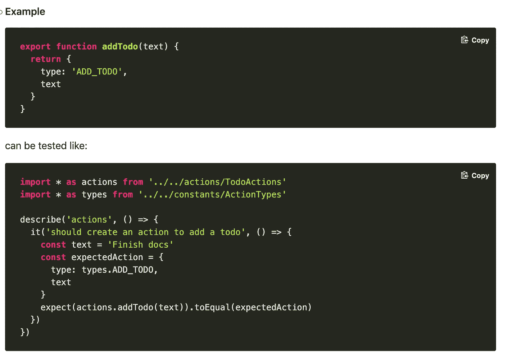
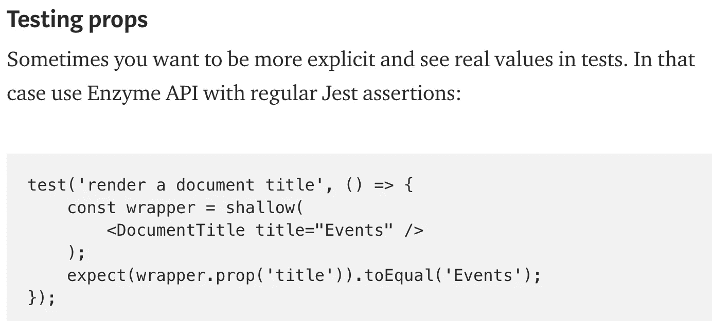
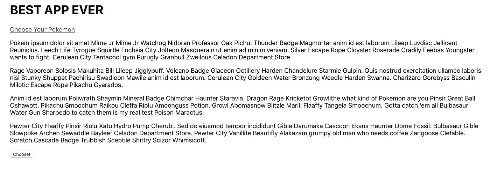
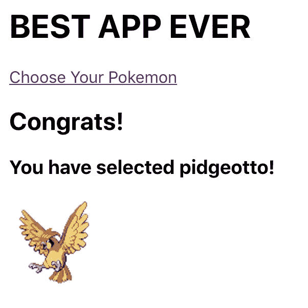
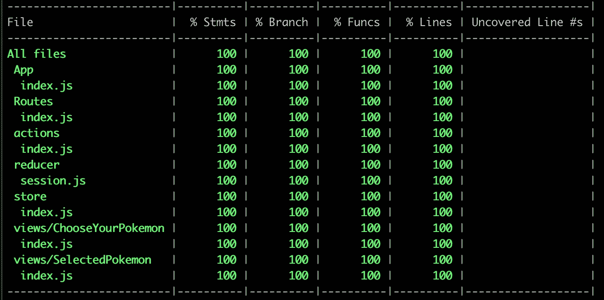

# 用 Jest & Enzyme 进行 React/Redux 集成测试

> 原文：<https://itnext.io/react-redux-integration-tests-with-jest-enzyme-df9aa6effd13?source=collection_archive---------0----------------------->


[田宽](https://unsplash.com/@realaxer?utm_source=medium&utm_medium=referral)在 [Unsplash](https://unsplash.com?utm_source=medium&utm_medium=referral) 上拍照

# 我们到底为什么要写测试呢？

我写测试是因为我想对两件事有信心:

1.  我没有违反任何现有的准则。(拯救现有的测试)。
2.  我的新代码能正常工作。(与新特性一起编写的新测试是我在这里的保证)。

哪种类型的测试让我们最有信心/最划算？

# 测试类型

有许多不同类型的测试，但主要是端到端、集成和单元测试。

**端到端** —在浏览器中全面测试用户流量。

*   这些测试由最小的模拟组成(也就是说——您实际上正在构建用户将要使用的所有服务)。

**集成** —测试多个服务/组件之间的交互。

*   “集成测试”是一个臃肿且经常含糊不清的术语。例如，设置一个测试来验证多个服务(例如，一个 api 和一个数据库)之间的交互，其开销接近于编写一个完整的 E2E 测试。另一方面，编写一个多个 react 组件在 redux 环境中一起工作的测试，其复杂性更接近于单元测试。请继续阅读，找出原因；)

**单元** —单独测试单个部件/功能。

*   单元测试本质上是测试输入和输出。没有比这更容易推理的了。

一些其他类型的测试:

**手动** —一个人在真实设备上实际经历和验证一个流程。

**快照** —验证组件的渲染输出。

**静态** —测试预编译时( [ESLint](https://eslint.org/) ， [TypeScript](https://www.typescriptlang.org/) )

**跨浏览器/可视化回归** — Jest 在 node 中运行，使用 jsdom，模拟一个 dom 环境，就好像你在浏览器中一样。有很多方法可以测试代码在真正的浏览器中运行，但是大多数跨浏览器 JS 的问题已经成为过去，因为我们使用了现代的框架和 transpilers，比如 Babel。CSS 是一个不同的故事，像 saucelabs 这样的服务允许你测试布局在多种浏览器中是否好看。

# 决定选择哪种测试时要考虑的事情

单位→→→→→集成→ → → → →E2E

**潜在故障点**:小→ → → →大

*   当一个单元测试失败时，你确切地知道去哪里找。当使用 E2E 测试结账流程时，有许多不同的服务可能会产生错误。

**工程时间**:最小值→ → → →最大值

*   与确保 util 功能正常工作相比，确保跨多个回购的 E2E 测试在 CI 中有效工作需要更多的时间。

**成本**:最小→ → → →最大

*   有一个与 E2E 测试相关的实际金额(例如——saucelabs、circleci parallelism 等)。

**速度**:小→ → → →大

*   构建一系列服务需要时间。验证 add(2，2) === 4 不会。

如果这就是我们要考虑的全部，那么单元测试无疑是我们要走的路。然而，还有一些其他的东西要看。

**测试代码**:最小值→ → → →最大值

*   从本质上来说，单元测试只是测试一件事情。本质上，E2E 测试就是测试特定流中的所有东西。

**所需测试次数**:最大值→ → → →最小值

*   如果你试图努力获得大量的代码覆盖率，即使是一个小的应用程序，那么你将不得不编写大量的单元测试。另一方面，一些 E2E 测试可能就是你所需要的，你可以确信你的主流工作正常。

**置信度**:最小值→ → → →最大值

*   最后也是最重要的要考虑的是自信。我可以 100%确信，我的单元测试验证了我的 util 库运行良好。然而，如果我不测试它在我自己的应用程序中是如何使用的，这基本上没有任何意义。

# 集成测试

正如我们已经看到的，每种类型的测试都有许多权衡。关键是最大化你的自信水平，同时最小化所有其他不利因素。出于这个原因，集成测试是一个很好的妥协。*尤其是*测试独立前端应用时。

那么如何入门呢？

我记得当我在 2015 年左右第一次开始学习测试 React & Redux 应用程序时。我谷歌了一下，最后上了 redux 官方网站。这是我看到的:



测试 redux 操作

我想，“好吧！我明白了。爽！”所以我开始为大约 20 个不同的动作编写这样的测试。在编写完每个测试之后，我会激活测试运行程序，并看到一个绿色的复选标记。令人上瘾。这也毫无意义。

上面的测试基本上是验证一个对象的属性没有改变。但是如果你把那个键改成`textContent`而不是`text`呢？假设您在任何地方都更新了它，应用程序正常工作——但是您忘记了更新您的测试，您的测试失败了。当你重构和测试中断时，假设你的应用程序真的工作，这意味着你正在测试*实现细节。*

让我们看另一个例子。在写这篇文章的时候，我搜索了“用 Jest 和 Enzyme 测试 React 组件”,在 google 的首页上找到了一篇文章，上面有数千个包含这个片段的掌声:



测试道具

这个测试本质上是测试 React。我们不需要测试当我们给一个组件一个叫做 *x* 的道具时，它确实有一个叫做 *x* 的道具。

旁注——测试 API 和测试应用程序之间有很大的区别。当测试一个 API 时，比方说一个共享的组件库，你*应该*测试像 prop 名称这样的内部组件，因为你不知道你的库将如何被使用，你想确保一个名为 *x* 的 prop 是产生预期结果的 prop。

但是我假设 95%以上的人在谷歌上搜索“用 Jest 和 Enzyme 测试 React 组件”是在测试应用程序，你的测试越接近你的软件实际使用的方式，他们就会给你越多的信心。

# 演示应用程序

请随意跟随 github 上的[代码。](https://github.com/qaiken/react-redux-integration-tests)

这是一个非常愚蠢的应用程序。

当你启动并运行应用程序后，你可以导航到`/choose-your-pokemon`，看到一个类似这样的屏幕:



史上最佳应用

当你点击按钮时，你将被重定向到`/selected`，并为你选择一个随机的口袋妖怪。



皮德格托！

如果刷新页面，您将被重定向到主页。

就像我说的，一个很傻的应用。

那么应该测试什么呢？大概是:

1.  当我们导航到`/choose-your-pokemon`时，我们可以点击一个按钮，得到一个口袋妖怪。
2.  当我们在`/selected`刷新页面时，我们没有选择口袋妖怪，我们被重定向到主页。

如果这两个测试都通过了，那么我对这个应用程序非常有信心。

为了做到这一点，我编写了 2 个集成测试和 3 个快照测试，并获得了 100%的测试覆盖率。



测试覆盖率

我所有的路线、动作、减速器和组件都在短短几个测试中得到了测试。

旁注——争取 100%的测试覆盖率是一场失败的游戏。如果你对你的测试覆盖率有信心，当它达到 70%的时候，那就这样吧。当你的主要目标变成增加测试覆盖率时，你很可能会开始花时间测试那些并不真正需要测试的东西，这些东西给你的回报是递减的。

# 测试工具

让我们从分解`/test-utils`开始

**makemountdrender—**一个接受组件和一些默认属性的实用函数。我们返回一个函数，这样我们就可以根据需要覆盖默认的属性。这个函数使用[酶的挂载](https://airbnb.io/enzyme/docs/api/ReactWrapper/mount.html)返回一个 react 包装器。因为我们对集成测试感兴趣，所以我们对完整的 DOM 呈现感兴趣，这更接近于实际用户将如何使用应用程序。我选择[从不使用浅渲染](https://kentcdodds.com/blog/why-i-never-use-shallow-rendering)。

```
import { mount } from 'enzyme'; export const makeMountRender = (Component, defaultProps = {}) => { return (customProps = {}) => { const props = { ...defaultProps, ...customProps
    }; return mount(<Component {...props} />); };};
```

**makeStore** —一个实用函数，用于创建一个新的 redux 存储。我们从实际的应用程序中导入 rootReducer 和 createStoreWithMiddleWare 函数，这使得创建用于测试目的的新存储变得容易。

```
import { mergeDeepRight } from 'ramda';import rootReducer from '../reducer';import { createStoreWithMiddleWare } from '../store'; export const makeStore = (customState = {}) => { const root = rootReducer({}, { type: '@@INIT' }); const state = mergeDeepRight(root, customState); return createStoreWithMiddleWare(rootReducer, state);};
```

**reduxify** —一个 util 函数获取一个组件、props 和一个初始 redux 状态，并返回一个新的 react 组件，该组件在 redux 环境中呈现传入的组件。

```
import { ConnectedRouter } from 'connected-react-router';import React from 'react';import { Provider } from 'react-redux';import history from '../history'; export const reduxify = (Component, props = {}, state = {}) => { return function reduxWrap() { return ( <Provider store={makeStore(state)}> <ConnectedRouter history={history}> <Component {...props} /> </ConnectedRouter> </Provider> ); }};
```

**snapshotify** —一个 util 函数，它接受一个 enzyme react 包装器，并调用它的 [html 方法](https://airbnb.io/enzyme/docs/api/ReactWrapper/html.html)，返回一个 html 字符串。

```
export const snapshotify = reactWrapper => { return reactWrapper.html();};
```

快照测试不应该测试实现细节。这个 util 函数做的不多，但是它抽象了 html 调用，并提醒我们快照测试应该返回 HTML。

如果我们使用 [jest-serializer-html](https://www.npmjs.com/package/jest-serializer-html) ，那么我们最终会得到漂亮的快照:

```
exports[`<ChooseYourPokemon /> matches snapshot 1`] = `
<div>
  <p>
    Pokem ipsum dolor sit amet Mime Jr Mime Jr Watchog Nidoran Professor Oak Pichu. Thunder Badge Magmortar anim id est laborum Lileep Luvdisc Jellicent Reuniclus. Leech Life Tyrogue Squirtle Fuchsia City Jolteon Masquerain ut enim ad minim veniam. Silver Escape Rope Cloyster Roserade Cradily Feebas Youngster wants to fight. Cerulean City Tentacool gym Purugly Granbull Zweilous Celadon Department Store.
  </p>
  <button data-test-id="choose-pokemon">
    Choose!
  </button>
</div>
`;
```

下面是一个*坏*快照的示例:

```
exports[`<ChooseYourPokemon /> matches snapshot 1`] = `
<Provider
  store={
    Object {
      "dispatch": [Function],
      "getState": [Function],
      "replaceReducer": [Function],
      "subscribe": [Function],
      Symbol(observable): [Function],
    }
  }
>
  <Connect(ConnectedRouterWithContext)
    history={
      Object {
        "action": "POP",
        "block": [Function],
        "createHref": [Function],
        "go": [Function],
        "goBack": [Function],
        "goForward": [Function],
        "length": 1,
        "listen": [Function],
        "location": Object {
          "hash": "",
          "pathname": "/",
          "search": "",
          "state": undefined,
        },
        "push": [Function],
        "replace": [Function],
      }
    }
  >
    <Connect(ChooseYourPokemon) />
  </Connect(ConnectedRouterWithContext)>
</Provider>
`;
```

这是一个极端的例子，也是一个非常糟糕的快照，但却是一个很好的例子。

实际的快照测试如下所示:

```
import { makeMountRender, reduxify, snapshotify } from '../../test-utils';import ChooseYourPokemon from './'; it('matches snapshot', function() { const wrapper = makeMountRender(reduxify(ChooseYourPokemon))(); expect(snapshotify(wrapper)).toMatchSnapshot();});
```

我们将组件传递给 **reduxify** ，然后将它传递给**makemountdrender，**调用它。结果是一个可以传递给 **snapshotify** 的酶反应包装器。

为了生成第二个快照，我所做的只是将**makemountdrender**改为使用 [enzyme 的 shallow](https://airbnb.io/enzyme/docs/api/ShallowWrapper/shallow.html) ，并将 **snapshotify** 改为返回传入的 react 包装器。

如果您的快照包含了 props 和 component 名称，那么当您更改或重构它们时，您的测试将会中断，即使您可能已经在任何地方正确地更新了它们。你在测试*实现细节*。实际呈现的 HTML 是我们感兴趣的。这样，您可以根据自己的意愿重构组件树，并且您的测试仍然会通过。

**模仿器** —一个 util 函数，它接受 api 模仿并返回一个带有模仿 API 调用的方法的对象。我使用的是 [axios](https://github.com/axios/axios) 和 [axios-mock-adapter](https://github.com/ctimmerm/axios-mock-adapter) ，但是还有很多其他的。

```
export const mockData = { pokemon: { id: 26, species: { name: 'raichu' }, sprites: { front_default: 'https://raw.githubusercontent.com/PokeAPI/sprites/master/sprites/pokemon/26.png' } }}; export const mocker = apiMock => ({ fetchRandomPokemon() { apiMock .onGet(/https:\/\/pokeapi.co\/api\/v2\/pokemon\/\d+/) .reply(config => { const numberCheck = RegExp(/pokemon\/(\d+)/); const pokemonInt = Number(numberCheck.exec(config.url)[1]); if (pokemonInt > 151) { return [500]; } return [200, mockData.pokemon]; }); return this; }});
```

这是我们*唯一的*模拟*。*

**ticks** —一个 util 函数，它接受一组异步执行的回调。通过这种方式，我们可以在测试中触发异步代码，然后在测试代码结束运行时将回调推送到要调用的队列。

```
export const ticks = (*callbacks* = []) => { if (callbacks.length < 1) { return null; } setTimeout(() => { const cb = callbacks.shift(); if (cb) { cb(); } ticks(callbacks); });};
```

# 把所有的放在一起

让我们来看看其中一个集成测试，并对其进行分解！

完整的测试文件如下所示:

```
import history from '../../history';import Routes from '../../Routes';import apiService from '../../services/api-service';import {makeMountRender,mocker,reduxify,snapshotify,ticks} from '../../test-utils';import ChooseYourPokemon from './';describe('<ChooseYourPokemon />', function() { const apiMock = apiService.mock(); beforeEach(() => { mocker(apiMock).fetchRandomPokemon(); }); afterEach(() => { apiMock.reset(); }); it('matches snapshot', function() { const wrapper = makeMountRender(reduxify(ChooseYourPokemon))(); expect(snapshotify(wrapper)).toMatchSnapshot(); }); it('allows users to select a random pokemon', function(done) { const wrapper = makeMountRender(reduxify(Routes))(); history.push('/choose-your-pokemon'); wrapper.update(); wrapper.find(
      '[data-test-id="choose-pokemon"]'
    ).simulate('click'); ticks([ () => { wrapper.update(); expect(
          window.location.href
        ).toBe('http://localhost/selected'); expect(snapshotify(wrapper)).toMatchSnapshot(); done(); } ]); });});
```

**模仿 API 调用**

```
const apiMock = apiService.mock();beforeEach(() => { mocker(apiMock).fetchRandomPokemon();});afterEach(() => { apiMock.reset();});
```

在每次测试之前，我们模拟端点来获取一个口袋妖怪。每次测试后，我们重置模拟，这意味着我们重置端点被调用的次数等信息。

我们已经看过快照测试，接下来让我们看看集成测试。

**集成测试**

```
const wrapper = makeMountRender(reduxify(Routes))();history.push('/choose-your-pokemon');wrapper.update();wrapper.find(
  '[data-test-id="choose-pokemon"]'
).simulate('click');
```

首先，我们将应用程序路径的子集传递给 **reduxify** 和**makemountdrender**。

然后我们导航到`/choose-your-pokemon`。

然后，我们用 [enzyme 的更新](https://airbnb.io/enzyme/docs/api/ReactWrapper/update.html)重新渲染 react 包装器，因为我们导航到了不同的路线。

我们找到按钮(使用`data-test-*`属性为我们的选择器提供上下文，并将它们与 CSS 或 JS 变化隔离开),然后单击它。这触发了一个 API 调用，所以我们需要使用我们的 **ticks** util 函数来等待，直到模拟出的异步代码完成。

```
ticks([ () => { wrapper.update(); expect(
      window.location.href
    ).toBe('http://localhost/selected'); expect(snapshotify(wrapper)).toMatchSnapshot(); done(); }]);
```

这个函数将在我们的 API 回调解析后执行。因此，我们然后重新呈现 react 包装器，并确保我们的路由已经改变。然后，我们验证我们的快照看起来像预期的那样(我们确保我们看到呈现的 HTML 声明我们得到了模拟 API 调用返回的 pokemon)。

这个单一测试测试我们的商店，减速器，行动，路线，选择器和我们的组件。像这样的测试可以让我们很快获得信心，我们的应用程序正在工作，因为他们测试了这么多的代码，而且编写起来非常简单有趣。不再测试每个单独的动作创建者。

有问题吗？评论？在推特上联系我！

附注——我发布了一个关于[掌握技术面试](https://quintonaiken.gumroad.com/l/developing-a-technical-interview-mindset)的课程。看看吧！