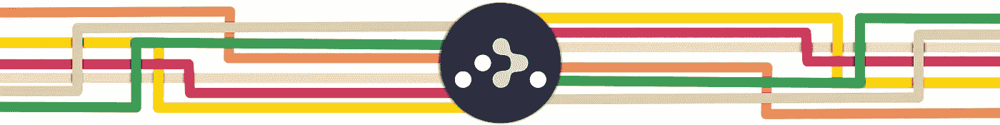
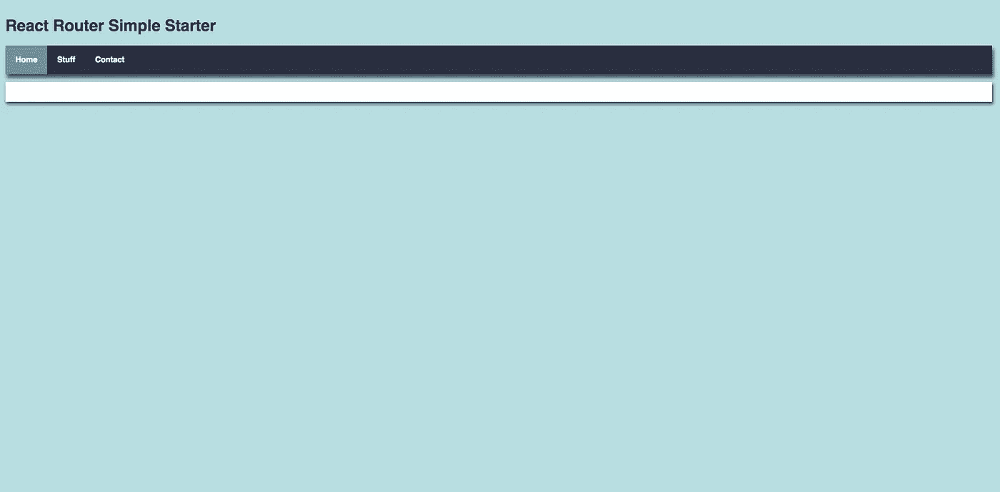
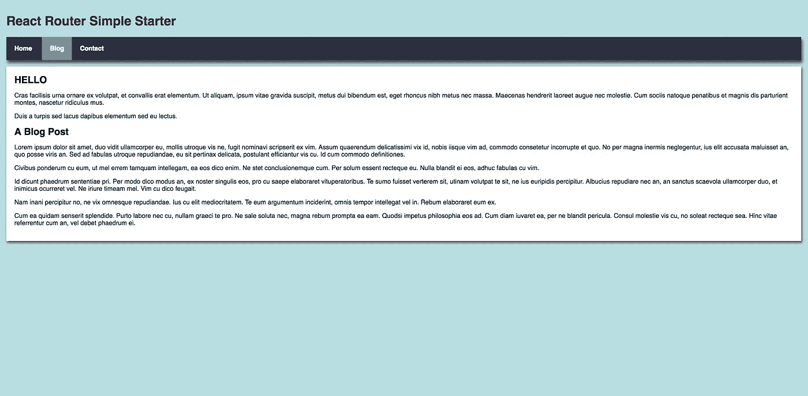

# React 路由器简单入门指南

> 原文：<https://itnext.io/react-router-simple-starter-guide-c6477695908c?source=collection_archive---------0----------------------->



# 我们正在建造的东西

没什么特别的，只是一个简单的 react 路由器例子，如果你想看代码的最终版本，请随意克隆来自 [**github**](https://github.com/Colour-Full/react-router-simple-starter) 的回购

# **安装依赖关系**

你需要在你的机器上安装 Node，但是因为你正在读一篇关于 React 的文章，我想你已经知道了。

首先我们将使用[**react create app**](https://github.com/facebook/create-react-app)来获得我们的项目设置

```
npx create-react-app simple-router
```

这将在名为 **simple-router 的文件夹中创建我们的新项目。**让`**cd**`进入`**simple-router**`并安装 react 路由器的网页版

```
npm install react-router-dom --save
```

好了，既然我们已经得到了所有需要的东西，我们要做的就是从 create-react-app 提供的 **src** 和 **public** 文件夹中清除所有文件，这样我们就可以从头开始了。

# **获取我们的静态 HTML**

首先在**公开**我们将创建一个全新的**index.html**并添加以下内容:

就这样，这是我们这个项目需要的所有 HTML。从现在开始，一切都是关于 JavaScript 的。

# **构建组件**

回到我们的 **src** 文件夹，我们将添加一个 **index.js** 文件:

如果你仔细观察，你会看到我们正在导入一些 css，但现在让我们继续关注组件，我们将在一会儿处理样式。

好的，我们显然需要一个**导航**组件，所以让我们把它添加到我们的 **src** 中

我们正在导入一些我们还没有构建的、易于修复的组件:

没有什么令人兴奋的只是几个非常简单的组件。

# **打扮自己**

还记得我说过这一切都是关于 JavaScript 的吗？好吧，差不多，我们会很快添加一些风格，在一天结束时，没有人真的希望他们的应用程序是丑陋的。在我们信任的 **src** 文件夹中添加一个新的 index.css 文件:

现在，如果您从终端运行`npm start`并转到 [http://localhost:3000/](http://localhost:3000/) ，您应该会看到类似这样的内容:



# 回到路线上

事情看起来很好，但我们仍然没有做任何路由。如果你点击那些闪亮的链接，什么也不会发生。

反应路由器救援。

首先回到 **Nav.jsx** 我们将导入以下内容:

```
import {Route,NavLink,BrowserRouter} from "react-router-dom";
```

自从 React 路由器 V4 以来，我们处理的只是 React 组件。组件有三种:**路由器**、**路由匹配**和**路由渲染道具。**

**BrowserRouter** 是一个 **Router** 组件，它将为我们创建一个专门的历史对象。基本上，这将允许我们的用户使用浏览器按钮通过我们的应用程序或网站后退和前进，并总是到达他们先前离开的地方。这个组件应该是我们应用程序的根，这就是为什么我们要用它来包装我们的 **Nav** 组件:

```
<BrowserRouter>
<div>       
<h1>React Router Simple Starter</h1>            
    <ul className="header">
       <li><a className="active" href="/">Home</a></li>
       <li><a href="/blog">Stuff</a></li>
       <li><a href="/contact">Contact</a></li>
    </ul>
<div className="content"></div>    
</div>  
</BrowserRouter>
```

需要说明的是，React Router**browser Router**和 **HashRouter 中有两个 **Router** 组件。根据官方文件:**

> 如果您有一个响应请求的服务器，您应该使用一个`<BrowserRouter>`,如果您使用一个静态文件服务器，您应该使用一个`<HashRouter>`

或者更简单地说， **BrowserRouter** 是你在客户端最常使用的，而 **HashRouter** 通常用于服务器端渲染。

这一切都很棒，但如果我们启动应用程序并点击链接，仍然什么也不会发生。

不要惊慌，这是正常的，要让它工作，我们需要抓住我们的 **NavLink** 组件:

```
<BrowserRouter>
<div>       
<h1>React Router Simple Starter</h1>            
    <ul className="header">
       <li><NavLink to="/">Home</NavLink></li>
       <li><NavLink to="/blog">Stuff</a></li>
       <li><NavLink to="/contact">Contact</a></li>
    </ul>
<div className="content"></div>    
</div>  
</BrowserRouter>
```

**NavLink** 组件是 **Link** 组件的样式化版本，当它与当前 URL 匹配时，它将向呈现的元素添加样式化属性。默认的类名是`active`,这就是为什么我们不再需要 class name 属性，我们需要将`href`属性改为`to`,没有双关语。

但是你可能会问自己**链接**组件是做什么的，React 路由器文档再次给出了答案:

> 在应用程序中提供声明性的、可访问的导航。

太酷了，让我们点击那些闪亮的导航链接…

别这么快，我们还没完成。为了让一切正常工作，我们需要将一个**路线匹配**组件引入到我们的导航中。首先，让我们快速浏览一下文档对这些类型的组件的描述:

> 路线匹配是通过比较`<Route>`的`path`道具和当前位置的`pathname`来完成的。当一个`<Route>`匹配时，它将呈现它的内容，当它不匹配时，它将呈现`null`。没有路径的`<Route>`总是匹配的。

好吧，让它简单一点。当您点击一个 **NavLink** 组件时，这将更新浏览器 url 以匹配与传递给该组件的`to` porp 相同的路径。例如，如果我们点击

```
<li><NavLink to="/blog">Stuff</a></li>
```

我们浏览器中的 url 将变为`myapp.com/blog`。然后，React Router 将寻找传递给 **Route** 组件的匹配路径，并显示我们在该路径上设置的任何组件。

这听起来甚至让我很困惑，所以让我们写一些实际代码。希望这将增加一些清晰度:

```
<BrowserRouter>
<div>
<h1>React Router Simple Starter</h1>
  <ul className="header">
    <li><NavLink exact to="/">Home</NavLink> </li>
    <li><NavLink to="/Blog">Blog</NavLink></li>
    <li><NavLink to="/Contact">Contact</NavLink></li>
  </ul>
<div className="content">
  <Route path="/" component={Home} />
  <Route path="/blog" component={Blog} />
  <Route path="/contact" component={Contact} />
</div>
</div>
</BrowserRouter>
```

这里发生的事情是，当浏览器 url 与页面上的`path`属性匹配时，我们告诉 React Router 显示传递给`component`属性的组件。

`component`道具是我们之前提到的**路线渲染道具**的一部分。对于如何为给定**路径**渲染组件，有三个合适的选择:`component`、`render`和`children`。对于这个启动项目，我们不需要考虑**渲染**和**子**道具。

***边注****:React 路由器提供的* ***路由匹配*** *组件，还有* ***交换机*** *组件，不过这个我们会在我已经规划好的一些未来高级路由文章中再看。*

# 是时候点击一些链接了

最后，我们可以启动我们的服务器，进入我们的应用程序，开始点击链接。

但是，等一下…有些事情似乎不太对劲。在主页上看起来很棒，但是当我们去博客或联系页面时，我们仍然可以看到主页上显示的内容。



这是因为加载我们的 **Home** 组件的路径是`/`。我们的**博客**和**联系人**组件的路径中也包含了`/`字符。这意味着我们的 **Home** 组件总是匹配我们试图导航到的任何路径。解决方法很简单。在代表我们家内容的 Route 组件中，我们将添加`exact`道具。所以我们的 **Nav.jsx** 文件的最终版本应该是这样的:

就这样，您现在已经掌握了使用 React Router 在 React 应用程序中构建路线的知识。

感谢您的阅读！我希望这篇文章对你有所帮助，并且你已经学到了一些新的东西。像往常一样，如果你有任何问题或建议，欢迎在评论中分享。