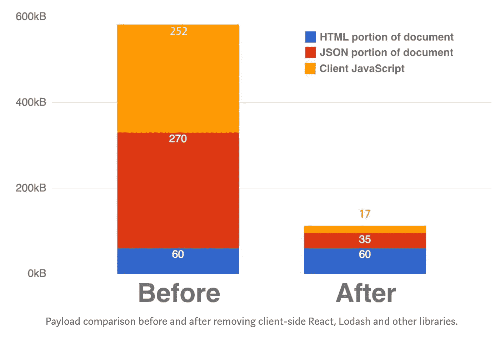

# React 服务器端代码拆分已完成..又

> 原文：<https://itnext.io/react-server-side-code-splitting-made-again-a61f8cbbd64b?source=collection_archive---------2----------------------->

React 代码拆分在一年前就成为了一件事。从那时起，我们正在寻找新的方法来代码分割和推迟组件渲染。让我们暂停一下，试着理解为什么代码拆分如此重要。为此，我们必须回到未来。

回到未来

# 单页应用程序。

SPAs——当今的圣牛，也是主要的代码分解主题。

您必须“拆分”它，因为 SPA 由兆字节的 Java 脚本组成，加载、解析、检测和执行将花费很长时间。**而且你不需要全部。同时。**

SPA，一个“单页应用程序”，并不是一个“单页”——从技术上来说，它是一个“T4”的单页，只供浏览器使用，而不是供你使用。“单页应用程序”实际上是“多页应用程序”。、或多视图、或多组件应用。没关系。二级“页面”确实存在，但在使用之前你并不需要它们，因此你可以推迟那些额外的页面，以及渲染所有内容所需的代码，但不是当前页面。**可以进行代码拆分。你必须进行代码拆分。**

> 代码拆分的主要原因 JavaScript 的数量。
> 
> 这么多 JavaScript。哦哇🐶

通过推迟一些代码块的执行，您可以更早地获得第一批代码块。通过不加载你不需要**加载的代码——你正在修改你的应用程序。让它更好地做事情，它应该**现在**做，而不是在未来的某个地方。使其使用起来更加舒适。**

> 这里的“愉快”几乎就像 `loading indicators`—“通过展示一些**微调器**，而不是一个**空白页**，你让用户认为你的页面很快，并且很快就准备好了，只要他们得到一些*感知*信号”。

## 所以 SPA？

> 从客户的角度来看，SPA 和老派网站有什么区别？

*   点击老派网站的链接，你会打开一个新的页面。打开新页面后，您必须再次加载所有数据。执行几十个脚本，从头开始运行一些东西，显示新的广告、横幅和跟踪器。
*   点击 SPA 中的链接会做同样的事情…更快，并带有一个花哨的过渡动画。

所以，依我拙见——水疗馆生来就是为了让“下一页”更快。只是为了去掉“下一页”的意思。为了让一切更 ajaxy 化，更流畅，执行我们通常在第一个页面视图中加载和执行的所有垃圾，只执行一次。

> SPA 背后的理念——让下一个“第二个”页面浏览速度更快。

但是，你知道，代码分割背后的想法是让**的第一个视图更快**，让**的第二个视图更慢**。我不确定，但是看起来代码分裂正在试图解决这个问题**与 SPA 生来要解决的问题**相反。

> 这里很不对劲！
> 
> 我们要回到未来了！

轰鸣·轰鸣！

# 服务器端渲染？

SPA 之前是什么？老平原服务器端渲染。简单的 HTML。简单的 CSS。温暖的阳光。绿草如茵。还有就是几滴 JS。

你能回答几个愚蠢的问题吗？我来指导你:

*   问:在第一页加载后，客户看到的 SSR 和 SPA“图片”是否相同？在 HTML 层面是一样的吗？
*   答:是的。两种解决方案看起来完全一样！
*   问:在“第二次”页面加载后，客户看到的 SSR 和 SPA“图片”是否相同？在 HTML 层面是一样的吗？
*   答:是的。然而，他们看起来完全一样！

> 现在，准备好主要的魔术，主要的问题

*   问:你需要下载多少 JavaScript 来渲染 SPA 页面？
*   答:一兆字节。轻轻松松！如今——也许更多。
*   问:为了渲染页面，你需要下载多少 HTML？
*   答:一千字节。或者是关于。

SSR 可以为客户提供相同的体验，相同的结果，成本是爱人的 100 倍，速度快 100 倍，能够在任何设备上运行。老派网站证明，我奶奶的电脑可以打开。

应该很清楚——最好的体验可以通过 SSR 渲染实现，并且只有“然后”——SPA 和代码分割。这种差异，尤其是对于前沿设备(和网络)来说，可能是巨大的！

更重要的是，没有任何 JS 发送到客户端的 SSR 是有史以来最好的代码分割，只要所有的东西都留在服务器上，并且没有任何不重要的东西(只有 HTML、CSS 和图像是重要的)被发送到客户端。

> 你可以使用任何你想要的库，无论大小，例如 moment.js，并且仍然适合 1kb 的网络流量限制。你自由了！

# 使用 SSR 进行代码拆分

所以。你已经为你的站点实现了 SSR，但是仍然需要把静态的，我想说是死的，HTML 转换成动态的 React 应用。静态站点是死站点。所以你还是要发兆的 JS，还是要运行，还是要代码拆分。

> 突然间——不像以前那么容易了。为什么？

## SSR 友好代码拆分的复杂性

SSR 现在是如何工作的？简而言之——你在服务器上渲染一个页面，把它发送到客户端，加载所需的 js，然后`hydrate` HTML，它就活了。答对了。

当你调用`hydrate`的时候，所有的脚本都必须被加载，所以你必须知道在某种状态下渲染某个页面所需的所有程序块。这就是为什么你必须使用“代码分割库”——它们将帮助你跟踪所使用的代码块。这并不像听起来那么简单。

现代的 React 代码拆分库，像 [React-loadable](https://github.com/jamiebuilds/react-loadable) 、 [loadable-components](https://github.com/smooth-code/loadable-components) 或 [react-imported-component](https://github.com/theKashey/react-imported-component) 能够做到这一点。他们将使用不同的方法来收集和报告当前渲染调用所需的*块*。但是！，即使它们的工作方式不同——结局总是一样——给**的单一命令等待所有使用的块**。

要真正呈现页面，用户已经可以看到由于 SSR，你必须加载所有脚本，才能重新呈现这个页面了。能够呈现出和你已经看到的一模一样的画面。

> 所以——页面已经准备好了，但是您还在等待加载脚本。**这是互动时间**。最糟糕的一秒钟，你可以看到任何东西，但什么也做不了…

对于我们大多数人来说，以我为例，这里的主要词汇——**加载所有脚本**。如果你想更深入地研究这个问题，我还有一篇关于它的文章。

 [## 反应和代码分割变得容易

### 代码分割一直是个问题。从你添加大量不同的脚本标签的时候起，直到需要…

hackernoon.com](https://hackernoon.com/react-and-code-splitting-made-easy-f118befb5168) 

别忘了从 JavaScript 的角度挖掘问题:

 [## 2018 年 JavaScript 的成本

### 构建交互式网站可能需要向用户发送 JavaScript。通常，太多了。你一直在…

medium.com](https://medium.com/@addyosmani/the-cost-of-javascript-in-2018-7d8950fbb5d4) 

但是，今天，让我们来关注另一句话，没有人(真的！看起来像没有人)给了狗屎之前— **用户已经可以看到由于 SSR** 的网站。

有人真的认为——这很糟糕。只要您将在服务器上“花费”更多时间，即使页面生成也会增加首字节时间或交互时间。看看这根线。然后，我会解释什么是错的。

这里出了什么问题？

*   花费在`renderToString`的 1.5s 秒。老式的 php 制作的网站通常不超过 300 毫秒就可以完全渲染。
*   可能那不是`renderToString`，而是全脂`render`？不要用。
*   组件方法—在这里是错误的。组件方法产生了一个问题，你必须首先渲染所有的东西，然后才能得到你提供给 react-helmet 的关于页面标题的信息。
*   代码中的一个简单错误。

错误很简单——你不需要在`renderToString`之前`render`,你不需要将呈现的字符串注入更大的模板。你可以，也必须是“线性”的。你可以尽可能快地发送你页面的“顶行”,然后再发送其他内容。让客户端开始下载软件包。让客户看到标题之前，你完成渲染的一切。就像 sui-components 的 SSR 包一样。

总之。假设我们有服务器呈现的页面。这里的要点非常简单明了。很难否认——

# 页面已经呈现。

这才是重点！每个人都应该等待所有脚本被加载，以便能够呈现页面，但它已经呈现了。已经到了。如果你可以重复使用它呢？

“重用”不是再水化重用它，而是重用它进行代码拆分！

我所说的想法非常简单

*   每个`AsyncComponent`，基本上都是一个`div`。其中包含“异步结果”。
*   对于客户端，AsyncComponent 在开始时为空，填充后“async”操作解决。它被装载了。
*   对于服务器端，AsyncComponent 不为空，这就是为什么我们必须等待客户端的异步操作竞争来匹配结果 HTML。
*   只要 AsyncComponent 不为空，它在从服务器发送的 HTML 中就不会为空，我们是否可以只保留用于包装组件的`div`的`innerHTML`，并在 JS 被加载时显示这个“记忆化”的值。
*   不要显示“spinner”或空格，而是呈现实际内容，`AsyncComponent`将不得不替换**完全相同的 HTML，**但是在将来，当 chink 加载时。但是，虽然未来不在这里—显示我们从`innerHTML`获得的内容。
*   在任何时刻，我们都在显示相同的内容。没有视觉变化。它像普通的代码分割一样工作，但是你不必等待所有的块都被加载到前面。

从某些角度来看，SSR 友好的代码分割总是一件困难而脆弱的事情。并且总是以“全有或全无”的形式工作。使用我所说的方法，您不必先等待所有的块都被加载——您可以在接收时开始执行传入的块。或者甚至不执行 javascript，只要内容已经呈现，就能够呈现应用程序某些部分，即使它以静态的、死的、非反应性的 HTML 代码的形式存在，对客户也是有用的。没有规则。你自由了。

# 反应预渲染组件

 [## kashey/react-预渲染组件

### 反应-预渲染-组件-🤔前 suspence 时代的部分水合作用

github.com](https://github.com/theKashey/react-prerendered-component) 

我说的是图书馆。预渲染组件。当内容不“实时”时，保留其内部的渲染内容，只有当您准备好开始渲染时，才开始渲染。这里唯一棘手的时刻——你正在控制`live`道具。正如我所说的——只有当用户`clicks`或`points`使用内容时，你才可以“上线”。这由你决定。

这与随机代码分割库不太兼容，而且长期以来他们通常不公开加载`promises`，而得到它的唯一方法——调用静态`preload`，你可能不应该在一些组件“挂载”之前调用。但是 10 行长的小型有状态组件应该可以完成这项工作。

## 它实际上是如何变魔术的？

这种模式的主要障碍是模式本身。在 React 中，您不能访问 DOM 节点，也不能从中读取信息，除非您呈现它。如果你渲染它，你会删除之前存在于那个节点中的所有信息。

> PS:在这种情况下,“那个”信息“只存在于”React 16 `hydrate`调用，且只在第一次呈现时存在。

为了使之成为可能，我使用了由 [react-uid](https://github.com/thearnica/react-uid) 库提供的“位置 id ”,它帮助我用众所周知的 id 创建`divs`,我可以在**组件构造器**中使用`querySelector`,并且在 react 控制 innerHTML 之前预取它。并最终抹去它。

更多细节，一如既往，在另一篇文章。这并不像听起来那么简单。

 [## 唯一 id 以及在哪里可以找到它们

### 第一件事，你将在 HTML 开发者课堂上听到——

medium . com SSR 代码拆分的结论](https://medium.com/@antonkorzunov/unique-ids-and-where-to-find-them-14020ddbc964) 

# SSR 代码分割结论

你仍然必须使用 SSR 友好的代码分割库，只要能够并行加载使用过的块就更好了。这变成了一件不重要的、绝对可选的事情，没有深度嵌套代码分割的大多数应用程序可以停止使用任何神奇的工具来跟踪使用过的 js。

> 但不是 CSS。不要忘记 CSS。

预加载组件给你更多的时间来加载东西，包括脚本和数据，然后才真正切换视图。

> 但它实际上并不是它的全部功能。

# 反应双重定义问题

让我们回忆一下最初的问题——你必须加载 JS 来重新绘制已经绘制的信息。我把它叫做——**反应双定义问题**。

> 你必须重新定义已经定义好的东西。渲染渲染。绘制绘制。

但是反应双重定义问题是…两个问题。这是双重双重问题。

> 您必须加载渲染已经渲染的信息所需的所有数据。

要重新呈现页面，您必须加载所有正在使用的 js，并加载所有正在使用的数据。JS 可能比 HTML“多”1000 倍。数据……也好不到哪里去。我看到过这样的例子，水合标准化 redux store 比“从它”呈现的信息大 100 倍。

我会说——SSR 太糟糕了，只要你不得不重做、重新加载、重新运行任何东西。我不确定 SSR 是一件好事。请用火杀死它。

> 你在服务器上做的任何东西都是无用的！扔掉它。

这在今天很常见，死于 SPA 获取和*消费*信息的方式，但在 jQuery 时代是反模式的。

jQuery 不调用 REST 或 GraphQL 端点。jQuery 只是从你留在 HTML 中的**数据属性中读取所有的东西。jQuery 只是遍历 DOM 并从 HTML 中恢复数据。jQuery 就是这么 jQuery。我不能说它做了所有正确的事情，但有些事情是…他们是有用的，我仍然很高兴使用它们。每次我不得不重构 10 年前的网站——由于我们今天“不得不”使用的所有“架构”,它变得更大(更胖)和更慢。**

10 年前这还不是一回事。你们的父亲比我们聪明。

> 可能—如果您使用一些数据(状态)来呈现一些数据(HTML) —您能够从派生视图(HTML)中恢复源数据(状态)。或者至少部分恢复它。

您可以使用自己呈现的页面作为状态的来源。只是把一些看不见的，但是很重要的数据片存储在看不见的属性或者标签里。

这实际上是一个边缘案例，但是我感兴趣的不仅仅是 HTML，还有状态。合成并从服务器发送到客户端 Redux 存储相对容易(这是内置特性)，但是发送“内部组件状态”几乎是不可能的，只要**没有地方可以存储它。那里**没有地方**。**

*   在第一个例子中，我们使用类似 jQuery 的方式，只是将信息扫描回状态。
*   第二个例子有点像 jQuery，实际上是将 JSON 存储在 element 旁边。

两者都能够在服务器端渲染存储“内部组件状态”,并在客户端恢复它。一些你以前做不到的事。一些你以前能做的事。回到未来。

不要像“我必须在结果 HTML 中存储一些不太有用的信息”那样考虑这个问题。当一个开发人员喝着冰沙玩着 React 时，另一个开发人员向他们的页面添加越来越多的微数据，使他们的页面更容易被发现、访问和理解。对于人类和机器人来说。

> 如果你能够从源 html 中**再水合信息**——那么，也许 GoogleBot 也将能够。

# 但是这个东西和代码拆分没有关系！

确实如此。React-prerendered-component 不是关于代码拆分，而是关于**代码拆分**加上 **React16 水合物**。请随意使用 React。您可以随意选择使用任何代码拆分库或组件。现在——绝对免费，绝对任意。

反应-预呈现-组分是异步组分和水合物之间的一个“**加**”。不多不少。

## 结束了

这还不是结束。这只是一个实验，没有生产用途。一个提议。尝试把一些石器时代的好东西带到反应世界。重新思考我们代码分割的方式。我们为什么要代码分割，为什么。

听起来，这是唯一一种可以很好地处理即将到来的 React 悬念流渲染的方法，只要不必“等待”。让我们看看。在未来。

# 附言:如果我没有说服你

还有另一篇文章，几乎是绝对相同的问题，但没有解决方案。网飞只是在服务器端保持反应，然后就收工了。

 [## 网飞网络性能案例研究

### 改善桌面 Netflix.com 的交互时间

medium.com](https://medium.com/dev-channel/a-netflix-web-performance-case-study-c0bcde26a9d9) 

他们有我所说的“双重定义问题”。index.html JSON 的 270kb 。这怎么可能！

看他们的文章。然后——重读这一篇。