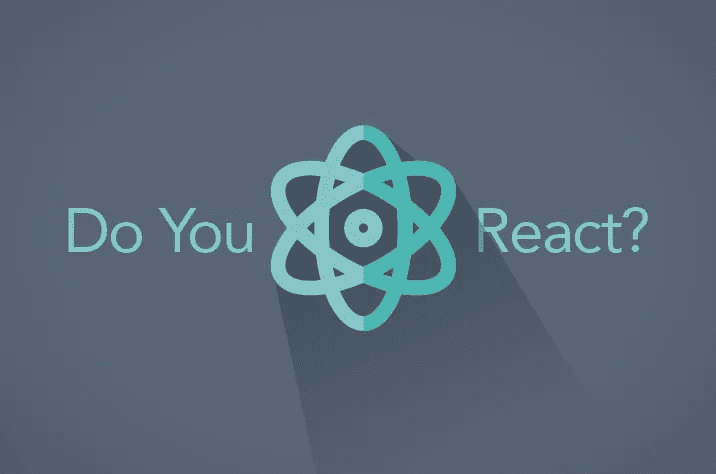

# React 初学者工具包—第 1 部分(简介)

> 原文：<https://itnext.io/react-starter-kit-part-1-introduction-78a27db36f6c?source=collection_archive---------8----------------------->



我在 Angular 中写代码已经快两年了，但是我总是在聚会、技术会议甚至酒吧中听到来自其他开发人员的消息"*反应太容易了*"我完全没有头绪，只是回复"*真的吗*！"或者“*可能是*”。

我不再装傻了，我想学着自己去理解不同之处。让我们开始吧

## 什么是反应？

*   Javascript 库(非框架)
*   建立在脸书(更容易使大型单页应用程序)
*   促进函数式编程

## 谁使用它？

各种市场领导者在生产中使用 React 来了解细节，请参考此链接[https://github.com/facebook/react/wiki/Sites-Using-React](https://github.com/facebook/react/wiki/Sites-Using-React)

## 我们要用哪个反应？

我很幸运地从 React 16(或 React fibre)开始。有很多小改动的版本。它的几个特点是:

*   改进的异步渲染
*   返回元素数组
*   更好的错误处理
*   较小的文件大小

许多先行者注意到了巨大的性能改进，但对开发人员来说变化不大。

## 反应语法

让我们看看我们的样本 index.html 文件，我们有脚本链接来反应和反应 dom。后者负责将所有内容呈现给我们的页面。

在这里，我们使用 **React.createElement 创建了一个新的 react 元素，**没有传递任何属性，并将“Hello world”作为子元素。第二个参数是要呈现这个新创建的元素的目标元素。很简单，对，所以如果你在浏览器中打开上面的页面，你会看到“Hello world”作为输出。

## JSX 简介

现在一切都很好，但是考虑一下你想在循环中的什么地方呈现全新的复杂标签，比如 list (li)或者 tr 等等。那么这种创建元素的方式可能会失控。这就是 JSX 出现的原因。JSX，或 JavaScript as XML，是一种语言扩展，允许您直接在 JavaScript 中编写标签。

但是如果我们直接在现有文件中写下面的代码，我们会得到一个错误，因为我们需要将 jsx 编译成 javascript。

```
<script type="text/javascript">ReactDOM.render(<h1></h1>,document.getElementById('react-container'))</script>
```

为了编译 jsx，我们现在打算在 babel 浏览器中使用，并像下面这样修改文件。

在这里，我们包括了巴别塔的 cdn 脚本版本，但它会非常慢。这是用来演示的，稍后我们会以更有效的方式来做。

所以，当项目越做越大，就很难一遍又一遍的写 React.createElement。那么 jsx 就是我们的大救星。

## ES6 —类别组件

react 的主要思想是组件。我们将各种组件组合在一起，形成一个用户界面。

让我们创建我们的第一个组件。为此，我们将使用 ES6 类。

我们创建一个简单的 ES6 类，命名为 HELLO，并扩展 React.component。在里面，我们将编写一个名为 render method 的 must 方法，它只返回 JSX。稍后，我们需要使用这个新创建的组件，如下所示。

```
ReactDOM.render(<Hello></Hello>,document.getElementById('react-container'))
```

请参考以下完整文件的代码:

如果您注意到了，我们还在新的 react 组件中放置了 id 和 class。唯一的问题是我们不能在 JSX 中使用 css 类的 class，因为它已经在定义 ES6 类中使用了。所以，我们把它命名为 **className。**其他都一样。

## 无状态功能组件

创建组件的另一种方式是通过无状态组件函数。我们上面的例子只是一个返回 UI 或 jsx 的类。我们的无状态函数也是一样的，它是一个返回 UI 的函数。

这是一种非常常见的语法，您会在许多 react 项目和文档中看到。

## 性能

下一个目标是如何在我们刚刚创建的无状态组件中传递一些数据。为此我们有道具。es6 组件和无状态函数组件的唯一区别是，前者有类似 **this.props** 的属性，而后者是函数参数。

请参考以下要点，了解实际实施情况

## 状态

我个人觉得状态是 react 最重要的概念之一。这就像每当状态改变时，渲染函数被再次调用。

为了描述状态的实现，我们将通过 es6 类的方式创建组件并构造这个新类

```
constructor(props) {super(props)this.state = {checked: true}}
```

在这里，我们只需将我们的道具传递给 super，并用选中的一个键初始化状态，就这样。

现在，我们将编写另一个函数来处理状态的变化，只需在 state 中切换选中的键。

```
handleCheck = () => {this.setState({checked: !this.state.checked})}
```

这很简单，请不要放松焦点，它就要结束了

因此，在上面的代码中，我们只是在 state full 组件中创建了一个复选框&每当我们改变复选框时，我们就改变了存储这个选择的变量，并更新了状态。

为了验证这一点，每当状态改变时，都会再次调用 render。我们实际上是在屏幕上显示消息，这取决于复选框的选中和未选中状态。

## 结论

这是 React Starter 中三个教程的第一个。本教程的目的是让你在直接创建新项目之前熟悉 react 的概念。接下来，我们将使用本文描述的核心概念在 react 中创建一个成熟的项目。

下一篇文章链接将很快在这里更新。