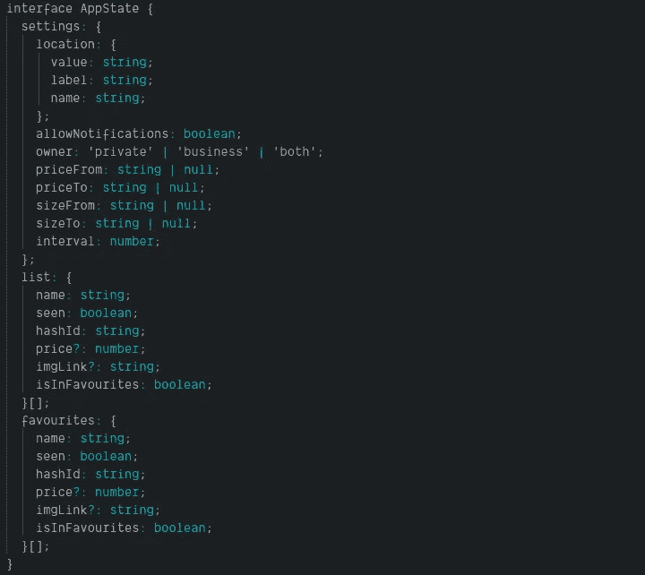

# React —不带库的状态管理(带挂钩)

> 原文：<https://itnext.io/react-state-management-without-libraries-with-hooks-5601959759a0?source=collection_archive---------7----------------------->

## 如何在 React 中不使用任何外部库的情况下管理状态？

> *阅读这篇博文时，打开 CodeSandbox 编辑器可能会有所帮助。*

# 你为什么不想使用状态管理器呢？

状态管理器(如 [Redux](https://redux.js.org/) 或 [MobX](https://mobx.js.org/) )真的很棒，但是在我看来，它们对于小应用来说太复杂了。

## 什么是「小 app」？

我们可以假设它只有不到 10 个视图，你可以在一个屏幕上打印整个状态定义。让我给你举个例子:



> *免责声明！请不要用这个例子来创建你的界面。这样显示只是为了一次显示整个状态。它应该被分割成可以重用的小块。参考沙盒示例中的* `*types.ts*` *。*

这种状态可以用在负责过滤和存储房地产机构销售报价的应用程序中。

# 如何在我们的应用程序中处理这样的状态？

为此，我们必须首先引入两种类型的挂钩:

*   [使用上下文](https://reactjs.org/docs/hooks-reference.html#usecontext)
*   [useReducer](https://reactjs.org/docs/hooks-reference.html#usereducer)

如果你不熟悉它们，我真的建议你停下来，查看一下 ReactJS 网站上的文档。

**useContext** 钩子负责创建一个**上下文**对象。上下文被设计成通过组件树共享数据(没有 props 传播)。

useReducer hook 类似于 **useState** ，但是它允许你指定一个函数来解析输入的数据。

我们要做的是把这些钩子结合起来，创造出类似 Redux 的东西。默认情况下， **Context** 没有为我们提供任何一种分派方法。我们可以绕过这个问题，因为它不限制存储在上下文中的值的类型。这就是 **useReducer** 发挥作用的地方。

如你所知 **useReducer** 接受减速器状态和初始值。当它被调用时，我们得到的是状态和调度函数，它们可以作为上下文的输入。

```
// AppState.tsx
const AppStateContext = React.createContext<AppStateContextType>([
  defaultAppState,
  () => {},
]);

const AppStateProvider = ({ children }) => {
  const [state, dispatch] = useReducer(reducer, defaultAppState);

  return (
    <AppStateContext.Provider value={[state, dispatch]}>
      {children}
    </AppStateContext.Provider>
  );
};
```

首先，我们创建一个上下文，它接受一个包含两个元素的数组。之后，我们必须创建我们的`AppStateProvider`，它是`AppStateContext.Provider`的包装器，它唯一的目的是调用`useReducer(reducer, defaultAppState`来获取`state`和`dispatch`。

> *你可能会问为什么* `*defaultAppState*` *就设置在这里？这是因为我们必须根据* `*AppStateContextType*` *提供有效的论证。*

# 使用中的 AppState

导出我们的状态提供者和上下文后:

```
// AppState.tsx
export { AppStateContext, AppStateProvider };
```

我们可以回到我们的主应用程序，把`AppStateProvider`放在树的某个地方。

```
// index.tsx
function App() {
  return (
    <AppStateProvider>
      <AddProperty />
      <ListComponent />
    </AppStateProvider>
  );
}
```

此时,`AppStateContext`的值可用于树中的任何子节点(也是嵌套的)。让我们进入`AddProperty`组件，看看我们如何访问状态信息。

```
// AddProperty.tsx
import { ACTIONS, AppStateContext } from './AppState';

const [{ settings }, dispatch] = useContext(AppStateContext);
```

正如你所记得的，数组的第一个元素总是一个`state`对象，第二个是我们的`dispatch`函数。该组件对当前状态没有用处，但它需要一个方法来将新属性添加到状态中。

```
// AddProperty.tsx
const submitProperty = (event: React.FormEvent<{}>) => {
  event.preventDefault();
  dispatch({
    type: ACTIONS.ADD_ITEM,
    payload: {
      name: form.name,
    },
  });
  setForm({
    ...defaultFormState,
  });
};
```

`submitProperty`是我们表单的一个`onSubmit`回调。点击**提交**按钮后，它调用`dispatch`进行适当的操作，该操作在定义的减速器中处理。

```
// AppState.tsx
    case ACTIONS.ADD_ITEM:
      return {
        ...state,
        list: [
          {
            ...payload,
            seen: false,
            isInFavourites: false,
            hashId: uuid()
          },
          ...state.list
        ]
      };
```

每次我们分派这种类型的动作时，它都会在我们的`list`中添加一个新项目，并且在**上下文**中更新状态。

现在我们可以在另一个组件中访问该列表

```
// ListComponent.tsx
export default function ListComponent() {
  const [{ list }, dispatch] = useContext(AppStateContext);

  const addToFavourites = (event: React.BaseSyntheticEvent<{}>) => {
    const {
      target: {
        dataset: { hashid }
      }
    } = event;
    dispatch({
      type: ACTIONS.ADD_TO_FAVOURITES,
      payload: hashid
    });
  };

  return (
    <React.Fragment>
      <br />
      <h2>List of properties</h2>
      {list.map(element => (
        <div key={element.hashId}>
          <span>{element.name}</span>
          <button onClick={addToFavourites} data-hashid={element.hashId}>
            Add to Fav
          </button>
        </div>
      ))}
      <Favourites />
    </React.Fragment>
  );
}
```

该组件显示当前列表，并允许用户将一些元素添加到**收藏夹**中。

# 结论

您不必总是为了管理一个简单的状态而将外部库导入到项目中。通过使用 React 的内置方法可以达到同样的效果，并且它不会比 Redux 的可读性差(你甚至可以从中复制 reducers)。您可以决定您的应用程序是否可以从更紧凑的方法中受益。

有一个改进可以让创建 reducers 更容易，但那是另一篇博文的内容了:)

*原发布于*[*https://erdem . pl*](https://erdem.pl/2019/09/react-state-management-without-libraries-with-hooks)*。*