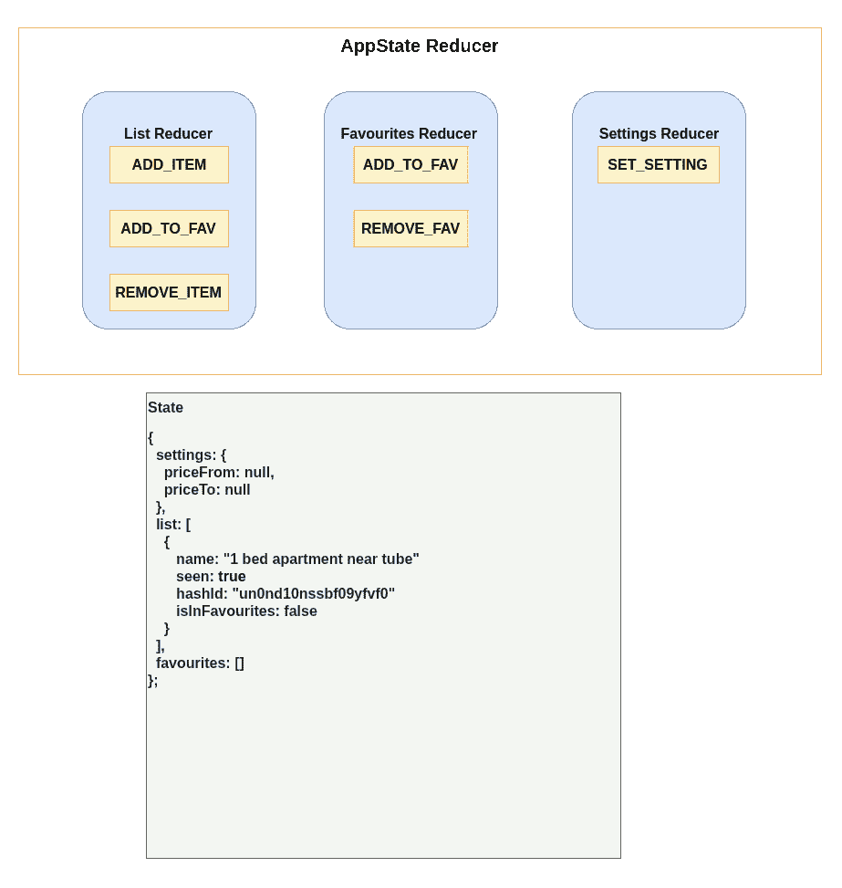
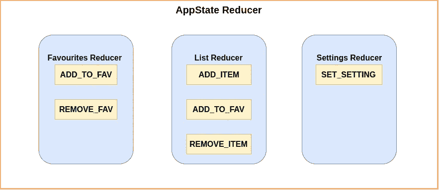
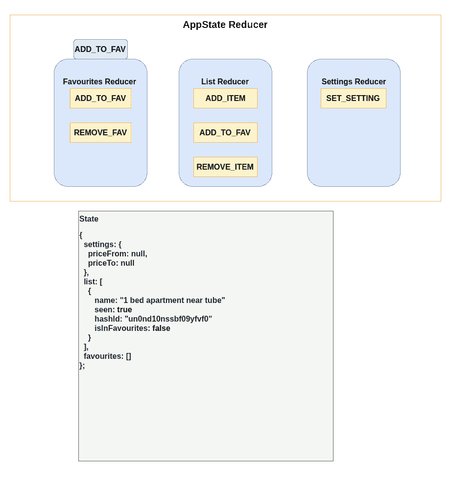
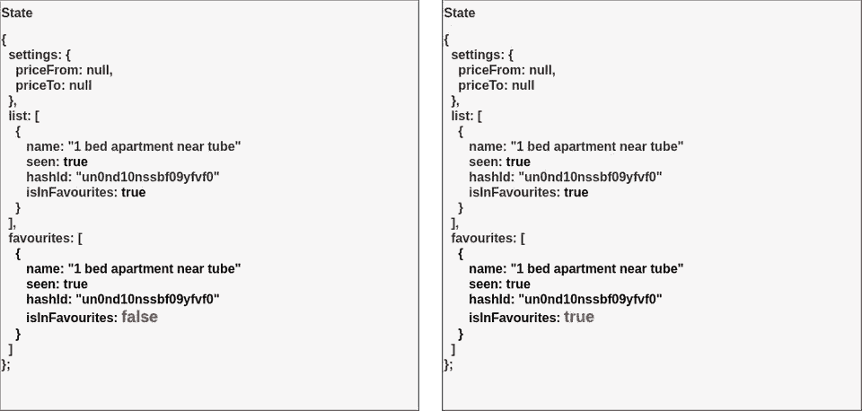

# React —不带库的状态管理(带钩子)第 2 部分

> 原文：<https://itnext.io/react-state-management-without-libraries-with-hooks-part-2-d087278185a9?source=collection_archive---------3----------------------->

## 如何在 React 中不使用任何外部库的情况下管理状态？

> 阅读这篇博文时，打开 CodeSandbox 编辑器可能会有所帮助。

> *这是“无库状态管理”的第二部分。如果你没有读第一个，可能很难理解这一个，所以请查看* [*第一部分*](https://erdem.pl/2019/09/react-state-management-without-libraries-with-hooks)

# 第一部分有什么问题？

正如你在第一部分中所记得的，我们已经创建了`AppStateContext`，它允许我们在 React 的**上下文**中存储我们的应用程序状态，并使用一个 reducer 修改它。那个唯一的问题是 **63** 。这是用于创建我们的减速器的许多行。

```
// AppState.tsx
function reducer(state: AppState, action: ActionType) {
  const { type, payload } = action;
  switch (type) {
    case ACTIONS.SET:
      return {
        ...state,
        [payload.name as string]: payload.value
      };
    case ACTIONS.ADD_ITEM:
      return {
        ...state,
        list: [
          {
            ...payload,
            seen: false,
            isInFavourites: false,
            hashId: uuid()
          },
          ...state.list
        ]
      };
    case ACTIONS.ADD_TO_FAVOURITES:
      const el = state.list.find(el => el.hashId === payload);
      if (el == null || el.isInFavourites) {
        return state;
      }
      return {
        ...state,
        list: state.list.map(element => {
          if (element.hashId === payload) {
            return {
              ...element,
              isInFavourites: true
            };
          }
          return element;
        }),
        favourites: [
          {
            ...el,
            isInFavourites: true
          },
          ...state.favourites
        ]
      };

    case ACTIONS.REMOVE_FROM_FAVOURITES:
      return {
        ...state,
        list: state.list.map(element => {
          if (element.hashId === payload) {
            return {
              ...element,
              isInFavourites: false
            };
          }
          return element;
        }),
        favourites: state.favourites.filter(fav => fav.hashId !== payload)
      };
    default:
      throw new Error();
  }
}
```

这很好，但在我们的应用程序中添加更多的功能后，它就成线性增长了。因为我们不想以 1k 行长的文件结束，所以我们必须重新安排我们的结构。

# 将主减速器分割成块

我们的 main `reducer`包含了所有类型的动作，我们要做的第一件事就是根据目的(或其他)将它们分组。

第一个想法是制造 3 个减速器:

*   `favouritesReducer` -处理**收藏夹**属性的所有操作
*   `listReducer` -处理**列表**属性的所有动作
*   `settingsReducer` -处理**设置**属性的所有动作

例如，我们的`listReducer.ts`将如下所示:

```
export default function listReducer(state: AppState, action: ActionType) {
 const { type, payload } = action;
 switch (type) {
   case ACTIONS.ADD_ITEM:
     return {
       ...state,
       list: [
         {
           ...payload,
           seen: false,
           isInFavourites: false,
           hashId: uuid()
         },
         ...state.list
       ]
     };
   default:
     return state;
 }
}
```

现在，我们必须找到一种方法将这些减速器合二为一。有不同的方法可以做到这一点:

*   每个减速器可以修改整个状态(1)
*   每个缩减器只修改它的状态部分(2)

哪个更好？

@1 如果 reducer 能够修改状态对象中的每一个属性，那么我们可能会遇到两个 reducer 在响应同一动作时试图修改状态的同一属性的情况。

@2 W 没有来自@1 的问题，但是在这种情况下，在 reducer 中提供 dispatcher 会很有用。

我们将选择其中的第一个。这是有原因的，我们只考虑小型到小型/中型应用程序，在这些应用程序中，您的状态定义可以显示在一个屏幕上。除此之外，如果你想选择第二个选项，请选择 Redux。

# 数据流

在我们决定要使用@1 方法之后，我们必须想象我们的动作流从现在开始会是什么样子

```
function reducer(state: AppState, action: ActionType) {
  return [listReducer, favouritesReducer, settingsReducer].reduce(
    (acc, reducer) => reducer(acc, action),
    state
  );
}
```



如果你沿着这条路走下去， **AppState Reducer** 正在获得`ADD_TO_FAV`带有一些有效负载的动作。之后，它遍历其中的每一个 reducer，并允许它们修改状态。一切看起来都很好，对吗？不完全是，我已经按正确的顺序添加了所有的还原剂。如果你改变顺序，你会得到不同的结果。

```
function reducer(state: AppState, action: ActionType) {
  return [favouritesReducer, listReducer, settingsReducer].reduce(
    (acc, reducer) => reducer(acc, action),
    state
  );
}
```



如你所见，在这种情况下，添加到**收藏夹**列表中的对象与**列表**中的对象不同。因为 **listReducer** 被第二次调用，所以在被复制到**收藏夹**之前，它不能修改列表项。我们可以以更好的方式设计这个结构，这样我们就不会复制那个标志(`isInFavourites`)，但是这是显示在处理您的 reducers 时可能会出现什么样的问题的最简单的方法之一(有时可能需要一段时间来调试它)。

一个快速的解决方法是在从列表中创建对象的副本时总是将`isInFavourites`设置为`true`。

```
return {
        ...state,
        favourites: [
          {
            ...el,
            isInFavourites: true
          },
          ...state.favourites
        ]
      };
```

# 结论

我们已经设法把我们的单级减速器分成几个更小的减速器。这种方法允许我们在应用程序中为状态的不同部分分离逻辑。它有一些缺点，但是因为我们在小应用中不处理真正复杂的状态，移除复杂的状态管理器对我们更有利。这又是一个完整的代码(但是你可能已经浏览过了:p)。

[https://codesandbox.io/s/mutable-dust-yggp9?fontsize=14](https://codesandbox.io/s/mutable-dust-yggp9?fontsize=14)

*最初发布于*[*https://erdem . pl*](https://erdem.pl/2019/09/react-state-management-without-libraries-with-hooks-part-2)*。*