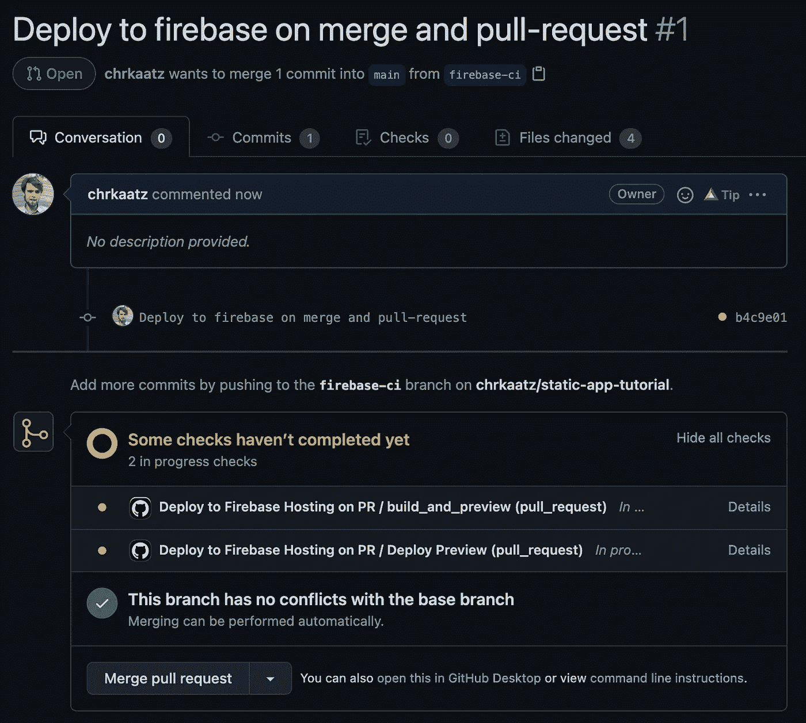
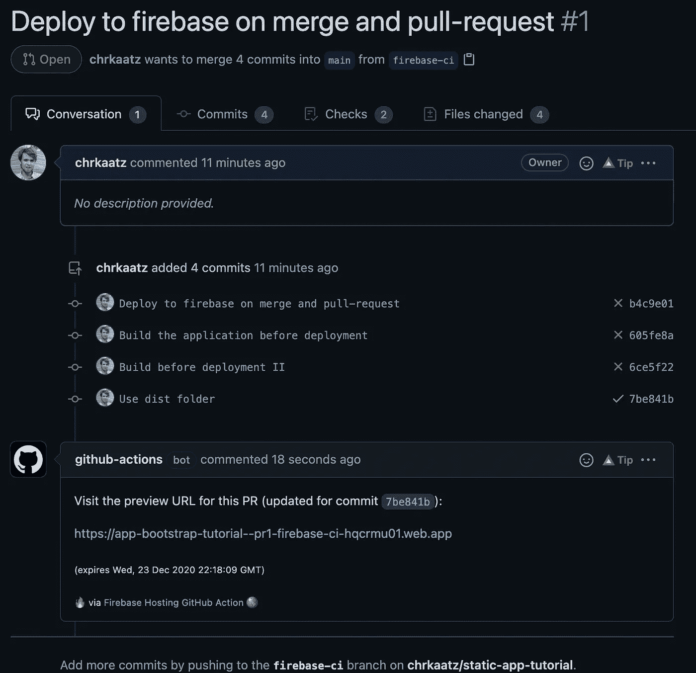
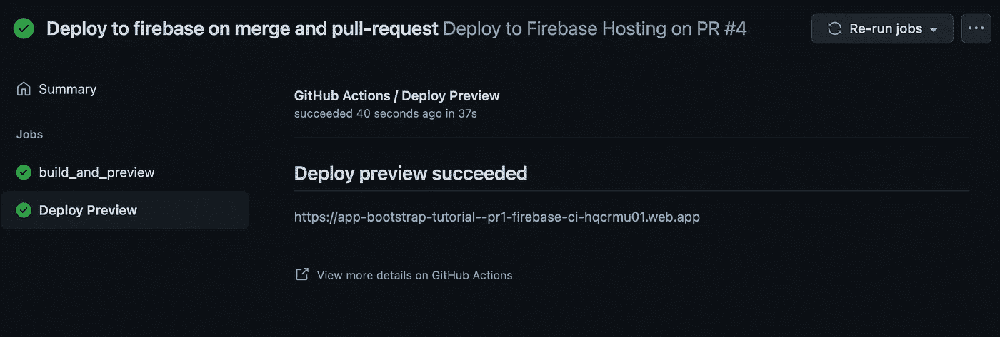
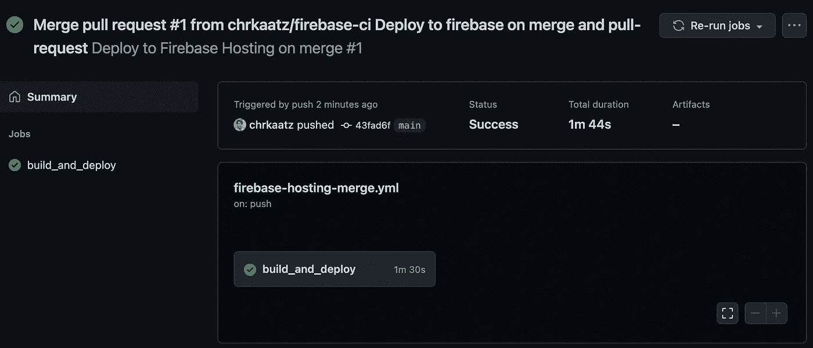
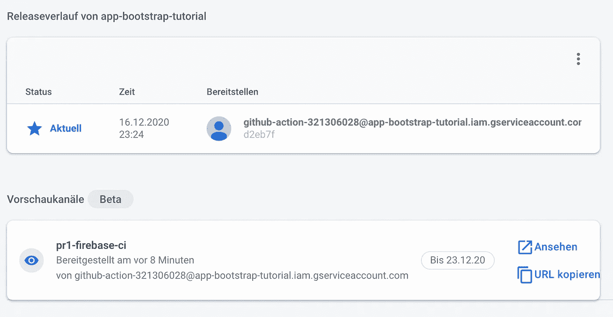
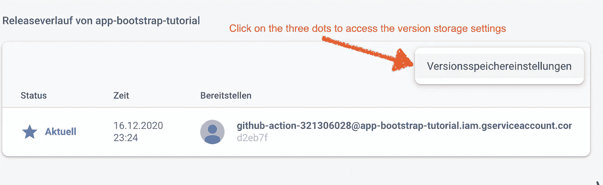
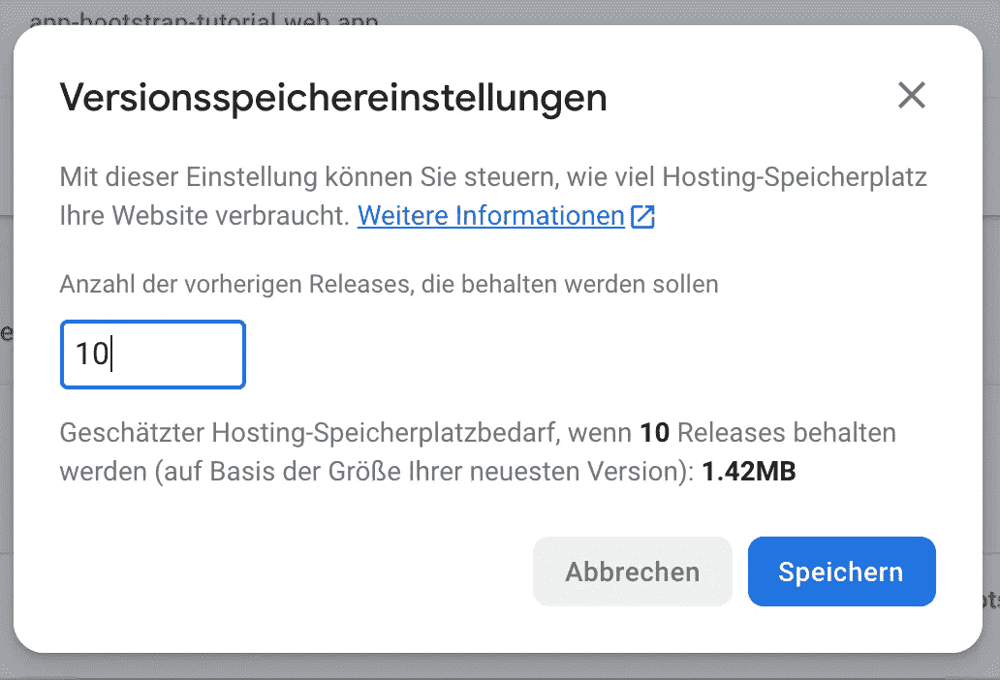

# react-静态应用部署和 CI —教程第二部分

> 原文：<https://itnext.io/react-static-app-deployment-and-ci-tutorial-part-ii-4b5df0946db2?source=collection_archive---------10----------------------->


02 使用 Firebase 和 CI 的反应-静态-应用程序

由于我们已经准备好部署我们的[成品应用](https://chrkaatz.medium.com/bootstrap-your-app-with-react-static-and-grommet-fac9c137cc31)，我们将把它部署到来自 Github 的 firebase with Continuous Integration(CI ),并且每当我们创建一个 Pull 请求时也创建预览分支，以便我们可以验证最新的更改。

# Firebase 设置

如果你还没有在 firebase.google.com[的账户，就创建一个免费的 Firebase 账户。](https://console.firebase.google.com/)

一旦你在你的仪表板上，创建一个新项目，并给它一个有意义的名字——我叫我的:应用程序-引导-教程，在这个阶段，我现在禁用谷歌分析，因为我只是想使用托管功能。

# 装置

```
$ npm install -g firebase-tools
```

下一步，我们需要用 firebase 登录，并在项目的根目录中初始化项目:

```
$ firebase login
$ firebase init

You're about to initialize a Firebase project in this directory:

  /Users/ckaatz/development/static-app-tutorial

? Which Firebase CLI features do you want to set up for this folder? Press Space to sele
ct features, then Enter to confirm your choices. Hosting: Configure and deploy Firebase 
Hosting sites

=== Project Setup

First, let's associate this project directory with a Firebase project.
You can create multiple project aliases by running firebase use --add, 
but for now we'll just set up a default project.

? Please select an option: Use an existing project
? Select a default Firebase project for this directory: app-bootstrap-tutorial (app-boot
strap-tutorial)
i  Using project app-bootstrap-tutorial (app-bootstrap-tutorial)

=== Hosting Setup

Your public directory is the folder (relative to your project directory) that
will contain Hosting assets to be uploaded with firebase deploy. If you
have a build process for your assets, use your build's output directory.

? What do you want to use as your public directory? /dist
? Configure as a single-page app (rewrite all urls to /index.html)? Yes
? Set up automatic builds and deploys with GitHub? Yes
? File /dist/index.html already exists. Overwrite? No
i  Skipping write of /dist/index.html

i  Detected a .git folder at /Users/ckaatz/development/static-app-tutorial
i  Authorizing with GitHub to upload your service account to a GitHub repository's secrets store.

Visit this URL on this device to log in:
https://github.com/login/oauth/authorize?client_id=<REDACTED>

Waiting for authentication...

✔  Success! Logged into GitHub as chrkaatz

? For which GitHub repository would you like to set up a GitHub workflow? (format: user/
repository) chrkaatz/static-app-tutorial

✔  Created service account github-action-XYZ with Firebase Hosting admin permissions.
✔  Uploaded service account JSON to GitHub as secret FIREBASE_SERVICE_ACCOUNT_APP_BOOTSTRAP_TUTORIAL.

? Set up the workflow to run a build script before every deploy? Yes
? What script should be run before every deploy? yarn && yarn build

✔  Created workflow file /Users/ckaatz/development/static-app-tutorial/.github/workflows/firebase-hosting-pull-request.yml
? Set up automatic deployment to your site's live channel when a PR is merged? Yes
? What is the name of the GitHub branch associated with your site's live channel? main

✔  Created workflow file /Users/ckaatz/development/static-app-tutorial/.github/workflows/firebase-hosting-merge.yml

i  Action required: Visit this URL to revoke authorization for the Firebase CLI GitHub OAuth App:
https://github.com/settings/connections/applications/<REDACTED>
i  Action required: Push any new workflow file(s) to your repo

i  Writing configuration info to firebase.json...
i  Writing project information to .firebaserc...

✔  Firebase initialization complete!
```

最好的情况是，我们将在一个特性分支中这样做，以测试 firebase 的预览功能。一旦 [PR](https://github.com/chrkaatz/static-app-tutorial/pull/1) 被创建，我们将看到 Github Actions 将开始创建一个预览部署并看到它的 url。



拉式请求检查



运行后预览可用的 URL



也可以在 Github 操作中找到

# 海峡群岛

在我们验证了 pull 请求之后，我们[合并](https://github.com/chrkaatz/static-app-tutorial/actions/runs/426750576)它，合并工作流将开始将变更从我们的特性分支部署到生产中。我的可以在[app-bootstrap-tutorial . web . app](https://app-bootstrap-tutorial.web.app/)找到



合并后部署



Firebase 版本概述

# 附加提示

我建议您将可用于回滚的版本限制在一个可行的数量(我选择了 10 个)，因为它还会占用 firebase 上的免费存储空间的预算。



访问存储设置



限制为 10

在本教程的下一部分，我们将为我们的应用程序添加 PWA ( [渐进式 web 应用程序](https://en.wikipedia.org/wiki/Progressive_web_applications))功能。

# 密码

代码可以在 Github[https://github.com/chrkaatz/static-app-tutorial](https://github.com/chrkaatz/static-app-tutorial)找到，每个教程步骤都有各自的提交和标签与之关联。这一个被标记为[02-反应-静态-火灾基础-和-CI](https://github.com/chrkaatz/static-app-tutorial/releases/tag/02-React-Static-Firebase-and-CI) 。

# 辅导的

1.  [第一部分——使用 react-static 和索环引导您的应用程序](https://chrkaatz.medium.com/bootstrap-your-app-with-react-static-and-grommet-fac9c137cc31)
2.  [**第二部分—React-静态 app 部署和 CI**](https://chrkaatz.medium.com/react-static-app-deployment-and-ci-tutorial-part-ii-4b5df0946db2)
3.  [第三部分—反应-静态 PWA](https://chrkaatz.medium.com/react-static-pwa-tutorial-part-iii-ed91e0fa1d10)
4.  [第四部分——使用 Cypress 进行 React-static app 测试](https://chrkaatz.medium.com/react-static-app-testing-with-cypress-tutorial-part-iv-ad1ad4612fc1)