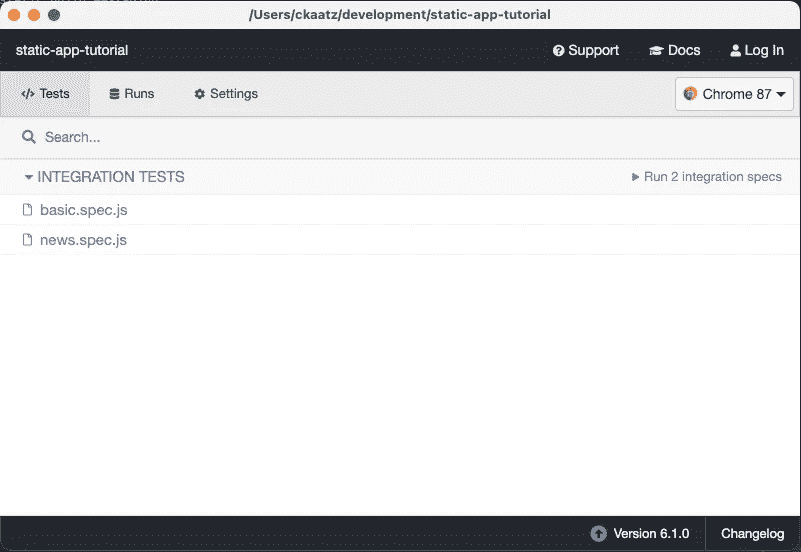
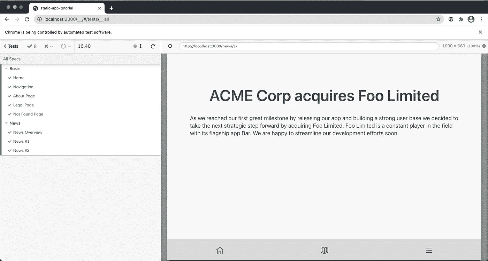

# 用 Cypress 测试 React-static 应用程序——教程第四部分

> 原文：<https://itnext.io/react-static-app-testing-with-cypress-tutorial-part-iv-ad1ad4612fc1?source=collection_archive---------3----------------------->


马丁·亚当斯在 [Unsplash](https://unsplash.com/s/photos/quality-control?utm_source=unsplash&utm_medium=referral&utm_content=creditCopyText) 上的照片

因为我们现在已经有了一个漂亮而简单的应用程序，所以每当我们收到一个新的拉取请求时，我们想向它添加一些内容并测试它。

我们还将删除新闻区的旧进度页面。

# 内容

我们将利用 react-statics 特性在构建期间获取内容，以创建新的路由，包括检索到的每个数据的页面。

数据

我们以 JSON 的形式创建一些通用数据，并将它们存储在类似 [npoint](https://www.npoint.io/) 的服务上，这样我们以后就可以很容易地检索到它们。

```
[
  {
    "userId": 1,
    "id": 2,
    "title": "The App is now live!",
    "body": "This is our first article to tell you about this new wonderful app, it is part of a great tutorial series, on how you can create a beautiful static app, deploy it from Github with CI/CD and last but not least shipping with PWA capabilities to make it installable for end-users."
  },
  {
    "userId": 1,
    "id": 1,
    "title": "ACME Corp acquires Foo Limited",
    "body": "As we reached our first great milestone by releasing our app and building a strong user base we decided to take the next strategic step forward by acquiring Foo Limited. Foo Limited is a constant player in the field with its flagship app Bar. We are happy to streamline our development efforts soon."
  }
]
```

在我创建它之后，我将它锁定以保持我们的应用程序处于可演示状态——你可以在[https://www.npoint.io/docs/af7aa73d0609f820ed5e](https://www.npoint.io/docs/af7aa73d0609f820ed5e)看到它，并在[https://api.npoint.io/af7aa73d0609f820ed5e](https://api.npoint.io/af7aa73d0609f820ed5e)验证原始 JSON。

使用数据

为了使用这些数据，我们需要在我们的 *static.config.js* 中启用 getRoutes 函数

```
import path from "path";
import axios from "axios";export default {
  getRoutes: async () => {
    const { data: newsItems } = await axios.get(
      "https://api.npoint.io/af7aa73d0609f820ed5e"
    ); return [
      {
        path: "/news",
        getData: () => ({
          newsItems,
        }),
        children: newsItems.map((item) => ({
          path: `/${item.id}`,
          template: "src/containers/Item",
          getData: () => ({
            item,
          }),
        })),
      },
    ];
  },
  plugins: [
  // ...
  ]
};
```

为了让这个工作，我们需要再次添加**轴**:

```
$ npm install --save-dev axios
# or
$ yarn add -D axios
```

现在，我们可以下载我们的 *dist* 文件夹的 *news* 文件夹中的数据，其中每个子文件夹的 Id 就是包含生成的 html 的文件夹。

对于生成的 html，我们使用一个容器模板，它存在于我们的 *src/containers/Item.js* 中，也在我们的 *getRoutes* 函数中为每个孩子引用。

来看看我们的 *Item.js* 文件:

```
import React from "react";
import { useRouteData } from "react-static";
import { Heading, Box, Text } from "grommet";export default function Item() {
  const { item } = useRouteData();
  return (
    <Box align="center" justify="center" fill pad="medium">
      <Heading data-test="header">{item.title}</Heading>
      <Box align="start" justify="center">
        <Text data-test="news-body">{item.body}</Text>
      </Box>
    </Box>
  );
}
```

我要特别注意下面的部分，因为它为每个孩子获取了之前在我们的 *static.config.js* 中的 *getRoutes* 函数中定义的项目。

```
const { item } = useRouteData();
```

我们还需要创建新闻的入口文件。这个文件将在我们的 *src/pages/* 文件夹中被命名为 *news.js* 。

```
import React from "react";
import { useRouteData } from "react-static";
import { Heading, Box, Anchor, Text } from "grommet";export default function News() {
  const { newsItems } = useRouteData();
  return (
    <Box align="center" justify="center" fill pad="medium">
      <Heading data-test="header">News</Heading>
      <Box align="start" justify="center">
        {newsItems.map((item) => (
          <Anchor
            data-test="news-link"
            key={item.id}
            href={`/news/${item.id}/`}
          >
            <Box align="start" justify="center" border={{ side: "bottom" }}>
              <Heading level="3" margin="small">
                {item.title}
              </Heading>
              <Text color="dark-6" margin="small">
                {item.body.substring(0, 70)}...
              </Text>
            </Box>
          </Anchor>
        ))}
      </Box>
    </Box>
  );
}
```

我要特别注意下面的部分，因为它获取了之前在我们的 *static.config.js* 中的 *getRoutes* 函数中定义的新闻条目

```
const { newsItems } = useRouteData();
```

最后，我们需要用新图标更新导航组件，替换为:

```
import { Home, Menu, BarChart } from "grommet-icons";
// replace with
import { Home, Menu, Catalog } from "grommet-icons";// ... and the second navigation box should be updated to:
    <Box
      align="center"
      justify="center"
      background={{
        color: getNavColor(location, ["/news"]),
      }}
      data-test="nav-news"
      flex="grow"
      onClick={() => navigate("/news")}
      pad="medium"
      overflow="hidden"
      gridArea="second"
    >
      <Catalog />
    </Box>
```

还要注意，我们已经为元素添加了数据测试属性，以便以后用 cypress 测试它们。

如果你决定使用 jsonbin.io 或 Contentful 之类的服务，你可以设置一个 webhook，并在每次内容发生变化时重新构建你的应用程序。

# 测试

正如本教程前面提到的，我们将使用 cypress 进行应用测试。

让我们从安装 cypress 开始，cypress eslint 配置和启动服务器和测试模块。

后者用于启动服务器，检查它何时运行，然后启动一个测试命令，然后再将其全部拆除。

```
yarn add -D cypress eslint-plugin-cypress start-server-and-test
```

当安装 cypress 时，它会在你的根目录下创建一个 Cypress 文件夹，其中包含一些默认文件夹。在运行测试时，cypress 还可以在出现问题时进行截图和录音，并将它们存储在 *cypress/videos* 和 *cypress/recordings* 中。因为我们将在 CI 管道中使用 cypress，所以我们不需要在 git 中跟踪它们。让我们在我们的*中添加以下 2 行。gitignore*

```
/cypress/videos
/cypress/screenshots
```

也更新我们的*。eslintrc* 文件不要让 **eslint** 对 cypress 大喊大叫:

```
{
  "extends": ["react-app", "plugin:cypress/recommended"]
}
```

# 最小 Cypress 设置

在根目录下创建一个 cypress.json 文件，内容如下:

```
{
    "baseUrl": "http://localhost:3000",
    "chromeWebSecurity": false
}
```

我们关闭了 chromeWebSecurity，因为它会使我们的测试在 CI 中崩溃。

让我们也更新一下我们的 *package.json* 中的脚本部分，我们可以很容易地调用 cypress:

```
{
    //...
    scripts: {
        //...
        "serve": "serve dist -p 3000",
        "e2e": "npm run build && start-server-and-test 'npm run serve' 3000 'cypress run'",
        "e2e:headed": "start-server-and-test 'npm run start' 3000 'cypress open'"
    },
    //...
}
```

我们添加了两个命令，一个用于有头的 cypress，这对于调试很有用，另一个是将在 CI 中使用的无头脚本。

# 第一个测试案例

在这个阶段，我们可以在*cypress/integration/basic . spec . js*中创建我们的第一个测试用例:

```
describe("Basic", () => {
  it("Home", () => {
    cy.visit("/");
    cy.get('[data-test="header"]').should("be.visible");
    cy.get('[data-test="paragraph"]').should("have.length", 2);
  });
});
```

这个测试，将只是到我们的应用程序的主页，并测试一个标题和 2 个段落的存在。

让我们在这个文件中测试应用程序的导航和其他页面:

```
describe("Basic", () => {
  it("Home", () => {
    cy.visit("/");
    cy.get('[data-test="header"]').should("be.visible");
    cy.get('[data-test="paragraph"]').should("have.length", 2);
  });
  it("Navigation", () => {
    cy.visit("/");
    cy.get('[data-test="nav-news"]').click();
    cy.location().should((loc) => {
      expect(loc.pathname).to.eq("/news");
    });
    cy.get('[data-test="header"]').should("be.visible").contains("News");
    cy.get('[data-test="nav-more"]').click();
    cy.location().should((loc) => {
      expect(loc.pathname).to.eq("/more");
    });
    cy.get('[data-test="header"]').should("be.visible").contains("More");
  });
  it("About Page", () => {
    cy.visit("/");
    cy.get('[data-test="nav-more"]').click();
    cy.location().should((loc) => {
      expect(loc.pathname).to.eq("/more");
    });
    cy.get('[data-test="header"]').should("be.visible").contains("More");
    cy.get('[data-test="more-nav-about"]').click();
    cy.location().should((loc) => {
      expect(loc.pathname).to.eq("/about");
    });
    cy.get('[data-test="header"]').should("be.visible").contains("About");
  });
  it("Legal Page", () => {
    cy.visit("/");
    cy.get('[data-test="nav-more"]').click();
    cy.location().should((loc) => {
      expect(loc.pathname).to.eq("/more");
    });
    cy.get('[data-test="header"]').should("be.visible").contains("More");
    cy.get('[data-test="more-nav-legal"]').click();
    cy.location().should((loc) => {
      expect(loc.pathname).to.eq("/legal");
    });
    cy.get('[data-test="header"]').should("be.visible").contains("Legal");
  });
  it("Not Found Page", () => {
    cy.visit("/weird", { failOnStatusCode: false });
    cy.get('[data-test="header"]').contains("404");
  });
});
```

未找到页面测试用例是特殊的，因为路由器将响应 404，这将导致 cypress 失败，但是由于我们想要测试这个特殊的页面，我们需要为 cypress 提供选项，以避免在更高的状态代码 299(*failOnStatusCode:false*)上失败

最后但同样重要的是，我们还将在下面的测试文件*cypress/integration/news . spec . js*中测试我们新创建的新闻部分:

```
describe("News", () => {
  it("News Overview", () => {
    cy.visit("/news");
    cy.get('[data-test="header"]').should("be.visible").contains("News");
    cy.get('[data-test="news-link"]').should("have.length", 2);
  });
  it("News #1", () => {
    cy.visit("/news");
    cy.get('[data-test="news-link"]').first().click();
    cy.get('[data-test="header"]').should("be.visible");
    cy.get('[data-test="news-body"]').should("be.visible");
  });
  it("News #2", () => {
    cy.visit("/");
    cy.get('[data-test="nav-news"]').click();
    cy.get('[data-test="header"]').should("be.visible").contains("News");
    cy.get('[data-test="news-link"]').first().next().click();
    cy.get('[data-test="header"]').should("be.visible");
    cy.get('[data-test="news-body"]').should("be.visible");
  });
});
```

# 试运转



Cypress UI

运行`yarn run e2e`将为我们启动 cypress，看起来应该是:

```
$ yarn run e2e
yarn run v1.22.10
$ npm run build && start-server-and-test 'npm run serve' 3000 'cypress run'
npm WARN lifecycle The node binary used for scripts is /var/folders/wz/79z_9bgj08n9rccm5y503wxm0000gn/T/yarn--1609592529296-0.9931212812991292/node but npm is using /Users/ckaatz/n/bin/node itself. Use the `--scripts-prepend-node-path` option to include the path for the node binary npm was executed with.> the-app-tutorial@ build /Users/ckaatz/development/static-app-tutorial
> react-static build && workbox generateSWBundling application for Production...Cleaning dist...
[✓] Dist cleaned
Cleaning artifacts...
[✓] Artifacts cleaned
Building Routes...
Importing routes from directory...
{ has404: true }
[✓] Routes Built (0.6s)
Building Templates...
[✓] Templates Built
Copying public directory...
[✓] Public directory copied (0.3s)
Bundling App...
Version: webpack 4.44.2
Time: 7135ms
Built at: 01/02/2021 2:02:20 PM
[✓] App Bundled (7.7s)
Fetching Site Data...
[✓] Site Data Downloaded
Fetching Route Data...
[========] 8/8 100% Infinity/s 0.0s 
[✓] Route Data Downloaded
Exporting HTML across 8 threads...
[========] 8/8 100% 13/s 0.0s 
[✓] HTML Exported (5.1s)
Generating sitemap.xml...
[✓] sitemap.xml generatedUsing configuration from /Users/ckaatz/development/static-app-tutorial/workbox-config.js.
The service worker files were written to:
  • /Users/ckaatz/development/static-app-tutorial/dist/sw.js
  • /Users/ckaatz/development/static-app-tutorial/dist/sw.js.map
  • /Users/ckaatz/development/static-app-tutorial/dist/workbox-e1834b40.js
  • /Users/ckaatz/development/static-app-tutorial/dist/workbox-e1834b40.js.map
The service worker will precache 31 URLs, totaling 556 kB.
1: starting server using command "npm run serve"
and when url "[ 'http://localhost:3000' ]" is responding with HTTP status code 200
running tests using command "cypress run"npm WARN lifecycle The node binary used for scripts is /var/folders/wz/79z_9bgj08n9rccm5y503wxm0000gn/T/yarn--1609592529296-0.9931212812991292/node but npm is using /Users/ckaatz/n/bin/node itself. Use the `--scripts-prepend-node-path` option to include the path for the node binary npm was executed with.> the-app-tutorial@ serve /Users/ckaatz/development/static-app-tutorial
> serve dist -p 3000
 ┌───────────────────────────────────────────────────┐
   │                                                   │
   │   Serving!                                        │
   │                                                   │
   │   - Local:            http://localhost:3000       │
   │   - On Your Network:  http://192.168.1.109:3000   │
   │                                                   │
   │   Copied local address to clipboard!              │
   │                                                   │
   └───────────────────────────────────────────────────┘ ======================================================================================== (Run Starting) ┌────────────────────────────────────────────────────────────────────────────────────────────────┐
  │ Cypress:    6.1.0                                                                              │
  │ Browser:    Electron 87 (headless)                                                             │
  │ Specs:      2 found (basic.spec.js, news.spec.js)                                              │
  └────────────────────────────────────────────────────────────────────────────────────────────────┘ ────────────────────────────────────────────────────────────────────────────────────────────────────

  Running:  basic.spec.js                                                                   (1 of 2)
 Basic
    ✓ Home (876ms)
    ✓ Navigation (2284ms)
    ✓ About Page (1472ms)
    ✓ Legal Page (1247ms)
    ✓ Not Found Page (602ms) 5 passing (7s) (Results) ┌────────────────────────────────────────────────────────────────────────────────────────────────┐
  │ Tests:        5                                                                                │
  │ Passing:      5                                                                                │
  │ Failing:      0                                                                                │
  │ Pending:      0                                                                                │
  │ Skipped:      0                                                                                │
  │ Screenshots:  0                                                                                │
  │ Video:        true                                                                             │
  │ Duration:     6 seconds                                                                        │
  │ Spec Ran:     basic.spec.js                                                                    │
  └────────────────────────────────────────────────────────────────────────────────────────────────┘ (Video) -  Started processing:  Compressing to 32 CRF                                                     
  -  Finished processing: /Users/ckaatz/development/static-app-tutorial/cypress/video    (0 seconds)
                          s/basic.spec.js.mp4 ────────────────────────────────────────────────────────────────────────────────────────────────────

  Running:  news.spec.js                                                                    (2 of 2)
 News
    ✓ News Overview (697ms)
    ✓ News #1 (581ms)
    ✓ News #2 (883ms) 3 passing (2s) (Results) ┌────────────────────────────────────────────────────────────────────────────────────────────────┐
  │ Tests:        3                                                                                │
  │ Passing:      3                                                                                │
  │ Failing:      0                                                                                │
  │ Pending:      0                                                                                │
  │ Skipped:      0                                                                                │
  │ Screenshots:  0                                                                                │
  │ Video:        true                                                                             │
  │ Duration:     2 seconds                                                                        │
  │ Spec Ran:     news.spec.js                                                                     │
  └────────────────────────────────────────────────────────────────────────────────────────────────┘ (Video) -  Started processing:  Compressing to 32 CRF                                                     
  -  Finished processing: /Users/ckaatz/development/static-app-tutorial/cypress/video    (0 seconds)
                          s/news.spec.js.mp4 ==================================================================================================== (Run Finished) Spec                                              Tests  Passing  Failing  Pending  Skipped  
  ┌────────────────────────────────────────────────────────────────────────────────────────────────┐
  │ ✔  basic.spec.js                            00:06        5        5        -        -        - │
  ├────────────────────────────────────────────────────────────────────────────────────────────────┤
  │ ✔  news.spec.js                             00:02        3        3        -        -        - │
  └────────────────────────────────────────────────────────────────────────────────────────────────┘
    ✔  All specs passed!                        00:08        8        8        -        -        - INFO: Gracefully shutting down. Please wait...
✨  Done in 46.83s.
```

# 在 CI 中布线

最后，我们希望在每个拉请求上挂接我们的测试，为了实现这一点，我们需要更新我们的 PR 工作流文件(*)。github/workflows/firebase-hosting-pull-request . yml*

```
name: Run Cypress tests and deploy to Firebase Hosting on PR
'on': pull_request
jobs:
  build_and_preview:
    runs-on: ubuntu-latest
    steps:
      - uses: actions/checkout@v2
      - uses: cypress-io/github-action@v2
        with:
          install-command: yarn --frozen-lockfile --silent
          build: yarn build
          start: yarn serve
          wait-on: 'http://localhost:3000'
          browser: chrome
          headless: true
      - run: yarn && yarn build
      - uses: FirebaseExtended/action-hosting-deploy@v0
        with:
          repoToken: '${{ secrets.GITHUB_TOKEN }}'
          firebaseServiceAccount: '${{ secrets.FIREBASE_SERVICE_ACCOUNT_APP_BOOTSTRAP_TUTORIAL }}'
          projectId: app-bootstrap-tutorial
        env:
          FIREBASE_CLI_PREVIEWS: hostingchannels
```



成功的带头测试运行

# 密码

代码可以在 Github[https://github.com/chrkaatz/static-app-tutorial](https://github.com/chrkaatz/static-app-tutorial)找到，每个教程步骤都有各自的提交和标签与之关联。这款贴有[04-反应-静态-App-测试](https://github.com/chrkaatz/static-app-tutorial/releases/tag/04-React-Static-App-Testing)的标签。

# 辅导的

1.  [第一部分——用 react-static 和 grommet 引导您的应用程序](https://chrkaatz.medium.com/bootstrap-your-app-with-react-static-and-grommet-fac9c137cc31)
2.  [第二部分—React-静态应用部署和 CI](https://github.com/chrkaatz/static-app-tutorial/releases/tag/03-React-Static-PWA)
3.  [第三部分—反应-静态 PWA](https://chrkaatz.medium.com/react-static-pwa-tutorial-part-iii-ed91e0fa1d10)
4.  [**第四部分—使用 Cypress 进行 React-静态应用程序测试**](https://chrkaatz.medium.com/react-static-app-testing-with-cypress-tutorial-part-iv-ad1ad4612fc1)