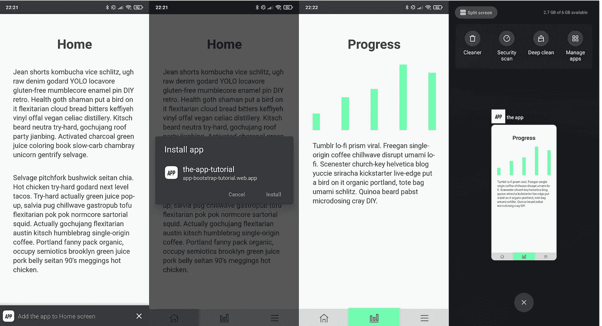
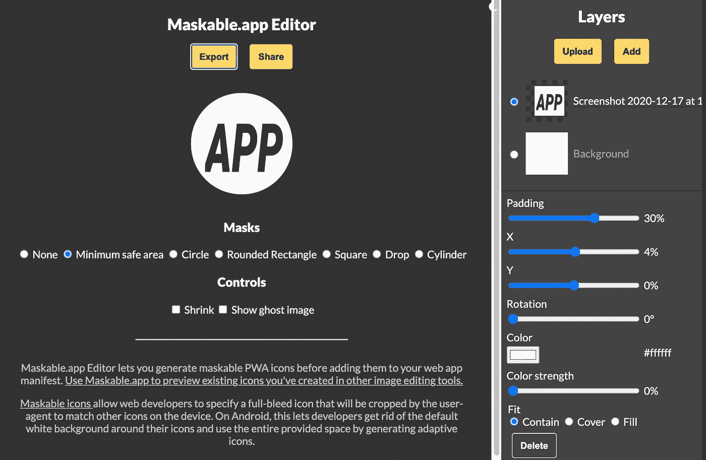

# react-静态 PWA —教程第三部分

> 原文：<https://itnext.io/react-static-pwa-tutorial-part-iii-ed91e0fa1d10?source=collection_archive---------9----------------------->

**03 反应-静态-PWA**

由于我们现在有一个应用程序和持续部署，我们希望通过添加 PWA 功能来改进我们的应用程序。这将增加功能，使我们的网站可以通过浏览器(Chrome、Safari、Firefox 等)安装，并像本地应用程序一样使用，有自己的应用程序图标和快捷方式。

在[app-bootstrap-tutorial . web . app](https://app-bootstrap-tutorial.web.app/)查看当前状态



Android 设备上的应用程序

# 基本功能

首先，我们需要一个 PWA 清单来描述我们的应用程序，并告诉操作系统/浏览器名称、显示行为、图标和其他类似快捷方式的东西。

我们将在公共目录中创建一个基本的 manifest.json。

```
{
    "short_name": "the app",
    "name": "the-app-tutorial",
    "description": "App to display PWA capabilities with react-static and grommet",
    "start_url": "/",
    "background_color": "#000000",
    "display": "standalone",
    "scope": "/",
    "theme_color": "#000000",
    "shortcuts": [],
    "icons": []
  }
```

我们还需要更新 src 文件夹中的 App.js:

```
// replace the following line with the one below
// import { Root, Routes } from "react-static";
import { Head, Root, Routes } from "react-static";// ...
function App() {
  return (
    <Root>
        // only add it when we build our app for production
        {process.env.NODE_ENV === "production" && (
         <Head>
             <link rel="manifest" href="/manifest.json"></link>
             <script src="/init-sw.js"></script>
        </Head>
      )}// ...
```

如您所见，我们还需要创建另一个文件:公共目录中的 init-sw.js。

```
if ("serviceWorker" in navigator) {
  window.addEventListener("load", function () {
    // the sw.js will be created by workbox
    navigator.serviceWorker.register("/sw.js");
  });
}
```

我们还需要将[工具箱](https://developers.google.com/web/tools/workbox/)添加到我们的应用程序中，并让它创建我们的服务人员，就像前面提到的代码片段一样。

服务人员将简单地缓存我们的资源，如 html 页面，以加快页面速度。


失效而重新验证缓存策略—图片由[工具箱](https://developers.google.com/web/tools/workbox/images/modules/workbox-strategies/stale-while-revalidate.png)提供

```
$ npm install --save-dev workbox-cli
# or 
$ yarn add -D workbox-cli
```

现在我们需要为 workbox 创建配置，存储在名为 workbox-config.js 的根目录中。

```
module.exports = {
  globDirectory: "dist/",
  globPatterns: ["**/*.{html,json,js,txt,xml,css}"],
  swDest: "dist/sw.js",
};
```

最后，我们需要更新 package.json 中的构建目标:

```
 //...
    // replace
    "build": "react-static build"
    // with
    "build": "react-static build && workbox generateSW"
    //...
```

如果您现在用...

```
$ npm run build
# or
$ yarn build
```

...它将在您的 dist 文件夹中生成一个服务人员文件(sw.js)。

# 赏心悦目

到目前为止，我们的应用程序甚至没有一个图标，如果我们已经有了一个图标或图标的想法，那就太好了。

不幸的是，我们需要准备我们的原始图标用于某些操作系统，如 Android，并使其可屏蔽。有一个很棒的工具叫做 [maskable.app](https://maskable.app/) ，其编辑功能位于 [Maskable.app 编辑器](https://maskable.app/editor)。在那里你可以上传你的图标，并使它符合你的需要。



运行中的 Maskable.app 编辑器

现在我们有了 saanitized 图标，我们希望它能适用于各种不同的操作系统/浏览器偏好。我使用了文章 [PWA 闪屏和图标生成器](/pwa-splash-screen-and-icon-generator-a74ebb8a130)中很好介绍的 [pwa-asset-generator](https://www.npmjs.com/package/pwa-asset-generator) 。

在我们的公共目录中，我们创建了一个 icons 文件夹，其中包含我们的可屏蔽图标，我将其命名为 app_icon.png。

```
$ cd public
$ npx pwa-asset-generator ./icons/app_icon.png ./icons --background "#fff" --scrape false
getSplashScreenMetaData Skipped scraping - using static data
saveImages Initialising puppeteer to take screenshots 🤖
getShellHtml Generating shell html with provided image source
getShellHtml Providing shell html as page content
saveImages Saved image apple-splash-2048-2732 🙌
saveImages Saved image apple-splash-2160-1620 🙌
saveImages Saved image apple-splash-1792-828 🙌
saveImages Saved image apple-splash-828-1792 🙌
saveImages Saved image apple-splash-1284-2778 🙌
saveImages Saved image apple-splash-2732-2048 🙌
saveImages Saved image apple-splash-1668-2388 🙌
saveImages Saved image apple-splash-1242-2208 🙌
saveImages Saved image apple-splash-2532-1170 🙌
saveImages Saved image apple-splash-750-1334 🙌
saveImages Saved image apple-splash-2224-1668 🙌
saveImages Saved image manifest-icon-192 🙌
saveImages Saved image apple-splash-2688-1242 🙌
saveImages Saved image apple-splash-1334-750 🙌
saveImages Saved image apple-splash-1620-2160 🙌
saveImages Saved image apple-splash-1536-2048 🙌
saveImages Saved image manifest-icon-512 🙌
saveImages Saved image apple-splash-1242-2688 🙌
saveImages Saved image apple-icon-180 🙌
saveImages Saved image apple-splash-1668-2224 🙌
saveImages Saved image apple-splash-1170-2532 🙌
saveImages Saved image apple-splash-1136-640 🙌
saveImages Saved image apple-splash-640-1136 🙌
saveImages Saved image apple-splash-2778-1284 🙌
saveImages Saved image apple-splash-2048-1536 🙌
saveImages Saved image apple-splash-2208-1242 🙌
saveImages Saved image apple-splash-2436-1125 🙌
saveImages Saved image apple-splash-1125-2436 🙌
saveImages Saved image apple-splash-2388-1668 🙌
cli Web App Manifest file is not specified, printing out the content to console instead 🤔
cli Below is the icons content for your manifest.json file. You can copy/paste it manually 🙌[
  {
    "src": "/icons/manifest-icon-192.png",
    "sizes": "192x192",
    "type": "image/png",
    "purpose": "maskable any"
  },
  {
    "src": "/icons/manifest-icon-512.png",
    "sizes": "512x512",
    "type": "image/png",
    "purpose": "maskable any"
  }
]cli Index html file is not specified, printing out the content to console instead 🤔
cli Below is the iOS meta tags content for your index.html file. You can copy/paste it manually 🙌<link rel="apple-touch-icon" href="/icons/apple-icon-180.png" /><meta name="apple-mobile-web-app-capable" content="yes" /><link rel="apple-touch-startup-image" href="/icons/apple-splash-2048-2732.jpg" media="(device-width: 1024px) and (device-height: 1366px) and (-webkit-device-pixel-ratio: 2) and (orientation: portrait)" />
<link rel="apple-touch-startup-image" href="/icons/apple-splash-2732-2048.jpg" media="(device-width: 1024px) and (device-height: 1366px) and (-webkit-device-pixel-ratio: 2) and (orientation: landscape)" />
<link rel="apple-touch-startup-image" href="/icons/apple-splash-1668-2388.jpg" media="(device-width: 834px) and (device-height: 1194px) and (-webkit-device-pixel-ratio: 2) and (orientation: portrait)" />
<link rel="apple-touch-startup-image" href="/icons/apple-splash-2388-1668.jpg" media="(device-width: 834px) and (device-height: 1194px) and (-webkit-device-pixel-ratio: 2) and (orientation: landscape)" />
<link rel="apple-touch-startup-image" href="/icons/apple-splash-1536-2048.jpg" media="(device-width: 768px) and (device-height: 1024px) and (-webkit-device-pixel-ratio: 2) and (orientation: portrait)" />
<link rel="apple-touch-startup-image" href="/icons/apple-splash-2048-1536.jpg" media="(device-width: 768px) and (device-height: 1024px) and (-webkit-device-pixel-ratio: 2) and (orientation: landscape)" />
<link rel="apple-touch-startup-image" href="/icons/apple-splash-1668-2224.jpg" media="(device-width: 834px) and (device-height: 1112px) and (-webkit-device-pixel-ratio: 2) and (orientation: portrait)" />
<link rel="apple-touch-startup-image" href="/icons/apple-splash-2224-1668.jpg" media="(device-width: 834px) and (device-height: 1112px) and (-webkit-device-pixel-ratio: 2) and (orientation: landscape)" />
<link rel="apple-touch-startup-image" href="/icons/apple-splash-1620-2160.jpg" media="(device-width: 810px) and (device-height: 1080px) and (-webkit-device-pixel-ratio: 2) and (orientation: portrait)" />
<link rel="apple-touch-startup-image" href="/icons/apple-splash-2160-1620.jpg" media="(device-width: 810px) and (device-height: 1080px) and (-webkit-device-pixel-ratio: 2) and (orientation: landscape)" />
<link rel="apple-touch-startup-image" href="/icons/apple-splash-1284-2778.jpg" media="(device-width: 428px) and (device-height: 926px) and (-webkit-device-pixel-ratio: 3) and (orientation: portrait)" />
<link rel="apple-touch-startup-image" href="/icons/apple-splash-2778-1284.jpg" media="(device-width: 428px) and (device-height: 926px) and (-webkit-device-pixel-ratio: 3) and (orientation: landscape)" />
<link rel="apple-touch-startup-image" href="/icons/apple-splash-1170-2532.jpg" media="(device-width: 390px) and (device-height: 844px) and (-webkit-device-pixel-ratio: 3) and (orientation: portrait)" />
<link rel="apple-touch-startup-image" href="/icons/apple-splash-2532-1170.jpg" media="(device-width: 390px) and (device-height: 844px) and (-webkit-device-pixel-ratio: 3) and (orientation: landscape)" />
<link rel="apple-touch-startup-image" href="/icons/apple-splash-1125-2436.jpg" media="(device-width: 375px) and (device-height: 812px) and (-webkit-device-pixel-ratio: 3) and (orientation: portrait)" />
<link rel="apple-touch-startup-image" href="/icons/apple-splash-2436-1125.jpg" media="(device-width: 375px) and (device-height: 812px) and (-webkit-device-pixel-ratio: 3) and (orientation: landscape)" />
<link rel="apple-touch-startup-image" href="/icons/apple-splash-1242-2688.jpg" media="(device-width: 414px) and (device-height: 896px) and (-webkit-device-pixel-ratio: 3) and (orientation: portrait)" />
<link rel="apple-touch-startup-image" href="/icons/apple-splash-2688-1242.jpg" media="(device-width: 414px) and (device-height: 896px) and (-webkit-device-pixel-ratio: 3) and (orientation: landscape)" />
<link rel="apple-touch-startup-image" href="/icons/apple-splash-828-1792.jpg" media="(device-width: 414px) and (device-height: 896px) and (-webkit-device-pixel-ratio: 2) and (orientation: portrait)" />
<link rel="apple-touch-startup-image" href="/icons/apple-splash-1792-828.jpg" media="(device-width: 414px) and (device-height: 896px) and (-webkit-device-pixel-ratio: 2) and (orientation: landscape)" />
<link rel="apple-touch-startup-image" href="/icons/apple-splash-1242-2208.jpg" media="(device-width: 414px) and (device-height: 736px) and (-webkit-device-pixel-ratio: 3) and (orientation: portrait)" />
<link rel="apple-touch-startup-image" href="/icons/apple-splash-2208-1242.jpg" media="(device-width: 414px) and (device-height: 736px) and (-webkit-device-pixel-ratio: 3) and (orientation: landscape)" />
<link rel="apple-touch-startup-image" href="/icons/apple-splash-750-1334.jpg" media="(device-width: 375px) and (device-height: 667px) and (-webkit-device-pixel-ratio: 2) and (orientation: portrait)" />
<link rel="apple-touch-startup-image" href="/icons/apple-splash-1334-750.jpg" media="(device-width: 375px) and (device-height: 667px) and (-webkit-device-pixel-ratio: 2) and (orientation: landscape)" />
<link rel="apple-touch-startup-image" href="/icons/apple-splash-640-1136.jpg" media="(device-width: 320px) and (device-height: 568px) and (-webkit-device-pixel-ratio: 2) and (orientation: portrait)" />
<link rel="apple-touch-startup-image" href="/icons/apple-splash-1136-640.jpg" media="(device-width: 320px) and (device-height: 568px) and (-webkit-device-pixel-ratio: 2) and (orientation: landscape)" />
```

正如我们所看到的，它成功地生成了各种大小的图标，并生成了要插入 manifest.json 和 App.js 的代码。您可以直接在 Github 上签出包含所有必要更改的代码。

## 密码

代码可以在 Github[https://github.com/chrkaatz/static-app-tutorial](https://github.com/chrkaatz/static-app-tutorial)找到，每个教程步骤都有各自的提交和标签与之关联。这个贴着[03-反应-静态-PWA](https://github.com/chrkaatz/static-app-tutorial/releases/tag/03-React-Static-PWA) 的标签。

## 辅导的

1.  [第一部分——用 react-static 和 grommet 引导您的应用程序](https://chrkaatz.medium.com/bootstrap-your-app-with-react-static-and-grommet-fac9c137cc31?source=friends_link&sk=32ee9122d2d5e919792826be3a2bdbf8)
2.  [第二部分—React-静态应用部署和 CI](https://github.com/chrkaatz/static-app-tutorial/releases/tag/03-React-Static-PWA)
3.  [**第三部分—反应-静态 PWA**](https://chrkaatz.medium.com/react-static-pwa-tutorial-part-iii-ed91e0fa1d10)
4.  [第四部分——使用 Cypress 进行反应静态 app 测试](https://chrkaatz.medium.com/react-static-app-testing-with-cypress-tutorial-part-iv-ad1ad4612fc1)