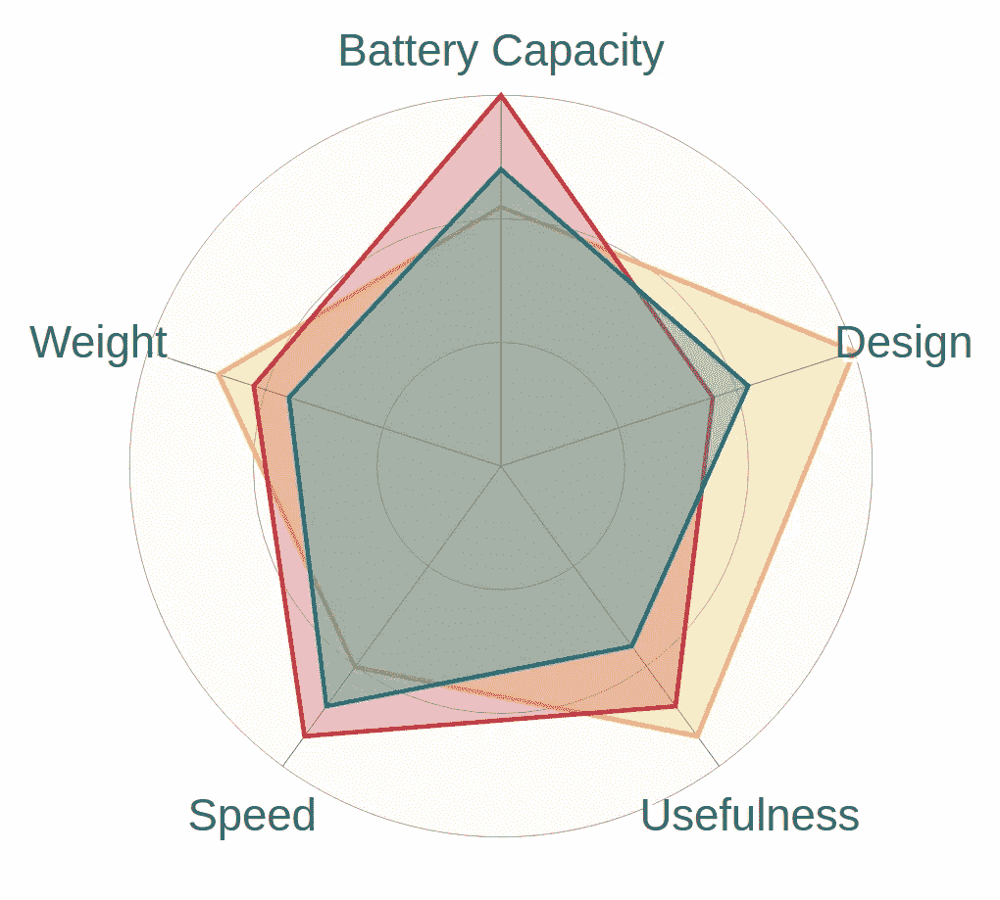
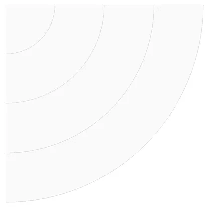
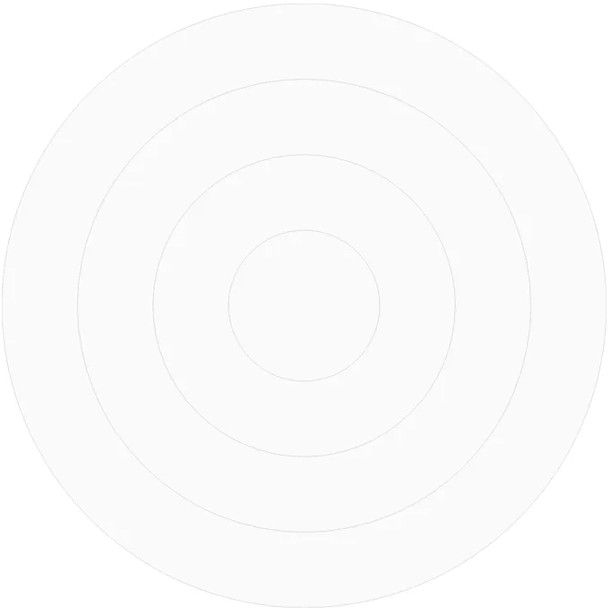
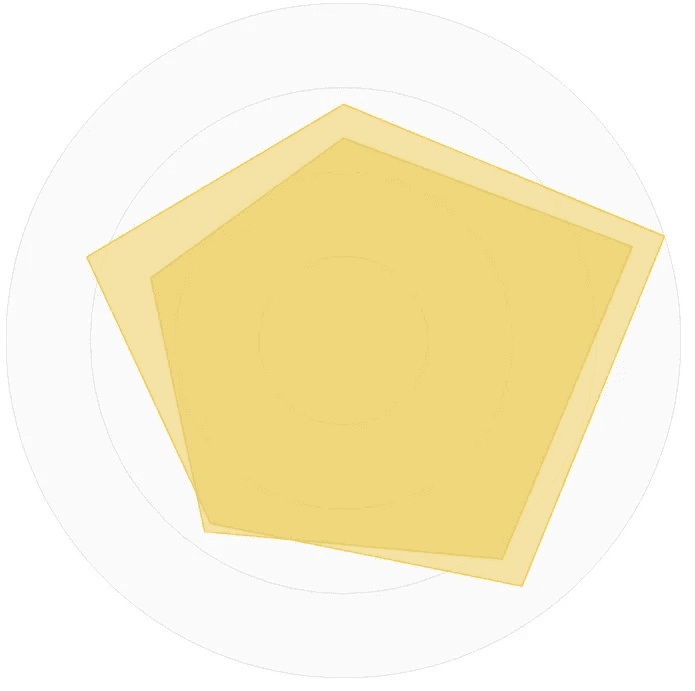
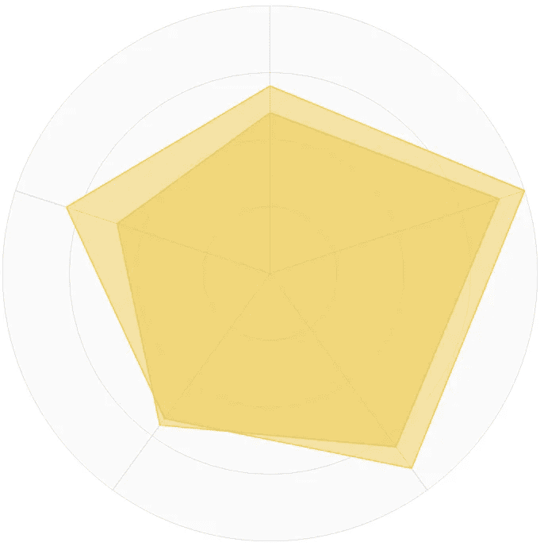
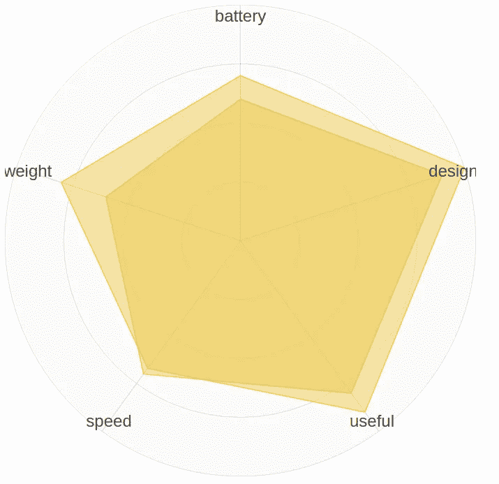
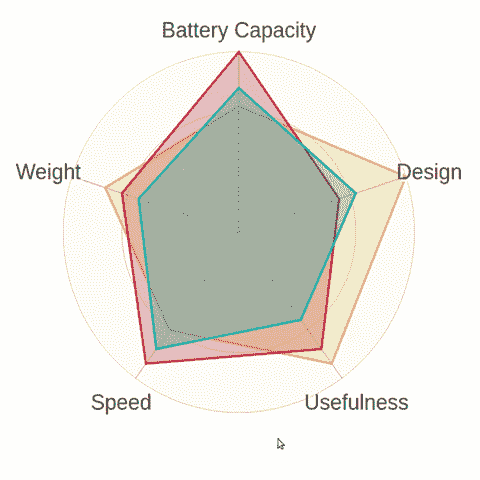

# 反应 SVG 雷达图

> 原文：<https://itnext.io/react-svg-radar-chart-a89d15760e8?source=collection_archive---------6----------------------->



用 React 制作的漂亮 SVG 雷达图

周围有很多库，用来创建图表，但是很多都很重。让我们看看如何用 *React* 构建**雷达图**。

我选择的图像格式是 SVG，主要原因是:

1.  **分辨率** : SVG 图像是*矢量*，由形状和填充组成，可以任意缩放，高分辨率打印。
2.  **速度** : SVG 比其他图像格式重量轻，浏览器下载速度更快。(在我们的例子中，它们不是下载的，而是生成的)
3.  **动画**:我们可以添加任何种类的动画和 CSS 样式。
4.  **可访问性和 SEO** :谷歌索引 SVG 图片。

# 让我们编码

让我们开始用 React 编码。

为了生成 **SVG 雷达图**，我们将开始创建一个 *React 组件*，它将呈现一个空的(到目前为止)SVG。

```
import React from 'react';const RadarChart = props => {
  return (<svg version="1"  width="450" height="450"></svg>);
};export default RadarChart;
```

现在我们要用雷达图填充空的 SVG。

在向图表添加任何对象之前，我们必须定义要显示的数据的数据结构。这些数据将是一个对象数组，其形状如下:

```
const data = [
 {battery: 0.7, design: 1, useful: 0.9, speed: 0.67, weight: 0.8 },
 {battery: 0.6, design: 0.9, useful: 0.8, speed: 0.7, weight: 0.6 }
];
```

数组的每个对象都由固定的属性组成，这些属性的值是 0 到 1 之间的一个数字。在上面的例子中，我们有两个数据系列，但我们可以添加一些其他的，或者只保留一个。我可能给你的建议是最多用 3/4 系列，不然数据可视化会太混乱。

## 画出刻度

让我们继续看图表，画出刻度，经典的雷达同心圆。我们将创建`scale`函数，为此我们需要知道:

*   图表的大小，来计算圆的半径。
*   圈数，我们想要多少圈。

```
const chartSize = 450;
const numberOfScales = 4;
```

这就是函数。

```
const scale = value => (
  <circle 
    key={`scale-${value}`}
    cx={0}
    cy={0}
    r={(value / numberOfScales * chartSize) / 2}
    fill="#FAFAFA"
    stroke="#999"
    strokeWidth="0.2"
  />
);
```

为了计算圆的半径(`r`属性)，我们使用`value`参数，其值为:`(value / numberOfScales * chartSize) / 2`。值得注意的是，我们把圆心放在位置 x = 0，y = 0。

我们将根据需要多次调用`scale`函数:

```
for (let i = numberOfScales; i > 0; i--) {
  scales.push(scale(i));
}
```

将*组件*组装在一起将会是:

```
import React from 'react';const data = [
  { battery: 0.7, design: 1, useful: 0.9, speed: 0.67, weight: 0.8 },
  { battery: 0.6, design: 0.9, useful: 0.8, speed: 0.7, weight: 0.6 }
];const chartSize = 450;
const numberOfScales = 4;const scale = value => (
  <circle
    key={`scale-${value}`}
    cx={0}
    cy={0}
    r={((value / numberOfScales) * chartSize) / 2}
    fill="#FAFAFA"
    stroke="#999"
    strokeWidth="0.2"
  />
);const RadarChart = props => {
  const groups = [];
  const scales = [];
  for (let i = numberOfScales; i > 0; i--) {
    scales.push(scale(i));
  }
  groups.push(<g key={`scales`}>{scales}</g>);return (
    <svg
      version="1"
      ae nw" href="http://www.w3.org/2000/svg" rel="noopener ugc nofollow" target="_blank">http://www.w3.org/2000/svg"
      width={chartSize}
      height={chartSize}
      viewBox={`0 0 ${chartSize} ${chartSize}`}
    >
      <g>{groups}</g>
    </svg>
  );
};
export default RadarChart;
```

我们将中心设置在`0,0`位置，因此结果将是:



雷达图的比例尺，在 0，0 位置

我们必须对组应用一个转换，在 SVG 的中间翻译它们，属性为`transform`:

```
const middleOfChart = (chartSize / 2).toFixed(4);
...
<g transform={`translate(${middleOfChart},${middleOfChart})`}>{groups}</g>
```

这就是结果:



雷达图上的圆圈现在处于正确的位置。

## 形状

让我们继续，画出图表的实际形状。

我们需要为每一个数据设定一个角度，知道在哪里划线。接下来，我们将添加一个组`g`来放置形状。

```
const captions = Object.keys(data[0]);
  const columns = captions.map((key, i, all) => {
    return {
      key,
      angle: (Math.PI * 2 * i) / all.length
    };
  });
  groups.push(<g key={`groups}`}>{data.map(shape(columns))}</g>);
```

我们创建了`shape`函数来绘制形状。这有点复杂，但是基本的概念是:对于数据中的每个序列，我们添加一个组`g`，在那里我们会放一个`path`。

`path`的`d`属性是*路径定义*，在这里面，我们可以使用一些*函数*，我们将要使用:

*   *移动到* ( `M`):将光标移动到这个位置。
*   *直线到* ( `L` ): 从这里的*到那里的*画一条直线。
*   *关闭路径* ( `z`):关闭路径。

为了知道在哪里画线，我们需要使用一些三角学，所以我创建了函数`polarToX`和`polarToY`，它们使用余弦和我们之前计算的角度。

```
const polarToX = (angle, distance) => Math.cos(angle - Math.PI / 2) * distance * chartSize;
const polarToY = (angle, distance) => Math.sin(angle - Math.PI / 2) * distance * chartSize;const pathDefinition = points => {
  let d = 'M' + points[0][0].toFixed(4) + ',' + points[0][1].toFixed(4);
  for (let i = 1; i < points.length; i++) {
    d += 'L' + points[i][0].toFixed(4) + ',' + points[i][1].toFixed(4);
  }
  return d + 'z';
};const shape = (columns) => (chartData, i) => {
  const data = chartData;
  return (
    <path
      key={`shape-${i}`}
      d={pathDefinition(
        columns.map(col => {
          const value = data[col.key];
          return [
            polarToX(col.angle, (value) / 2),
            polarToY(col.angle, (value) / 2)
          ];
        })
      )}
      stroke={`#edc951`}
      fill={`#edc951`}
      fillOpacity=".5"
    />
  );
};
```

同样，将所有代码放在一起，我们的代码将是:

```
import React from 'react';const data = [
  { battery: 0.7, design: 1, useful: 0.9, speed: 0.67, weight: 0.8 },
  { battery: 0.6, design: 0.9, useful: 0.8, speed: 0.7, weight: 0.6 }
];const chartSize = 450;
const numberOfScales = 4;const scale = value => (
  <circle
    key={`scale-${value}`}
    cx={0}
    cy={0}
    r={((value / numberOfScales) * chartSize) / 2}
    fill="#FAFAFA"
    stroke="#999"
    strokeWidth="0.2"
  />
);const polarToX = (angle, distance) => Math.cos(angle - Math.PI / 2) * distance;
const polarToY = (angle, distance) => Math.sin(angle - Math.PI / 2) * distance;const pathDefinition = points => {
  let d = 'M' + points[0][0].toFixed(4) + ',' + points[0][1].toFixed(4);
  for (let i = 1; i < points.length; i++) {
    d += 'L' + points[i][0].toFixed(4) + ',' + points[i][1].toFixed(4);
  }
  return d + 'z';
};const shape = columns => (chartData, i) => {
  const data = chartData;
  return (
    <path
      key={`shape-${i}`}
      d={pathDefinition(
        columns.map(col => {
          const value = data[col.key];
          return [
            polarToX(col.angle, (value * chartSize) / 2),
            polarToY(col.angle, (value * chartSize) / 2)
          ];
        })
      )}
      stroke={`#edc951`}
      fill={`#edc951`}
      fillOpacity=".5"
    />
  );
};const RadarChart = props => {
  const groups = [];
  const scales = [];
  for (let i = numberOfScales; i > 0; i--) {
    scales.push(scale(i));
  }
  groups.push(<g key={`scales`}>{scales}</g>);const middleOfChart = (chartSize / 2).toFixed(4);const captions = Object.keys(data[0]);
  const columns = captions.map((key, i, all) => {
    return {
      key,
      angle: (Math.PI * 2 * i) / all.length
    };
  });
  groups.push(<g key={`groups}`}>{data.map(shape(columns))}</g>);return (
    <svg
      version="1"
      ae nw" href="http://www.w3.org/2000/svg" rel="noopener ugc nofollow" target="_blank">http://www.w3.org/2000/svg"
      width={chartSize}
      height={chartSize}
      viewBox={`0 0 ${chartSize} ${chartSize}`}
    >
      <g transform={`translate(${middleOfChart},${middleOfChart})`}>{groups}</g>
    </svg>
  );
};
export default RadarChart;
```

部分结果将变成:



雷达图开始有了最终的形状，我们添加了形状。

## 轴心

让我们继续在形状的顶点添加轴。

我们将创建一个函数来绘制轴，轴的数量将根据我们拥有的数据量而变化。在这种情况下，我们也使用功能`polarToX`和`polarToY`来定位它们。

```
const points = points => {
  return points
    .map(point => point[0].toFixed(4) + ',' + point[1].toFixed(4))
    .join(' ');
};const axis = () => (col, i) => (
  <polyline
    key={`poly-axis-${i}`}
    points={points([
      [0, 0],
      [polarToX(col.angle, chartSize / 2), polarToY(col.angle, chartSize / 2)]
    ])}
    stroke="#555"
    strokeWidth=".2"
  />
);
```

我们将添加另一组，并将其放在*形状组*之前，以便有更好的美学效果。

```
groups.push(<g key={`group-axes`}>{columns.map(axis())}</g>);
```

我们的雷达图差不多完成了，这是目前为止的代码:

```
import React from 'react';const data = [
  { battery: 0.7, design: 1, useful: 0.9, speed: 0.67, weight: 0.8 },
  { battery: 0.6, design: 0.9, useful: 0.8, speed: 0.7, weight: 0.6 }
];const chartSize = 450;
const numberOfScales = 4;const scale = value => (
  <circle
    key={`scale-${value}`}
    cx={0}
    cy={0}
    r={((value / numberOfScales) * chartSize) / 2}
    fill="#FAFAFA"
    stroke="#999"
    strokeWidth="0.2"
  />
);const polarToX = (angle, distance) => Math.cos(angle - Math.PI / 2) * distance;
const polarToY = (angle, distance) => Math.sin(angle - Math.PI / 2) * distance;const pathDefinition = points => {
  let d = 'M' + points[0][0].toFixed(4) + ',' + points[0][1].toFixed(4);
  for (let i = 1; i < points.length; i++) {
    d += 'L' + points[i][0].toFixed(4) + ',' + points[i][1].toFixed(4);
  }
  return d + 'z';
};const shape = columns => (chartData, i) => {
  const data = chartData;
  return (
    <path
      key={`shape-${i}`}
      d={pathDefinition(
        columns.map(col => {
          const value = data[col.key];
          return [
            polarToX(col.angle, (value * chartSize) / 2),
            polarToY(col.angle, (value * chartSize) / 2)
          ];
        })
      )}
      stroke={`#edc951`}
      fill={`#edc951`}
      fillOpacity=".5"
    />
  );
};const points = points => {
  return points
    .map(point => point[0].toFixed(4) + ',' + point[1].toFixed(4))
    .join(' ');
};const axis = () => (col, i) => (
  <polyline
    key={`poly-axis-${i}`}
    points={points([
      [0, 0],
      [polarToX(col.angle, chartSize / 2), polarToY(col.angle, chartSize / 2)]
    ])}
    stroke="#555"
    strokeWidth=".2"
  />
);const RadarChart = props => {
  const groups = [];
  const scales = [];
  for (let i = numberOfScales; i > 0; i--) {
    scales.push(scale(i));
  }
  groups.push(<g key={`scales`}>{scales}</g>);const middleOfChart = (chartSize / 2).toFixed(4);const captions = Object.keys(data[0]);
  const columns = captions.map((key, i, all) => {
    return {
      key,
      angle: (Math.PI * 2 * i) / all.length
    };
  });
  groups.push(<g key={`group-axes`}>{columns.map(axis())}</g>);
  groups.push(<g key={`groups}`}>{data.map(shape(columns))}</g>);return (
    <svg
      version="1"
      ae nw" href="http://www.w3.org/2000/svg" rel="noopener ugc nofollow" target="_blank">http://www.w3.org/2000/svg"
      width={chartSize}
      height={chartSize}
      viewBox={`0 0 ${chartSize} ${chartSize}`}
    >
      <g transform={`translate(${middleOfChart},${middleOfChart})`}>{groups}</g>
    </svg>
  );
};
export default RadarChart;
```

这就是结果:



雷达图快完成了。

## 字幕

任何自尊的图表都有它的标题。让我们创建函数`caption`。

```
const caption = () => col => (
  <text
    key={`caption-of-${col.key}`}
    x={polarToX(col.angle, (chartSize / 2) * 0.95).toFixed(4)}
    y={polarToY(col.angle, (chartSize / 2) * 0.95).toFixed(4)}
    dy={10 / 2}
    fill="#444"
    fontWeight="400"
    textShadow="1px 1px 0 #fff"
  >
    {col.key}
  </text>
);
```

和相对组:

```
groups.push(<g key={`group-captions`}>{columns.map(caption())}</g>);
```

这就是结果:



我们几乎完成了，我们只需要添加一些风格。

## 以风格收尾

我们可以感到满意，但是缺少了一些东西:

*   每个形状都有相同的颜色，这是不好的。
*   我们可以在形状上添加一个`:hover`效果。
*   标题不是真正的文本，而只是数据对象关键字*。*
*   在某些情况下，标题不适合 SVG。
*   对数据没有正式或运行时验证

我可以编写代码在这个故事中添加所有这些改进，但我更喜欢创建并发布一个 [*npm 库*](https://spyna.github.io/react-svg-radar-chart/) ，其中所有这些事情都已经完成了。这是最后的结果。



这是 SVG React 雷达图的最终结果

最后，我给你留下了使用它的所有信息:

演示应用:[https://spyna.github.io/react-svg-radar-chart/](https://spyna.github.io/react-svg-radar-chart/)

Npm 页面:【https://www.npmjs.com/package/react-svg-radar-chart 

GitHub 页面:【https://github.com/Spyna/react-svg-radar-chart 

[](/manage-react-state-without-redux-a1d03403d360) [## 管理无冗余的反应状态

### 如何以一种简单漂亮的方式使用 React 上下文 API？

itnext.io](/manage-react-state-without-redux-a1d03403d360)