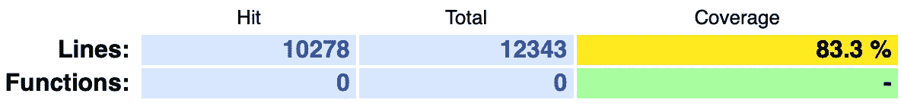

# 应对颤振:一个开发者的旅程—第 1 部分

> 原文：<https://itnext.io/react-to-flutter-one-developers-journey-part-1-f101443bff82?source=collection_archive---------3----------------------->

大约两年前，在 Wyzetalk 工作时，我们决定开发一个 [Flutter](https://flutter.dev) 应用程序，这是我通往一个全新世界的旅程的开始。

 [## 我们为什么选择颤振

### 有些人会想，为什么一个开发团队几乎只讲 Javascript 的公司会选择 flutter 来…

medium.com](https://medium.com/wyzetalk-tech/why-we-chose-flutter-fdb98fcbea8) 

我从事开发不到 10 年，大部分时间都花在了 JavaScript 领域，我经历了很多年的框架，从 jQuery、Backbone、AngularJS 到 ReactJS/Native，其中一些还涉猎了 VueJS、Aurelia 和其他一些。

在过去五六年的大部分时间里，我专注于 ReactJS 领域，致力于金融、保险和通信方面的应用。

我对 Flutter 的第一印象确实有些混乱，看着代码感觉既熟悉又陌生，因为我使用过现代 JavaScript 和 TypeScript，所以我对类和类型很熟悉，但在某种程度上一切都变了。

我参加的第一个课程是在[https://fluttercrashcourse.com](https://fluttercrashcourse.com)，这被证明是一个非常好的所有基础知识的入门课程，我认为在几天内花了大约 3 个小时，还做了其他工作。

早期出现了许多错误，其中最大也是最难修复的一个错误可能是没有采用一个具有全局能力的状态管理解决方案，当时我认为我可以通过简单地使用`StatefulWidget`来满足业务需求，老实说，这让我们走了很远，但几个月后，情况变得很清楚，虽然这在当时不是一个坏主意，但在不久的将来会被证明是一个糟糕的主意。

在用 Flutter 学习了 6 个月左右之后，我们退一步，盘点了自己有什么，犯了什么错误。第一个错误是我们没有测试，老实说代码库是最不可测试的。

接下来是我们下一个重要的学习资源， [Reso Coder](https://www.youtube.com/channel/UCSIvrn68cUk8CS8MbtBmBkA) ，一个非常熟练的 Flutter 开发人员，有一些关于使用 Flutter 的优秀视频和视频系列，其中一个对我们很重要的是[Flutter TDD Clean Architecture](https://www.youtube.com/playlist?list=PLB6lc7nQ1n4iYGE_khpXRdJkJEp9WOech)，我们发现这是一个关于构建 Flutter 应用程序以及编写更多可测试代码的极好资源。

从那时起，我们花了好几个月的时间来重构这个应用，一段一段地检查我们所有的代码，实现领域驱动的方法，添加像 [freezed](https://pub.dev/packages/freezed) 这样的包来帮助零安全，添加 [pedantic](https://pub.dev/packages/pedantic) 来实现更严格的代码风格和结构控制，当然还有测试，很多很多的测试。

到目前为止，我们已经通过这种方法成功地测试了 83%的代码，这肯定不容易，我们的一些测试要么非常有创意，要么非常出格。

 [## 单元测试返回小部件的实用函数

### 这可能不是一个常见的用例，但对我来说，我有一个从应用内导航处理应用内导航的实用函数…

medium.com](https://medium.com/wyzetalk-tech/unit-testing-a-utility-function-that-returns-a-widget-77b1b3fec888) 

在这个过程的相当多的步骤中，我们不得不重新评估我们的一些软件包选择，不幸的是，虽然很多 Flutters 文档都很棒，但当涉及到测试时，就相当令人沮丧了，许多软件包不包括任何形式的文档或关于如何在测试空间中集成它们的示例。

这自然使重构变得更加复杂， [Dio](https://pub.dev/packages/dio) 就是这样一个我们不得不移除的包，这是一个缓慢的过程，因为无论我在谷歌上搜索了多少或多远的第 3 页，我都找不到任何形式的关于如何在测试空间模仿 [Dio](https://pub.dev/packages/dio) 的信息，考虑到它实际上是一个多么强大的网络包，这是非常可悲的。

在这段时间里，我写了很多关于 Flutter 和 testing 的博客，希望能帮助那些加入 Flutter 或者从事更大项目，并且真正想进行适当的、高质量的测试的人。

虽然我们的覆盖率报告看起来很好，但覆盖率并不是一切，覆盖率报告是作为一种健全性检查，是我们作为开发人员用来验证我们编写的测试是否真正达到了我们实现的所有业务逻辑的东西，没有质量的覆盖率是没有价值的，没有任何意义的测试除了达到某一行而没有真正验证该行是否正常工作。

通过这次旅行，我在当地的 Flutter 社区中变得有些活跃，最终我发现自己实际上是在最近的 GDC 虚拟会议上做报告,[你 Flutter 了吗？](https://gdg.community.dev/events/details/google-gdg-cape-town-presents-are-you-fluttered-yet/\)，我发现我真的很喜欢。虽然我可能会在未来再次出席，但我肯定会参加更多这样的活动，虽然这个社区仍然很小，但它是一个非常棒的社区，听到其他人在他们激动人心的旅程中的经历是非常棒的。

这个想法正是这篇文章的灵感来源。

我希望您对此感兴趣，如果您有任何问题、评论或改进，请随时发表评论。享受你的颤振发展之旅:D

如果你喜欢，鼓掌(或 50)会很棒，如果你真的喜欢，一杯[咖啡](https://www.buymeacoffee.com/remelehane)会很棒。

感谢阅读。

在接下来的一集里，我们回到早期，来看看一种特殊的方式让我们印象深刻。

敬请关注:D

# 第二部分…

 [## 应对颤振:一个开发人员的旅程—第 2 部分

### 对一个 React 开发人员迁移到 Flutter 的经历有一点了解。

itnext.io](/react-to-flutter-one-developers-journey-part-2-10ac6919f580)  [## 用 dart 和 Lefthook 验证提交消息

### 一段时间以来，我一直试图为我的 Flutter 项目解决的事情是验证提交消息，最初…

medium.com](https://medium.com/wyzetalk-tech/validating-commit-messages-with-dart-and-lefthook-4934984c6f8e)  [## 在 Flutter 中通过简单的 OTA 更新改善用户体验

### 通过一些简单的更改，您可以消除像区域设置或主题化这样的简单更改的应用程序部署。

medium.com](https://medium.com/wyzetalk-tech/improving-user-experience-through-simple-ota-updates-in-flutter-ba7169e3a59b)