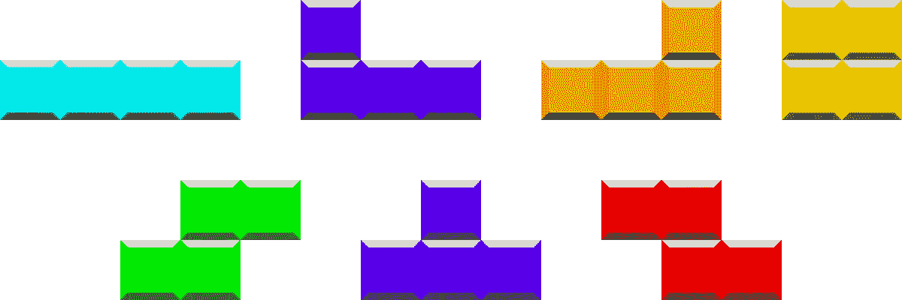

# React To Typescript 第 2 部分:将 React 组件转换为 Typescript

> 原文：<https://itnext.io/react-to-typescript-part-2-converting-react-components-to-typescript-bfe716c8e07c?source=collection_archive---------5----------------------->

*这是一系列博客文章中的第二篇，将讨论如何将现有的 React 代码库 Flatris 由*[*@ skying*](https://twitter.com/skidding)*转换为 Typescript。我们将最终得到一个完全经过类型检查的代码库。这一次，我们将着眼于向简单的 React 组件添加类型注释。*

# [我们上次停止的地方](https://medium.com/@geewee/tinkerer-converting-a-react-codebase-to-typescript-part-1-getting-it-to-compile-e53567db25)

我们现在可以并行运行 Javascript 和 Typescript。这意味着我们可以逐步转换事物。让我们首先转换 React 组件——它们很容易转换，因为它们已经有了一个通过 PropTypes 附加的类型系统。由于 Flatris 没有测试套件，我们无法自动测试我们的重构。但是，它只有一个屏幕，所以手动测试很容易。我们要做的是一次重写一个组件，运行游戏以确保一切正常。

我以前写过从哪里开始向一个[非类型化代码库](https://medium.com/@geewee/tinkerer-in-what-order-should-i-start-adding-types-f1c3fdd6d0f4)添加类型，但是 TL；dr is:我们应该从具有尽可能少的非类型依赖的组件开始。我称之为自下而上。

现在，让我们看看要重构的一些不同类型的组件。

# 不需要修改的组件

Javascript 和 TypeScript 之间的一些组件是相同的。这些组件的类型要么是由第三方库提供的，要么是不接受任何支持的组件。

一个简单的例子:

除了文件扩展名之外，这些 TypeScript 组件与它们的 JS 组件完全相同。

在 Flatris 中，我们也有一些这样的组件。有一个用[样式组件](https://www.styled-components.com/)创建的按钮，看起来如下:

我们需要库的类型来完成这项工作。

有些库附带了 typescript 定义，在这种情况下，我们不需要做任何额外的工作。没有附带类型定义的流行库在 npm 上的@types 名称空间下有它们。

由于 styled-components 自带了自己的 typescript 定义，我们不需要做任何额外的事情——我们所需要做的就是将 **button.jsx** 重命名为 **button.tsx** ，这样我们就可以开始了。

# 带道具的无状态组件

自底向上添加类型意味着从一个组件开始是有意义的，比如 SquareBlock，它是一个彩色的正方形块。

我们要做的第一件事是将其重命名为 tsx。

我们将得到以下错误:

```
C:/…/flatris-ts/src/components/SquareBlock.tsx
(15,13): Property 'propTypes' does not exist on type '({ color }: { color: any; }) => Element'.
```

Typescript 在这里正确地推断了我们函数的类型，作为一个函数，它接受一个颜色对象，并返回一个 JSX 元素。然而，typescript 并不热衷于向函数中随机添加属性。这意味着当我们试图添加 propTypes 时，typescript 会停止并告诉我们这个函数没有 propType 属性——这是怎么回事？

我们想要做的不是像在上面的常规 Javascript 中那样简单地定义函数，而是我们想要添加一个类型注释，以确保 Typescript 认为它是一个正确的 React 组件— propTypes 等等。

在反应类型中，功能组件称为反应。SFC —其中 SFC 是无状态功能组件。让我们尝试将这种类型注释添加到组件中:

这成功地消除了 propTypes 错误——但是另一场风暴正在酝酿之中..

# 打字道具

这里我们得到一个新的错误:

```
(11,36): Type '{ children?: ReactNode; }' has no property 'color' and no string index signature.
```

这里，TypeScript 似乎在抱怨我们在组件中传入了`color`。奇怪。让我们试着看看反应的类型。去证监会看看是怎么回事。虽然这不是类型定义中最复杂的例子(对于复杂的情况，它们可能会变得非常*和*令人毛骨悚然),但它仍然足够复杂，值得仔细研究。

我们将一次查看一个类型注释，并试图弄清楚发生了什么。这将是对一些打字稿打字的更深入的探究——等等。

第一次打字是这样的:

```
type SFC<P = {}> = StatelessComponent<P>;
```

这是我们正在使用的 SFC 类型。

这就是所谓的类型别名，由“type”关键字表示。它的基本意思是“这是那种类型的简写”,所以例如

```
type StringOrNumber = string | number
```

是字符串和数字并集的类型别名。完全等同于每次看到 StringOrNumber 都用 string | number 代替。

现在，字体的下一部分:尖括号。尖括号<>内的部分表示通用类型。

这里的一般类型被称为 P——我猜是道具。这是我们告诉 Typescript 我们愿意接受什么样的道具的部分。它说`<P = {}>`——这意味着；如果没有提供类型，默认为空对象`{}`——意味着没有额外的道具

综上所述，整行的意思是:

当您使用 SFC 时，我将引用 StatelessComponent 类型。我想要一个带道具的通用参数，但是如果你不给我，我就认为没有道具

因此，让我们来看看 StatelessComponent 的类型——我们将快速查看实际代码，然后将其分解。

所以，界面的第一部分是有趣的部分，让我们来看看:

```
(props: P & { children?: ReactNode }, context?: any): ReactElement<any> | null;
```

这里我们有一个可调用的签名——这意味着任何符合这个接口的东西都可以用下面的签名来调用。让我们试着把它拆开一点，看看它意味着什么

第一部分

```
(props : P & (children?: ReactNode)
```

是交集类型，用`&`表示。`&`的意思是“组合这两种类型”,所以这个语句的意思是:“接受一个 props 参数，这是通用参数 props 的组合，但也可以有一个名为 children 的额外的 props。”

那个？在儿童之后表示它是可选的。这使得我们可以通过 JSX，在我们想通过的时候通过孩子们。例如

```
<Foo><Bar/></Foo>
```

相当于通过了一个`Bar`作为`Foo`的儿童道具。

现在，类型签名的第二部分:

```
context?: any
```

这意味着该函数也可以接受第二个参数，但它是非类型化的。它用于访问遗留的 React 上下文 API。现在我们来看看返回类型:

这种返回类型意味着该函数要么返回一个接受任何类型的道具的 React 组件，要么不返回任何东西

所以总结一下。这个:

```
(props: P & { children?: ReactNode }, context?: any): ReactElement<any> | null;
```

意思是:

可以用 Props 调用 StatelessComponent，如泛型参数 P 所指定的，并且可以选择使用 children。如果它需要道具之外的另一个论证，那就是语境。这可以是任何东西。该函数要么返回一个 ReactElement，要么不返回任何内容。

咻！解释我们最初的错误消息绕了很长一段路。为了唤起您的记忆，错误消息是:

```
(11,36): Type '{ children?: ReactNode; }' has no property 'color' and no string index signature.
```

因此，TypeScript 在这里抱怨的是 React.SFC 中的泛型参数。由于它默认为{}，即空对象，这意味着如果我们不指定泛型部分——它唯一接受的是子对象——例如，没有 props。

所以错误信息说:*嘿——你告诉我你没有收到任何道具，但是紧接着你又说这个颜色变量——这是怎么回事？*

为了确保我们对泛型的理解是正确的，让我们试着说我们接受任何类型的道具:

这使得它编译起来没有任何问题——然而 TypeScript 现在允许我们将任何属性传递给 SquareBlock。现在我们不一定希望这样——我们越多地使用任何类型，我们从 Typescript 中获得的价值就越少。

我们可以从 PropTypes 中判断出 color 对象应该是一个字符串，所以让我们在 typescript 接口中捕获它。

这些 prop 类型:

```
SquareBlock.propTypes = {
 color: PropTypes.string.isRequired
};
```

对应于此界面:

```
interface Props {
   color: string;
}
```

既然有了编译器的支持，我们就可以直接删除 propTypes 了。虽然在 typescript 代码库中很少保留 propTypes，但是当我们仍然处于过渡过程中时，为了一些额外的运行时安全性，或者如果您正在构建非 TypeScript 使用的东西，例如库，您可能希望保留它们。

没有 proptypes 的最终组件如下所示:

# 基于类的组件

让我们来看一个稍微复杂一点的组件——俄罗斯蚱蜢。一个方块是四个方块的集合。我想它们就是大多数人所说的“俄罗斯方块”。



我甚至不知道这些有名字

Tetromino 在这里是一个基于类的组件，所以我们必须做一些不同的事情。这里我们不需要添加任何显式类型。当延伸反应时。component-TypeScript 自动选取类型。

如果我们看看 React 的类定义。组件它看起来像这样:

```
// Note that this is not the actual typings - the react typings are // reasonably complex, so I've edited them a bit down to communicate // the gist of it
class Component<P={}, S={}> {
    constructor(props: P, context?: any);
    // ...Stuff removed for brevity
}
```

请注意默认为空对象的两个泛型参数。我们可以编写这样的代码:

```
class Tetromino extends React.Component {}
```

它将是完全有效的类型脚本代码。然而，与函数组件一样，如果我们想使用状态或属性，它会给我们带来错误。我们需要定义泛型类型来获得适当的类型安全。

作为编译的第一步，我们当然可以将它们指定为任意:

```
class Tetromino extends React.Component<any, any> {}
```

然而，我们可以做得更好。查看 Tetromino，我们可以看到它不包含任何状态，因此让我们将第二个参数更改为 void:

```
class Tetromino extends React.Component<any, void> {}
```

或者更好——我们可以不考虑它！

```
class Tetromino extends React.Component<any> {}
```

现在让我们来处理道具！我们将再次把 propTypes 重写到一个接口中。propTypes 看起来像这样:

所以我们有一个字符串，和一个数字数组。这可以用如下的类型脚本来表示:

```
interface Props {
    color : string,
    // Note the double square brackets - that's a twice nested array
    grid: number[][] 
}
```

我们把它加入到反应中。组件，所以我们的新类定义现在是:

```
class Tetromino extends React.Component<Props> {
```

现在——我们还没有完成。我们将得到另一个 propTypes 错误:

```
Property 'propTypes' does not exist on type 'typeof Tetromino'.
```

因此，Typescript 并不热衷于我们在已经存在的类上声明新的属性——将 propTypes 声明为基于类的属性的最佳方式是使用静态块。所以与其说:

我们得到:

当然，我们可以完全省略 propTypes。总的来说，我们将以下面的课程结束。

看起来差不多，对吧？如果已经通过 propTypes 指定了类型，通常可以简单地用 typescript 接口替换 propTypes。通常，您根本不需要向组件的主体添加任何类型注释——typescript 可以为您推断出来。

在下一部分中，我们将看看如何使用简单的运行时分析来对组件进行类型化，我们无法通过简单地查看属性类型来弄清楚如何进行类型化。我们还将看看类型化减少器和动作。如有任何意见或问题，可通过[*@ GeeWengel*](https://twitter.com/GeeWengel)*联系我。*

如果您只想在下一部分上线时得到通知，请订阅我的时事通讯。我很少发电子邮件，因为我很懒。

[](http://eepurl.com/dwbCH1)