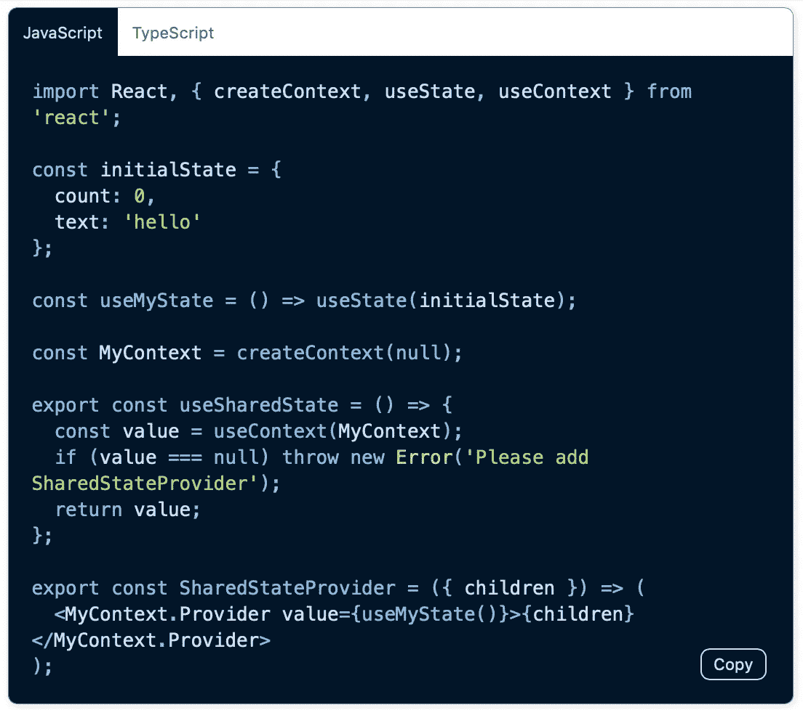

# 使用 Docusaurus v2 对跟踪的文档网站做出反应

> 原文：<https://itnext.io/react-tracked-documentation-website-with-docusaurus-v2-7d92f9f445bf?source=collection_archive---------6----------------------->

## 一个带有 React 钩子的全局状态库


# 介绍

我一直在开发一个名为 React Tracked 的 React 钩子库。这是我最近花了很多心血的图书馆，也是我的其他图书馆。

[](https://github.com/dai-shi/react-tracked) [## 戴式/反应跟踪式

### 超级快速反应全局/共享状态与上下文和钩子文档站点:https://react-tracked.js.org 如果你是…

github.com](https://github.com/dai-shi/react-tracked) 

这个库解决了 React 上下文的性能问题。对基本面问题感兴趣的，请看一下[的长刊](https://github.com/facebook/react/issues/14110)。

这个库中值得注意的是，它没有提供任何新奇的特性。你可以简单地替换上下文。Provider 和 useContext 与自定义的，它只是与性能。

因为它没有提供任何花哨的特性，我该如何向那些还不知道这个问题的人讲述这个库的好处呢？这是我开始一个新的文档网站的动机。

文档网站已启动并运行:

[https://react-tracked.js.org](https://react-tracked.js.org/)

# Docusaurus

Docusaurus 是流行的文档工具之一。它被许多项目使用，如 Create React App、Redux families、Jest 等。Docusaurus 计划很快发布 v2，这听起来很有希望。如果我要创建一个新网站，为什么我不使用这个新工具？

事实证明，v2 的配置非常简单。你最少只需要三个文件。

*   `docusaurus.config.js`配置一些基本的东西
*   `sidebars.js`配置降价文件
*   `src/pages/index.js`创建主页面

我不确定这是不是正确的方法。我们应该很快会有更好的 Docusaurus 文档。如果你对我如何配置它感兴趣，请查看回购协议。

# 自定义插件

在这一点上我想做一些事情。我不想同时为 JavaScript 和 TypeScript 创建代码片段。JavaScript 片段可以从 TypeScript 片段生成。所以，我开发了一个小插件(主题)来做这件事。

结果相当不错。下面是 markdown 中的一段代码。

```
```typescript ts2js
import React, { createContext, useState, useContext } from 'react';const initialState = {
  count: 0,
  text: 'hello',
};const useMyState = () => useState(initialState);const MyContext = createContext<ReturnType<typeof useMyState> | null>(null);export const useSharedState = () => {
  const value = useContext(MyContext);
  if (value === null) throw new Error('Please add SharedStateProvider');
  return value;
};export const SharedStateProvider: React.FC = ({ children }) => (
  <MyContext.Provider value={useMyState()}>
    {children}
  </MyContext.Provider>
);
```
```

就凭这一点，网站就显示出如下这样的东西。



如果您单击“TypeScript”选项卡，将显示 TypeScript 片段。

实现这一点的一个小提示是，因为“tsc”不保留空格，所以 prettier 用于重新格式化代码片段。

如果这是有价值的东西，我们可能会考虑把它作为一个可安装的插件发布。在此期间，您可以查看代码的[。](https://github.com/dai-shi/react-tracked/tree/5469f0bafa5794a0aa69f4d084365061e9383771/website/custom_modules/docusaurus-theme-ts2js-codeblock)

老实说，我希望在构建时完成。这可能需要开发一个插件，而不是一个主题。

# 标志；徽标

嗯，你能想象一个没有 logo 的文档网站吗？所以我创造了这个标志。我希望网站现在很好看。

# 不调和

许多 OSS 项目都有社区频道。我认为现在是开始至少一个的好时机。所以我做了一个 Discord 服务器。邀请链接是[这里](https://discord.gg/MrQdmzd)。

# 摘要

同样，React 跟踪文档网站位于:

【https://react-tracked.js.org 

请访问那里了解 React Tracked 和/或 Docusaurus v2。希望你喜欢。欢迎通过不和谐渠道或其他方式进行反馈。

我的计划是在网站上增加更多的内容。了解人们想知道什么是很重要的。有人能帮忙吗？

*原载于 2019 年 10 月 15 日*[*https://blog.axlight.com*](https://blog.axlight.com/posts/react-tracked-documentation-website-with-docusaurus-v2/)*。*