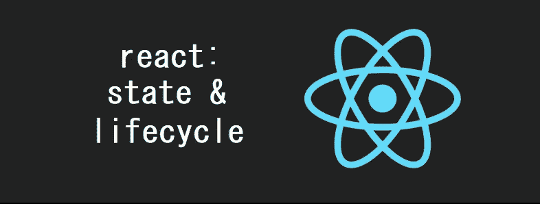

# 反应:理解状态和生命周期

> 原文：<https://itnext.io/react-understanding-state-lifecycle-d45df5d2cf3f?source=collection_archive---------2----------------------->



在本文中，我们将了解状态和生命周期在 React 中是如何工作的。这些知识非常强大，因为它帮助我们分离关注点，增加动态性，并构建真正可重用的组件。

🤓*想跟上网络发展的步伐吗？*
🚀*想要将最新消息直接发送到您的收件箱？
🎉加入一个不断壮大的设计师&开发者社区！*

**在这里订阅我的简讯→**[**https://ease out . EO . page**](https://easeout.eo.page/)

# 什么是状态？

状态与 React 组件类一起使用，使它们成为动态的。它使组件能够跟踪呈现之间不断变化的信息。更具体地说，组件的状态是一个对象，它保存的信息可能会在组件的生命周期内发生变化。

**状态 v 道具**

你可能想知道这和道具有什么区别？我们看了我上一篇文章里的道具: [React: Components &道具](/react-components-props-db1db95c04c8)。回想一下，props 是一个保存信息以控制组件行为的对象。这听起来非常类似于 state，但是让我们看看它们有什么不同:

*   道具是不可变的。一旦设定，就无法更改
*   状态是可观察的。它可以保存可能随时间变化的数据
*   Props 可以用在函数或类组件中
*   状态仅限于类组件
*   道具由父组件设置
*   状态由事件处理程序更新

# 使用状态

当使用状态时，我们需要组件的状态总是存在——所以我们需要设置一个初始状态。我们可以通过在组件类的**构造函数**中定义我们的状态来实现，就像这样:

```
class MyClass extends React.Component {
  **constructor**(props){
    **super**(props);
    **this**.state = { attribute : "value" };
  }
} 
```

*注意:*我们将在本文后面的生命周期方法中详细研究这些代码。现在，很高兴知道我们如何介绍状态！

## 更新状态

关于 state，接下来要知道的是它不应该**被显式更新**。React 将使用一个可观察对象作为状态，这允许组件做出相应的行为。

例如，如果我们要像这样更新一个组件的状态:

```
this.state.attribute = "changed-value";
```

我们会有一个渲染错误！因为国务院无法察觉这些变化。

**setState()**

这也是我们使用`setState()`内置 React 方法的原因。它接受一个参数，并期望一个包含我们的值集的对象被更新。

该方法将更新我们的状态，然后调用`render()`方法来重新呈现页面。因此，更新我们状态的正确方法是这样的:

```
this.setState({attribute: “changed-value”});
```

记住，我们只允许在构造函数中显式定义我们的状态——当我们提供初始状态时。

## 设置多个状态

我们还可以通过在一个`setState()`方法中设置多个状态来利用 React 的异步能力。这方面的一个用例可能是当我们想要保持计数时(例如，跟踪帖子或照片之类的内容)。

我们可以使用 ES6 箭头函数来实现，如下所示:

```
this.setState((prevState, props) => ({
  total: prevState.count + props.diff 
}));
```

这里，我们将之前的组件状态和道具作为参数，然后更新总数。同样也可以写成这样的常规函数:

```
this.setState(function(prevState, props){ 
  return {total: prevState.count + props.diff}; 
});
```

# 生命周期

在下一节中，我们将了解 React 生命周期。让我们从定义开始..

## 生命周期是什么？

一般来说，我们可以将生命周期定义为出生、成长和死亡。我们的 React 组件也遵循这个循环:它们被创建(安装在 DOM 上)，它们经历增长(通过更新)和死亡(从 DOM 中卸载)。这就是组件生命周期！

在组件的生命周期中，有不同的阶段。这些阶段都有自己的生命周期方法。现在让我们来看看这些方法。

# 生命周期方法

组件的生命周期可以分为四个部分:

*   初始化
*   增加
*   更新
*   卸载

让我们详细看看每一个..

## 初始化

在这个阶段，我们的组件将设置它的状态&道具。这通常在构造函数方法中完成，如下所示:

```
class Initialize extends React.Component {
  constructor(props){ // calling the constructor of its parent
    super(props); // initialization process
    this.state = {
      time: new Date(),
      selectedStatus: false
    };
  }
}
```

## 增加

初始化阶段完成后，我们进入安装阶段。这是我们的 React 组件“安装”在 DOM 上的时候(它被创建并插入到 DOM 中)。这是我们的组件第一次呈现。该阶段可用的方法有`componentWillMount()`和`componentDidMount()`。

**componentWillMount()**

这个方法在组件挂载到 DOM 之前被调用(或者当 render 方法被调用时)。然后安装我们的组件。

**componentidmount()**

这个方法在组件被装载到 DOM 上之后被调用。像`componentWillMount()`一样，在一个生命周期中只调用一次。在执行之前，会调用 render 方法。我们可以进行 API 调用，并用 API 响应更新状态。

让我们通过一个例子来看看这些方法的作用:

```
class LifeCycle extends React.Component {
  componentWillMount() {
      console.log('Component will mount!')
   }
  componentDidMount() {
      console.log('Component did mount!')
      this.getData();
  }
  getData=()=>{
   /* method to make an api call for data */
  }render() {
      return (
         <div>
            <h1>Mounting methods in action!</h1>
         </div>
      );
   }
}
```

## 更新

在创建组件的安装阶段之后，我们进入更新阶段。这是组件状态改变的地方，因此，重新渲染发生。

组件的数据(它的状态和属性)将会更新以响应用户事件，比如点击、输入等。这将导致组件的重新呈现。我们在这里使用的方法是:

**shouldcomponentdupdate()**

此方法确定组件是否应该更新。默认情况下，它将返回 true。如果在某个时候，如果你想重新渲染某个条件下的组件，那么`shouldComponentUpdate()`方法将是正确的选择。

例如，如果您只想在属性发生变化时重新渲染组件，那么就应该使用这种方法。它接收像 *nextProps* 和 *nextState* 这样的参数，通过与当前的属性值进行比较来帮助我们决定是否重新渲染。

**componentWillUpdate()**

我们在重新呈现组件之前调用这个方法。如果您想在更新状态和属性后重新渲染组件&之前执行计算，则在`shouldComponentUpdate().`之后调用一次，然后您将使用此方法。像`shouldComponentUpdate()`一样，它也接收像 *nextProps* 和 *nextState* 这样的参数。

**componentDidUpdate()**

我们在重新呈现组件后调用这个方法。在更新的组件在 DOM 上得到更新后，执行`componentDidUpdate()`方法。这个方法将接收像 *prevProps* 和 *prevState* 这样的参数。

让我们扩展一下之前的例子:

```
class LifeCycle extends React.Component {
  constructor(props){
    super(props);
    this.state = {
      time: new Date(),
      selectedStatus: false,
      list:[]
    };
  } componentWillMount() {
    console.log('Component will mount!')
  }
  componentDidMount() {
    console.log('Component did mount!')
    this.getList();
  } getList=()=> {
    /* method to make an api call for data */
    fetch('[https://api.mydomain.com](https://api.mydomain.com/)')
      .then(response => response.json())
      .then(data => this.setState({ list:data }));
  } shouldComponentUpdate(nextProps, nextState) {
    return this.state.list!==nextState.list
  }
  componentWillUpdate(nextProps, nextState) {
    console.log('Component will update!');
  }
  componentDidUpdate(prevProps, prevState) {
    console.log('Component did update!')
  } render() {
   return (
     <div>
       <h1>Mounting methods in action!</h1>
     </div>
   );
 }
}
```

## 卸载

最后一个阶段是卸载。我们的组件从 DOM 中卸载。我们在这里可以使用的方法是:

**componentWillUnmount()**

我们在卸载发生之前调用这个方法。在从 DOM 中移除组件之前，`componentWillUnMount()`将会执行。这个方法是组件生命周期的终点！

下面是一个流程图，清晰地展示了所有的生命周期方法:


***你准备好让你的 JavaScript 技能更上一层楼了吗？今天就开始用我的新电子书吧！无论你是想学习你的第一行代码，还是想扩展你的知识面并真正学习基础知识..*[*JavaScript 精通完全指南*](https://gum.co/mastering-javascript) *带你从零到英雄！***


*现已上市！👉*[https://gum.co/mastering-javascript](https://gum.co/mastering-javascript)

# 结论

就是这样！我们已经介绍了一些重要的概念，它们是反应的基础。首先我们看了状态，我们将状态与道具进行了比较，并且我们看了如何更新和设置多个状态。然后我们转到 React 组件生命周期，涵盖了各个阶段(初始化、安装、更新和卸载)以及每个阶段可用的方法。

我希望这篇文章对你有用！你可以在媒体上关注我。我也在[推特](https://twitter.com/easeoutco)上。欢迎在下面的评论中留下任何问题。我很乐意帮忙！

# 关于我的一点点..

嘿，我是提姆！👋我是一名开发人员、技术作家和作家。如果你想看我所有的教程，可以在[我的个人博客](http://www.easeout.co)上找到。

我目前正在构建我的[自由职业者完整指南](http://www.easeout.co/freelance)。坏消息是它还不可用！但是如果这是你可能感兴趣的东西，你可以[注册，当它可用的时候会通知你](https://easeout.eo.page/news)👍

感谢阅读🎉