# React:使用 React-Spring 制作交叉渐变图像的动画

> 原文：<https://itnext.io/react-using-react-spring-to-animate-crossfading-images-1fee000e310d?source=collection_archive---------0----------------------->

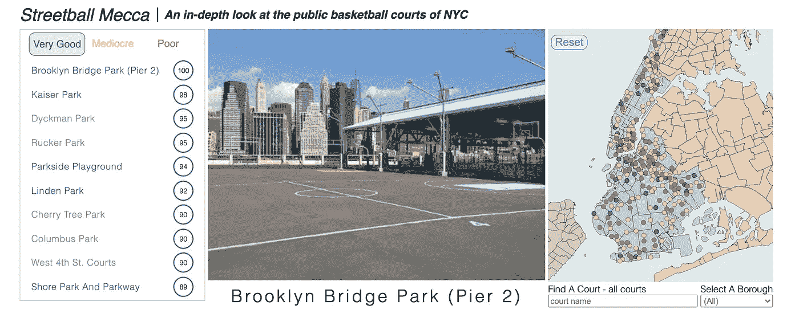

作者图片

在 Streetball Mecca 从仅使用 D3 的版本到利用 D3 的辅助功能和 React 实现所有其他功能的版本的重构过程中，我用 **React-Spring** 替换了 **d3.transition** 以制作地图上圆圈的淡入/淡出动画。你可以在上一篇文章中了解我是如何实现这个解决方案的: [React & D3:使用 React-Spring 转换在地图上渲染圆形](https://jkeohan.medium.com/react-d3-rendering-circles-on-a-map-b7746600502)。

当我将公园图像重构为它自己的组件时，我再次发现需要用一个替代解决方案来替换 **d3.transition** ，并决定再试一次 React-Spring。

# React-Spring 文档和更多研究

过去在公园图像中逐渐消失的过渡感觉有些起伏。原因是它首先替换了先前的背景图像，然后使用不透明度来创建淡入效果。下面是原始代码。

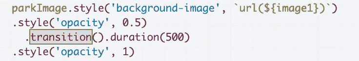

作者图片

我对 UX 的实现一直不太满意，总是想在输入/输出图像之间应用平滑的交叉渐变。我也知道这需要对原始的 D3 代码进行重构，但是我已经在那个项目中达到了足够好的程度，需要转移到下一个 D3 项目。

然而，我现在有了实现交叉渐变的机会，同时也有了使用 React-Spring 的另一个理由。

## 工作示例

我做的第一件事是查看文档，希望找到一个交叉渐变图像的工作示例。React-Spring 提供了几个方法，在浏览完文档后，useTransition 钩子吸引了我的注意，所以我从那里开始。

我浏览了提供的演示样本，在不到 30 秒的时间里，我找到了一个工作示例，即[以连续循环的方式循环过渡 4 个图像](https://codesandbox.io/embed/morr206pv8)。

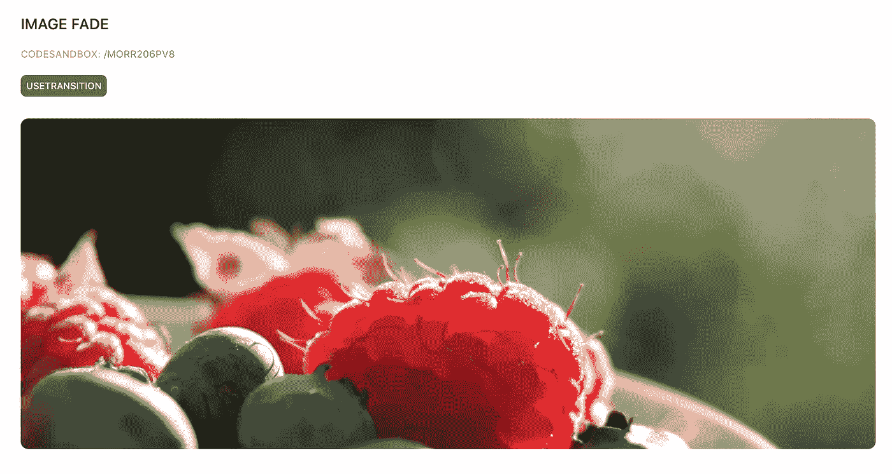

图片来自 React-Spring 演示

审查代码后，很明显 **useTransition** 被用来控制过渡，但我觉得我需要做一些额外的研究，以更好地了解它与 **useSpring** 的不同之处。

## 额外研究

所以我在谷歌上搜索了一下**‘use transition vs use spring’**，偶然看到了约书亚·霍尔写的文章[“使用 react-spring 在 React 中创建复杂动画”](https://alligator.io/react/advanced-react-spring/)。在这篇文章中，他讨论了 **useSpring** 、 **useSprings** 、 **useTrail、**和 **useTransition** 的用例，我觉得这篇文章确实提供了我正在寻找的额外背景。

关于**使用弹簧**和**使用过渡**之间的比较，他声明:

> `useSpring`的一个问题是它没有给我们任何对组件生命周期的控制

并且进一步接着是:

> 相反，我们可以使用`useTransition`来控制动画在视图中的安装和卸载。

虽然这是我第一次尝试使用 **useTransition** 来实现动画，但我确实记得以前曾经使用过几个类生命周期方法来实现动画。因此，在搜索了我多年来写的数百支代码笔后，我遇到了制作字母表(2018 年 1 月)的[，它使用](https://codepen.io/jkeohan/pen/VyGLOM?editors=0010) [React-Transition-Group](https://reactcommunity.org/react-transition-group/transition) 库实现了动画。

它是使用类组件编写的，并利用了生命周期方法 **componentWillEnter** 和 **componentWillLeave** ，这是我之前从未见过的，而 **componentWillReceiveProps。**

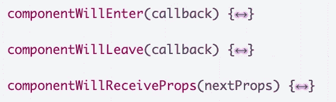

作者图片

在工作示例中， **useTransition** 也被配置为使用关键字**‘enter’**和**‘leave’**，因此现在很清楚它将如何触发动画以符合上述生命周期方法。

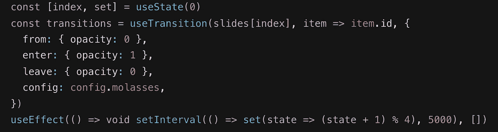

作者图片

同样在这个例子中，我可以看到 **setInterval** 每 5 秒更新一次索引状态值，在重新渲染期间，一个新的 **useTransition** 将被实例化并被赋予新的值。

**useTransition** 返回一个数组，该数组随后被映射并在每次迭代中返回一个新的 **animated.div** 。

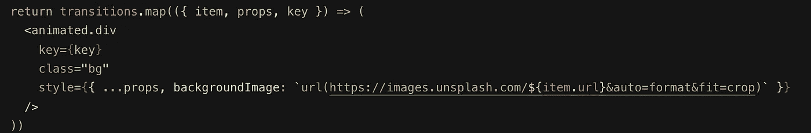

作者图片

## 需要更多的理解

我不太确定 transitions 数组中包含了什么，我仍然很想了解整个过程，所以我添加了控制台日志来查看。

我让它运行了几次，注意到了一个模式。当将要显示下一个图像时，该数组将包含 3 个元素，2 个表示离开，1 个表示进入。一旦图像淡入，数组将删除第一个位置的树叶，并更新最后一个位置的**回车**到**更新**。

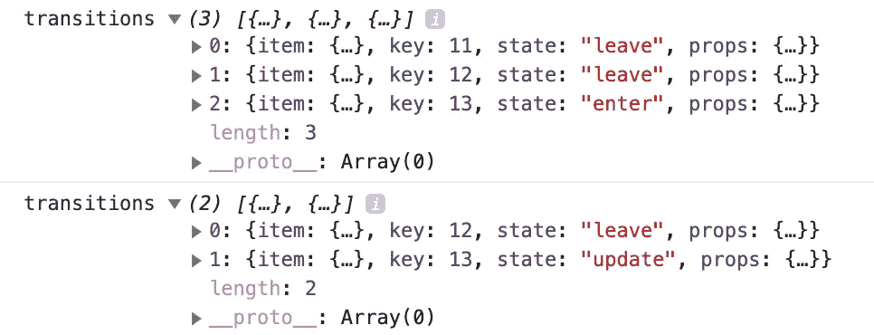

作者图片

因此，一旦转换完成并且元素从 DOM 中移除，似乎 **useTransition** 就会从数组中移除该元素。我还注意到**键**的值会不断增加，并与 React 跟踪通过地图呈现的元素的标准方式相关联。

这是工作示例的完整代码示例，因此您可以看到它们是如何结合在一起的。

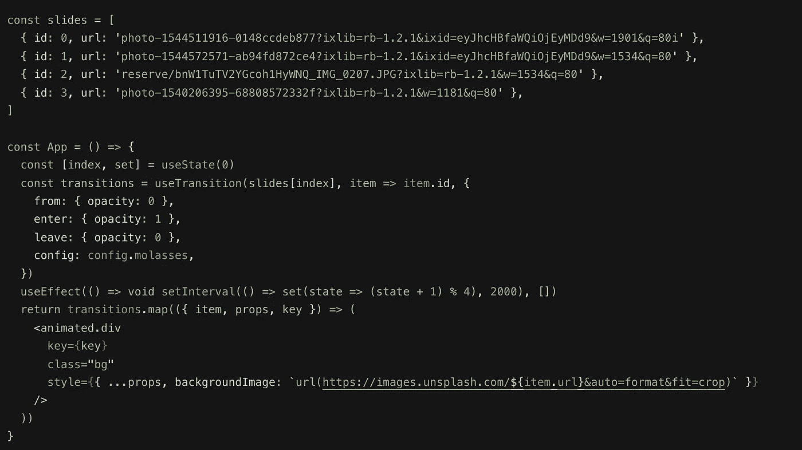

作者图片

我现在觉得我对正在发生的事情有所了解，并决定是时候将这种理解应用到公园图像的转换中了。

## 实施过渡

第一步是从 React Spring 导入 **useTransition** 和**动画**方法。

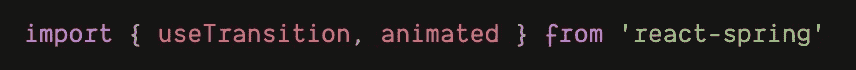

作者图片

在工作示例中， **useTransition** 基于更新的索引值被重新分配了新图像。然而，在我的配置中，图像是作为道具传递的。

由于每次传递新道具时组件都被重新渲染，因此将当前道具值分配给 **useTransition** 是有意义的，在本例中是 **activePark** 对象。

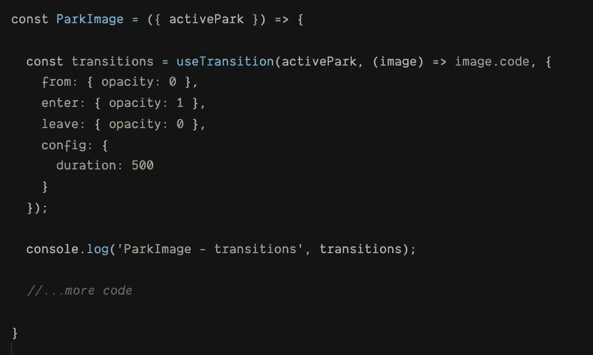

作者图片

我还添加了一个控制台日志，以查看转换是否会遵循与以前相同的模式。尽管数组中少了一个元素，但模式是相似的。

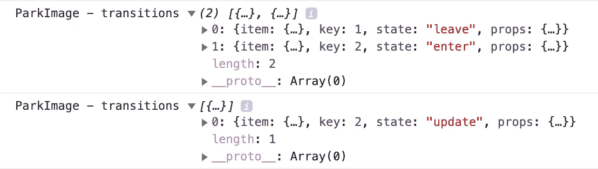

作者图片

不太清楚为什么会有这样的变化，但是我确信如果这让我的开发人员良心不安的时间够长，我会在以后重新审视它，并试图弄清楚它。

## 渲染图像

至于渲染图像，我能够重用工作示例中的所有代码，只做了一些编辑。其中一个编辑是需要包含一些条件逻辑，以便在 **activePark** 对象存在时运行。

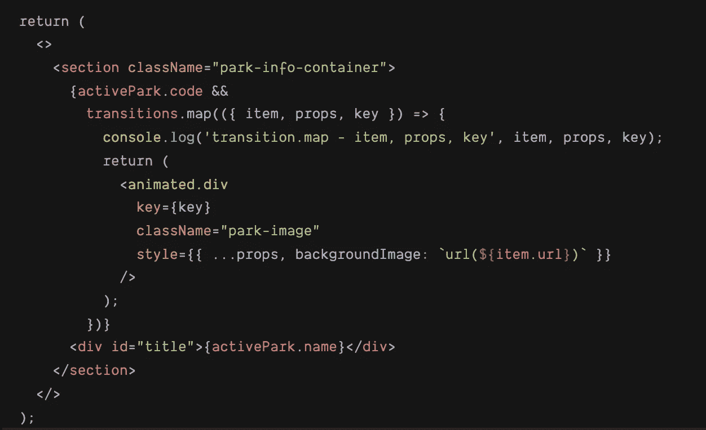

作者图片

我还添加了一个控制台日志来查看地图内部的内容。这些元素与我预期的一致。**项**是 **activePark 对象，**道具**道具**是**过渡，**和**键**对应于元素，这就是**如何使用过渡**在渲染时跟踪它们。

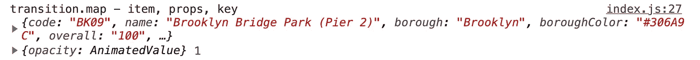

作者图片

然后，每次渲染新图像时，键值都会增加。

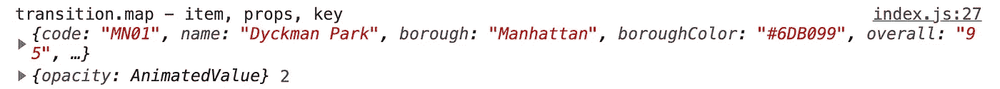

作者图片

# 结论

这种从 **d3.transition** 到 React-Spring**use transition**的重构相当容易。一路走来，我有了一些发现，觉得自己现在对幕后发生的事情有了更好的理解。正是在这样的时刻，我意识到当我的学生想知道为什么时，他们的感受是怎样的，但我们只有时间教他们如何做。

我确实研究过另一个解决方案，它最初稍微复杂一点，利用了 useState 和 useEffect 以及在一个数组中交替放置图像。

直到我开始写这篇文章并记录我的想法，我才决定重构那个解决方案。我有一种直觉，这太复杂了，可以找到一种更简单的方法。

无论如何，如果你想进一步了解，这里是[代码沙箱](https://codesandbox.io/s/d3-streetball-mecca-react-using-react-spring-to-crossfade-images-medium-jkzmc?file=/src/components/ParkInfo/ParkImage/image-spring.js)。

# 附加文章

这里是我根据 D3 => React 的代码重构写的一些附加文章。如果你有任何想法、建议或评论，我很乐意倾听。

*   [使用 useD3 自定义挂钩进行试验](https://jkeohan.medium.com/the-used3-custom-hook-889ddbd30f18)
*   [反应& D3:渲染贴图](https://levelup.gitconnected.com/react-d3-rendering-a-map-5e006b2f4895)
*   [React:使用 useReducer 管理复杂的状态转换](https://medium.com/swlh/react-managing-complex-state-transitions-with-usereducer-e37536b12944)