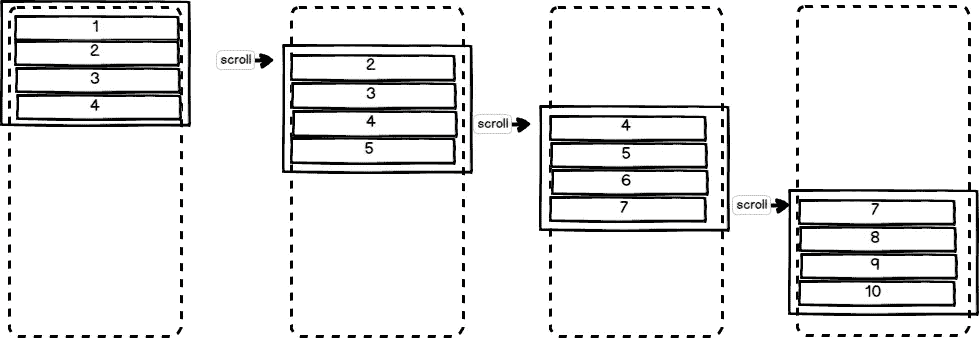

# 反应虚拟渲染

> 原文：<https://itnext.io/react-virtual-rendering-448f0f1b81ad?source=collection_archive---------5----------------------->

想知道如何在 react 组件中呈现大量记录，而不影响浏览器吗？例如，呈现包含数千项的列表或包含高密度列和行的数据网格。

顺便说一句，如果你是一名云工程师，你可能会有兴趣加入 topcloudops.com 网络。伟大的客户，伟大的项目，伟大的薪酬。

这种技术的一个很好的例子可以在 https://github.com/guiqui/react-timeline-gantt[找到](https://github.com/guiqui/react-timeline-gantt)更多的例子可以在 [https://www.uxxu.io](https://uxxu.io) 找到。

解决这个问题的一种方法是使用一种叫做“虚拟渲染”的技术。“VR”的基本思想是只渲染用户看到的东西，保持渲染对象的数量最少。

“VR”和 React 的一个典型应用是实现一个包含数千个元素的列表组件。在这篇文章中，我将展示实现一个使用“虚拟渲染”技术的 React 组件是多么容易。[这里的](https://jsfiddle.net/gquiman/7hnr8pu0/)是 jsfiddle 中完整的例子。

首先，我们需要一个**视窗**区域。这个区域将负责包含列表的可见项目，并有一个滚动条，使用户能够浏览所有项目。

这个例子的代码可以在 [Github](https://github.com/guiqui/react-virtual-list) 中找到。

我也用同样的技术制作了一个 react timeline 组件，repo 链接在这里是[或者可以使用**NPM install react-gantt-timeline 来安装。**](https://github.com/guiqui/react-timeline)

为了在 HTML 中实现这一点，我们将创建一个名为“viewport”的 div，并在其中添加另一个高度为*h =行高*行数的 div。*现在，视口 div 将能够以正确的滚动长度滚动，最后要做的事情是向我们的视口 css 添加属性 *overflow-y: scroll。*

因此，让我们将这些放在一个 react 组件中，并为呈现行添加一个简单的类，我们称之为“Item”。代码和 css 将如下所示:

现在让我们创建一些数据并初始化组件状态。我们将创建一些重要的变量:
1。我们将作为属性
2 传递的行的高度( **itemheight** )。使用 **itemheight** 我们可以计算出 **itemcontainer** div 的总高度(h= **itemheight** * numRows ),我们将创建一个变量调用( **containerStyle** )以用作内联样式。
3。viewPort 中可见项目的数量(**numvisible items**)= viewPort . height/**item height**
4。我们将初始化包含要呈现的行的索引的状态。

现在我们已经设置好了，我们也可以创建一个 renderRows 方法，使用 **start** 和 **end** 来呈现可见的行。

renderRow 方法是所有魔法发生的地方，这里我们只渲染可见的元素，我们将每个项目放置在他的右边**顶部**与**视窗** div 的滚动条的位置相匹配。

这很酷，现在我们有了一个列表，可以用滚动条显示前 n 个可见项。最后要做的是给滚动条添加一个监听器，这样当滚动条移动时，我们可以改变状态属性 **start** 和 **end** index **。**更改状态将触发更新，我们将看到右侧行呈现新的滚动位置。将创建新项目，不可见的项目将被销毁。

下图显示了我们滚动时发生的情况:

现在我们可以看看最终的结果。滚动时，代码运行速度非常快，对 CPU 几乎没有影响。