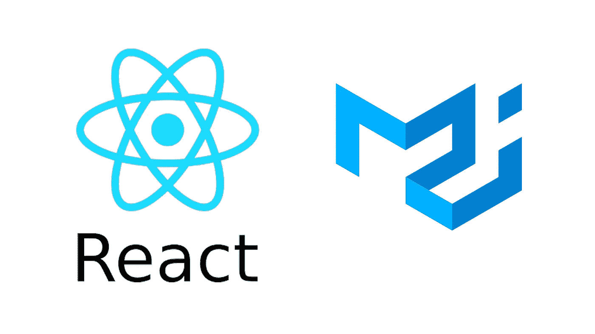
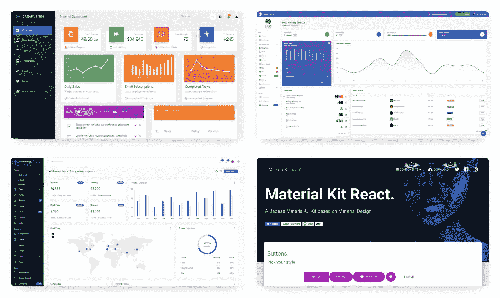

# 与材料-用户界面和示例组件进行反应

> 原文：<https://itnext.io/react-with-material-ui-with-example-components-90eeb8c74f60?source=collection_archive---------3----------------------->



React 是一个非常流行的框架，很多人在他们的 web 开发项目中使用它。

有很多用于设计 react 组件样式的库。Material UI 就是其中之一，而且很受欢迎。Material UI 提供 React 组件，用于更快、更轻松的 web 开发。可以创建自己的设计体系，也可以从材料设计入手。

github:[https://github.com/mui-org/material-ui](https://github.com/mui-org/material-ui)

官方网站:[https://material-ui.com/](https://material-ui.com/)

您可以从他们的网站和组件中找到许多有用的信息，您希望在您的项目中使用这些信息。

在本文的下一部分，将会有很多例子和它们的代码，我相信这将会帮助你理解它是如何被使用的，并且你可以开始创建你自己的组件。

谷歌主要使用材料设计，当人们使用谷歌产品时，他们开始更加习惯材料设计。

[**素材 UI 库**](https://material-ui.com/)

一些用材料 UI 构建的示例网站



材料 UI [模板](https://material-ui.com/getting-started/templates/)

你可以用 Material-ui 创建你的主题并在你的 web 项目中使用它。

你可以检查他们的[模板](https://material-ui.com/getting-started/templates/)，尽快开始使用其中一个。

如果您想在现有项目上实现，您可以继续安装过程，但如果您想创建名为 material-ui 的新 react 应用程序，请运行以下代码。

```
npx create-react-app material-ui
```

**安装概要:** 这些包会在详细安装中解释。*如果您想跳过安装部分，您可以安装所需的软件包，如下图*。

```
yarn add [@material](http://twitter.com/material)-ui/core fontsource-roboto @material-ui/icons// index.js
import 'fontsource-roboto';
```

# 装置

注意:如果你安装了上面提到的软件包，你可以跳过这一部分。

```
// With npm
npm install @material-ui/core

// With yarn
yarn add @material-ui/core
```

## 字体

材料用户界面使用'机器人'字体应该添加到能够使用排版。

```
// With CDN
<link rel="stylesheet" href="https://fonts.googleapis.com/css?family=Roboto:300,400,500,700&display=swap" />
```

将**font source-robot to**作为模块安装

```
// With npm
npm install fontsource-roboto// With yarn
yarn add fontsource-roboto
```

然后，您可以在您的入口点中导入它。

```
// index.js
import 'fontsource-roboto';
```

## 字体图标

为了能够使用**/</>**对象，需要添加素材图标。

```
// With CDN
<link rel="stylesheet" href="https://fonts.googleapis.com/icon?family=Material+Icons" />
```

将`**@material-ui/icons**`安装为模块

```
// With npm
npm install @material-ui/icons// With yarn
yarn add @material-ui/icons
```

然后，您可以导入您想要使用的图标，如下所示。

```
import AccessAlarmIcon from '@material-ui/icons/AccessAlarm';
```

现在所有需要的模块都安装好了。

# 使用

在我们安装了所有需要的模块后，我们可以开始使用 react with material-ui 并设计我们的组件。

让我们用材质 ui 创建简单的按钮组件。

```
import React from 'react';
import ReactDOM from 'react-dom';
import Button from '@material-ui/core/Button';

function App() {
  return (
    <Button variant="contained" color="primary">
      Hello World
    </Button>
  );
}
```

这是 codesandbox 上这个项目的一个实例。

正如你在上面看到的，我们的组件看起来像预期的那样工作。以后我们可以随心所欲地使用 Material UI 中的所有组件。

# 示例组件

您可以在下面找到 Material UI 最常用的组件示例，并在 codesandbox 中查看它们的代码，并根据需要进行编辑。您可以在项目中直接使用这些组件。

**电网系统**

**按钮**

**不同的按钮**

**滑块输入**

**日期时间选择器**

**选择框**

**转移清单**

**步进器**

**标签页**

**带搜索的应用程序栏**

**抽屉**

**卡片**

**手风琴**

**小吃店**

**替身**

**徽章**

**简单列表**

**用开关**列出项目

**表**

**排版**

**对话框**

## 材料图标

如果你正在寻找更多不同的图标，你可以在这里找到它们！

[](https://material-ui.com/components/material-icons/) [## 材质图标-材质-用户界面

### 1100+React 材质图标，从官网即可使用。以下 npm 包，@material-ui/icons…

material-ui.com](https://material-ui.com/components/material-icons/) 

材料图标的颜色和大小可以改变。

大小

```
<HomeIcon fontSize="small" />
<HomeIcon />
<HomeIcon fontSize="large" />
<HomeIcon style={{ fontSize: 40 }} />
```

旗帜

```
<HomeIcon />
<HomeIcon color="primary" />
<HomeIcon color="secondary" />
<HomeIcon color="action" />
<HomeIcon color="disabled" />
<HomeIcon style={{ color: green[500] }} />
```

这些是流行的材质 UI 的基本例子。

如果您想了解更多信息，请访问[材质 UI 组件](https://material-ui.com/components/box/)

*如果你觉得这篇文章很有帮助，你可以通过使用我的推荐链接注册一个* [***中级会员来访问类似的***](https://melihyumak.medium.com/membership) *。*T58

***跟我上*** [**推特**](https://twitter.com/hadnazzar)


在 [Youtube](https://www.youtube.com/c/TechnologyandSoftware?sub_confirmation=1) 上订阅更多内容

# 编码快乐！

梅利赫