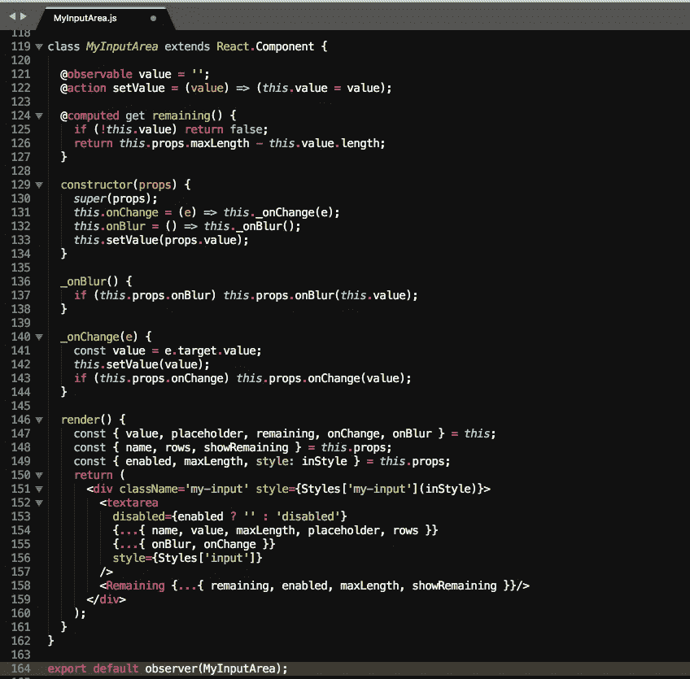
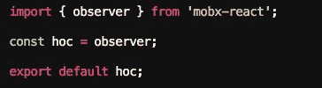
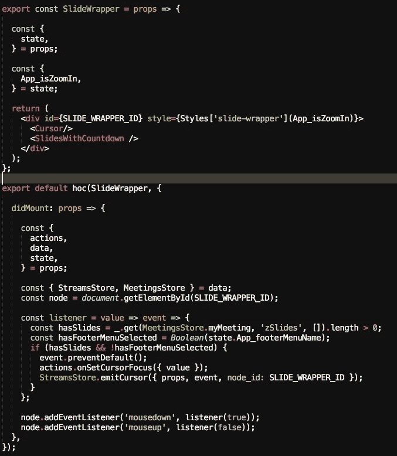

# 与(out) MobX 反应(第 1 部分，共 2 部分)

> 原文：<https://itnext.io/react-with-out-mobx-part-1-of-2-b540a7e631a9?source=collection_archive---------4----------------------->

## 如何在不“污染”您的存储和组件的情况下获得 MobX 的所有好处

*这篇文章展示了我在开发*[*【timefic.com】*](https://www.timefic.com)*的过程中的另一段旅程，从 React components with explicit MobX inside components and stores，到 React components and stores where****根本没有单独引用 MobX****，但仍然在幕后使用 MobX。*

你为什么要这么做？

这种方法的好处是:

*   减少了样板文件，提高了代码的可读性。
*   代码中不需要装饰者。
*   组件和存储更好的可测试性。
*   声明性和框架不可知的代码。

> 我将向您展示的方法不仅仅是 React 和 MobX 的配方，而是一种模式，一种可以在您开发的任何应用程序中使用的设计原则！*💪*

## 场景 1:标准方法

当你使用 MobX 和 React 时，你需要考虑 MobX 在你的应用中的两个地方:

*   在组件级，其中组件观察来自商店和/或本地状态的道具。
*   在商店级别，您为组件和其他商店准备要使用的数据。

**组件级**

在组件级别，您将在整个应用程序中使用 mobx-react 库提供的**观察者**功能:*这是 mobx 中提高性能的常见做法，因为 MobX 实现了自己的****should component update****生命周期方法(* [*在此阅读更多信息*](https://mobx.js.org/best/react-performance.html) *)。*

有状态 React 组件(观察本地状态变化)

而且，如果您的组件需要本地状态(不需要向外部公开的状态)，您还将使用 mobx 库中的**可观察的**和**计算的**函数(或装饰器，如图所示)。

在任何情况下，当观察到的任何属性发生变化时，无状态或有状态组件将自动重新呈现。

**商店级别**

一个 mobx 商店是完整的“mobx 领域”，这里没有反应。在商店里，你基本上定义了两件事:

*   **可观察数据**，形式为*可观察属性*(显式更新的原语)和*计算属性*(数据自动从原语和其他计算属性中扣除)。
*   **修改数据**的事件，以*动作*(通常由用户触发)或*反应*(通常由应用程序内数据的某些条件触发)的形式出现。

典型的 MobX 商店:可观察的数据、动作和反应

**那么，我的 app(前端)与 MobX 的“妥协”程度如何？**我会说 **70%** ，也就是说，前端 10 个文件中有 7 个在使用一些从 mobx 或者 mobx-react 库导入的函数。

> 这没有错。严格来说，场景 1 和场景 2(我现在将向您展示)在性能方面表现相同。不同之处在于开发人员的观点:可读性、可测试性、减少的样板文件和对未来变化的更好准备。

## 场景 2:“独立于 MobX”的方法

> 简而言之:想法是使用 MobX，但不引用它。

**组件级**

在组件级别，我们将做一个简单的调整:

*   将 mobx **观察器**功能替换为 **hoc** (高阶组件)功能。

就是这样。

特设 T17 最基本的实现是这样的:

使子组件成为观察者的 hoc(高阶组件)的基本实现

**看起来像个笑话，但不是**:我们将构建一个特设组件，在我们的应用程序中使用。这个特设机构将赋予其子女超能力:

*   会让他们成为 Mobx 商店的观察员。
*   会提供商店作为道具。
*   将允许调用生命周期方法作为道具。
*   将允许自动调试。
*   将使我们的组件更容易测试。

让我们来看看在[timefic.com](https://www.timefic.com)中使用的这个 **hoc** 的当前版本:

我知道这段代码可能会让你感到困惑:但是，它是从我之前向你展示的基本实现发展到这个“多用途”组件的。

> 背后的概念很简单:使用一个单一的、多用途的、高阶的组件来“装饰”层次结构中的所有组件。您的组件需要的任何数据或行为将由这个**特设**组件提供。

使用这种方法，可以简单地忽略所有这些模式和库:

*   反应上下文
*   提供者/消费者模式(如 MobX 和 Redux)
*   将道具从父级传递到嵌套很深的子级
*   需要定义为类的组件，因为它们有生命周期方法。
*   render 方法中的本地“console.log ”,以查看某个组件在假定不进行重新渲染时是否进行了重新渲染(或者您能想到的任何其他调试功能)。
*   用来自假冒商店的数据水化组件，测试你的组件，因为它有简单的功能(它们是！)

> 在一个大尺寸的应用程序中，处理一些复杂的事情和许多简单的事情比处理相同数量的中等复杂程度的事情要容易得多。

**复杂的东西**，比如这个特设功能，将成为你的工具带、模式、架构选择的一部分，甚至可能成为未来的一个框架。经过一段时间的稳定，你不会再看到这些文件。它们只会工作，不会占据你大脑的任何空间。

**更简单的东西**将成为你的应用程序的实际组成部分。你每天都会看到它们，所以越简单越好。

具有由特设功能提供的“超级能力”的 React 组件

正如你可能注意到的，当你遵循这种模式**时，你将导出你的应用程序的每个组件正好两次**:

*   **命名导出**是一个简单的“哑”组件。它从外部接收所有的属性(特设函数)，没有生命周期方法，没有状态，没有观察者装饰器。如果您愿意，可以独立使用该组件进行快照测试(只需传递 props 并检查输出)。
*   **默认的导出**是增强的组件，这个组件实际上是跨应用程序呈现的。这个增强是一个简单的“不可见的”observer 装饰器(每个组件的默认设置)，加上作为 props 传递的所有存储(也是每个组件的默认设置)，再加上一些您可能需要的额外行为，在本例中是生命周期方法。

您还可以注意到:

*   组件
*   **子组件 **< Cursor/ >** 和**<slides with count down/>**不需要从其父组件接收任何道具。但是，因为它们也在自己的文件中定义了一个 hoc，所以它们可以访问上下文中的所有内容。**
*   **如果需要，子组件可以从其父组件接收道具，例如在迭代循环中。所有这些道具都在一个名为“inner”的对象中传递。**
*   **默认导出中的 **DidMount** 属性(以及剩余的生命周期属性)也可以访问属性，这也是模块的所有上下文。**

> **在 timefic 中，**上下文**被定义为一个对象，该对象具有:**动作**(应用在商店级别定义的所有动作；动作被传递给要附加到事件处理程序的组件)、**数据**(来自后端或仅存储在本地的应用程序数据)、**状态**(保存所有 ui 状态的单个存储)、**内部**(从父级显式传递的属性)和**实用程序**(设置、路由器对象和组件中可能需要的其他实用程序)。**

**我们现在要对文章开头所做的“承诺”进行核对:**

*   ****减少样板文件:**只要避免从父组件向下传递道具，就可以大大减少样板文件(和错误)。它使编码变得更有趣，并鼓励开发人员尽可能多地划分组件(当您需要一直将道具传递给孩子时，划分一个组件就成了一项繁琐的任务)。**
*   ****没有装饰器/更好的可测试性:**当你需要测试组件(和我们将看到的存储)时，有装饰器可能会对你使用的测试套件造成问题。只有常规的 react 组件更安全。**
*   ****框架不可知代码**:如果明天有比 MobX 更好的替代方案会怎样？请记住，因为我们只在一个文件中导入 mobx，所以我们所有的代码都不知道我们使用的是什么反应式状态管理框架。其原语可以命名为**可观察的**、**计算的**、**观察者**和**动作**或**单元格**、**公式**、**观察者**和**更新**。我们应该只调整特设功能，其余的都保持不变。**

**在本文的第二部分，我们将继续展示**如何实现一个*全功能的* MobX 存储**，完全不涉及 MobX。**

**它追求同样的好处，并使程序员的生活更加愉快😀！！**

**继续此处的[第二部分](https://medium.com/@jmaguirrei/react-with-out-mobx-part-2-of-2-a927d87fcd2)。**