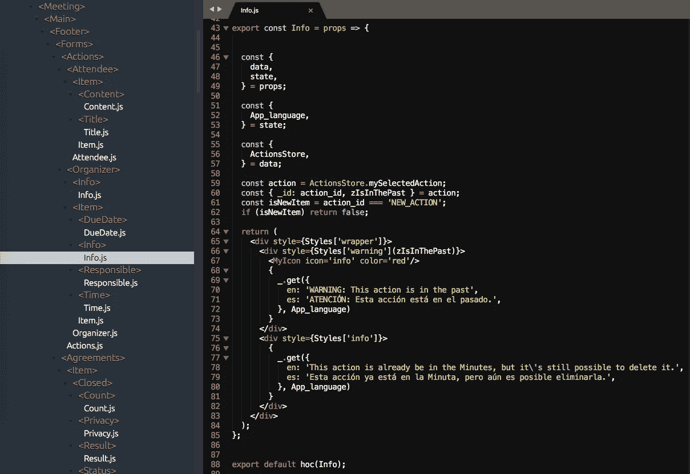
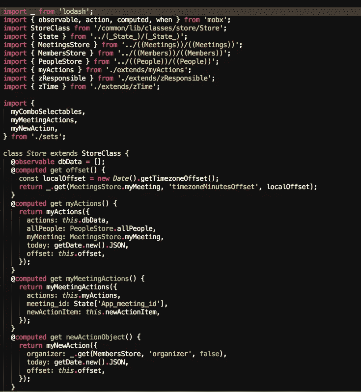
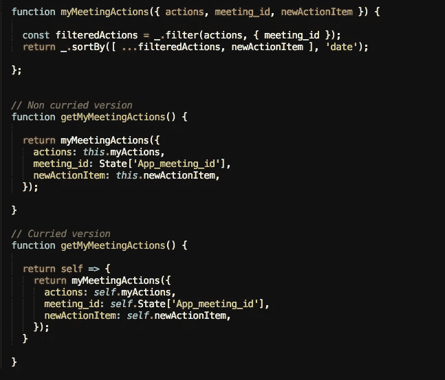
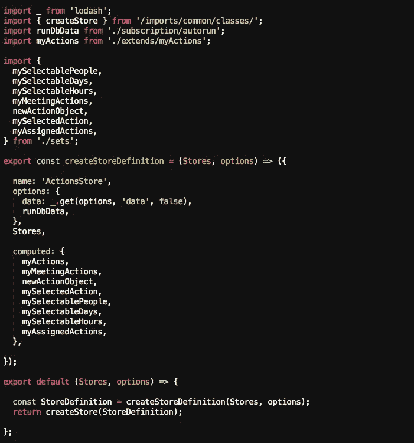
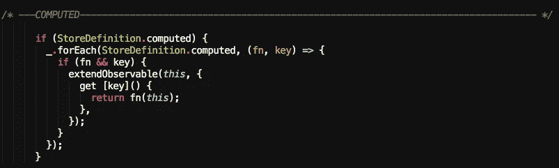
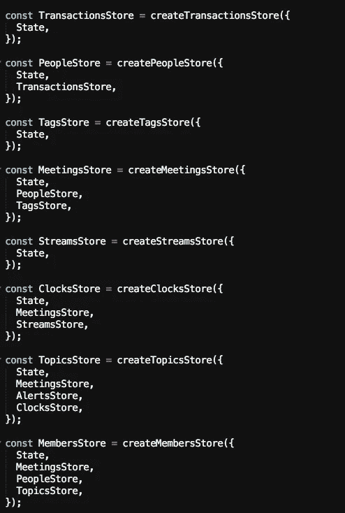

# 与(out) MobX 反应(第 2 部分，共 2 部分)

> 原文：<https://itnext.io/react-with-out-mobx-part-2-of-2-a927d87fcd2?source=collection_archive---------6----------------------->

## 如何在不“污染”您的存储和组件的情况下获得 MobX 的所有好处

*这篇文章展示了我在开发*[*【timefic.com】*](https://www.timefic.com)*的过程中的另一段旅程，从 React components with explicit MobX inside components and stores，到 React components and stores where****根本没有单独引用 MobX****，但仍然在幕后使用 MobX。*

> 注:这是本文中[的第二部分。](https://medium.com/@jmaguirrei/react-with-out-mobx-part-1-of-2-b540a7e631a9)

在上一篇文章中，我告诉了您为所有应用程序定义单个**特设**(高阶组件)的好处。这个组件并不是真正的 React 组件，而是返回一个**增强组件**的函数。

我的建议是让你的应用程序的每个组件都成为增强组件。因此，如果您的应用程序有 250 个组件，您需要增强 250 个组件:

无状态组件(命名导出)和增强组件(默认导出)

你会停止思考:

*   **数据和函数**如何进入组件的道具中。
*   如果组件**在假设不**时被重新渲染。
*   并且不再需要生命周期方法的类。

您的组件不再对这些“小细节”负责:**特设负责！**

因此，场景 1 是标准方法(在组件和商店中使用 MobX ),场景 2 没有使用显式 MobX，还记得吗？现在回到故事上来👇

## 场景 2:“独立于 MobX”的方法

> 简而言之:想法是使用 MobX，但不引用它。

**商店级别**

在商店级别，“照常”使用 MobX 让我有点不舒服，因为:

*   我的每一家商店(在会议模块中有 17 家)都变得越来越大。因此，我在一个单独的文件中为每个字段创建了一个函数，将存储转换得更像一个索引文件。
*   **这个**这个词到处都是。我需要用他们需要的输入来填充任何计算出的值，因为它们现在在一个单独的文件中。
*   我没有**依赖注入机制**，所以测试商店很困难(周围的装饰者也没有帮助)。

一个典型的 MobX 存储，将计算字段作为函数，没有依赖注入

如图所示，这个 ActionsStore 有 **1 个可观察的**和 **4 个计算字段**。每个计算字段都是一个从商店本身和其他商店获取输入的函数，在本例中: **PeopleStore** 、**meetingstore**、 **MembersStore** 和 **State** 。

为了测试这个文件，我需要上述存储中的数据，但是我如何将数据放入其中呢？

> 您正在查看的商店是我拥有的简单商店之一，因此，当您想要查看不太好用的东西时，请想象一个通常有 200 行的文件……*😧*

所以，我需要做点什么。

我不记得具体是怎么做的(我总是阅读一些函数式编程技术)，但它提出了一个 curried 函数，指明了方向。

两种口味的计算字段:咖喱和非咖喱

如图所示，curried 版本不需要 ***这个*** 和**状态**存储在函数范围内。现在 ***自我*** 正在定义这个范围(这个范围就是我们将要看到的商店本身)。这里有商店中每个字段可能需要的所有信息(其他商店和同一商店中的其他字段)。

所以，因为函数是可定制的，如果你调用***【getMeetingActions(this)***你会得到一个函数，它正好有计算值所需的数据。

战略出现了:

> 每个计算字段将通过调用一个函数(curried function)获得，以存储本身(this)作为上下文。

但是，我们将隐藏这个实现细节，使商店看起来像这样:

新版商店:MobX 在哪里？

看图像:MobX 在哪里？

> 想想看:如果每个计算值都有相同的签名，在这种情况下，是以 ***this*** 作为参数调用函数的结果，那么可以将它们定义为一个对象内的字段列表，如图所示。

类似的东西也用于**动作**、**可观察到的**和**反应**:大多数 MobX 商店的基本构件。

例如，计算值是这样实现的:

通用计算值的实现(使用 MobX)

再者，如果想使用另一个类似 MobX 的反应式状态库，只需要接触这段代码就可以了！

好处:

*   **标准存储创建**:存储用(工厂)功能创建的。需要让每家店都可以调试？只需将 ***窗口*【商店名称】= *这个*** 添加到那个工厂函数中。现在你可以在控制台中检查你创建的任何商店(这非常有用)。
*   **缩减样板**:对比前后店铺。后者不仅更小，而且有 8 个计算字段，而不是 4 个。
*   **易读性**:阅读它难道不是一种享受吗？
*   **框架不可知论者**:厌倦了 MobX(我爱它！)?只要以其他方式实现它的原语，就可以开始了！
*   **Testability** :您将测试从 curried 函数返回的函数，这意味着它的所有依赖项都已经作为参数传递了。此外，**您可以创建一组新的一致性测试，将 createStoreDefinition 中的对象与商店**(组件或其他商店)之外实际使用的对象进行比较。这可能是以后的文章，但是请记住，定义不仅可以用来“生成代码”，还可以用来测试它。

为了使商店更加完整，只缺少一个细节:

> 每个存储需要知道其他存储的最小集合，因为在**内部，这个**必须是计算字段需要的上下文的引用。

换句话说:

*   如果***myMeetingActions***需要***State[' App _ meeting _ id ']*【T19]的值，那么 ***State*** store 必须用来构造 ActionsStore。**

这意味着不可能是循环依赖。

> 如果**店 C** 需要**店 A** 和**店 B** ，那么**店 B** 就不能依赖**店 C** 。在这种情况下(确实如此)，你需要打破**商店 C** ，例如，在两个商店。当你被迫这样做时，这是有意义的，因为你意识到有些事情是交错的(没有良好的设计)。

例如，以下是 timefic 中的商店列表:

存储的创建:顺序很重要——存储不能有循环依赖

最后的好处？

看着这些文件，很容易想到**数据是如何组成的**。

就是这样。希望这有意义，能有帮助！