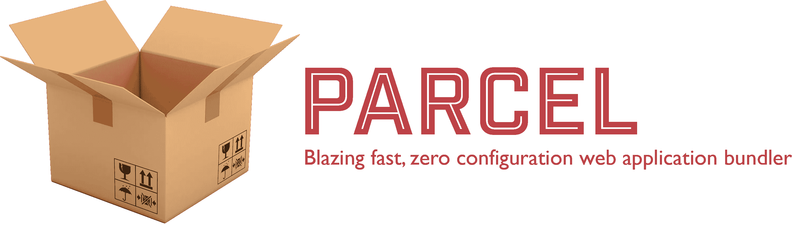
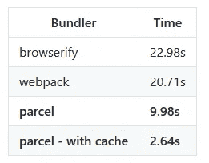
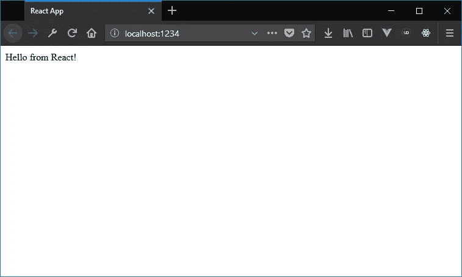

# 与包裹反应📦

> 原文：<https://itnext.io/react-with-parcel-99229106dac8?source=collection_archive---------2----------------------->

> [点击这里在 LinkedIn 上分享这篇文章](/react-with-parcel-99229106dac8?utm_source=medium_sharelink&utm_medium=social&utm_campaign=buffer)

我记得我们不得不写大约**一千**T4 的日子。config 文件来启动和运行一些 Javascript 应用程序。如今，我认识的每个人都在使用 [browserify](http://browserify.org/) 或 [webpack](https://webpack.js.org/) ，要么直接使用，要么通过某种样板文件，比如 [create-react-app](https://github.com/facebook/create-react-app) 。

几个月前，另一个人参加了比赛:



[Parceljs](https://parceljs.org/)

> 有许多 web 应用捆绑软件被广泛采用，包括 webpack 和 browserify。那么，我们为什么需要另一个呢？主要原因是围绕开发者体验。

别误会，webpack 很好。但是当我看到这些类型的[基准](https://github.com/parcel-bundler/parcel#benchmarks)时，我觉得我错过了一些重要的东西:



使用不同捆绑器构建的基准

他们的主要目标是给你一个真正简单的开箱即用的捆扎机。所以我决定尝试一下，用它创建一个最小的 React 应用程序。着急的可以在这里找到代码[，否则继续看！](https://github.com/tducasse/react-parcel)

# 安装

像往常一样，使用你最喜欢的包管理器全球下载并安装**包**。

使用 [npm](https://www.npmjs.com/) :

```
npm install -g parcel-bundler
```

或者用[纱](https://yarnpkg.com/):

```
yarn global add parcel-bundler
```

一旦完成，您应该在终端路径中有可用的 **parcel** 命令。

# 属国

然后，我们将 **npm 初始化**项目(继续按 *enter* 接受默认值):

```
npm init
```

或者，如果你很懒，你可以按照 [Darren](https://medium.com/@darrentorpey) 在[评论](https://medium.com/@darrentorpey/i-encountered-the-glorious-simplicity-of-parcel-setup-for-a-non-react-but-previously-webpack-based-e232a91cb9f1)中的建议，自动接受所有默认设置:

```
npm init -y
```

并安装依赖项:

```
npm install --save react react-domoryarn add react react-dom
```

您还可以添加 parcel(作为 devDependency):

```
npm install --save-dev parcel-bundleroryarn add -D parcel-bundler
```

我们现在准备创建我们的 react 文件！

# index.html

创建一个名为**index.html**的文件:

```
<!DOCTYPE html>
<html lang="en">
<head>
    <title>React App</title>
</head>
<body>
    <div id="root"></div>
    <script src="index.js"></script>
</body>
</html>
```

# 索引. js

创建一个名为 **index.js** 的文件:

```
import React from "react";
import ReactDOM from "react-dom";
import App from "./App";ReactDOM.render(<App />, document.getElementById("root"));
```

# App.js

创建一个名为 **App.js** 的文件:

```
import React, { Component } from "react";class App extends Component {
    render() {
        return <div>Hello from React!</div>;
    }
}export default App;
```

# 启动脚本

然后，您可以向您的 **package.json** 添加一个新的**脚本**命令，以便启动 dev 服务器:

```
"scripts": {
    "start": "parcel index.html"
},
```

就是这样！零 conf 圣杯*！*

只是 r *un*

```
npm run startor yarn start
```

*和* **瞧**:



奇迹正在发生

虽然第一次构建可能会比后来长一点，但由于 Parcel 使用了缓存系统，后续的构建将会更短。

我已经在 [github](https://github.com/tducasse/react-parcel) 上推出了这个最小例子的一个版本。请注意，这有点不同，因为我试图反映我习惯的架构，但一切都应该是不言自明的。

# 结论

与实际的 create-react-app 相比，这可能是一种更简单的创建 react 应用的方式。

我还没有发现你到底能做什么，以及它与大型应用程序的伸缩性如何，但我认为对于那些你不想花几个小时钻研配置的小项目，large 是完美的！