# React:带有条件属性和类型脚本的智能组件 API

> 原文：<https://itnext.io/react-write-awesome-component-api-with-conditional-props-and-typescript-ae9fcdd29cab?source=collection_archive---------0----------------------->

使用 TypeScript 和条件属性，您可以为 React 组件构建一个 API，该 API 对属性的要求是清晰明确的。这样做将有助于你的团队，并让你成为一名出色的开发人员。

我们将从一个简单的用例开始，并以一个涉及泛型的更高级的用例结束。

本教程假设您对 TypeScript 和类型有基本的了解。

# 非此即彼

假设你有一个组件，其中有两个冲突的属性。您希望客户端提供其中一个属性，而不是两个都提供。

对于我们的例子，我们将使用一个接受 URL 字符串或文件对象作为源的 Avatar 组件。如果客户端提供了 URL 字符串，我们不希望他们也提供文件，反之亦然。

组件的第一次迭代可能是这样的:

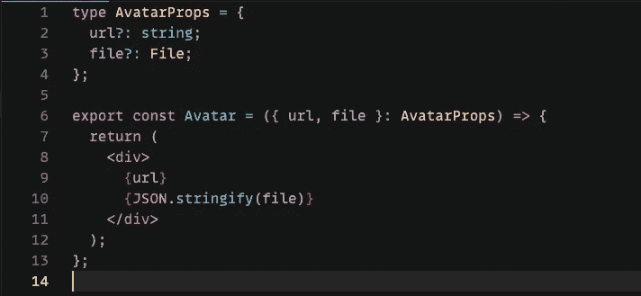

现在，如果我们通过了两个道具，我们的组件不会抱怨:

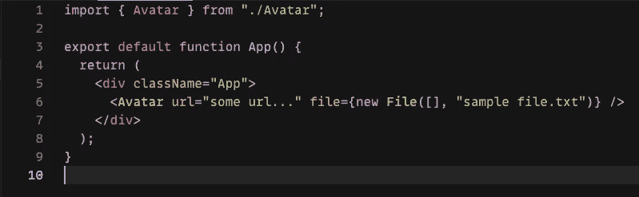

这不行——如果我们两个道具都通过了，我们希望 TypeScript 对我们大喊大叫！

为了实现这一点，我们可以使用两种类型创建一个[联合类型](https://www.typescriptlang.org/docs/handbook/2/everyday-types.html#union-types)，这两种类型反映了我们的组件支持的两种场景:

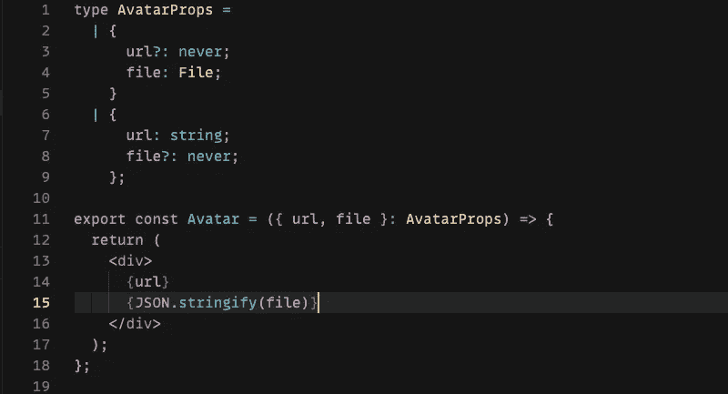

现在，如果我们试图同时提供这两个属性，我们将看到一个 TypeScript 错误:

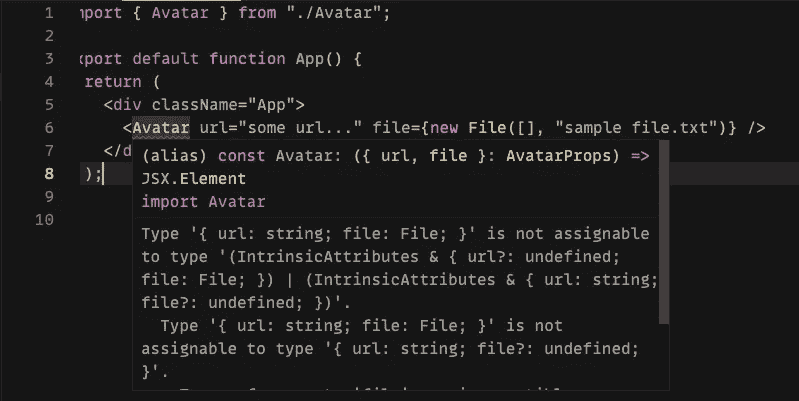

好多了！这里需要注意的一件有趣的事情是我们对 [never](https://www.typescriptlang.org/docs/handbook/2/narrowing.html#the-never-type) 关键字的使用。TypeScript 文档最好地解释了这个关键字:

> TypeScript 将使用 never 类型来表示一个不应该存在的状态。

重申一下，我们为两个场景定义了两种类型，并使用 union 操作符将它们组合在一起。

# 类型变体

让我们从之前的用例开始，构建一个具有不同变体的组件。

假设我们正在构建一个通用加载器。我们的加载器可能有三种不同的变体:微调器、文本或进度条。

对于每个变体，我们都有一套道具。我们希望只有当客户选择了匹配的变体时，才提供这些道具。

我们需要做的是定义一个联合类型，它包含所有三个变量，并具有一个共享的`variant`属性:

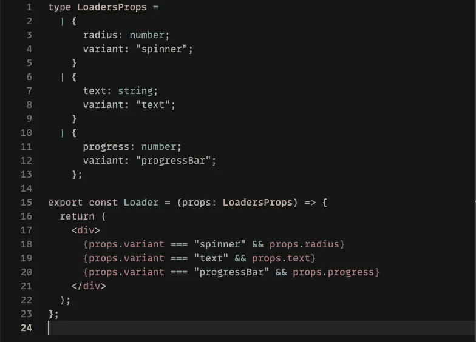

我们使用 variant prop 来告诉客户端要提供哪些附加属性。如果您将变量设置为`progressBar`，您将看到一个错误:

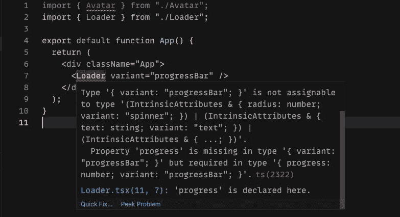

一旦我们将`variant`属性设置为`progressBar`，TypeScript 将组件的类型缩小到进度条，并告诉您需要提供“progress”属性。

最重要的是，如果你试图提供`radius`属性，TypeScript 会抱怨该属性不是进度条类型的一部分。相当整洁！

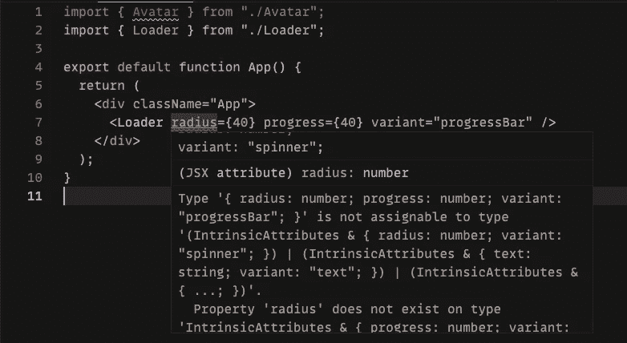

该技术基于**区别并集**。这有助于我们缩小使用公共财产的联盟成员范围。在我们的案例中，`variant`是我们的共同财产。你可以在这里阅读更多关于歧视性结合的内容。

# 收藏物品的条件道具

对于我们的下一个用例，让我们尝试为 Select 组件定义条件属性。我们的组件需要足够灵活，以便为它的`options`属性接受一组字符串或对象。

如果组件接收到一个对象数组，我们希望客户端指定我们应该使用这些对象的哪些字段作为标签和值。

下面是我们如何使用有区别的联合和`never`为组件设置类型:

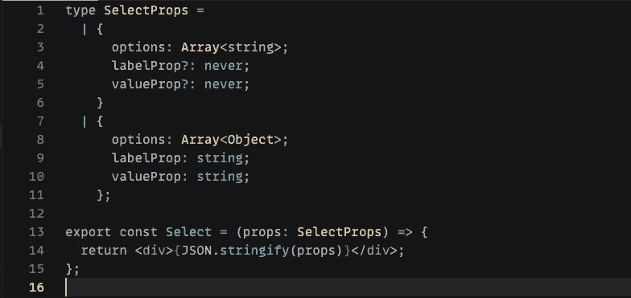

## 使用泛型自动完成

我们可以通过给我们的`labelProp`和`valueProp`添加一个自动完成特性来改进我们的选择。为此，我们可以在 TypeScript 中使用[泛型](https://www.typescriptlang.org/docs/handbook/2/generics.html)。

让我们将泛型添加到 Select 的类型中，如下所示:

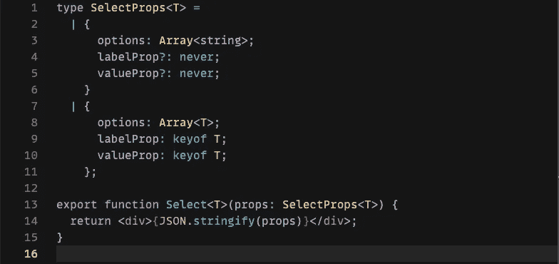

在我们的第二种类型中，我们将通用对象的`options`属性从`Array<Object>`改为`Array<T>`。客户端必须提供一个通用对象类型的项目数组。

我们使用关键字的[key 让 TypeScript 知道我们期望`labelProp`和`valueProp`是通用对象的字段。](https://www.typescriptlang.org/docs/handbook/2/keyof-types.html)

现在，当您尝试提供`valueProp`或`labelProp`时，您会看到一个基于选项项字段的漂亮的自动完成建议。

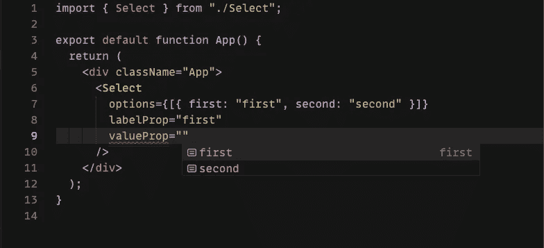

此外，如果您提供的值不是选项项的字段，您将会看到一个错误:

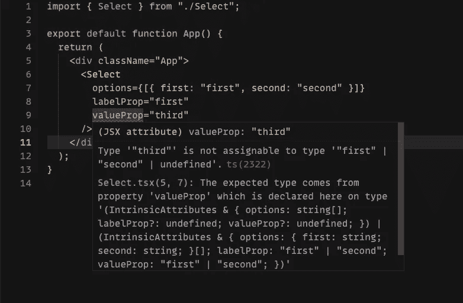

到目前为止一切顺利。

然而，我们需要添加一个小的修改来防止某些错误。我们希望确保提供给我们的通用对象是一个自定义对象，而不是像字符串这样的原语:

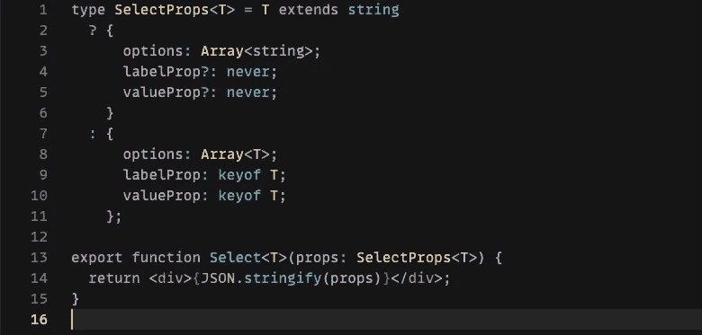

这里我们使用一个三元运算符来检查我们的泛型类型是否是一个字符串，基于此，我们将组件的类型设置为适当的选项。

现在，我们的组件的类型定义已经完成，可以发布了！

在这篇文章中，我们回顾了一些使用 TypeScript 构建智能组件 API 的技术。使用这些技术，您可以编写具有清晰明确的 prop 需求的组件。它也是构建组件库的强大工具。

如果你想学习更多编写干净的声明性组件的技术，可以看看我关于 React 的复合组件模式的帖子。

这里是本教程的[代码沙箱](https://codesandbox.io/s/conditional-props-hvfbo?file=/src/App.tsx)的链接。

*原载于 2021 年 4 月 19 日 https://isamatov.com***。**