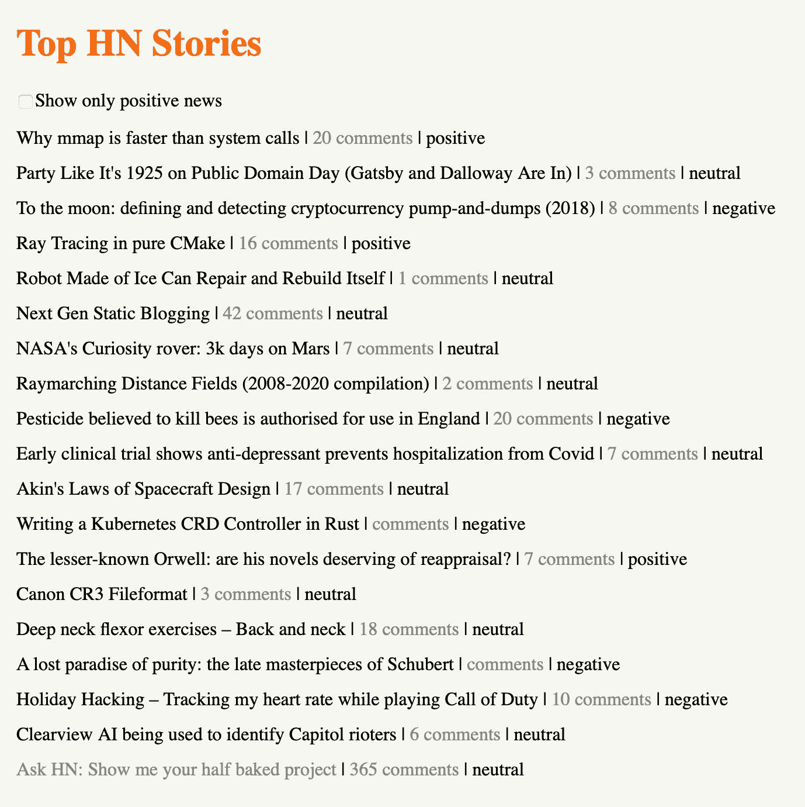

# 反应角

> 原文：<https://itnext.io/reactive-angular-b7914b0190f5?source=collection_archive---------1----------------------->

这个帖子是关于 Angular 中的反应式编程。在一个实例中，我们将讨论如何使用 RxJs 实现可维护的业务逻辑。

这是期望你有经验的角度和最低限度的经验与 RxJs(订阅可观)。

该演示将展示 20 大黑客新闻故事，以及相应的文章链接、HN 评论和对标题的*情感*分析。

我们将首先看看你如何使用可观测量，并错误地认为你是*在做*反应式编程。然后，我们肯定会看到如何实际反应。



源码肯定在 GitHub: [无功-角度](https://github.com/patuzov/reactive-angular)

# 反应式编程

在不把它变成一篇关于反应式编程的理论文章的情况下，这里有两个简单的概念来描述它:

*   异步数据流
*   变化的传播

我们将一切(数据)视为**流**，无论是鼠标点击、http 调用还是字符串值。我们将定义这些流，并忙于描述当数据在未来到来时我们将如何**反应**—**变化**将如何**通过这些流传播**。


资料来源:https://gist.github.com/staltz/868e7e9bc2a7b8c1f754

例如，在面向对象编程中，我们有对象和它们相应的状态。整个逻辑是围绕操纵对象的这种状态而编写的。

在反应式编程中，我们用数据流代替。我们正在编写转换数据的逻辑，这些数据通过流从**流向**，直到它达到最终期望的状态。直到那时状态才被存储。

# 以错误的方式使用 RxJs

例如，你知道 Angular 的 HTTP 客户端正在使用 RxJs (Observable)，所以，不管你是否想要，你至少已经在接触反应式编程范式了。

让我们看看如何利用它。

您可以做的一件不好的事情是在组件代码中进行 http 调用。你不应该。你在服务中编写技术材料(http)。组件应该只包含表示逻辑。但是您已经知道了，并且正在创建实现 HTTP APIs 的服务。因此，让我们创建实现[黑客新闻 API](https://github.com/HackerNews/API) 的服务:

为了获得关于热门故事的详细信息，我们必须发出两个 HTTP 请求:获取故事的 id 和获取每个 id 的详细信息。

下面是在您的组件中如何做到这一点:

*topNewsIds* 返回当*到来*时将获得前 20 名新闻 id 的可观察对象。当它们*到来*时，我们将遍历它们，并为每一个获得另一个可观察的，这将获得新闻的细节(当它们*到来*)。

虽然你这里用的是 RxJs，但是你不是*反应型*。你正在实现类似回调的东西。此外，在这个非常简单的例子中，您已经有了嵌套(我们才刚刚开始)。

现在，如果你决定只显示故事(没有工作，问或显示)，你会怎么做？您只需过滤:

你有反应了吗？不。你现在实际上是在一条通向黑暗的路上。您正在组件类中开发业务逻辑。因为，你知道，接下来是显示标题的*情感*的请求——它是正面的、负面的还是中性的新闻。你将如何实现它？更多的嵌套，组件中更多的业务逻辑？你还能跟踪那里发生的事情吗？如果在获取故事细节时出现暂时性 HTTP 错误，该怎么办？您能重试请求并继续吗？

# 起反应

使用可观察对象(和主题)，RxJs 实现了观察者模式。可观察的是我们的数据流。但这对你来说并不陌生，对吧？不过，RxJs 变酷的地方是它的运营商。这就是反应式编程的*变化传播*部分。

使用 RxJs 运算符，您可以描述您的业务逻辑。以可读、可维护的方式。你正在建立一个*方法*来处理数据，当数据*到来*时，如何操作它，直到我们得到想要的形式，想要的数据状态。

首先，让我们开始在一个独立的服务中构建我们的业务逻辑，这是它的归属。为了一开始就简单起见，我们将首先重构获取故事细节部分:

在这个极简的例子中，美好的事情已经发生了。首先注意一下*管道()*。管道将描述数据流。您将在管道中定义您的业务逻辑。*变更*将通过这个管道传播，使用 RxJs 操作符，您将描述数据将如何被变更。

在管道内部，您可以看到第一个 RxJs 操作符— *过滤器*。当数据进入管道时，下面是它将如何被改变——只有类型为 *story* 的新闻将进入管道。其余的都将被过滤掉，即不会发出任何值。

请注意，过滤器操作符获取故事作为输入，而不是可观察的。还是那句话，数据来了就叫*，故事就有了。目前它只是一个配方。另外，请注意 filter 的结果(由 *story* 方法返回的任何内容)是可观察的。操作符的返回值总是被包装在一个可观察的。*

顺便说一下，你通常希望在管道中进行过滤，不相关的数据在被过滤掉之前不会被不必要的处理。

如果这有助于你形象化操作者做什么，这里有大理石图。例如对于[滤波器](http://reactivex.io/documentation/operators/filter.html)。

回到组件:

我们得到的是，再次从组件中提取业务逻辑。这里还没有发生什么，但是现在我们已经为未来做好了准备。例如，让我们为这个故事创建一个数据传输对象:

让我们将从 API 获得的任何东西转换成我们的应用程序能够理解的模型:

而这里是第二张——[*地图*](http://reactivex.io/documentation/operators/map.html) 。地图可以转换数据的结构。在这种情况下，我们获取故事对象，并将其转换为新闻对象。一个可观察到的<消息>顺着管道流下。因为没有更多的*改变*要做，这是从管道中得到的，这是*故事*方法返回的。

现在您已经熟悉了两个非常流行的操作符。你觉得这烟斗怎么样？可读性强吗？你注意到我们实现一个新的功能请求(新闻 DTO)有多容易了吗？这其中的逻辑非常清楚。当下一个功能请求到来时，您可以继续操作数据，比如获取标题的*情感*…

*我正在使用* [*Azure 认知服务*](https://azure.microsoft.com/en-us/services/cognitive-services/) *来获取文本的情感。这超出了本文的范围。代码见*[](https://github.com/patuzov/reactive-angular/blob/master/src/app/cognitive.service.ts)**。您必须在 environments 文件夹中添加一个 cognitive.environment.ts 文件，该文件将包含密钥和 url。我肯定没有把它包含在存储库中。在*[*environment . ts*](https://github.com/patuzov/reactive-angular/blob/master/src/environments/environment.ts)*中你会看到 cognitiveenv 常量的结构。**

*有了[*cognitive service*](https://github.com/patuzov/reactive-angular/blob/master/src/app/cognitive.service.ts)*，*我们可以调用它的*情绪*方法(顺便说一下，它使用自己的管道)并获得情绪作为可观察的<字符串>。我们可以再次使用 *map* 来操作我们的数据结构:*

```
*map(story => this.cognitiveSvc.sentiment(story.title))*
```

*但是……情感*方法的结果是一个可观察的<字符串>。并且，记住，无论从操作符中得到什么，都被包装在一个可观察对象中，所以，最终，我们将获得一个可观察的<可观察的<字符串> >。**

*这里我们有两个问题:外部可观测性和*字符串*。我们先来处理可观测的。*

*当然，有展平算子，将*展平*这个结构成为一个可观察的——这正是我们所需要的。我们将使用 mergeMap(或者你会经常通过它的别名— flatMap 找到它)。还有一个替代方案— switchMap，它有一个微小但重要的区别。让我们把理解两者的不同作为家庭作业。*

```
*mergeMap(story => this.cognitiveSvc.sentiment(story.title))*
```

*现在，从管道里出来的将会是一个可观测的<string>。字符串？相反，我们需要的是用情感来更新故事，然后把它送进管道。</string>*

*有几种方法可以解决这个问题。其中之一是为*情感*流定义一个单独的管道，使用*映射*转换故事对象，并从该管道返回故事对象(而不仅仅是情感):*

*容易实现，我们已经熟悉所有的运营商。我唯一不喜欢的是这里的巢。但是幸运的是，在这一点上它仍然是可读/可维护的。*

*为了避免管道嵌套，我们可以使用 [forkJoin](https://www.learnrxjs.io/learn-rxjs/operators/combination/forkjoin) 沿着管道发送情感和故事，然后使用 *map* 来做我们在上面的嵌套管道中所做的事情。但是，在我看来，我们会在这样的管道中失去可理解性。*

*精彩！我们不断添加功能，描述当数据通过管道时我们如何反应。代码保持可读性和可维护性。该组件对此一无所知，只是简单地显示它得到的任何故事。*

*现在，那些身份证呢？为什么组件需要知道如何获取 id 以及如何处理它们？它所需要的只是展示头条新闻。这就是它需要实现的逻辑。*

*我们需要*合并*从服务中获取业务逻辑中的 ids 这是它的归属。这里我们有两个非常不同的选择。该流要么发出一个包含 20 个故事的数组，要么一个接一个地发出每个故事。我喜欢后一种方法有两个原因:我们不会等到我们有了所有故事的数据，并且它与我们已经有的代码非常吻合(对每个 id 作出反应)。*

*所以，我们的想法是，当我们得到带有 id 的数组时，我们将开始一个接一个地发送它们。还记得那句口头禅— **一切都是溪流**？数组也可以是流。 [*from*](http://reactivex.io/documentation/operators/from.html) 是一个可以将数组转化为流的运算符。然后，它将一个接一个地发出这些值。不要与操作符的*混淆，后者将整个数组作为单个值发出。**

*现在我们的管道从 ids 开始，往下看也一样。这是组件的代码:*

*看看这段代码。它只做它必须做的事情——处理表示逻辑。它从服务中获取数据并显示出来。没有业务逻辑，没有技术内容(除了在组件被销毁时处理订阅)。*

*花点时间了解一下这个*新闻*对象是什么。这就是所寻求的*最终期望状态*。这是我们唯一的状态。整个业务逻辑是无状态的。*

*管道中描述了业务逻辑。在我们的例子中，这就是反应式编程发生的地方。当您调用 *subscribe，*获得数据的*期望*状态时，反应式编程结束。*

*让我们把它推得更远。又一个功能请求来了。我们想要一个只显示正面消息的过滤器。它已经回答了您将为此使用哪个 RxJs 运算符。很简单，对吧？你很清楚这种改变属于哪里。这是可维护代码的标志。*

**

# *结论*

*就 RxJs 所能提供的而言，还有很多内容需要介绍，比如错误处理、重试(你已经知道了——有适合相同编程风格的操作符)、合并流以及冷和热的可观察性。但是这篇文章的重点是关注如何使用 RxJs 编写可维护的代码。*

*RxJs 非常适合 Angular，因为它的一些模块是基于 RxJs 的。比如 ActivatedRoute。查看实现正面新闻过滤器的[组件代码](https://github.com/patuzov/reactive-angular/blob/master/src/app/reactive/reactive.component.ts)。url 片段**是**也是**的一个流**。我们不会为了获得 url 片段的状态而立即订阅它，然后对它做一些事情。相反，我们**描述**当**改变时**我们将如何反应。我们将根据我们的需要操作片段，我们将通过重置故事数组来创建一些副作用(点击操作符),我们将根据我们的过滤器获取故事。这一切都从 url 片段被更改开始，到最终的新闻对象结束。中间没有状态。*

*不过，我希望 Angular 在其核心部分变得更具反应性(因为他们无论如何都决定走这条路)。例如，当过滤器复选框的值改变时，我们在回调中处理这个事件。如果我们以流的形式获得复选框值，不是很好吗？实际上有一些技巧可以做到这一点(使用 [fromEvent](https://www.learnrxjs.io/learn-rxjs/operators/creation/fromevent) 操作符)，但是，就角度而言，这更像是一种变通方法。*