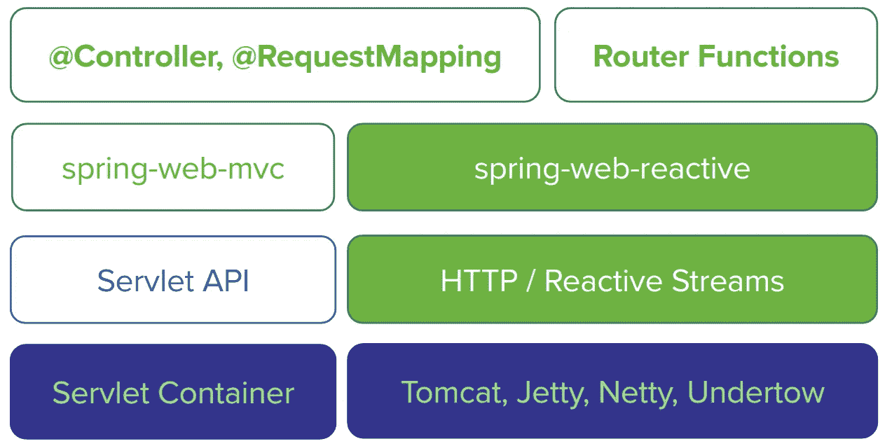
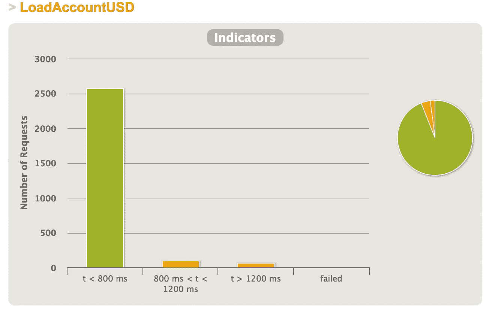
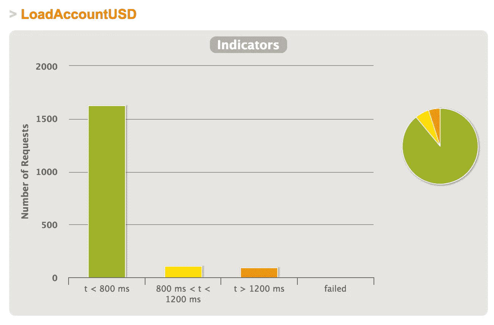

# 带弹簧的反应式微服务 5

> 原文：<https://itnext.io/reactive-microservices-with-spring-5-95c5f8cd03d0?source=collection_archive---------0----------------------->

Spring 5 正在经历有史以来最大的更新。Spring 5 是一个新版本，它承诺让开发人员能够构建更健壮、更有弹性、更灵活的系统，更好地满足现代需求。这就是我们所说的反应系统。


弹簧 5 当前在 [v5.0.0.RC3](https://github.com/spring-projects/spring-framework/releases/tag/v5.0.0.RC3) 上。(发布候选 3)，于 2017 年 7 月发布，目标是，在 JDK 9 的 GA 日期后立即 GA(可从 [21.9.2017](http://www.java9countdown.xyz/) 获得)。spring 的新版本是用 Java 8 编写的，但将与下一个版本 Java 9 完全兼容。如果你想了解新的 Spring 5 的一切，请查看[Spring 框架的新功能](https://github.com/spring-projects/spring-framework/wiki/What's-New-in-the-Spring-Framework#whats-new-in-spring-framework-5x)和 [Spring 5 文档](http://docs.spring.io/spring-framework/docs/5.0.0.M5/spring-framework-reference/html/)。在开始讲 Spring 5 之前，我们先来讲讲反应式系统和编程。

# 反应式编程

如果你从未听说过反应系统，我推荐你阅读[反应宣言](http://www.reactivemanifesto.org/)。总之，一个反应系统必须是**反应灵敏的、有弹性的、有弹性的和消息驱动的。**

大系统由较小的系统组成，因此依赖于其组成部分的反应性质。这意味着反应式系统应用设计原则，因此这些属性适用于所有级别的规模，使它们成为可组合的。

反应式编程是异步和事件驱动的非阻塞应用程序，需要少量线程垂直伸缩(即在 JVM 内)而不是水平伸缩(即通过集群)。

反应式编程可以用在不同的用例中，让我们看一些例子:

**外部服务调用:**如今很多后端服务都是 REST-ful 的，HTTP 从根本上来说是阻塞式和同步式的。IO 操作通常是阻塞操作，我们不想等一个调用完成后再发送下一个请求。

**高度并发的消息消费者:**反应模式本质上非常适合消息处理。

**基于同步处理的抽象:**函数式反应式编程提供一些额外的抽象层是很方便的，因为不需要知道我们调用的代码是同步的还是异步的。

# 弹簧腹板反应模块

Spring Framework 5 包括一个新的`spring-web-reactive`模块。该模块支持反应式 HTTP 和 WebSocket 客户端以及反应式服务器 web 应用程序，包括 REST、HTML 浏览器和 WebSocket 风格的交互。



# 让我们开始吧

首先，我们需要使用 [Spring Initializr](https://start.spring.io/) 创建一个 Spring Boot 应用程序。如果你对 Spring Boot 没有足够的经验，请阅读这个。基础代码可以在文章末尾找到。

## 添加依赖关系

在根文件夹中找到 pom.xml，添加 Spring Web Flux、MondoDB、Gatling 和 Test 的依赖项。

```
<**dependency**>
    <**groupId**>org.springframework.boot</**groupId**>
    <**artifactId**>spring-boot-starter-webflux</**artifactId**>
</**dependency**>

*<!--EMBED MONGO DB-->

<!-- https://mvnrepository.com/artifact/org.springframework.data/spring-data-commons -->* <**dependency**>
    <**groupId**>org.springframework.boot</**groupId**>
    <**artifactId**>spring-boot-starter-data-mongodb-reactive</**artifactId**>
</**dependency**>

<**dependency**>
    <**groupId**>org.springframework.boot</**groupId**>
    <**artifactId**>spring-boot-starter-data-mongodb</**artifactId**>
</**dependency**>

<**dependency**>
    <**groupId**>de.flapdoodle.embed</**groupId**>
    <**artifactId**>de.flapdoodle.embed.mongo</**artifactId**>
    <**version**>1.50.5</**version**>
</**dependency**>

<**dependency**>
    <**groupId**>org.springframework.boot</**groupId**>
    <**artifactId**>spring-boot-starter-test</**artifactId**>
    <**scope**>test</**scope**>
</**dependency**>

*<!--GATLING-->
<!-- https://mvnrepository.com/artifact/io.gatling.highcharts/gatling-charts-highcharts -->* <**dependency**>
    <**groupId**>io.gatling.highcharts</**groupId**>
    <**artifactId**>gatling-charts-highcharts</**artifactId**>
    <**version**>2.2.5</**version**>
    <**scope**>test</**scope**>
</**dependency**>
```

## 建立我们的网络服务

```
@SpringBootApplication
@EnableAutoConfiguration
@EnableMongoAuditing
@EnableReactiveMongoRepositories
**public class** ReactiveAccountRestApplication {
    **public static void** main(String[] args) {
        SpringApplication.*run*(ReactiveAccountRestApplication.**class**, args);
    }
}
```

*   SpringBootApplication :是我们 REST 服务的标准配置。这个注释相当于使用了`@Configuration`、`@EnableAutoConfiguration`和`@ComponentScan`
*   **enable auto configuration**:允许我们的依赖项进行自我配置。
*   **EnableReactiveMongoRepositories**:使我们的 MongoDB 能够反应式工作。

## 模型

```
@Document(collection = **"accounts"**)
**public class** Account {

    @Id
    **private** String **id**;

    @CreatedDate
    @JsonFormat(shape = JsonFormat.Shape.***STRING***, pattern = **"dd-MM-yyyy mm:ss"**)
    **private** Date **creationDate**;

    **private** Double **amount**;

    **private** Currency **currency**;

    **public** Account() {
    }

    **public** Account(**double** amount, Currency currency) {
        **this**.**amount** = amount;
        **this**.**currency** = currency;
    }

    **public** String getId() {
        **return id**;
    }

    **public void** setId(String id) {
        **this**.**id** = id;
    }

    **public** Date getCreationDate() {
        **return creationDate**;
    }

    **public void** setCreationDate(Date creationDate) {
        **this**.**creationDate** = creationDate;
    }

    **public** Double getAmount() {
        **return amount**;
    }

    **public** Currency getCurrency() {
        **return currency**;
    }

    **public void** setCurrency(Currency currency) {
        **this**.**currency** = currency;
    }

    **public void** setAmount(Double amount) {
        **this**.**amount** = amount;
    }

    @Override
    **public** String toString() {
        **return "Account{"** +
                **"id='"** + **id** + **'\''** +
                **", creationDate="** + **creationDate** +
                **", amount="** + **amount** +
                **", currency="** + **currency** +
                **'}'**;
    }
}**public enum** Currency {
    ***USD***, ***EUR***, ***BRL***;

    **public static** Currency fromValue(String value) {
        **for** (Currency currency : *values*())
            **if** (currency.name().equalsIgnoreCase(value)) {
                **return** currency;
            }
        **return null**;
    }
}
```

# 反应堆知识库

现在，在 SPRING 5 中，我们有了这个来自 SPRING 数据的新接口，称为 ReactiveCrudRepository。它是一个通用接口，用于对特定类型的存储库进行 CRUD 操作，遵循反应式范例，使用建立在反应式流之上的项目反应堆类型。

```
@NoRepositoryBean
**public interface** ReactiveCrudRepository<T, ID> **extends** Repository<T, ID> {
    <S **extends** T> Mono<S> save(S var1);

    <S **extends** T> Flux<S> saveAll(Iterable<S> var1);

    <S **extends** T> Flux<S> saveAll(Publisher<S> var1);

    Mono<T> findById(ID var1);

    Mono<T> findById(Publisher<ID> var1);

    Mono<Boolean> existsById(ID var1);

    Mono<Boolean> existsById(Publisher<ID> var1);

    Flux<T> findAll();

    Flux<T> findAllById(Iterable<ID> var1);

    Flux<T> findAllById(Publisher<ID> var1);

    Mono<Long> count();

    Mono<Void> deleteById(ID var1);

    Mono<Void> deleteById(Publisher<ID> var1);

    Mono<Void> delete(T var1);

    Mono<Void> deleteAll(Iterable<? **extends** T> var1);

    Mono<Void> deleteAll(Publisher<? **extends** T> var1);

    Mono<Void> deleteAll();
}
```

让我们扩展它，并为 Account 创建我们的存储库 ReactiveAccountRepository。

```
 @Repository
**public interface** ReactiveAccountRepository **extends** ReactiveCrudRepository<Account, String> {

    Flux<Account> findByCurrency(Currency currency);
}
```

Spring 框架在内部使用[反应器](https://projectreactor.io/)作为自己的反应支持。Reactor 是一个 Reactive Streams 实现，它用`Flux`和`Mono`可组合 API 类型进一步扩展了基本 Reactive Streams `Publisher`契约，以提供对`0..N`和`0..1`数据序列的声明性操作。

# 定义我们的控制器

要定义我们的控制器，我们只需要用@RestController 进行注释，就像我们用 spring-mvc 一样。该控制器可以表现为简单的控制器，或者可以基于响应而反应。

```
*/**
 * Created by rodrigo.chaves on 20/06/2017.
 */* @RestController
@RequestMapping(**"/accounts"**)
**public class** AccountController {

    **private final** ReactiveAccountRepository **reactiveAccountRepository**;

    **public** AccountController(ReactiveAccountRepository reactiveAccountRepository) {
        **this**.**reactiveAccountRepository** = reactiveAccountRepository;
    }

    @RequestMapping(value = **"/search/bycurrency"**, method = RequestMethod.***GET***)
    Flux<Account> findByCurrency(@RequestParam String currency) {
        **return reactiveAccountRepository**.findByCurrency(Currency.*fromValue*(currency));
    }

    @RequestMapping(value = **"/{id}"**, method = RequestMethod.***GET***)
    Mono<Account> findById(@PathVariable String id) {
        **return reactiveAccountRepository**.findById(id);
    }

    @RequestMapping(value = **"/"**, method = RequestMethod.***POST***)
    Mono<Account> save(@RequestBody Account account) {
        **return reactiveAccountRepository**.save(account);
    }

    @RequestMapping(value = **"/"**, method = RequestMethod.***GET***)
    Flux<Account> findAll() {
        **return reactiveAccountRepository**.findAll();
    }
}
```

Spring 框架在其自己的许多反应式 API 中公开了`Flux`和`Mono`。然而，在应用程序级别，Spring 一如既往地提供了选择，并完全支持 RxJava 的使用。

# 测试

我们可以使用 WebTestClient 通过类似于`[WebClient](https://docs.spring.io/spring/docs/5.0.x/javadoc-api/org/springframework/web/reactive/function/client/WebClient.html)`的 API 来测试我们的服务器端点，并且实际上委托给一个`WebClient`实例，但是侧重于测试。

```
@RunWith(SpringRunner.**class**)
@SpringBootTest(webEnvironment = SpringBootTest.WebEnvironment.***DEFINED_PORT***)
**public class** ApplicationIntegrationTest {

    WebTestClient **webTestClient**;

    List<Account> **expectedAccounts**;

    @Autowired
    ReactiveAccountRepository **reactiveAccountRepository**;

    @Before
    **public void** setup() {
        **webTestClient** = WebTestClient.*bindToController*(**new** AccountController(**reactiveAccountRepository**)).build();
        **expectedAccounts** = **reactiveAccountRepository**.findAll().collectList().block();
    }

    @Test
    **public void** findAllAccountsTest() {
        **this**.**webTestClient**.get().uri(**"/accounts/"**)
                .accept(***APPLICATION_JSON_UTF8***)
                .exchange()
                .expectStatus().isOk()
                .expectHeader().contentType(***APPLICATION_JSON_UTF8***)
                .expectBodyList(Account.**class**).isEqualTo(**expectedAccounts**);
    }

    @Test
    **public void** streamAllAccountsTest() **throws** Exception {
        **this**.**webTestClient**.get()
                .uri(**"/accounts/"**)
                .accept(***TEXT_EVENT_STREAM***)
                .exchange()
                .expectStatus().isOk()
                .expectHeader().contentType(***TEXT_EVENT_STREAM***)
                .returnResult(Account.**class**);
    }

    @Test
    **public void** streamAllAccountsByCurrencyTest() **throws** Exception {
        **this**.**webTestClient**.get()
                .uri(**"/accounts/?currency=EUR"**)
                .accept(***TEXT_EVENT_STREAM***)
                .exchange()
                .expectStatus().isOk()
                .expectHeader().contentType(***TEXT_EVENT_STREAM***)
                .returnResult(Account.**class**);
    }
}
```

# 特性试验

我们可以使用加特林测试我们的控制器的性能，最后我们会有一个非常酷的图表。该应用程序每秒将接收总共 1000 个请求，遵循以下操作 CreatAndLoadAccountUSD、CreatAndLoadAccountEUR、CreateAndLoadAccountBR，然后是 LoadAccountByCurrenciesBRL、LoadAccountByCurrenciesUSD 和 LoadAccountByCurrenciesEUR。

```
**class** AccountsLoadTest **extends** Simulation {
  **val** *rampUpTimeSecs* = 5
  **val** *testTimeSecs* = 60
  **val** *noOfUsers* = 200
  **val** *noOfRequestPerSeconds* = 1000

  **val** *baseURL* = **"http://localhost:8080"
  val** *accountResourcePath* = **"/accounts"

  object** CreatAndLoadAccountUSD {
    **val** *create* = exec(http(**"CreateAccountUSD"**)
      .post(*accountResourcePath* + **"/"**)
      .body(RawFileBody(**"create_account_usd.json"**))
      .asJSON
      .check(jsonPath(**"$.id"**).saveAs(**"accountId"**)))

    **val** *load* = exec(http(**"LoadAccountUSD"**)
      .get(*accountResourcePath* + **"/${accountId}"**)
      .check(*status*.is(HttpURLConnection.*HTTP_OK*)))
  }

  **object** CreateAndLoadAccountBR {
    **val** *create* = exec(http(**"CreatAccountBR"**)
      .post(*accountResourcePath* + **"/"**)
      .body(RawFileBody(**"create_account_brl.json"**))
      .asJSON
      .check(jsonPath(**"$.id"**).saveAs(**"accountId"**)))

    **val** *load* = exec(http(**"LoadAccountBR"**)
      .get(*accountResourcePath* + **"/${accountId}"**)
      .check(*status*.is(HttpURLConnection.*HTTP_OK*)))
  }

  **object** CreatAndLoadAccountEUR {
    **val** *create* = exec(http(**"CreateAccountEUR"**)
      .post(*accountResourcePath* + **"/"**)
      .body(RawFileBody(**"create_account_eur.json"**))
      .asJSON
      .check(jsonPath(**"$.id"**).saveAs(**"accountId"**)))

    **val** *load* = exec(http(**"LoadAccountEUR"**)
      .get(*accountResourcePath* + **"/${accountId}"**)
      .check(*status*.is(HttpURLConnection.*HTTP_OK*)))
  }

  **object** LoadAccountByCurrencies {
    **val** *usd* = exec(http(**"LAByCurrencyUSD"**)
      .get(*accountResourcePath* + **"/search/bycurrency?currency=usd"**)
      .check(*status*.is(HttpURLConnection.*HTTP_OK*)))
    **val** *br* = exec(http(**"LAByCurrencyBR"**)
      .get(*accountResourcePath* + **"/search/bycurrency?currency=br"**)
      .check(*status*.is(HttpURLConnection.*HTTP_OK*)))
    **val** *eur* = exec(http(**"LAByCurrencyEUR"**)
      .get(*accountResourcePath* + **"/search/bycurrency?currency=eur"**)
      .check(*status*.is(HttpURLConnection.*HTTP_OK*)))
  }

  **val** *httpProtocol* = http
    .baseURL(*baseURL*)
    .acceptHeader(**"application/json"**)
    .userAgentHeader(**"Gatling"**)

  **val** *testScenario* = scenario(**"LoadTest"**)
    .during(*testTimeSecs*) {
      exec(
        CreatAndLoadAccountUSD.*create*,
        CreatAndLoadAccountUSD.*load*,
        CreatAndLoadAccountEUR.*create*,
        CreatAndLoadAccountEUR.*load*,
        CreateAndLoadAccountBR.*create*,
        CreateAndLoadAccountBR.*load*,
        LoadAccountByCurrencies.*eur*,
        LoadAccountByCurrencies.*usd*,
        LoadAccountByCurrencies.*br* )
    }

  setUp(
    *testScenario* .inject(atOnceUsers(*noOfUsers*)))
    .throttle(
      reachRps(*noOfRequestPerSeconds*) in (*rampUpTimeSecs* seconds),
      holdFor(*testTimeSecs* seconds))
    .protocols(*httpProtocol*)
}
```

一个有趣的测试是比较 web-mvc REST 应用程序和 reactive REST 应用程序+ reactive mongo DB。这是我们的结果:



反应静止—负荷账户



简单 REST — LoadAccount

两项测试完全相同。LoadAccountUSD 读取所有美元账户，Reactive REST 我们有 1000 多个响应时间更短的呼叫(t < 800 ms). The main reason of this result is that we're using a Reactive MongoDB. This example from [Reactive Mongo](http://reactivemongo.org/) ，很好地说明了我们所看到的情况:

> 假设您有一个 web 应用程序，对数据库进行 10 次并发访问。这意味着您最终会同时拥有 10 个冻结的线程，除了等待响应之外什么也不做。一个常见的解决方案是增加运行线程的数量，以处理更多的请求。如果您的应用程序负载不是很重，这样的资源浪费实际上并不是问题，但是如果您要处理 100 个甚至 1000 个以上的请求，执行每个 DB 查询，会发生什么情况呢？乘法增长非常快。

# 结论

Spring 5 将改变我们构建 REST APIs 的方式，但是要发布一个稳定版本的 web-flux 还需要做很多工作。我在编写此服务时遇到的问题:

*   **API 文档:** springfox 仍然不支持 web-flux，但在他们的平原支持它。[详情](https://github.com/springfox/springfox/issues/1773)
*   **Spring Security:** 仍然不支持。
*   **文档:**我们仍处于发布候选阶段，文档正在改进，但仍不成熟。

我的建议是，如果你想在 GA 版本发布后马上使用 web-flux，考虑一下你会从这种新方法中得到什么和失去什么。

这个例子可以在[https://github.com/LINKIT-Group/spring-rest-reactive](https://github.com/LINKIT-Group/spring-rest-reactive)下载