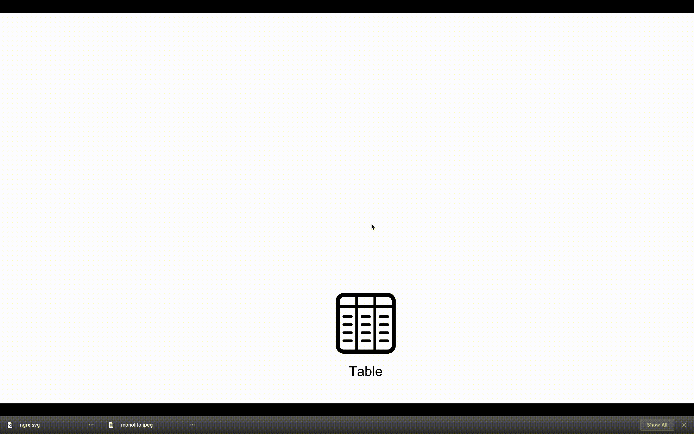
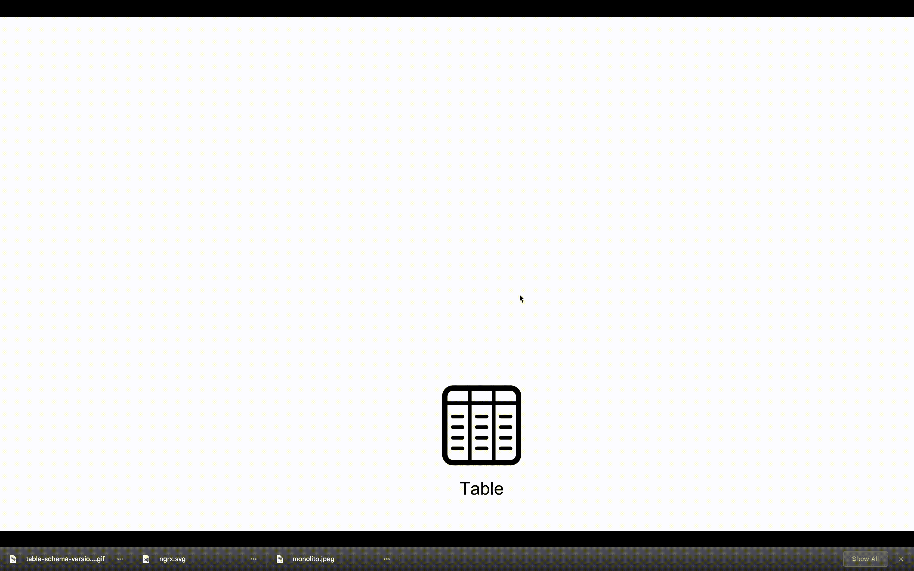
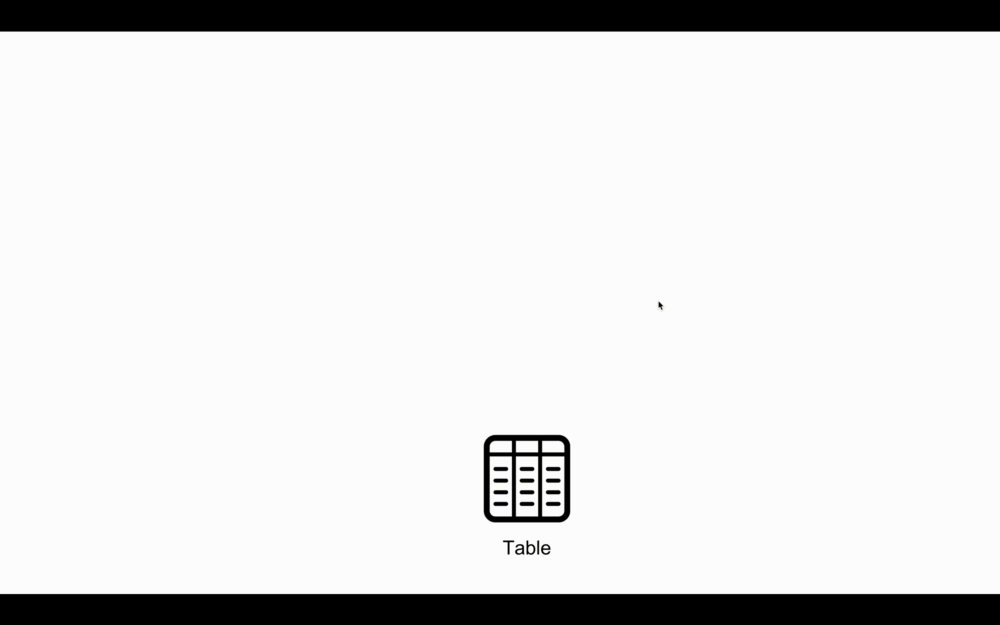
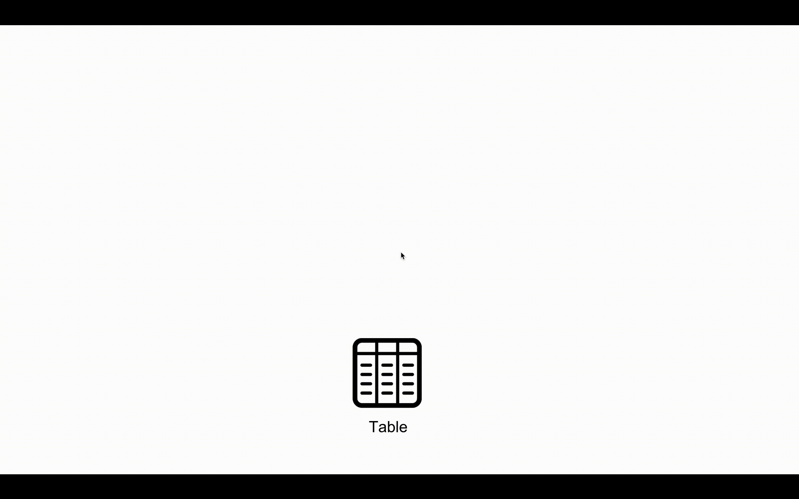
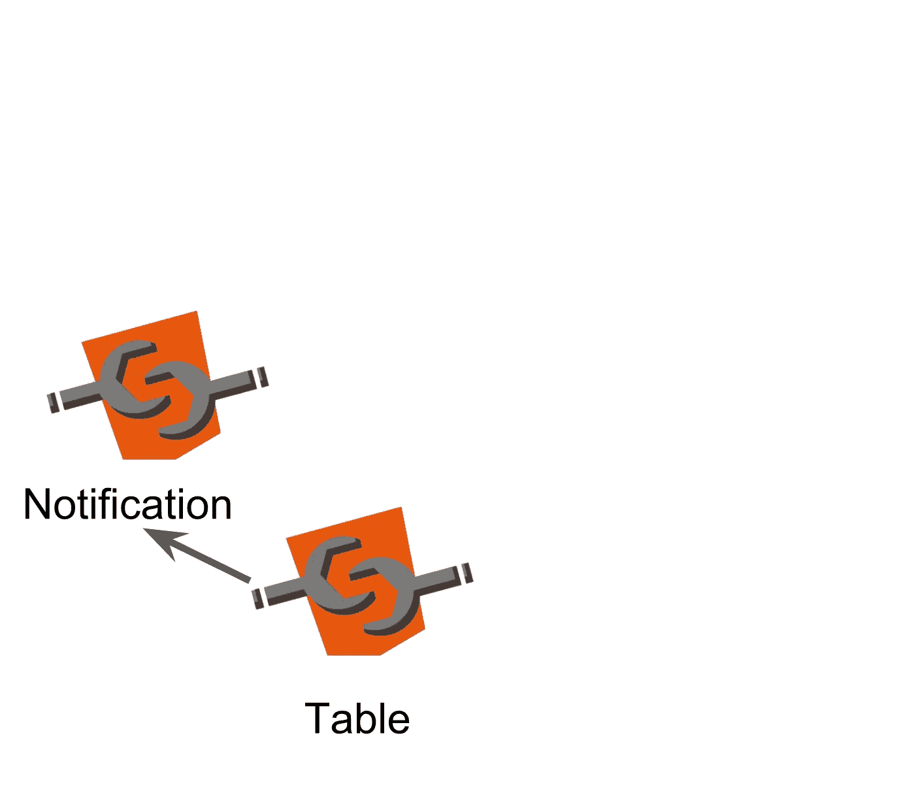
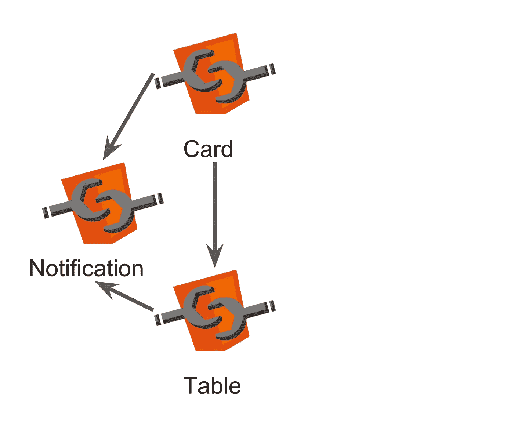
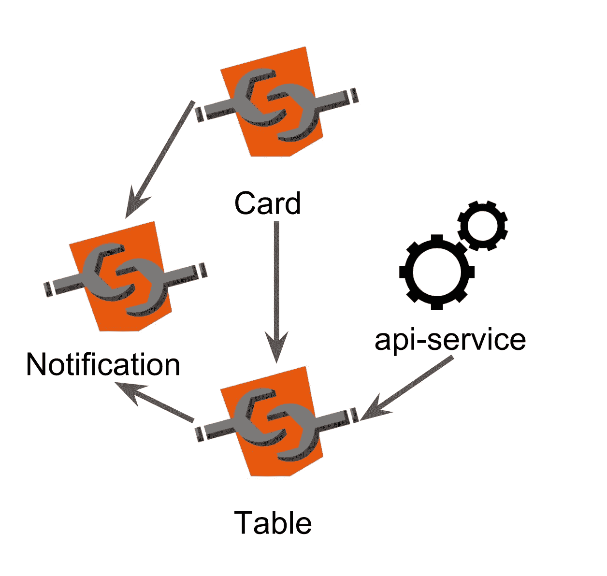
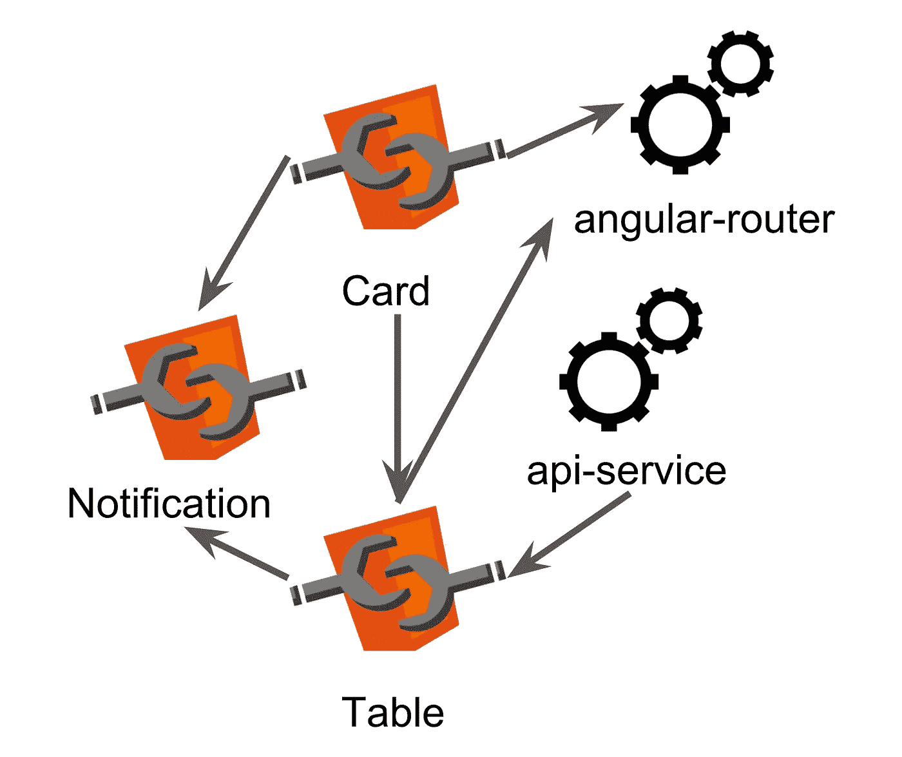

# 角度无功编程:无功分量(第 1 部分)

> 原文：<https://itnext.io/reactive-programming-in-angular-reactive-components-part-1-7291882e352c?source=collection_archive---------5----------------------->


## 这是关于 Angular 中反应式编程的第二篇文章。我在 Angular 开始分享我和 rxjs 的想法和经验的一系列文章。第一篇文章是 Angular 中的反应式编程:关于推送通信，你可以在下一个[链接](/reactive-programming-in-angular-on-push-communication-af44de553c18)中阅读

# 该表:

让我们想象一下，我们需要用 Angular 来编码一个表。非常简单的事情。我们有两个输入；一个用于配置，另一个用于数据。该表必须分页，所以它必须有一个按钮返回到第一页，一个按钮的前一页和两个以上的下一页和最后一页。选择改变表格的大小也很方便。

表格的元素必须是可选择的。如果用户单击表中的某一行，该表将返回所选项的索引。

另一个要求是使表尽可能可重用。一旦我们完成了这项工作，我们就不想再重复了。

或多或少像这样:

如你所见，没什么特别的。然而，让我们详细检查一下它是如何工作的，以确保每个人都在同一页上。

当用户单击其中一个分页按钮时，过程如下:

1.  从表中运行一个 newPage 事件(src/app/table/table . componet . ts 第 44 行)
2.  此事件运行主页中的方法 update table(src/app/home/home . component . html 第 4 行)
3.  方法 updateTable 在 ApiService 请求新页面，该页面返回一个新的可观察实例(src/app/home/home.component.ts 第 47 行)
4.  观察对象被异步管道订阅，从结果中，我们获取新的数据数组，作为表中的输入传递(src/app/home/home . component . html 第 3 行)
5.  该表获取新数据并更新视图



如果用户单击表格中的某一行，会发生以下情况:

1.  名为“选择”的输出事件从表开始(src/app/table/table . component . ts 第 51 行)
2.  前面的事件在主页上执行 goDetails 方法(src/app/home/home.component.html 第 5 行)
3.  goDeatils 方法获取点击数据的索引作为输入。导航到详细信息网页，并将索引放在 url 的末尾(src / home / home.component.ts 第 54 行)
4.  详细信息 web 页面调用 ApiService 来获取从 url 检索的索引所指向的信息(src/app/details/details . component . ts 第 19 行)
5.  ApiService 返回一个由异步管道订阅的可观察对象，以检索个人信息(src/app/details/details.component.html 第 5–7 行)



这个应用程序非常简单。易于阅读和理解。问题是软件有想增长的坏习惯。

# 软件总是想进化

您可能已经注意到，表格的示例非常简单，很可能在生产几天后，客户开始要求我们改进它。毫无疑问，他/她想要的新特性之一是对行进行排序。最后，表的标签将有另一个事件来获取用户点击订购的列:

```
*<my-table
[config]="config$ | async"
[data]="data$ | async"
(newPage)="updateTable($event)"
(selection)="goDetails($event)"* ***(sortRow)=”sort($event)”*** *></my-table>*
```

这是一个进步，但我们的桌子仍然太有限。另一个应该很常见的特征是，可以通过在表中拖放一个项目来添加新元素:

```
*<my-table
[config]="config$ | async"
[data]="data$ | async"
(newPage)="updateTable($event)"
(selection)="goDetails($event)"* ***(sortRow)=”sort($event)”
(drop)=”dropElement($event)”*** *></my-table>*
```

当然，如果我们可以从表中删除元素，我们应该允许它们被拖出:

```
*<my-table
[config]="config$ | async"
[data]="data$ | async"
(newPage)="updateTable($event)"
(selection)="goDetails($event)"* ***(sortRow)=”sort($event)”
(drop)=”dropElement($event)”
(drag)=”dragElement($event)”*** *></my-table>*
```

我不知道你是否意识到问题出在哪里。问题是，对于我们想要添加的每个新动作，我们必须创建一个新事件。这会影响组件本身(我们必须为事件创建新的函数)和放置组件的网页(组件必须创建一个函数在事件发生时执行)。最后，每次我们改进组件时，都必须对组件和所有使用组件的地方进行修改…这不太容易维护…

# 大约 NGRX。

我第一次尝试解决这个问题的时候，我想到了 redux 架构(如果你不知道 redux 架构是什么，你可以从[这篇 ng-book 博客文章](http://blog.ng-book.com/introduction-to-redux-with-typescript-and-angular-2/)中了解)。原因很简单；redux 中的所有动作都有相同的接口；动作类型和有效载荷。无论可以在组件上执行多少操作，界面总是相同的。Angular 中最流行的 redux 实现是 ngrx，所以…我们来试试。

如果你对 ngrx 一无所知，我建议你看一下[托德座右铭](https://www.youtube.com/channel/UCNtFk-g4CCmXMYL4pYNmoEA)的视频，看看他的[披萨应用](https://github.com/UltimateAngular/ngrx-store-effects-app)的例子。我作弊是因为我的一个最好的朋友，Andres Gesteira，是一个在 ngrx 项目中有丰富经验的开发人员。他解释了 ngrx 是如何工作的，我节省了很多阅读时间；).谢谢安德烈斯。

这是我们的 ngrx 版本的表格:

和以前一样，我将解释每次用户更改表格页面或单击其中一行时会发生什么。我建议您在另一个选项卡中打开 stackblitz 编辑器，以便遵循代码中的步骤。这个例子没有第一个容易。

当用户更改页面时，流程如下:

1-在表组件中运行输出事件 new page(src/table-list/component/table . component . ts 第 42 行)

2-此方法运行表容器的函数 request new page(src/table-list/container/table-container . component . html 第 4 行)

requestNewPage 分派一个名为 LoadRows 的新动作，该动作获取所请求的页面及其大小作为输入(src/table-list/container/table-container . component . ts 第 31 行)

4-调度被 reducerss 拦截，reducer 改变表的状态，将加载标志设置为 true。这只是表明我们正在运行一个异步任务，这可能需要一些时间(src/table-list/reducers/table-reducers . ts 第 25 行)

5-动作被桌子的效果抓住。他们运行 ApiService 来获取新页面(src/table-list/effects/table-effects . service . ts 第 22 行)

6-当我们从 ApiService 获得答案时，效果会调度其他动作，这一次是 LoadRowsSuccess，它获取新页面、页面的索引和表格最后一页的索引作为输入(src/table-list/effects/table-effects . service . ts 第 23 行)

7-这个新动作再次被 reducers 截获，并用新数据更新存储的状态(src/table-list/table-reducers . ts 第 42–46 行)

8-表格容器有一个可观察对象来观察表格状态的变化。它是使用一个选择器(src/table-list/selectors/table-selectors . ts 第 8 行)创建的，该选择器只检索带有表数据的存储的状态(src/table-list/containers/table-container . component . ts 第 24 行)

9-通过异步管道订阅可观察对象。每当表的状态改变时，值作为输入被传递给组件，视图被更新(src/table-list/containers/table-container . component . html 第 3 行)



当用户点击一行时，下一行发生:

1-从表中启动一个名为“选择”的输出事件(src/table-list/components/table . component . ts 第 49 行)

2-此事件运行容器的 getSelection 方法(src/table-list/container/table . container . html 第 5 行)

3- getSelection 调度一个名为 Navigate 的新动作，该动作获取细节网页的 url 和所选行的索引作为输入(src/table-list/container/table . container . ts 第 36 行)

4-前一个动作被路由器的效果拦截(是的，ngrx 正在包装 angular- router ),并且它运行到详细信息网站的导航。(src/app/store/effects/router-effects . service . ts 22 行)

5-细节网页具有在商店上发生变化时订阅的卡容器(src/card/containers/card-container . component . ts 行 19)

6-要获取所选行的信息，使用 getPerson 选择器。它是一个自定义选择器，用于获取表的最后状态和路由器的最后状态。路由器从状态中获取所选行的索引，并从表的状态中获取所选行。没有必要再次调用 ApiService，因为该行的信息已经在应用程序存储中，这是我们的真实来源(src/card/selectors/selector-card . ts 第 11 行)

7-卡容器的可观察对象由异步管道订阅，异步管道获取行的信息并将其作为输入传递给卡组件(src/card/container/card-container . component . html line 1)



很抱歉解释得这么无聊，但重要的是我们要理解这里发生了什么，看看 ngrx 是否真的解决了我们最初的问题。

# 反思:单片 vs 组件

在继续之前，我想思考一下编写整体应用程序或组件应用程序意味着什么。我愿意这样做是因为，很多时候，当我试图向某人解释他/她所做的是一个单片应用程序时，就好像我在质疑他/她母亲的荣誉。每个人都被冒犯了，技术上的争论变成了一场争斗……在公司的会议室里发现枪支并不常见，这真是一件幸事。因此，由于我的意图不是冒犯任何人，我邀请您冷静和平地思考一个非常简单的例子，单片应用程序到底意味着什么。

想象一下，你需要写一个函数把 4 和 6 相加。两种可能的解决方案是:

**解决方案 1:**

```
*function add () {
  let leng = arguments.length;
  let result = 0;
  for (let i = 0; i < leng; i++){
   result = result + arguments[i];
  }
  return result;
}*
```

**解** **2:**

```
*function add () {
  return 4 + 6;
}*
```

也许你们大多数人会选择第一种解决方案…也许你们大多数人不会考虑第二种解决方案的优势。首先，第二种解决方案易于测试和阅读，满足所有要求(只需将 4 和 6 相加)，并且性能优于第一种解决方案。然而，解决方案 2 创建了一个上下文。我想说的是，其他每一个使用方案 2 的函数，结果都只能等 10。需要另一个结果的函数不能与解决方案 2 一起工作，所以我们用值 10 链接我们所有的开发。如果将来我们的应用程序需要一个不是 10 的值，我们将不得不重构，然后我们将意识到我们的应用程序是单一的。

然而，尽管如此，解决方案 2 仍然比解决方案 1 更容易阅读，更容易测试，也更快。这是第一个伟大的真理；没有什么灵丹妙药，没有什么完美的解决方案。单片应用程序具有我们在解决方案 2 中指出的相同优势(如果它是用一点常识编码的话……)，是一个完美而有效的解决方案。然而，必须明确的是，未来它将不得不重构。

如果最终我们选择一个整体解决方案:

1.我们必须意识到我们正在编写一个单一的应用程序。

2.我们必须无所畏惧、无所懈怠地规划重构任务。

# 但是 NGRX 解决了我们最初的问题吗？

回到我们的主要问题，NGRX 似乎解决了我们应用程序的初始问题。主页使用表格的方式如下:

**home.component.html:**

```
*<table-container></table-container>*
```

**home.component.ts**

```
*import { Component } from '@angular/core';

@Component({
* *selector: 'my-home',
* *templateUrl: 'home.component.html'
})
export class HomeComponent {}*
```

因此，组件如何发展并不重要，因为与组件相关的一切都在组件内部，所以它的用途总是相同的。嗯，我不得不说，这只是表面上的真实。table 组件被依赖关系所包围，这些依赖关系导致它的发展导致了对其他组件的重构。我们面对的是一个单一的应用程序。

请这样看:表的作用是接收错误消息。错误的解决方案如何属于应用程序(想法是应用程序为其所有组件显示一致的外观)我们不能在表中创建错误处理的逻辑…我们必须创建其他组件(我们可以称为“通知”)来处理这一点。此时，我们的表和通知组件之间有很强的依赖性。如果我们改变表格发送错误动作的方式，通知将会受到影响。



现在让我们换到卡组件。卡的组件获得它的表的状态的信息，没有表，它不能工作的原因。这没多大关系，因为卡必须处理自己的错误状态，为此我们必须使用已经链接到表的通知组件。卡片的组件通过两侧与桌子相连。



因为请求中的数据也在表的组件内，所以数据的输入必须符合表的 API。这意味着 ApiService 方法必须将 back 的结果转换成表(只有表)能够理解的对象。



最后一个依赖项来自角度路由器，因为表需要发送导航事件，卡需要检索所选元素的索引。



正如你所看到的，我们必须在应用程序中有很多的依赖性，以考虑表中的变化不会有副作用。

# 虚拟组件不是组件

我们把只有一个模板的组件称为可视组件或虚拟组件，它的功能是促进用户对容器的操作。我的意思是看一下 src/table-list/components/table . component . ts 这个组件只是渲染模板，观察用户的交互。它不做任何其他事情。这样，table.component.ts 不依赖于应用程序的任何元素，完全可以重用。然而，打破应用程序的整体性是不够的。原因是这种类型的组件不太符合软件组件的定义。

基于组件的体系结构是由道格拉斯·麦克洛伊于 1968 年在德国的加米施首次提出的。他用 Unix 命令的例子来解释什么是软件组件。如果你看看 Unix 命令，像' ls '或' grep ',它们是完整的软件。我的意思是，每个 Unix 命令本身都有意义。你可以单独使用它们……或者你可以通过管道运营商将它们结合起来。这就是视觉组件所缺乏的。可视化组件本身不能执行任何任务。你能想象一个只有 table.component.ts 及其模板的网页吗？这很简单，它需要存储、选择器和缩减器来管理自己状态的数据，如果组件的这些部分创建了一个应用程序上下文，那么组件的概念就会被淡化，最终成为一个整体的应用程序。我再说一遍，如果我们清楚自己在做什么，这不一定是一件坏事。

# 下一集

有趣的是，当我开始写这篇文章时，我没有想到它会这么大，但事实就是如此。我还有很多事情要告诉你。当然，我实现了一个替代版本的表格应用程序，打破了整体。这个版本解决了我们的第一个问题，创建了一个基于组件的架构，但是也带来了 ngrx 没有的缺点。我想分享这些想法和更多，但今天已经足够了。我认为，通过这篇文章，我已经修改了关于这个月的争议范围。下个月我们将继续辩论。