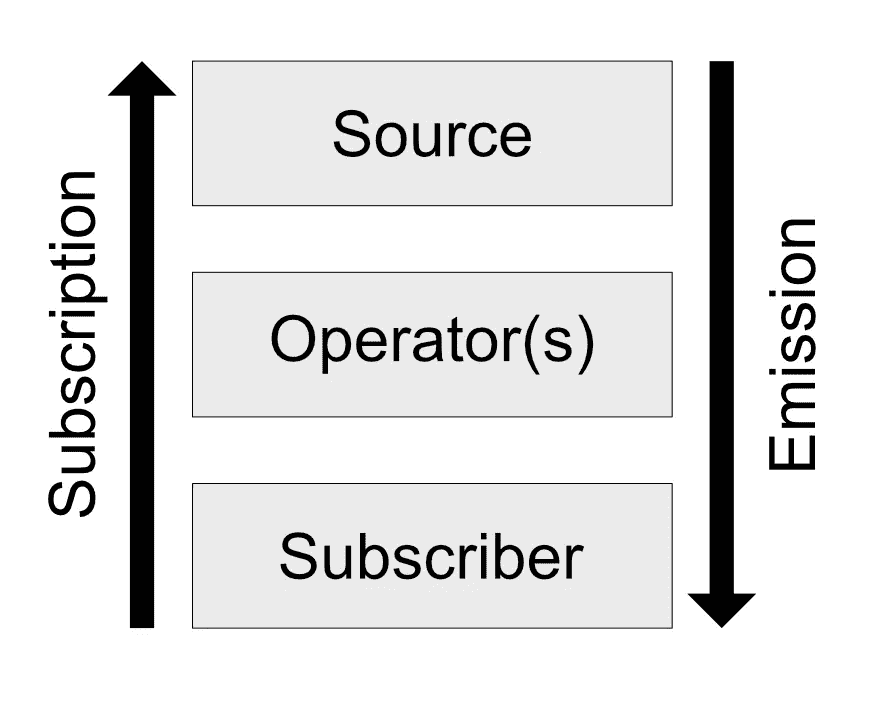

# 反应流只是函数

> 原文：<https://itnext.io/reactive-streams-are-just-functions-da3f2b60753d?source=collection_archive---------3----------------------->


反应流是一个很好的工具。它们允许我们轻松地编写高性能的异步代码。它们帮助我们关注如何处理数据，而不是如何处理数据。它们很容易理解。一开始是这样的。

我们大多数人一开始都把流想象成一系列随时间推移而产生的值。这个简单的模型足以订阅流，并对其应用 map 等基本操作符。但是，一旦我们需要添加更复杂的操作符，或者如果某些东西不像预期的那样工作，价值流的概念就不再有用了。

所以让我提出另一个心智模型，一个更关注流如何工作的模型:流只是函数。

一个小注意:我在我的例子中使用了 JavaScript，并尽量保持简单，这样即使没有 JavaScript 技能的开发人员也很容易理解。

# 源头

当你将一个操作符应用于一个可观察对象时，你创建了一个新的可观察对象，它的父对象是原来的可观察对象。源是没有父对象的可观察对象。它只发出值。

```
function source(subscriber) {
  subscriber(1);
  subscriber(2);
}
```

源函数需要一个回调(订户)并通过调用订户来发出值。我们也可以在一个数组上循环，而不是“手动”发出值。让我们订阅我们的“可观察”。

```
function subscriber(value) {
  console.log(value);
}source(subscriber);//Prints 1 and 2 in the console
```

您可能会反对这不允许异步流。我们开始吧:

```
function source(subscriber) {
  setTimeout(function() {
    subscriber(1);
  }, 1000); setTimeout(function() {
    subscriber(2);
  }, 3000);
}source(subscriber);//Prints 1 after 1 second and 2 after 3 seconds
```

setTimeout 函数在给定的时间段后调用订阅者。如果您尝试这样做，您会注意到这些值在几秒钟后发出。

# 接线员

操作符是一个简单的函数，它接受一个值并调用一个订阅者。

```
function operator(value, subscriber) {
  let newValue = "Value: " + value;
  subscriber(newValue);
}
```

运算符的秘密武器是它不返回新值，而是调用订阅者。这使得它非常强大。我们可以决定何时发出一个值(例如去抖)，发出多少个值(例如平面图)，或者是否发出任何值(例如过滤器)。

# 胶水

当然，我们不想直接调用算符而是将其应用于另一个可观察对象。因此，让我们创建一个管道函数:

```
function pipe(source, operator) { function newSource(subscriber) {
    function operatorSubscriber(value) {
      operator(value, subscriber);
    } return source(operatorSubscriber);
  } return newSource;
}
```

由于这些嵌套函数，这看起来有点复杂。让我们过一遍。我们从最里面的 operatorSubscriber 开始。源只接受订阅者，因此我们将操作符包装到另一个函数中。源可以调用 operatorSubscriber，operator subscriber 调用操作符，操作符又可以调用实际的订户。

当我们将一个操作符应用于一个流时，我们就创建了一个新的流。所以管道函数需要返回一个。我称它为 operatorSource(虽然它实际上不是一个源)。当有人“订阅”新源时，该请求通过调用 source 函数被传递给原始源。

我们的工作流程是这样的:

*   订户调用 operatorSource(它包装了操作符)
*   operatorSource 调用源
*   信源反复调用 operatorSubscriber
*   运营商用户反复呼叫用户

这基本上是一种请求/响应模式

# 订阅

我们已经成功订阅了该流，但我们还想取消订阅。让我们添加一个退订功能:

```
function source(subscriber) {
  subscriber(1); let id1 = setTimeout(function() {
             subscriber(2);
            }, 1000); let id2 = setTimeout(function() {
              subscriber(3);
            }, 3000); function unsubscribe() {
    clearTimeout(id1);
    clearTimeout(id2);
  } return unsubscribe;
}let unsubscribe = source(subscriber);
unsubscribe();
```

clearTimeout 取消 setTimeout。我们在订阅后立即调用 unsubscribe，因此我们不会得到异步值。但是我们确实得到了第一个值，因为它是在我们可以取消订阅之前发出的。

# 结论

一个完全成熟的实现需要比我们所介绍的多一点，但是我们已经为流提供了一些基本的构建块。我们已经知道，流基本上就是一系列的函数调用。嗯，实际上是两个系列:当我们订阅时，从订阅者到源，当发出值时，从源到订阅者。



现在我们也知道了为什么我们需要主动订阅一个流:我们需要调用源函数。

下一次一个流没有像预期的那样运行时，试着找出哪些函数被调用了，哪些没有被调用，以及为什么。