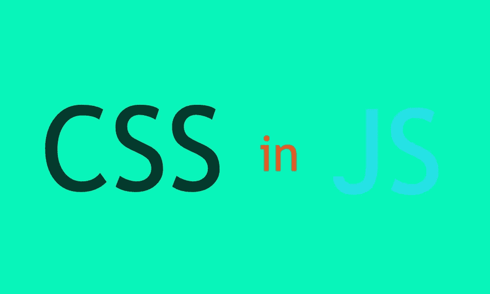

# react js——用于设计组件的情感

> 原文：<https://itnext.io/reactjs-emotion-for-styling-components-5c82e58910fe?source=collection_archive---------5----------------------->

## 情感主题和组件简介



> 创新是把两个已经存在的东西以一种新的方式组合在一起

从一开始，react 就一直在质疑前端 web 开发的传统理念。在 web 出现后不久，开发人员和思想工程师注意到有组织的代码可以提高生产率和减少错误。这带来了关注点分离的想法，将样式从 html 中分离出来，放在可以单独加载的样式表中。

我们在样式领域不断创新，增加了 SASS 和其他样式语言。

随着 react 的推出，facebook 决定 html 和 javascript 真的不应该分开。随之而来的问题是，我们是否真的应该分离造型。尤其是因为有太多的样式决定需要用 javascript 来做出。

## 为什么是情感？

本文将尝试给出一些事实，说明如何利用情绪来帮助决定情绪是否适合 react 项目。我使用 Emotion 大约有一年了，我发现用组件进行造型有很多好处。我将回顾情绪的基本关键特征，包括:

*   样式组件
*   主题
*   插入文字

## 装置

首先，我们需要确保我们有一个 react 项目设置。我不打算详细介绍这些步骤，因为本文假设您对如何在 react 中使用和编写代码有一个大致的了解。但作为参考，您可以[点击此处](https://reactjs.org/docs/create-a-new-react-app.html)开始遵循逐步指南。

为了开始使用情感，我们需要安装软件包

```
npm i @emotion/core
```

安装 emotion 核心包只是针对 react 的用户。我个人更喜欢使用带情感的风格化 api，所以我们也需要将情感/风格化包与核心一起安装。

```
npm i @emotion/styled
```

另一个要安装的情感包是主题化。

```
npm i emotion-theming
```

我们现在应该都准备好了。

## 主题

让我们从设置好主题开始。

这是我们将要使用的文件的一个例子。首先，我们将把我们的主题放在 App.js 里面。

好的，我们将开始创建一个新页面，作为我们的登录页面。我将创建一个名为 Pages 的新文件夹。以下文件:

```
Pages/Landing.jsx
theme.js
```

同样值得注意的是，我更喜欢把我的主题文件从应用程序中分离出来，这样更容易定位。在大多数情况下，我喜欢把我需要的所有东西放在同一个文件中，或者至少放在同一个文件夹中，这样我就不必到处寻找我需要的东西。

下面是我的 App.js now 的一个例子:

主题. js

我们现在可以在应用程序的任何地方访问我们的主题。

我们可以在样式组件中的任何地方访问主题，或者使用 withTheme。之后，主题只是传递给组件的另一个道具。

在样式化组件中:

```
const Header = styled.div(({theme}) => ({ color: theme.color }))
```

或者

```
const Headline = styled.h1`
  color: ${props => props.theme.color};
  font-family: sans-serif;
`
```

与主题一起使用:

```
class TellMeTheColor extends React.Component {
  render() {
    const { theme } = this.props;
    return <div>The color is { theme.color}.</div>
  }
}

const TellMeTheColorWithTheme = withTheme(TellMeTheColor)
```

这里不再讨论项目的具体细节，而是专门讨论组件的样式。

## 样式组件

实际上有两种方法可以设计情感中的组件。一种叫做字符串样式，另一种叫做对象样式。你真的可以使用任何一个，两个都支持。我个人更喜欢对象样式，因为我觉得它更像 javascripty。

下面是一个对象样式的例子:

如你所见，你可以传入道具。如果你使用主题，那么其中一个道具就是主题道具。

现在，您可以像使用任何其他组件一样使用该组件。

```
<Container paddingLeft={10} ></Container>
```

这些组件不包含任何业务逻辑，只包含样式所需的逻辑。

下面是一个使用 css api 的字符串样式示例:

```
const paragraph = css`
  padding: 10px;
  background-color: turquoise;
`;<div css={paragraph}>
 This is a paragraph
</div>
```

为了在组件上使用 css 属性，你必须做两件事。首先需要导入 jsx，其次需要在文件顶部添加一个 jsx pragma。您也不再需要导入 react。

```
*/** @jsx jsx **
import { jsx, css, } from '@emotion/core'
```

## 插入文字

字符串样式很酷的一点是，你可以用插值来覆盖不同的 css 属性。

这很好，因为你不再需要使用！重要的地方。

例子

现在你可以看到这个 div 将不再有青绿色的背景色。它现在应该是粉红色的。

你也可以将两个字符串样式合并成一个，并向 css 属性传递一个列表。

```
<div className="r-test" css={[bouncingTitle, paragraph]}>
     This should be bouncing
</div>
```

这将合并两种风格在一起。

## 结论

现在你有了一个以情感和主题化开始的项目，以及开始使用情感的基本知识。情感使得 css 的许多痛苦变得更容易处理。如果你有更多的问题，你可以访问情感网站[阅读更多](https://emotion.sh/docs/introduction)。

祝你好运！还有快乐编码！！！！