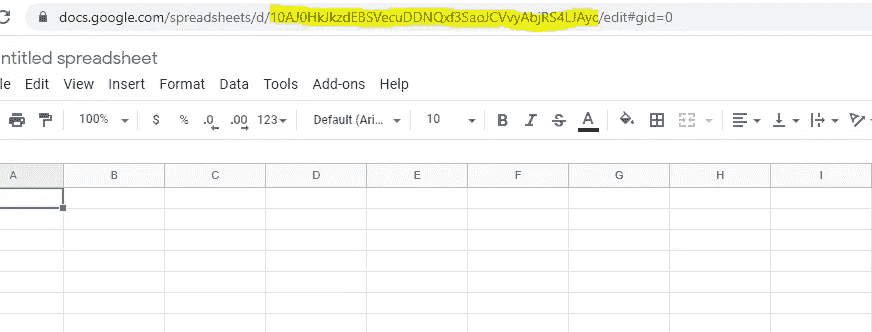
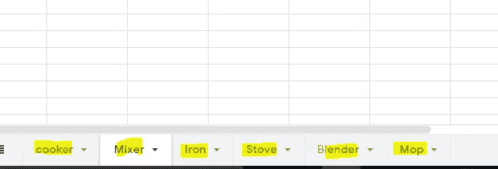
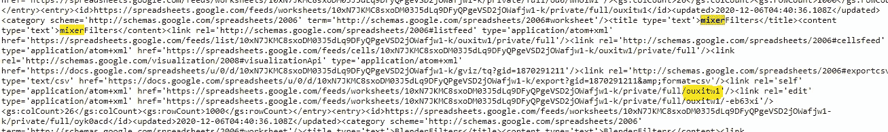
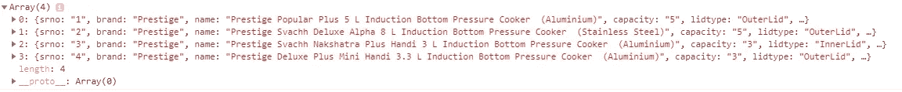
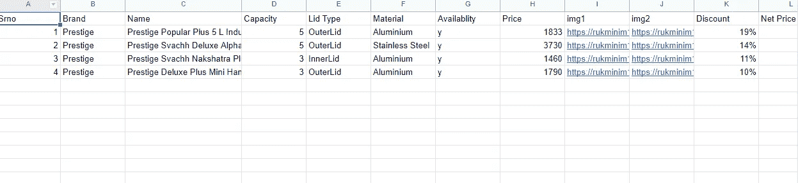
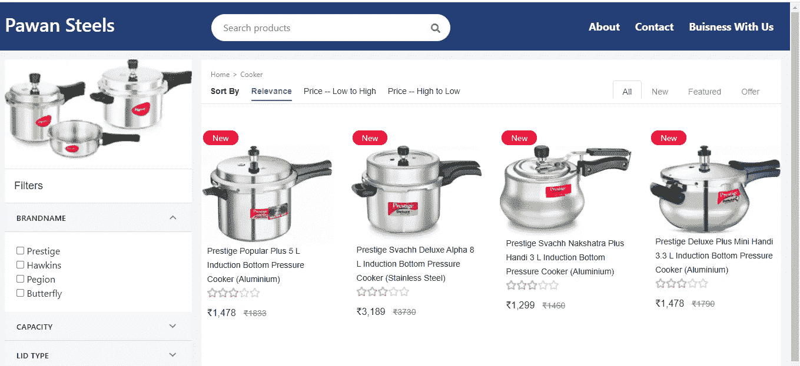

# 从谷歌电子表格中读取数据

> 原文：<https://itnext.io/read-data-from-google-spreadsheet-in-angular-209ee74b6cb4?source=collection_archive---------2----------------------->

**Github**:【https://github.com/mehulk05/MyShop 

【https://mehulk05.github.io/MyShop/#/】试玩链接:

**博客链接**:[https://blogs-by-mehul . blogspot . com/2020/12/read-data-from-Google-spread sheet-in . html](https://blogs-by-mehul.blogspot.com/2020/12/read-data-from-google-spreadsheet-in.html)

如果你曾经发现自己在问‘我如何用 JavaScript 访问 Google Sheet 电子表格？’，那么你可能不是一个人。你只需要在谷歌中输入“使用 javascript 读取谷歌表单数据”这样的话，你就会被这个难题的大量解决方案淹没。

问题是，以我的经验来看，它们要么非常复杂和夸张，要么很难启动和运行(例如，糟糕的文档)，要么它们在如何为您提供那些宝贵的结果方面有点过于规范。这就是为什么我借此机会写一个简单的解决方案

# 首先，这是否符合我的需求？

下面的博客只允许*阅读*公开发布的谷歌表单。如果您的需求如下，那么它可能非常适合您:

*   您可以公开发布您的 Google 表单
*   在单个工作表中有一个相对简单的数据集(多工作表是一个计划中的特性)
*   你只需要*读取*数据
*   您不需要访问由官方 Google Sheets API 提供的更高级的功能(如缓存或 OAuth)。
*   您想要一种简单、直接的方式来获取数据>用数据做事>庆祝！

## 第 1 步:创建 Google 工作表并保存

*   首先，我们将进入[谷歌电子表格](https://docs.google.com/spreadsheets/u/0/)并创建一个新的工作表。一旦您创建了一个工作表，您将在 URL 中获得一个特定工作表的唯一 id。将 id 复制到代码中需要它的地方。请查看下图，以便理解



## 步骤 2:发布电子表格

1.  单击文件>发布到 web
2.  选择“链接”选项卡
3.  选择“整个文档”或(更有可能)特定的工作表名称
4.  在下一个下拉列表中，选择“网页”或“CSV”。哪个并不重要
5.  展开底部的部分
6.  选中“进行更改时自动重新发布”旁边的框
7.  点击“发布”。

## 第三步:获取图纸编号

*   有时，一个文件中可以有多张图纸。请查看下图，以便理解。



*   因此，要获得我们想要的数据的工作表编号，请访问 URL[https://spreadsheets.google.com/feeds/worksheets/<您的工作表 id>/私有/完整](https://spreadsheets.google.com/feeds/worksheets/10xN7JKMC8sxoDM03J5dLq9DFyQPgeVSD2jOWafjw1-k/private/full)。这里的工作表 id 是我们在步骤 2 中创建新工作表时的 id。
*   一个 JSON 数据将会出现，我在下面的图片中展示了它。复制我为您生成的黄色编号，如下图所示。



## 创建一个角度项目

所以我在这里只是快速跳过一些步骤，假设你知道如何创建一个 angular 项目和创建服务和组件。

**床单服务文件**

```
public getCooker(): Observable<any> {const sheetno="o6isq5z"
     const sheetid = "1GLoPM2OKSGQPypZeBL3uCl4diAi4YXLye-LrXIx4jr4"
     const url = 
`https://spreadsheets.google.com/feeds/list/${sheetid}/${sheetno}/public/values?alt=json`;

        return this.http.get(url)
          .pipe(
            map((res: any) => {
              const data = res.feed.entry;

              const returnArray: Array<any> = [];
              if (data && data.length > 0) {
                data.forEach(entry => {
                  const obj = {};
                  for (const x in entry) {
                    if (x.includes('gsx$') && entry[x].$t) {
                      obj[x.split('$')[1]] = entry[x]['$t'];
                    }
                  }
                  returnArray.push(obj);
                });
              }
              return returnArray;
            })
          );
      }
```

**床单。Component.ts**

```
constructor(private csv: CsvParserService,private csvFilter:GetfilterFromCSVService) { }ngOnInit(): void {this.csv.getCooker().subscribe(res => {
      this.productData = res
      this.productDataFilter = res
      console.log(this.productData)
    })
}
```

所以你会得到类似 chrome 控制台的输出，如下图所示。



## 结论

*   这是一个简单而干净的解决方案，可以从一个包含多个工作表的电子表格文件中读取数据。
*   因此，这是一种快速的变通解决方案，在这种情况下，您不希望为小需求配置数据库。
*   一个很好的更简洁的方法，你可以动态地加载经常变化的数据(例如:电子商务网站，你的小商店的库存商品)
*   成本效益(无存储成本)，更快的访问(谷歌数据库更快)

**限制:**

*   我们只能从电子表格中读取数据。需要写一个单独的函数来修改或删除项目。
*   该文件需要公开发布(不适合敏感数据)。

## 我的应用程序使用这种方法的演示图像(电子商务网站)



**数据**



**我的演示应用**

## 也阅读

[](/authentication-using-jwt-in-mean-stack-6b425247b7d8) [## 在均值堆栈中使用 JWT 的认证

### 从头开始在一个平均堆栈应用程序中使用 JWT 进行身份验证

itnext.io](/authentication-using-jwt-in-mean-stack-6b425247b7d8) [](https://medium.com/javascript-in-plain-english/how-to-add-medium-blogs-on-your-react-app-a3898a729aad) [## 如何在 React 应用上添加中型博客

### 如何在 React 应用和其他网站上嵌入中型博客

medium.com](https://medium.com/javascript-in-plain-english/how-to-add-medium-blogs-on-your-react-app-a3898a729aad) [](https://codeburst.io/covoid-19-tracker-statistics-app-using-angular-2358347b3d1f) [## COVOID 19 跟踪器(统计)应用程序使用角度

### 现场演示:https://mehulk05.github.io/COVOID-19/

codeburst.io](https://codeburst.io/covoid-19-tracker-statistics-app-using-angular-2358347b3d1f) [](https://codeburst.io/blogging-app-using-angular-9-and-firebase-98e36168d850) [## 使用 Angular 9 和 Firebase 的博客应用程序等媒体

### 媒体博客应用程序完整演示

codeburst.io](https://codeburst.io/blogging-app-using-angular-9-and-firebase-98e36168d850)