# 用 Gatsby + GraphQL 从 JSON 文件中读取数据

> 原文：<https://itnext.io/reading-data-from-a-json-file-with-gatsby-graphql-572b18ab98a?source=collection_archive---------2----------------------->

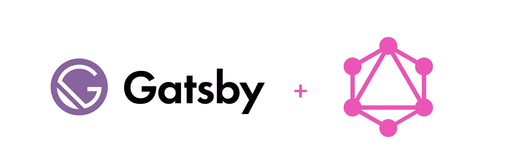

**目标:**使用`gatsby-transformer-json`从本地 JSON 文件中读取数据，并在 React 组件中动态生成列表项。

**用例:**我有一个侧边栏 React 组件，它接受侧边栏列表项(对象)的数组，并从它们的数据中动态生成列表项。我不想硬编码所有的侧边栏值，因为这会很快变得难以控制。因此，我希望有一个 JSON 文件，可以在其中快速添加新的列表项，并将其传播到 UI。

*本博客假设你已经有了一个* [*盖茨比*](https://www.gatsbyjs.org/) *项目创建。您可以使用 Gatsby CLI 快速启动新的应用程序。我的 sidebar.js 组件正在被导入到 index.js starter 文件中，该文件是在运行 CLI 命令后生成的。*

1.  创建存储 JSON 数据的目录和 JSON 文件。我的会住在`src/data/sidebarItems.json`里面。

我的 JSON 数据具有以下结构:

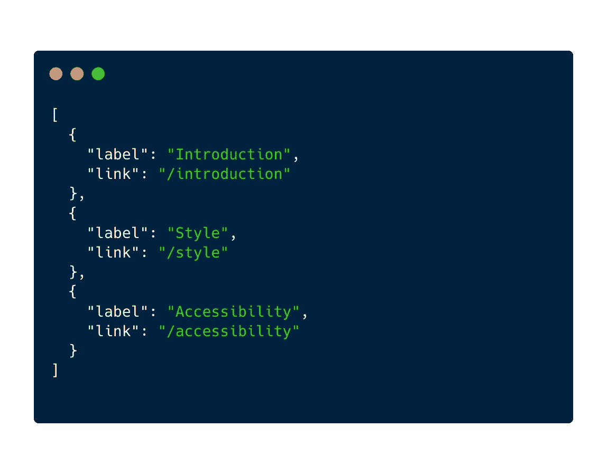

2.接下来，安装`gatsby-transformer-json`和`gatsby-source-filesystem`。

```
npm install gatsby-transformer-json gatsby-source-filesystem --save
```

3.在`gatsby-config.js`文件中，添加以下内容:

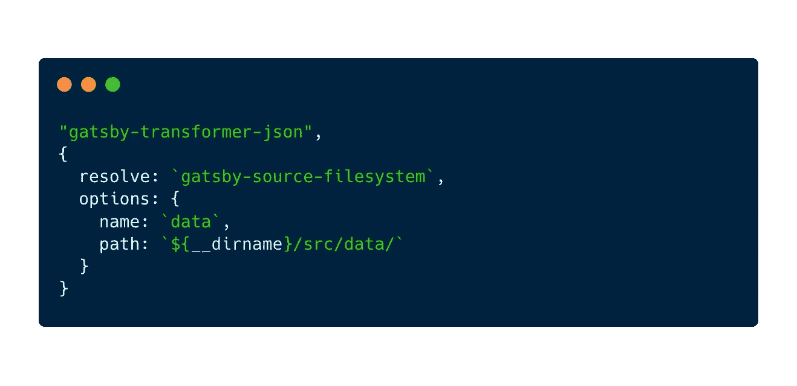

`path`值将链接到包含 JSON 文件的文件夹。

4.接下来，打开要使用数据的组件。我住在`sidebar.js`里面

首先从`gatsby`导入`StaticQuery`和`graphql`。我们需要这些来访问我们的 JSON 数据。

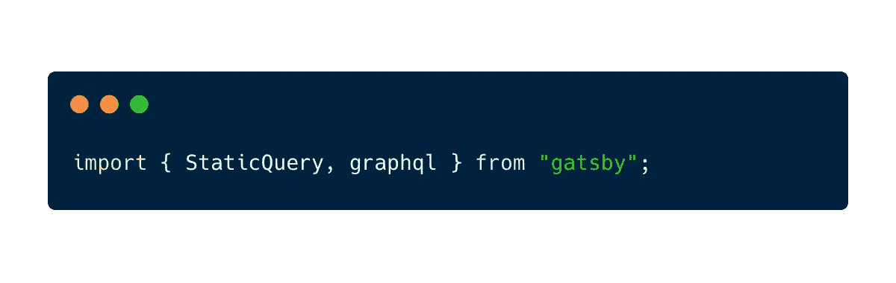

我们将使用 Gatsby 的[静态查询](https://www.gatsbyjs.org/docs/static-query/)来包装一个[无状态功能反应组件](/react-component-class-vs-stateless-component-e3797c7d23ab)。

在`<StaticQuery />`元素内部，添加两个属性:`query`和`render`。

# 查询属性

查询属性的值如下所示:

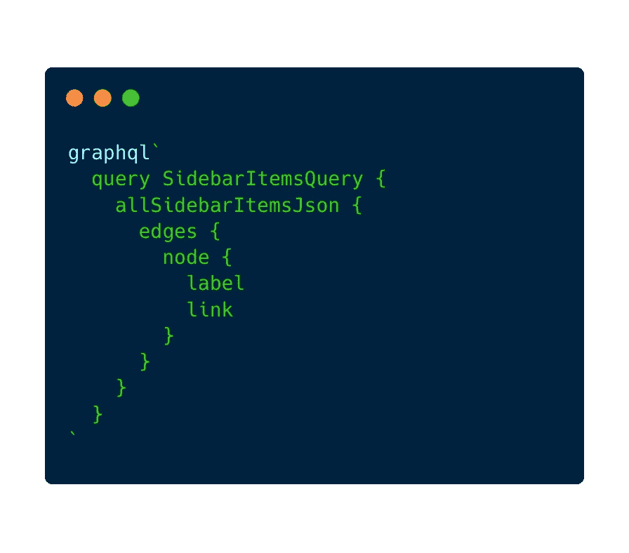

我们正在创建一个名为`SidebarItemsQuery`的查询(您可以随意命名该查询；我选择命名为`{dataReturned}Query`。返回的数据将是侧栏条目，因此查询名称将是`SidebarItemsQuery`。

接下来我们有`allSidebarItemsJson`。您必须根据您的 JSON 文件名来命名它。自从我有了`SidebarItems.json`，这就叫做`allSidebarItemsJson`。这是默认的命名约定，但是您可以在`gatsby-config.js`中更改它(更多细节请参见最后的“更改默认的 gatsby-transformer-json 命名约定”一节)。

其中有`edges`、`node`，以及我们希望从查询中返回的值。在我的例子中，由于我创建了一个侧边栏，其中有一列指向不同内容的链接，所以我有一个`label`和一个`link`(参见下面的“GraphQL 命名法”一节，了解边和节点的高级定义)。

# 渲染属性

现在我们有了查询，让我们定义呈现属性。该属性将接受一个参数:来自我们刚刚编写的查询的数据。它将返回我们希望无状态功能组件呈现的 JSX。

*注意:您可以将 JSX 放在空括号中`< > … < / >`作为* [*React 片段*](https://reactjs.org/docs/fragments.html) *的简写。这允许您返回多个子组件，而无需向 DOM 追加额外的节点。*

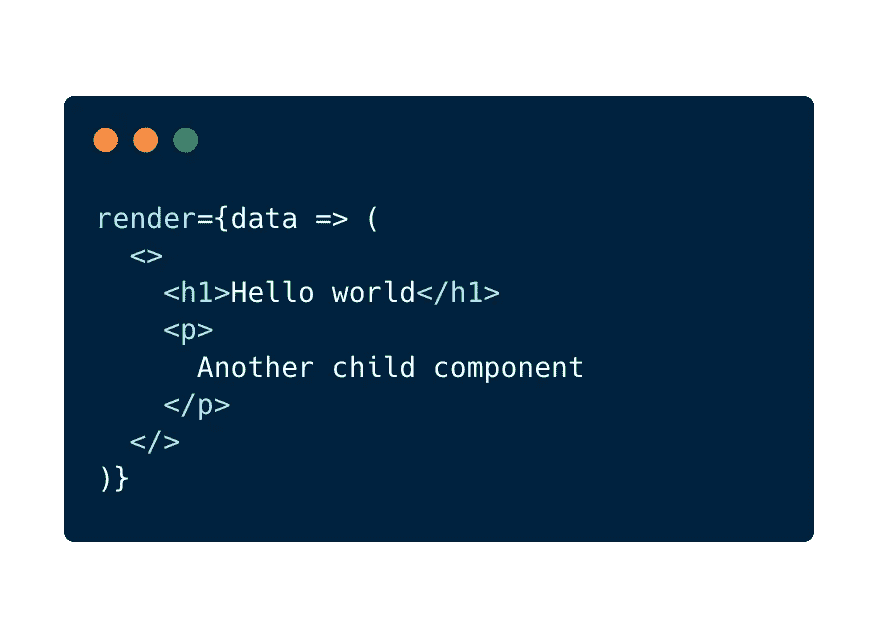

这和写这个是一样的:

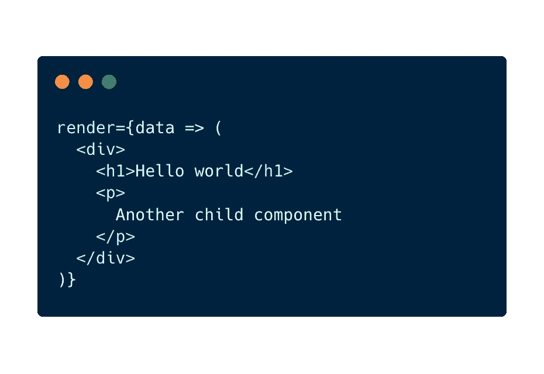

现在，我想迭代这些节点，并为每个标签创建一个`<h1>`；它可能看起来像这样。我创建了一个`getSidebarLabels`助手函数，它接收数据并对其进行迭代以创建三个`<li>`项。

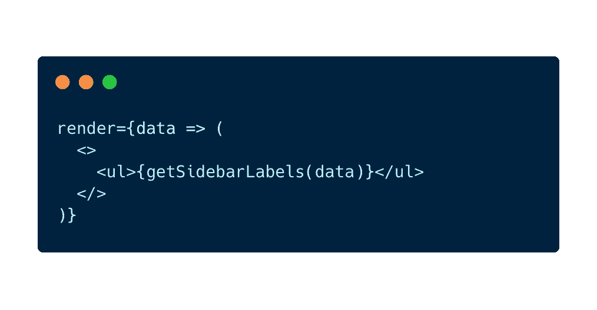

助手功能如下:

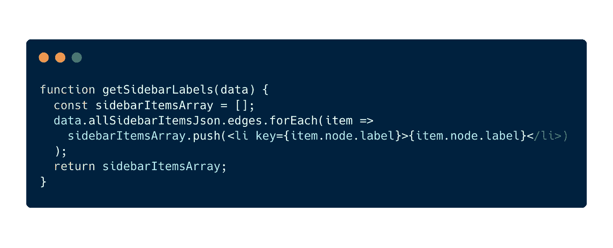

正如我们所料，DOM 中添加了三个列表项。

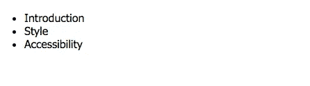

这里是`sidebar.js`中无状态功能组件的完整代码。

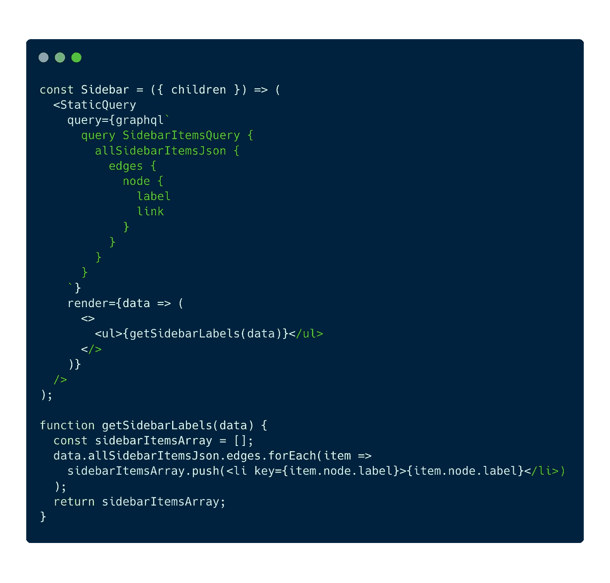

# 图表命名法

GraphQL 使用图形来表示数据。你可以把它想象成这样:

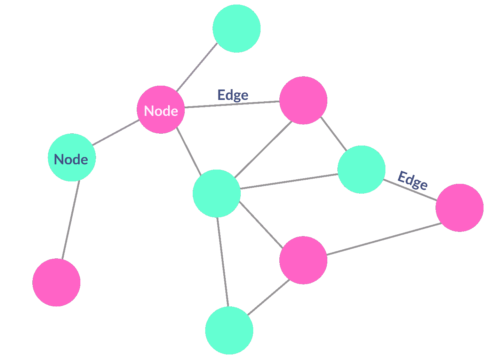

**边:**连接图中不同节点的线，表示一种关系。

**节点:**记录或数据。

让我们举一个像 Medium 这样的博客网站的例子。在这个用例中，节点可以被认为是博客文章或用户。

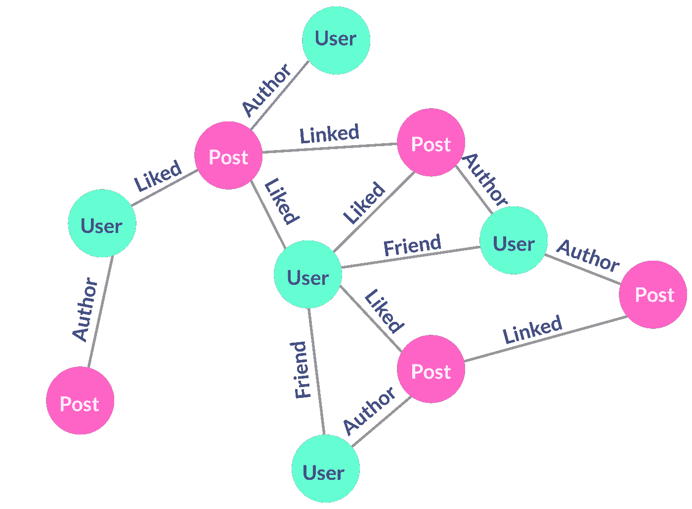

我不是 GraphQL 方面的专家；我还在学！如果我说错了什么，请在下面留下你的评论。

# 更改默认的 gatsby-transformer-json 命名约定

要更改 JSON 查询，请转到`gatsby-config.js`，用下面的对象替换`"gatsby-transformer-json"`行。

在选项对象内部，更新`typeName`键；这可以是任何字符串值。在这里，我们放入了静态值`Json`，尽管需要注意的是这只是一个字符串值，所以如果你愿意，你可以称它为`Cats`。

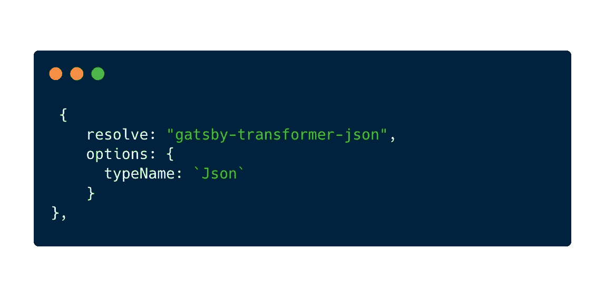

现在，在我们创建 GraphQL 查询的文件内部(在我的例子中是`sidebar.js`，用`all{typeName}`引用查询中新命名的 typeName 值。

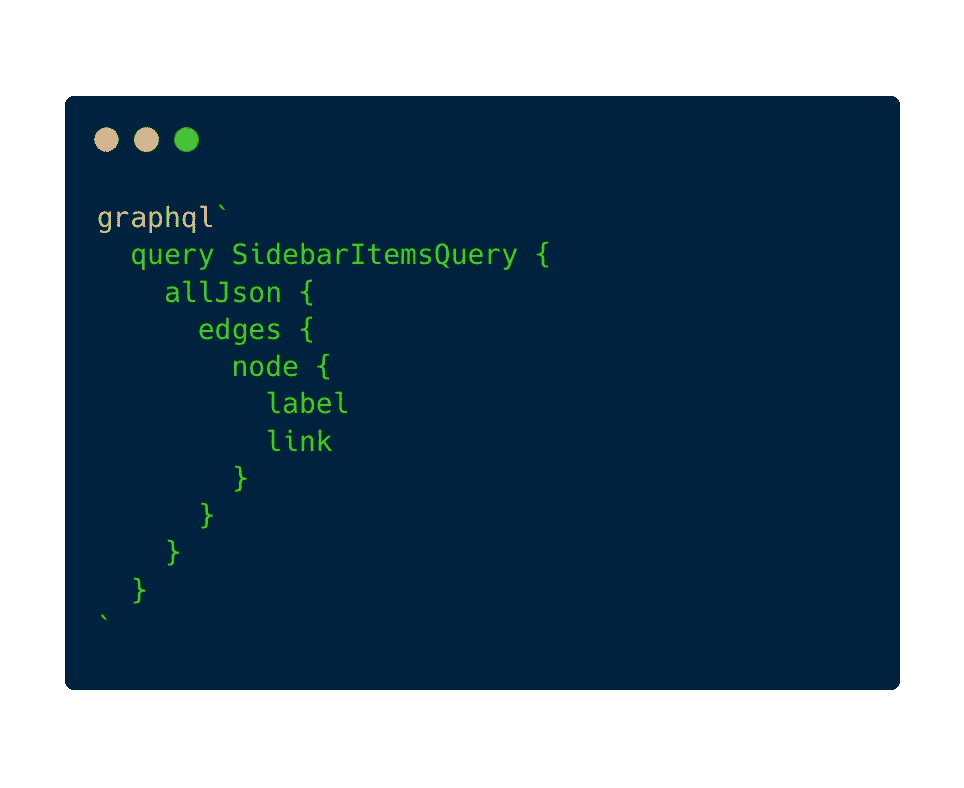

现在您知道了如何使用 gatsby-transformer-json 从本地 json 文件中读取数据。我写这篇博文主要是为了我自己的利益(我以后可能需要引用它)，所以可能会有一些小错误。如果你发现了什么，请在下面的评论中告诉我。:)