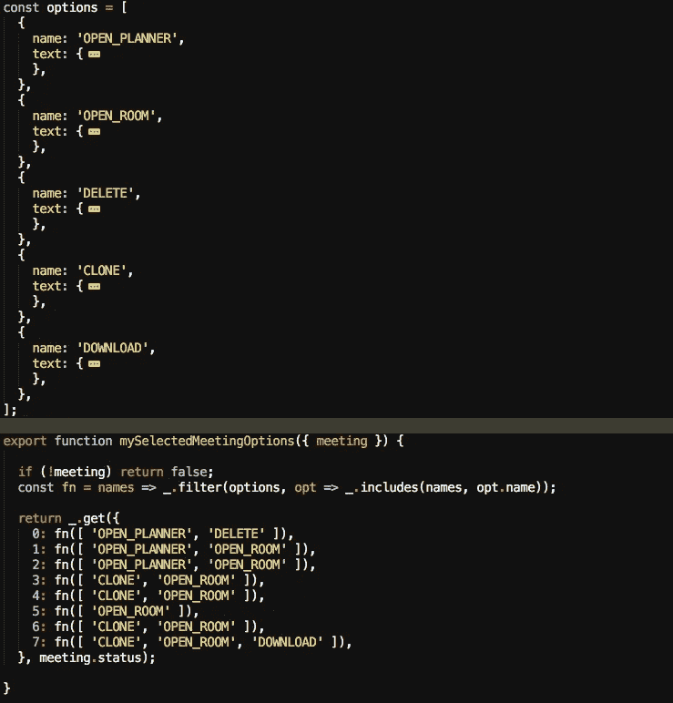

# “真正的商店”是:本地商店(第 2 部分，共 3 部分)

> 原文：<https://itnext.io/real-storeis-local-stores-part-2-of-3-b9628e830e08?source=collection_archive---------2----------------------->

## MobX 将定义存储在现实应用中

> 这篇文章展示了[timefic.com](https://www.timefic.com)的“状态管理”方面，这意味着我们在这里不是在谈论 React 组件，渲染到 dom 或处理用户事件。它将讲述如何组织数据(状态)以及如何对基于 3 种或 3 类商店的任何应用进行建模:

*   **实用商店**:对应用程序(很可能是你现在正在构建的应用程序)来说是“架构性的”商店，因此它们可以被你的“大图”中定义的所有模块或服务使用。[见此文](/real-storeis-utility-stores-part-1-of-3-1277a0d76720)。
*   **本地存储**:本地持久化或者根本不持久化的存储。它们保存临时数据，但对用户的客户端体验至关重要。
*   **域存储**:与特定域或服务相关的存储，业务规则位于其中。

所以，在本文中，我们将着眼于 ***本地商店*** ！但是首先，让我们定义什么时候有必要拥有它们。

照片由[丹尼尔·曾](https://unsplash.com/@daniel840528?utm_source=medium&utm_medium=referral)在 [Unsplash](https://unsplash.com?utm_source=medium&utm_medium=referral) 上拍摄

## **如何知道一段数据是否应该在自己的存储中？**

虽然我们还没有看到域存储，但是很明显这些存储是必要的:*您的数据库中有一个表，需要在客户端访问它的数据？*然后你定义一家店。这是一对一的关系。比如:‘agreements’(MongoDB 中的表)在客户端会有‘agreements store’。

但是，本地商店在你的后端没有桌子，那么如何知道他们什么时候需要呢？

*   **UI 状态管理**:你的 UI 没有一次全部显示出来。有隐藏的菜单，弹出窗口，标签。有元素列表，您选择了一个。对于所有这些数据，最好有一个存储(并且只有一个),并且能够从您的 UI 和其他存储中访问它。
*   实用商店的实例:我们在本文第一部分看到的通用商店需要实例化。例如，您将使用您正在开发的特定模块所需的定义(警报)在本地定义一个*alertstore*。
*   **跨域业务规则**:业务规则遍布店铺。每个商店都可以像*协议商店*或*评论商店*一样有自己的规则。但是，在某些情况下，有些规则会跨越特定商店的界限，并在您的应用程序中扮演相关角色。例如，在 timefic 中，有一个 *ChecklistStore* 保存召开会议的规则，如会议日期的最小预期、有时间的议程和目的等。
*   UI 复杂性封装:有时你需要定义一个“整体商店”来隐藏组件的复杂性。例如，在 timefic 中，有一个 *SyslidesStore* (系统生成的幻灯片)，需要在满足某些条件时显示，比如需要投票的新协议，或者当前主题的时间到了。

Dashboard 应用程序中控制商店的片段。

## 一些具体的用例

本地商店可能有很多可能的使用案例，所以我给你一个我正在使用的例子:

*   **State** :一个存储简单值(通常是布尔值和字符串)的商店，这些值在你的应用程序中必不可少。就像 React 状态处于组件级别一样，这也是应用程序级别的状态。“真理的唯一来源”。
*   **Alerts** :这里存储元数据(需要的警报类型的定义)、实际数据(生成的警报)以及添加或删除它们的方法。这是一家本地商店，因为在这里你不会碰到你的后端。
*   **时钟**:本地商店，每隔 *X* *秒*与你后端的时钟同步，负责向你基于时间的业务规则和其他对该数据感兴趣的商店通知当前时间。
*   **Streams** :保存来自外部来源的值的存储，如 *api* 或流服务。例如，当用户在聊天中键入内容时，其他用户会看到通知。您可以在此发布和订阅此通知。
*   **系统幻灯片**:“系统幻灯片”或系统生成的幻灯片的缩写。这个存储库从域存储库和*时钟存储库*的子集获取输入，以创建一些 React 组件将知道的事件。这种复杂性被封装在这里，以避免复杂的组件。
*   **控件**:本地存储，也是为了封装 UI 复杂度。在这种情况下，会议有一个侧边栏菜单，显示您可以执行的一些操作:打开会议室、打开会议规划器、下载 PDF 格式的会议记录、删除会议等。这些选项取决于会议状态、会议中的用户角色和帐户状态。所以这个逻辑在这里比直接在 UI 中更好。
*   **授权**:与上面的商店类似，在这种情况下，有一个多步骤流程，用户可以使用(或不可以使用)选项，这取决于会议状态、用户角色、时钟等。
*   **清单**:与上面类似的另一种情况，在这种情况下，这是 100%的业务规则，允许或拒绝用户发送邀请、确认会议或发送更新。

> 我认为这篇文章可能非常具体地针对我在 meetings 应用程序中发现的用例，但它可能会帮助你思考你的用例，并找到与我的用例的一些相似之处。

本文的下一部分，也是最后一部分，我们将关注**域存储**，或者保存应用程序主要数据的存储，正因为如此，它们被保存在你的后端。