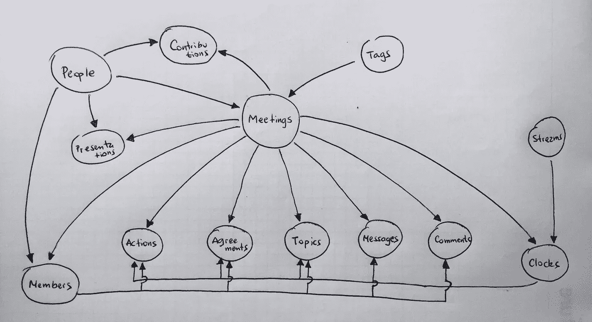

# “真实商店”是:域商店(第 3 部分，共 3 部分)

> 原文：<https://itnext.io/real-storeis-local-stores-part-3-of-3-638393e43336?source=collection_archive---------4----------------------->

## MobX 将定义存储在现实应用中

> 这篇文章展示了[timefic.com](https://www.timefic.com)的“状态管理”方面，这意味着我们在这里不是在谈论 React 组件，渲染到 dom 或处理用户事件。它将讲述如何组织数据(状态)以及如何对基于 3 种或 3 类商店的任何应用进行建模:

*   **实用商店**:对应用程序(很可能是你现在正在构建的应用程序)来说是“架构性的”商店，因此它们可以被你的“大图”中定义的所有模块或服务使用。[见此文](/real-storeis-utility-stores-part-1-of-3-1277a0d76720)。
*   **本地存储**:本地持久化或者根本不持久化的存储。它们保存临时数据，但对用户的客户端体验至关重要。[看到这里的文章](/real-storeis-local-stores-part-2-of-3-b9628e830e08)。
*   **域存储**:与特定的域或服务相关的存储，业务规则位于其中。

所以，在本文中，我们将着眼于 ***域商店*** ！

在你继续阅读之前，一个警告: ***这篇文章不是关于任何通用的或者架构的概念，也不是具体的编码例子*** 。它的目标是展示一个真实的案例，商店是如何被定义来解决“会议问题”的，因为我认为你可以找到一些与你正在做的工作相似的地方。

我想指出的是:

> 真实世界的例子在你的大脑中找到了更好的固定位置。

所以，没有 ***foo/bar*** 会出现在这个帖子里， ***没有熊*** 的列表或者任何通用的例子。你会发现会议应用程序的真正成分！

域存储关系，不允许循环依赖！

## PeopleStore

该存储将保存参与会议的用户的数据。基础数据(存储在数据库中的数据)将仅在客户端使用数据进行丰富，例如:

*   **UserPicURL** :用户激活的图片的 URL。
*   **IsContact** :如果用户是我的用户的联系人。
*   **IsActive** :如果用户账号激活。

此外，为了方便起见，将在商店内创建一个字段 ***myUser*** ，其中包含当前连接的用户。

> 请注意，存储中的所有数据都可以直接在组件中访问。没错，但是把它放在商店里的想法是因为**它简化了 React 组件内部的使用，也允许更好的可测试性**。

## TagsStore

在 timefic 中，**标签用于为会议**提供一个结构，比如会议所属的项目或区域。因此，这个存储非常简单，但是，因为 timefic 中有两级标记(项目/主题或区域/子区域)，所以这个存储实际上也起到了“扁平化”层次结构的作用，结果是将父区域名称附加到子区域的记录。

会议。照片由 [rawpixel](https://unsplash.com/@rawpixel?utm_source=medium&utm_medium=referral) 在 [Unsplash](https://unsplash.com?utm_source=medium&utm_medium=referral) 上拍摄

## 会议商店

模块的主存储(实际上模块有相同的名字)，也是整个应用程序的主集合。

当你开始对应用程序建模时，“所有的东西都在这个集合中”，直到你认识到一些数据有自己的实体，你决定把它们从这个存储中分离出来，比如动作、协议和评论。

因此，这个商店必须保持简单，成为你的应用程序的骨架，并保存这种数据:

*   **标签**:我们附加了*标签*(会议的*主题*)和*父标签*(拥有该主题的*项目*)的名称和 *id* ，因此我们可以在稍后的 UI 中显示这两个名称。
*   **LogoURL** :稍后将在会议记录中显示的标志
*   **日期时间范围**:表示会议开始和结束日期的计算字段:开始日期*加上持续时间*。

## 贡献存储

发言是文本形式的笔记，与会者可以将其发送给会议秘书，以包含在会议记录中。当*与会者*发布其投稿时，*秘书*会收到一个通知，上面有投稿人的姓名和照片。因此，我们从 *PeopleStore* 中获取信息并附加到贡献内容中，以便以后使用:

*   **投稿人** : *投稿人姓名*、*照片及姓名首字母*。
*   **OwnContributions** :对会议投稿的过滤，仅显示由我的用户创建且尚未发布的投稿(仍可修改)。
*   **ReceivedContributions** :对会议投稿的过滤，仅显示发送给我的用户且尚未使用的投稿(一旦发布，它们将被过滤出此集合)。

演示文稿。 [Teemu Paananen](https://unsplash.com/@xteemu?utm_source=medium&utm_medium=referral) 在 [Unsplash](https://unsplash.com?utm_source=medium&utm_medium=referral) 上的照片

## 演示商店

每个与会者在会议中可以有零个或一个演示文稿。当*组织者*在议程上创建一个项目时，他可以将*与会者*定义为该主题的演示者，因此会议可以以各种演示结束。

*   演示文稿的主要元素是 ***幻灯片*** 字段，这是一个项目数组，其中每个项目都有一些属性，这些属性以 URL 结尾，将用于显示该幻灯片。

例如，一个图像将显示在一个 *img* 标签中，但是一个 Google 或 Office 文档将在一个 *iframe* 中结束，其 URL 还包括用于显示该内容的服务。

## 会员商店

成员混合来自人们和会议的信息，以拥有“每个人的会议观点”。例如，以下字段附加到每个人，并在以后的业务规则和 ui 元素中使用:

*   *_id、姓名、电子邮件、姓名首字母、activePic、isRegistered、颜色、角色、isMe、askedTheFloorCount、hasAskedTheFloor、isChatOn、isMicOn、isVideoOn、isOnline、score、token、isPresenter、isSecretary、peerUID。*

这是应用程序的中央存储，也用于定义集合或元素子集:

*   *活动演示者、活动屏幕共享者、所有活动成员、我和组织者。*

钟表店。[特里斯坦·科朗吉罗](https://unsplash.com/@tcrawlers?utm_source=medium&utm_medium=referral)在 [Unsplash](https://unsplash.com?utm_source=medium&utm_medium=referral) 举办的“怀表灰度摄影”

## 钟表店

在 timefic 中，为了使会议富有成效，时钟起着核心作用。因此，会议必须准时开始，每个主题也必须准时开始和结束，并且有时间在会议结束后结束会议(并将会议记录发送给参与者)。

该规则基于来自 *MeetingsStore* 的某些配置，并在其他商店内部使用以增强其业务规则(如 ActionsStore、AgreementsStore 和 TopicsStore)

在时钟的每一秒或“滴答”之后，创建并重新评估以下字段:

*   **SecondsToStart** ，持续会议开始的秒数。
*   **SecondsToSuspend** :开始的时间到了，我们不会再等超过*这*秒了…
*   **第二秒**，即会议开始后的总秒数。
*   **SecondsToFinish** ，持续会议结束的秒数。
*   **SecondsToSecretaryClose** ，即秘书向组织者提交会议记录所剩的秒数。
*   **SecondsToClose** ，即组织者关闭会议并发送会议记录所剩的秒数。

## TopicsStore

应用程序中的另一个中央存储。一个主题就像一个“迷你会议”，因为它定义了开始的时间、持续的总时间、注释等等。

这里有一些属于这个商店的元素，我们将只提到它们，至少对于这篇文章来说是这样的:

*   **UI 相关** : myTopics，myActiveTopic，newTopicObject，myMeetingAgenda，myTopicsChatSelector，
*   **时间相关**:secondsreiminginactivetopic、secondsElapsedInActiveTopic、activeTopicProgress、extendedSecondsConsumed 和 meetingAgendaTimer。

结果。 [rawpixel](https://unsplash.com/@rawpixel?utm_source=medium&utm_medium=referral) 在 [Unsplash](https://unsplash.com?utm_source=medium&utm_medium=referral) 上“一个人在膝上的笔记本上起草营销活动计划”

## ActionsStore、AgreementsStore、CommentsStore 和 MessagesStore

这种存储(加上*主题存储*中的注释)是“结果存储”或存储用户在会议期间生成的信息的存储，这些信息将在会议结束后以会议记录或另一种数字形式提供。

它们在概念上相似，但拥有不同的数据和业务规则。我无意详细介绍这家商店，但这里有一些他们拥有的字段:

*   ***actions store****:my actions，newActionObject，mySelectedAction，mySelectablePeople，mySelectableDays，mySelectableHours，myAssignedActions。*
*   ***协议存储*** *: myAgreements，newAgreementObject，myAgreementsDisplayedInForm，mySelectedAgreement，myOpenedAgreement，secondsRemainingInAgreement。*
*   ***comments store****:myComments，my comments，attendeesComments，unreadedCommentsCount。*
*   ***messages store****:my messages，myActiveTopicMessages，unreadedMessagesCount。*

# 最后的话

当你设计商场时，你希望它们是:

*   **结构相似**，虽然它们持有不同的数据，但定义商店的所有原语保持不变:您将拥有原语(可观察)值、派生(计算)值、修改可观察值的动作和捕捉事件的反应，这些也需要反映在商店的数据中。
*   **语义分离**，尽可能避免混合域。一个纯域应该代表你的模型中的一个实体(比如动作、协议、评论等等。)或数据进入的某个渠道(如时钟和警报)或需要混合概念以表示业务规则的复合存储。
*   **被原子分割**，或者被分割成“不能再分割”的部分，所以你被迫给这个部分起一个名字，然后，让其他人(其他商店)明白每个元素的用途。

我希望这篇文章和这个系列能够帮助那些试图为改善我们生活的下一个应用程序建模的人！

来自智利🇨🇱的欢呼！