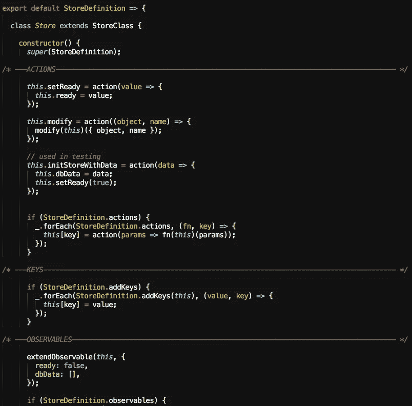
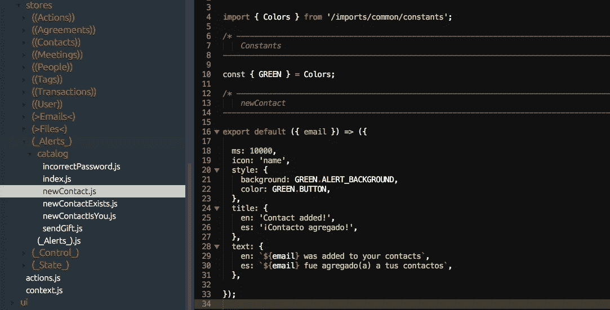
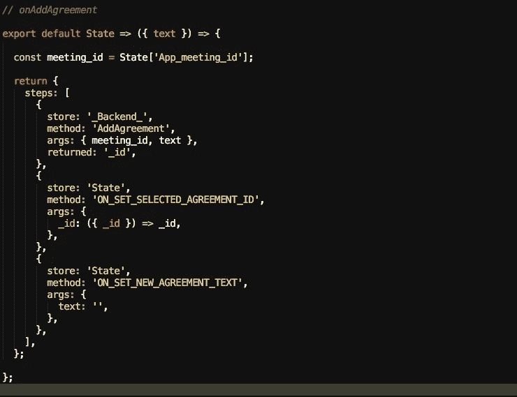
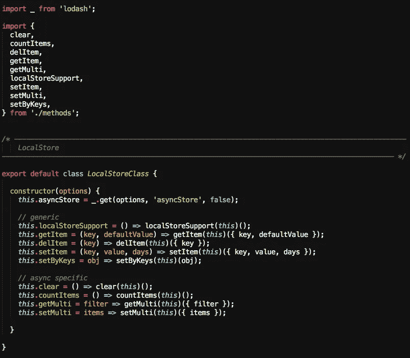

# “真正的商店”是:实用商店(第 1 部分，共 3 部分)

> 原文：<https://itnext.io/real-storeis-utility-stores-part-1-of-3-1277a0d76720?source=collection_archive---------5----------------------->

## MobX 将定义存储在现实应用中

> 这篇文章展示了[timefic.com](https://www.timefic.com)的“状态管理”方面，这意味着我们在这里不是在谈论 React 组件，渲染到 dom 或处理用户事件。它将讲述如何组织数据(状态)以及如何对基于 3 种或 3 类商店的任何应用进行建模:

*   **实用商店**:对应用程序(很可能是你现在正在构建的应用程序)来说是“架构性的”商店，因此它们可以被你的“大图”中定义的所有模块或服务使用。
*   **本地商店**:本地持久化或根本不持久化的商店。它们保存临时数据，但对用户的客户端体验至关重要。
*   **域存储**:与特定的域或服务相关的存储，业务规则就位于其中。

所以，我们不会在这篇文章中看到太多的代码，也许是一些形象的想法，因为我知道你有多爱看 javascript 代码😀！！

## 商店#1:根商店

*又名:所有商店之母*

当您创建第一家商店时，您会逐步将所有需要的功能放在那里，例如:

*   添加大多数商店将需要的字段(可观察的)，如 **dbData** (来自服务器的数据)和 **ready** (一个布尔值，表示该数据已经加载)。
*   **调用服务器**来填充您需要的数据。
*   创建一个名为**的**通用动作**修改**来改变你声明的任何字段(可观察的)的值。
*   将每个存储记录到窗口对象中，例如:**窗口。行动商店**。
*   **用数据初始化存储库**，而不是从你的服务器加载数据(这在你测试系统时很有用)。

在我的例子中，也是**从任何将使用这个根存储构建的存储中完全隐藏 MobX 原语**:**可观察的**、**动作**、**计算的**、**反应**、**当**、**自动运行**以提及最频繁使用的原语。如果你想了解更多关于这种模式的信息，请查看这篇文章。

用于定义根存储的代码片段

## 商店#2:支票商店

*又名:门卫。*

你需要验证一个*电子邮件*或者*密码吗？*一个*电话号码*或者一个*当你的用户在输入框中输入时一个字符串的最小长度*？

在我的案例中，我经历了 3 个阶段来解决这个问题:

*   **在动作层**验证:当用户输入(onChange 事件)或提交字段(onClick 事件)时，会调度一个动作。该操作接受此输入，但在进入后端之前，会检查电子邮件看起来是否良好。这很好，直到你需要在另一个地方验证一封电子邮件:你会再次写同样的代码吗？
*   **使用效用函数进行验证**:不，你知道你不能忍受这种明显的代码重复(你也知道将来会有三倍的重复……)。因此，您创建了名为 *checkEmail* 、 *checkPassword* 、 *checkToken* 等实用函数。这很好，这里没有重复，但是您需要将这个验证的结果存储在某个地方，不是吗？
*   **使用商店验证**:我们的朋友商店出现。它不仅包含您编写的实用函数(对于一个函数来说，有一个家是很好的)，还将存储从您所做的检查中返回的数据。因此，React 组件可以观察这些数据并显示一条好消息(也是在存储中定义的！)给用户。最后，因为这个错误不应该永远可见，所以您还将定义一个标准机制来使它消失:例如超时。

## 商店#3:提醒商店

又名:可用性增强器。

类似的故事比支票店在这里。

假设一个用户刚刚创建了一个联系人，发送了一个会议邀请，或者给秘书写了一个投稿通知。

在提交这个动作后的第二秒，他会问自己:**我发送了吗？** **他收到了吗？Whatsapp 发明了单双检查之后，你知道用户期待对某些行为的即时反馈(不是每个行为！).**

因此，这个存储提供了一种标准机制来创建将由 React 组件显示的可观察数据，使用标准消息(也在存储级别定义)和一种消除警报的机制(超时或删除警报的显式处理程序)。

> 请记住，这是实用商店，所以你需要决定如何在应用程序的具体模块中使用它们。
> 
> 例如:在 timefic 中，我选择让所有的支票存储都是实用程序存储的精确副本，因为我认为它的用途是“通用的”。
> 
> 但是对于警报存储，我决定每个模块都用自己的警报定义来扩展实用程序存储。

仪表板模块中定义的预警示例

## 存储#4:队列存储

*又名:主管。*

这个存储负责编排来自用户的所有动作，然后转到后端(一次或多次)，然后返回给用户。

编排有一个“奇特的”*基于承诺的*实现，这是需要将同步动作与异步动作相结合的结果。

例如:

*   会议组织者创建一个要投票的新协议，用字段 ***文本*** (协议的描述)调用一个动作。
*   **状态**(我们将在本文的第 2 部分中查看的商店)已经知道当前正在使用的 *meeting_id* 。因此，动作创建者不需要明确告知这个值。
*   我们在后端调用一个名为 ***AddAgreement*** 的方法来传递这些值，并在创建后取回协议的 ***_id*** 。
*   此 ***_id*** 允许**更新状态**以在屏幕中选择此新协议。
*   最后，**我们清理状态**(新协议的文本)，以便可用于将来的新协议。

队列存储所需形式的操作

队列存储的任务是从所有地方接收这样的动作，并把它们放在一个内部队列中(我们存储的一个可观察的数组)。

每个动作都是按顺序处理的，每个动作中的每个步骤也是如此。因为每个步骤可以是同步的或异步的，所以我们在这里做的是**将每个步骤包装在一个承诺**中。

这就是队列控制执行流程的方式，也是为什么客户端和服务器可以在每个步骤完成后互相传递数据。

> 这种方法的优点是什么？我有数百个像这样定义的动作，这个模式仍然有效。
> 
> 同样，动作定义只是一个对象。**看一看:是不是很可爱？**

## 商店#5:本地商店

*又名:小 db。*

这个存储只是浏览器本地存储的包装。

该商店存在的主要原因是**能够作为队列商店**的一个步骤。例如，当用户设置首选语言“西班牙语”时，您可以更改状态，转到后端，并将其保存在您的浏览器中。每个动作，队列一步。

此外，您可以在这里填充本地存储(如果您的浏览器不支持 *localStorage* ，您可以使用 *cookies* ),还可以将它用作对本机使用做出反应的 *AsyncStorage* 的包装器。

这里没有更多的。这个商店只是一个与用户保存在本地的数据进行交流的接口，通过便捷的方式**获取**、**设置**、**清除**、**计数**和**检查可用性**。

本地商店的定义

## 商店#6:钟表商店

*又名:同步器。*

这个商店不像以前的商店那么普通，但我把它变成了一个实用商店，因为它在 timefic 的许多“应用程序模块”中使用(*仪表板*、*计划者*、*会议*)。

时间管理是 timefic 中的关键，所以这可能也是你的情况，取决于你正在构建的应用程序。

> 警告:这个商店不是“多年发展的结果”…它只是一种适合我的方法，所以小心使用它*😊*

简而言之，这家店:

*   有一个名为 ***服务器时钟*** 的可观察字段。
*   每隔 1000 毫秒，它检查是否有来自***serverClockFromStream***的新值。
*   如果是，则用该值更新 ***服务器时钟*** 。
*   否则，更新 ***服务器时钟*** ，将 1000 毫秒加到先前的值。

这样，从后端每 10 秒(您可以定义最适合您需求的时间间隔)将时间戳发送到所有连接的客户端(字段***serverClockFromStream***)。

这个存储被导入到需要时间管理的模块中，并使用基于 serverClock 和其他字段的计算字段进行扩展。例如:会议的 ***过去的时间*** ？从**服务器时钟**中减去**开始日期**。

> 注意:再看一下 [mobx now](https://github.com/mobxjs/mobx-utils) ，一个每秒都有时间的可观测场。这可能对你也有用。这是同步应用程序不同片段的简单方法(但不是与服务器同步)。

## 商店#7:溪流商店

*又名:客户端之间的无服务器通信*

最后，Streams Store 是另一个出现在 timefic 中的模式，当时我试图解决:

*   当我在**输入**时，通知其他加入聊天的人(也收到相同的信息)。
*   **将光标**显示在我正在演示的幻灯片内。

无服务器交流:组织者向观众展示一些东西

当然，您需要一个 React 组件来订阅该事件，用 CSS 施展您的魔法。

但是，如果这是无服务器的，谁来充当服务器呢？需要澄清的是，这并不是严格意义上的无服务器，而是**没有使用你的服务器**，这意味着数据来自另一台服务器。作为一个例子，我使用 [PubNub](https://www.pubnub.com/) 服务来发出和订阅这个事件。

在下一集，我们将谈论本地商店或不将其数据保存到后端并用于封装用户界面复杂性的商店。