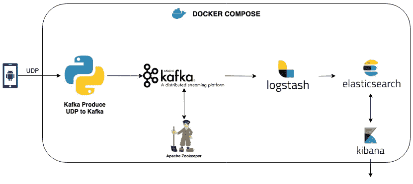
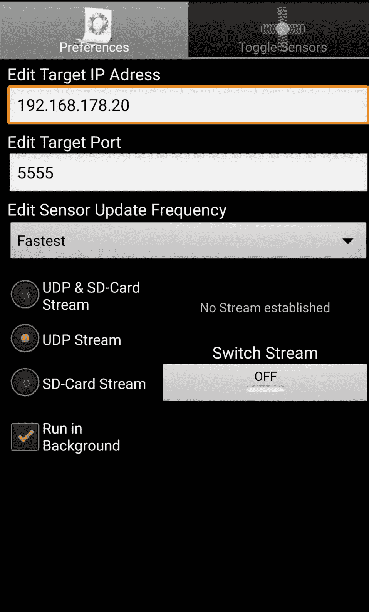
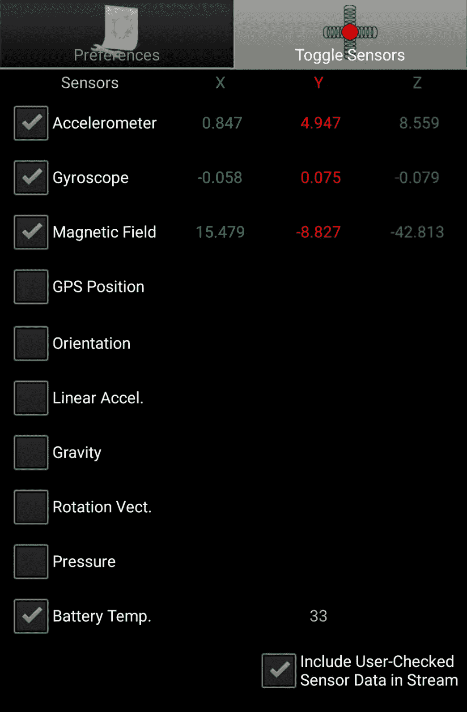
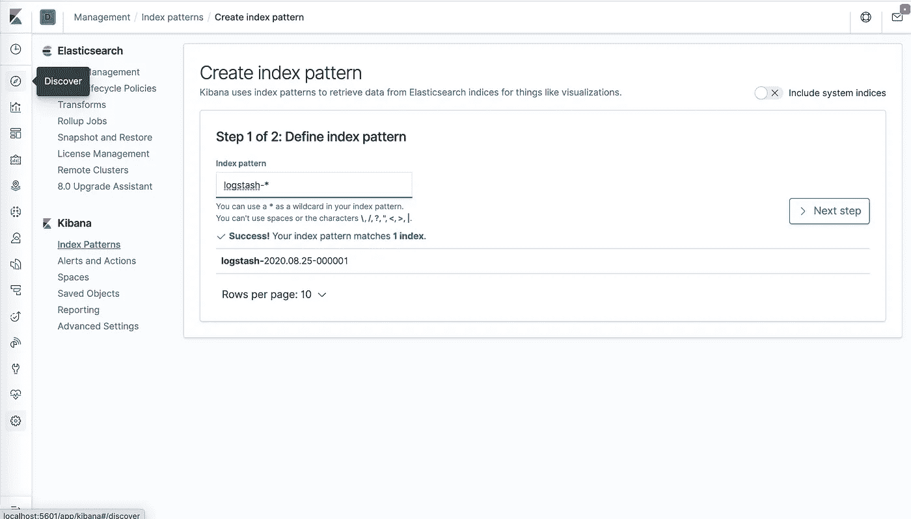
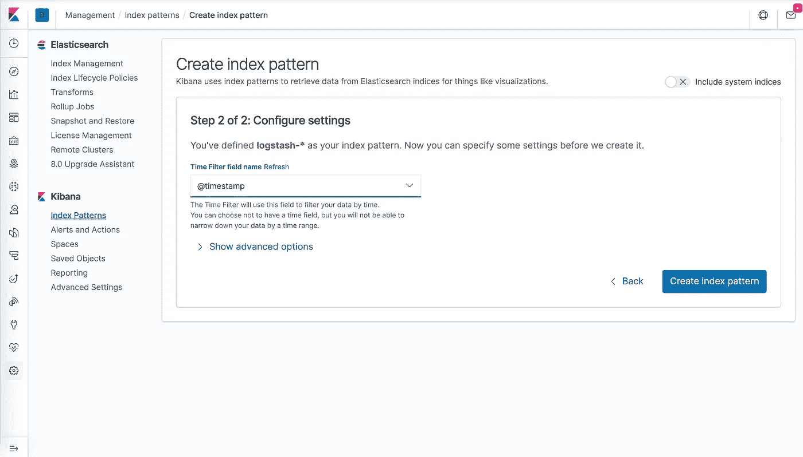
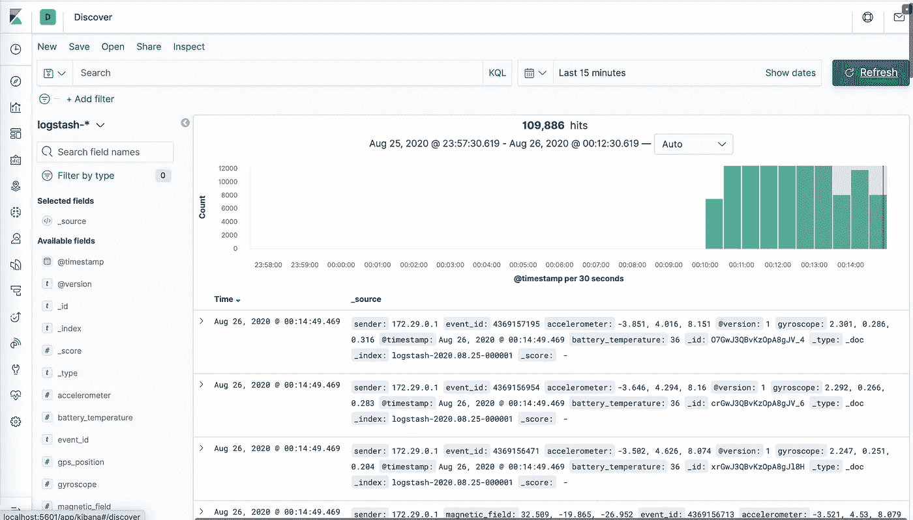
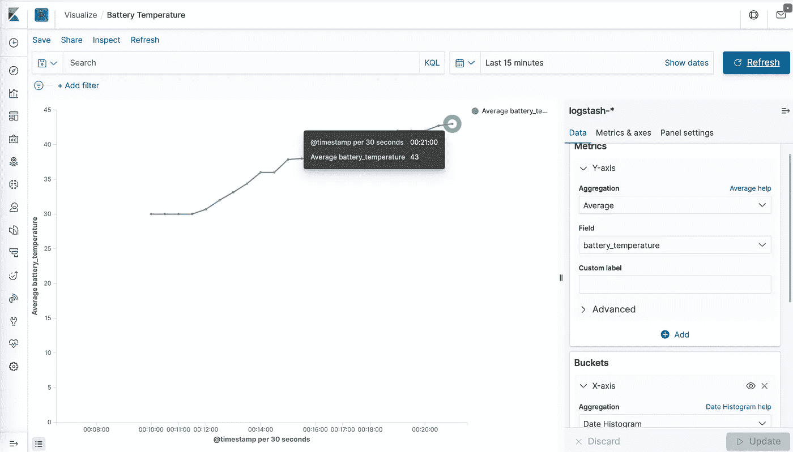

# 来自旧智能手机的实时物联网数据流

> 原文：<https://itnext.io/real-time-iot-data-streaming-from-old-smartphone-e9fbee6ecc91?source=collection_archive---------2----------------------->

> *TL；博士，如果您正在寻找一个简单的项目来开始使用物联网，但没有适合您的硬件/传感器。使用* [*Kafka*](https://kafka.apache.org/) *流式传输 android 智能手机的传感器数据，并使用*[*ELK stack*](https://www.elastic.co/what-is/elk-stack)*将传感器数据存储/可视化在 dockerized 容器*中



实时物联网数据流架构

这个项目背后的想法是监测智能手机的电池温度。我用我的一部旧 android 智能手机作为 IP 网络摄像头，它容易过热，所以我想监控温度。

主要组件包括

*   物联网设备——智能手机传感器
*   流水线— [阿帕奇卡夫卡](https://kafka.apache.org/)
*   聚合/处理、存储和可视化— [ELK 堆栈](https://www.elastic.co/what-is/elk-stack)

> 使用 docker-compose 对流管道和 ELK 堆栈进行 docker 化并运行

## 要求:

*   [Docker 引擎](https://docs.docker.com/get-docker/)版本 19.03 或更新
*   [Docker Compose](https://docs.docker.com/compose/install/) 版本 1.25.5 或更新
*   3 GB 内存分配给 docker-engine
*   Android 操作系统 2.3.3 及以上版本的智能手机

## **从物联网设备发送数据:**

要从智能手机收集和发送传感器数据，请安装 playstore 的
[Sensorstream IMU+GPS](https://play.google.com/store/apps/details?id=de.lorenz_fenster.sensorstreamgps&hl=en)应用程序。安装后打开应用程序。



注意:不要更改目标端口，UDP 接收器期望数据流通过端口` 5555 '

1)用运行 Docker 的机器的本地 IP 地址更新`Target IP Address`。

2)选择`UDP Stream`，因为我们不想在手机上存储数据的副本。

3)选中`Run in Background`选项，使应用程序在最小化的同时继续发送数据。

4)切换到`Toggle Sensors`部分并勾选`Battery Temp.`复选框。
您可以检查任何或所有其他传感器 [UDP 接收器/Kafka-producer](https://github.com/Dineshkarthik/real-time-IoT-data-streaming/blob/master/kafka-producer/udp_to_kafka.py) 被配置为处理所有可用的传感器数据。

5)勾选`Include User-Checked Sensor data into Stream`复选框。

6)切换回`Preferences`段，按`Switch Stream`按钮开始数据流。

## 处理和存储数据流:

使用以下命令克隆 [GitHub repo](https://github.com/Dineshkarthik/real-time-IoT-data-streaming)

```
git clone https://github.com/Dineshkarthik/real-time-IoT-data-streaming
```

一旦项目被克隆，确保您的 docker 引擎正在运行，然后在项目路径中执行下面的命令来构建所需的 docker 映像并运行容器。

```
cd real-time-IoT-data-streaming 
docker-compose up --build
```

根据你的网速，上面的命令需要花费一些时间来获取需要的 docker 镜像，同时构建 Kafka-producer docker 镜像。一旦所有需要的图像都准备好了，docker-compose 将运行所有需要的 docker 容器。

*   卡夫卡-制片人
*   卡夫卡
*   弹性搜索
*   Logstash
*   基巴纳

所有容器启动并运行大约需要 15-20 秒。所有通过 UDP 流发送的传感器数据都由 UDP 接收方/Kafka-producer python 脚本使用，并馈入名为— `smartphone-sensor`的 Kafka 主题。这个话题被 Logstash 消费、处理、摄入到 Elasticsearch 中。Kibana 连接到 Elasticsearch，我们可以查询&可视化传感器数据。

## 聚合和可视化传感器数据:

可以使用 URL 来访问 ki Bana—[http://localhost:5601](http://localhost:5601)

*   从上面的 URL 打开 Kibana。第一次访问时，Kibana 将提示`Explore Sample Data`或`Explore on my own`。选择后者——自己探索。
*   现在基巴纳将带你到主页。从主页使用左侧导航栏导航至`Discover`部分。
*   这里您必须创建一个索引模式，以便 Kibana 可以在 Elasticsearch 中识别数据源并使用它。在索引模式文本区域输入`logstash-*`，现在您可以看到一条成功消息，表明有一个索引与模式匹配。点击`Next Step`。



*   第二步是配置设置，对于`Time Filter field name`，从下拉框中选择`@timestamp`。点击`Create index pattern`。



*   上面的代码将创建一个索引，可以在 discover 部分查询流中的数据。



*   现在让我们在 Kibana 中创建一些可视化图表来监控电池的温度。使用左侧导航栏导航至`Visualize`部分(发现部分下方的一个部分)。
*   点击`Create Visualization`，提示您选择可视化类型。点击`Line`图表。
*   下一步将要求您在`Choose Source`上点击`logstash-*`索引图案。
*   现在，您可以配置折线图。点击右侧数据选项卡下的`Metrics`部分。选择`Aggregation`为`Average`，选择`Field`为`battery_temperature`。
*   要可视化时间序列数据，单击指标部分下方的`Buckets`部分下的添加，选择`X-axis`，选择`Aggregation`作为`Date Histogram`，然后单击更新。
*   现在可以查看折线图了。也可以使用左上角的保存按钮保存该图表，以备后用。



我的智能手机电池温度在 10 到 15 分钟内从 30 摄氏度上升到 43 摄氏度。我确实打开了很多应用程序来增加手机上的工作量，以显示具有增加趋势的图表。

现在，您可以探索剩余的可用传感器数据，并尝试不同的用例。