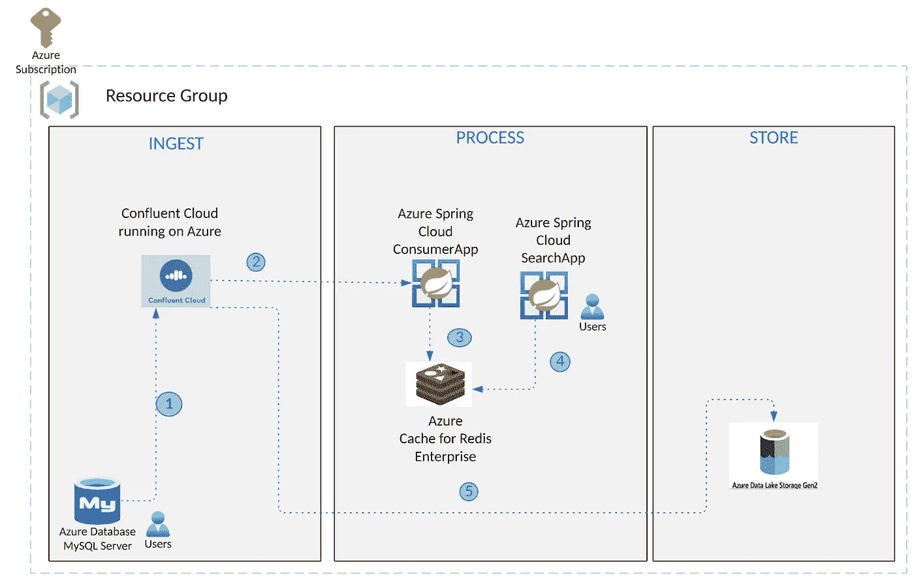
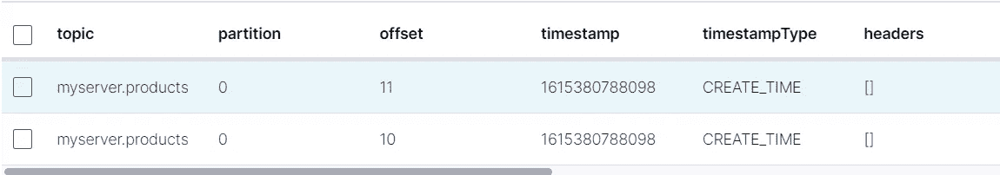
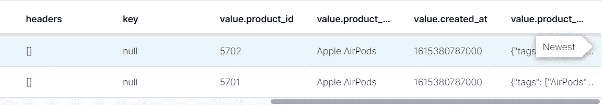
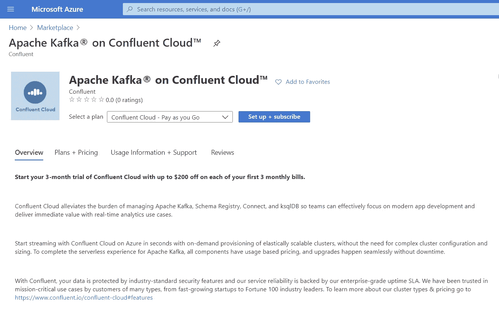
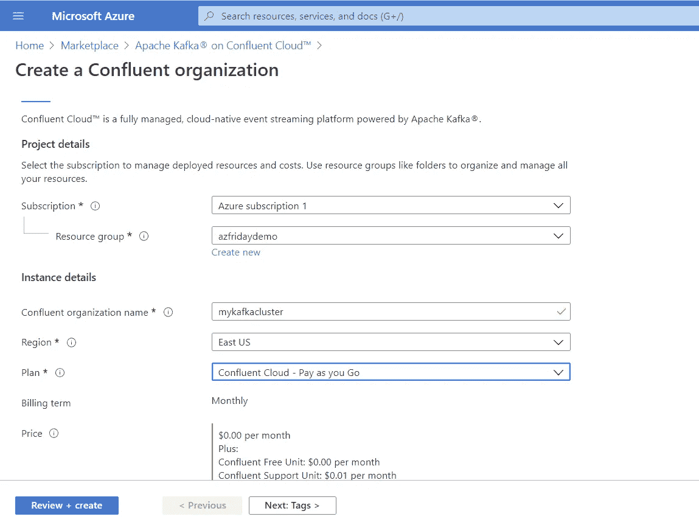
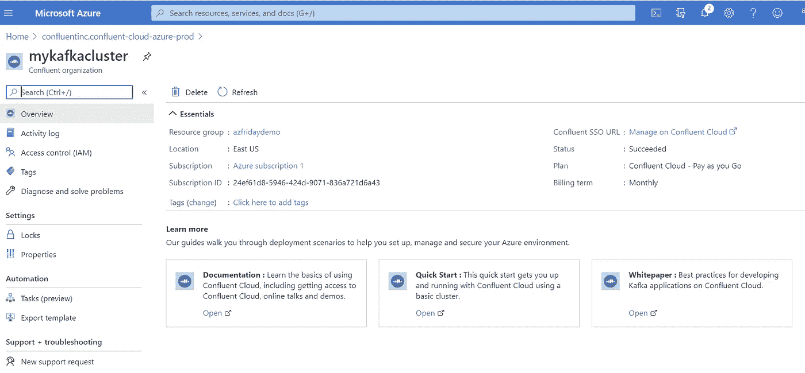
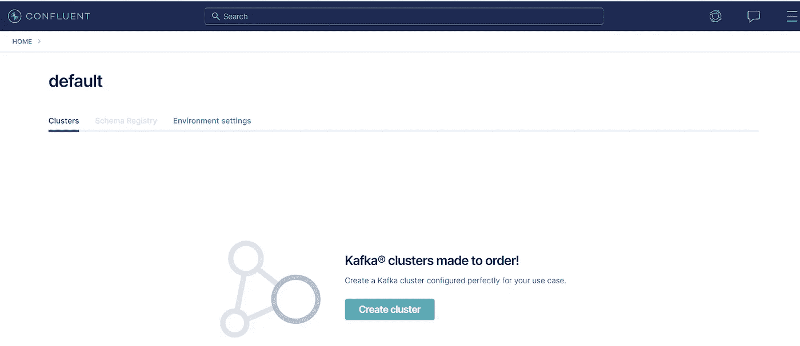
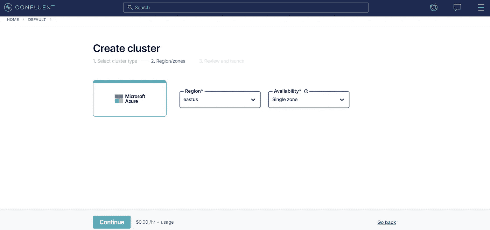

# 利用 Confluent、Azure、Redis 和 Spring Cloud 进行实时搜索和分析

> 原文：<https://itnext.io/real-time-search-and-analytics-with-confluent-azure-redis-and-spring-cloud-3b0d2881e18c?source=collection_archive---------3----------------------->

*原载于 2021 年 3 月 25 日*[*https://www . confuent . io*](https://www.confluent.io/blog/real-time-search-and-analytics-with-confluent-cloud-azure-redis-spring-cloud)*。*

自我管理一个像 Apache Kafka 这样的分布式系统，以及构建和操作 Kafka 连接器，是非常复杂和耗费资源的。它要求您组织的开发和运营团队具备丰富的 Kafka 技能和专业知识。此外，您处理的实时数据量越大，确保所有基础架构高效扩展和可靠运行的挑战就越大。

Confluent 和微软正在共同努力，通过缓解典型的基础设施管理需求，使采用事件流的过程比以往任何时候都更容易，这种需求通常会使开发人员远离构建关键应用程序。通过 Azure 和 Confluent 的无缝集成，您可以实时收集、存储、处理事件流，并将它们提供给多个 Azure 数据服务。这种集成有助于减轻 Azure 和 Confluent 之间管理资源的负担。

[与汇流](https://www.confluent.io/azure/)的统一集成使您能够:

*   从 Azure 客户端界面(如 Azure Portal/CLI/SDK)调配新的融合云资源，并提供完全托管的基础架构
*   利用您现有的 Azure Active Directory (AAD)身份，简化从 Azure 到融合云的单点登录(SSO)
*   通过 Azure 订阅发票获得对您的融合云服务使用的统一计费，并可选择使用 Azure commits 融合的云消费费用只是作为 Azure 月账单上的一个项目出现
*   从 Azure 门户管理融合的云资源，并在“所有资源”页面中跟踪它们，以及你的 Azure 资源

Confluent 开发了一个预建连接器的[扩展库](https://www.confluent.io/azure/),可以无缝集成来自许多不同环境的数据。通过融合，Azure 客户可以访问完全托管的连接器，这些连接器将低延迟、实时分析的数据流传输到 Azure 和微软服务，如 [Azure Functions](https://docs.confluent.io/cloud/current/connectors/cc-azure-functions-sink.html) 、 [Azure Blob Storage](https://docs.confluent.io/cloud/current/connectors/cc-azure-blob-sink.html) 、 [Azure Event Hubs](https://docs.confluent.io/cloud/current/connectors/cc-azure-event-hubs-source.html) 、[Azure Data Lake Storage(ADLS)gen 2](https://docs.confluent.io/5.5.0/cloud/connectors/cc-azure-datalakeGen2-storage-sink.html)和 [Microsoft SQL Server](https://docs.confluent.io/cloud/current/connectors/cc-microsoft-sql-server-source.html) 。现在，更多实时数据可以轻松地流向应用程序，以实现更智能的分析和更丰富的上下文体验。

# 实时搜索用例

在当今快速发展的业务生态系统中，组织必须创建新的业务模式，提供卓越的客户体验，并提高运营效率，以保持相关性和竞争力。技术在这一旅程中扮演着关键角色，新的当务之急是构建可扩展、可靠、持久的实时系统。以较低成本和风险处理大量数据的实时基础设施在这一演变中发挥了关键作用。

Apache Kafka 经常在现代数据架构中扮演关键角色，其他系统向它生成数据/从它消费数据。这些可能是客户订单、金融交易、点击流事件、日志、传感器数据和数据库更改事件。正如您可能想象的那样，Kafka 中有大量数据(主题)，但只有在经过处理(例如，使用 Azure Spring Cloud 或 ksqlDB)或被其他系统接收时，这些数据才有用。

让我们研究一种将现有的传统事务系统转换为实时数据处理系统的架构模式。我们将描述一个在 MySQL 和 RediSearch 之间同步数据的数据管道，由 Azure 上的融合云提供支持。这个场景适用于许多用例，但是我们将专门讨论下游系统必须接近实时地获得批处理数据以满足搜索需求的场景。数据可以进一步传输到 ADLS 商店，以便关联实时和历史数据、进行分析和可视化。这为通过 API 驱动业务的重要部分的其他服务提供了基础，例如面向客户的网站，它可以提供关于产品、可用性等的最新信息。



以下是上述体系结构的关键要素和功能:

*   构成架构基础的基础设施组件
*   [ADLS 第二代接收器连接器](https://docs.confluent.io/cloud/current/connectors/cc-azure-datalakeGen2-storage-sink.html#az-data-lake-storage-gen2-sink-connector-for-ccloud),用于将数据从 Kafka topics 导出到 ADLS
*   [ADLS 数据存储](https://docs.microsoft.com/en-us/azure/storage/blobs/create-data-lake-storage-account)用于实时和历史数据的关联以及进一步的分析和可视化
*   应用组件:这些是运行在 Azure Spring Cloud 上的服务
*   使用 [Spring 进行 Apache Kafka 集成的](https://spring.io/projects/spring-kafka) [Java Spring Boot 应用程序](https://spring.io/projects/spring-boot)是一个消费者应用程序，它通过创建所需的索引定义来处理从 Kafka 主题到 Redis 的事件；它通过创建所需的索引定义和添加新的产品信息作为重新搜索文档(当前表示为 Redis hash ),将记录作为重新搜索文档添加
*   搜索应用程序是另一个 Spring Boot 应用程序，它使再搜索数据作为 REST API 可用；它允许您按照[重新搜索查询语法](https://oss.redislabs.com/redisearch/Query_Syntax/)执行查询

上述服务使用 JRediSearch 库与 RediSearch 接口，以便创建索引、添加文档和查询。

多亏了 JDBC 源连接器，MySQL(产品表)中的数据被发送到 Kafka 主题。以下是 JSON 有效负载的样子:



# 目标

数据可以上传到 Azure Database for MySQL 上的关系数据库中，在这种情况下，通过应用程序或批处理。这些数据将从 Azure 上的 Confluent Cloud 同步到 Redis 企业服务 Azure Cache 中的 RediSearch 模块。这将使您能够以灵活的方式对数据执行实时搜索。实时数据也被传输到 ADLS 的一家商店。所有的服务组件都可以部署到一个 Azure 区域，以获得低延迟和低性能。此外，这些服务组件部署在单个 Azure 订阅中，以通过 Azure 订阅发票对您的融合云使用进行统一计费。

## 先决条件

1.  一个 Azure 账户
2.  [安装 Azure CLI](https://docs.microsoft.com/cli/azure/install-azure-cli?WT.mc_id=data-14444-abhishgu) 来部署和管理基础架构组件
3.  JDK 11 或以上为例[开 JDK](https://openjdk.java.net/projects/jdk/11/)
4.  最近的一个 Maven 版本
5.  安装 [Git](https://git-scm.com/downloads)

## [设置 Azure 云环境](https://github.com/Azure-Samples/mysql-kafka-redis-integration#set-up-the-base-infrastructure-components)

1.  [为 MySQL 服务器创建 Azure 数据库](https://docs.microsoft.com/azure/mysql/quickstart-create-mysql-server-database-using-azure-cli?WT.mc_id=data-14444-abhishgu)
2.  [在融合云上创建 Apache Kafka 的实例](https://docs.microsoft.com/en-us/azure/partner-solutions/apache-kafka-confluent-cloud/create)
3.  [创建一个 Redis 企业缓存实例](https://docs.microsoft.com/azure/azure-cache-for-redis/quickstart-create-redis-enterprise?WT.mc_id=data-14444-abhishgu)，启用 Redis 搜索模块
4.  [提供 Azure Spring Cloud 的一个实例](https://docs.microsoft.com/azure/spring-cloud/spring-cloud-quickstart?tabs=Azure-CLI&pivots=programming-language-java&WT.mc_id=data-14444-abhishgu#provision-an-instance-of-azure-spring-cloud)

## [构建并部署应用到 Azure Spring Cloud](https://www.confluent.io/blog/real-time-search-and-analytics-with-confluent-cloud-azure-redis-spring-cloud#azure-spring-cloud)

1.  设置消费者应用程序来处理从 Kafka 主题到 Redis 的事件
2.  设置搜索应用程序以查询来自重新搜索的记录
3.  构建并部署应用程序 JAR 文件

## [使用搜索应用程序查询数据](https://www.confluent.io/blog/real-time-search-and-analytics-with-confluent-cloud-azure-redis-spring-cloud#in-action)

1.  使用`curl`或 HTTP 客户端来调用搜索 API

## [将数据导出到 Azure Data Lake](https://www.confluent.io/blog/real-time-search-and-analytics-with-confluent-cloud-azure-redis-spring-cloud#azure-data-lake)

1.  设置 ADLS Gen 2 连接器以从 Kafka 主题导出数据

## [清理](https://www.confluent.io/blog/real-time-search-and-analytics-with-confluent-cloud-azure-redis-spring-cloud#delete-resources)

1.  单独删除资源(MySQL、融合云组织、Redis 和您的 Azure Spring 云实例)或删除资源组

# 在 Azure 上配置 MySQL 和融合云

## Azure 上的 MySQL 实例

使用 Azure CLI 为 MySQL 服务器创建一个 [Azure 数据库(或者使用](https://docs.microsoft.com/azure/mysql/quickstart-create-mysql-server-database-using-azure-cli?WT.mc_id=data-14444-abhishgu) [Azure 门户](https://docs.microsoft.com/azure/mysql/quickstart-create-mysql-server-database-using-azure-portal?WT.mc_id=data-14444-abhishgu)，如果您喜欢的话):

## 融合云中的卡夫卡星团

*   [在融合云上设置并订阅](https://portal.azure.com/#create/confluentinc.confluent-cloud-azure-prod)Apache Kafka，您可以通过 Azure Marketplace 轻松找到它



*   **提供在 Azure 上创建融合云组织的配置细节**



*   **Azure 中的供应:**通过 Azure 门户无缝供应融合的组织



*   **单点登录融合云:**直接登录融合云



*   **创建融合云完全受管资源**，如集群、主题和连接器



*   **创建主题(可选):**连接器自动创建主题(基于默认约定)；如果您想要覆盖其默认设置，请手动创建主题，但是要确保在配置连接器时使用相同的主题名称
*   [使用门户](https://docs.confluent.io/cloud/current/connectors/cc-mysql-source.html#step-2-add-a-connector)配置并启动 MySQL 源连接器

# 将应用程序构建和部署到 Azure Spring Cloud

从克隆 [GitHub 库](https://github.com/Azure-Samples/mysql-kafka-redis-integration)开始，进入`mysql-kafka-redis-integration`目录:

```
git clone [https://github.com/Azure-Samples/mysql-kafka-redis-integration](https://github.com/Azure-Samples/mysql-kafka-redis-integration) cd mysql-kafka-redis-integration
```

对于这两个服务，用 Redis 的 Azure Cache 和融合云集群的连接细节更新`src/main/resources`文件夹中的`application.yaml`文件。

以下是变更事件处理器服务的精简版本:

```
redis:
  host: <enter redis host>
  port: <enter redis port>
  password: <enter redis access key> 
topic:
  name: <topic name e.g. myserver.products>
  partitions-num: 6
  replication-factor: 3
spring:
  kafka:
    bootstrap-servers:
      - <enter Confluent Cloud bootstrap server>
    properties:
      ssl.endpoint.identification.algorithm: https
      sasl.mechanism: PLAIN
      request.timeout.ms: 20000
      retry.backoff.ms: 500
      sasl.jaas.config: org.apache.kafka.common.security.plain.PlainLoginModule required username="<enter Confluent Cloud API key>" password="<enter Confluent Cloud API secret>";
      security.protocol: SASL_SSL
...
```

搜索 API 服务的配置非常紧凑:

```
redis:
  host: <enter redis host>
  port: <enter redis port>
  password: <enter redis access key>
```

为 Spring 应用程序构建 JAR 文件:

```
export JAVA_HOME=<enter path to JDK e.g. /Library/Java/JavaVirtualMachines/zulu-11.jdk/Contents/Home>

# Change Events Processor service
mvn clean package -f change-events-processor/pom.xml

# Search API service
mvn clean package -f search-api/pom.xml
```

为 Azure CLI 安装 Azure Spring Cloud [扩展:](https://docs.microsoft.com/cli/azure/extension?view=azure-cli-latest&WT.mc_id=data-14444-abhishgu)

```
az extension add --name spring-cloud
```

[创建与两个服务对应的 Azure Spring 云应用](https://docs.microsoft.com/cli/azure/ext/spring-cloud/spring-cloud/app?view=azure-cli-latest&WT.mc_id=data-14444-abhishgu#ext_spring_cloud_az_spring_cloud_app_create):

```
# Change Events Processor service
az spring-cloud app create -n change-events-processor -s <enter the name of Azure Spring Cloud service instance> -g <enter azure resource group name> --runtime-version Java_11

# Search API service
az spring-cloud app create -n search-api -s <enter the name of Azure Spring Cloud service instance> -g <enter azure resource group name> --runtime-version Java_11 --is-public true
```

[为您刚刚创建的各个应用程序部署 JAR 文件](https://docs.microsoft.com/cli/azure/ext/spring-cloud/spring-cloud/app?view=azure-cli-latest&WT.mc_id=data-14444-abhishgu#ext_spring_cloud_az_spring_cloud_app_deploy):

```
# for the Change Events Processor service
az spring-cloud app deploy -n change-events-processor -s <enter the name of Azure Spring Cloud service instance> -g <enter azure resource group name> --jar-path change-events-processor/target/change-events-processor-0.0.1-SNAPSHOT.jar

# for the Search API service
az spring-cloud app deploy -n search-api -s <enter the name of Azure Spring Cloud service instance> -g <enter azure resource group name> --jar-path search-api/target/search-api-0.0.1-SNAPSHOT.jar
```

# 是时候看看实时搜索了！

现在我们已经有了所有的组件，我们可以测试端到端的功能。我们将从向 MySQL 数据库添加新产品数据开始，并使用搜索应用程序来确保它已经传播到 Redis。

插入以下示例数据:

```
INSERT INTO `products` VALUES (42, 'Outdoor chairs', NOW(), '{"brand": "Mainstays", "description": "Mainstays Solid Turquoise 72 x 21 in. Outdoor Chaise Lounge Cushion", "tags": ["Self ties cushion", "outdoor chairs"], "categories": ["Garden"]}');

INSERT INTO `products` VALUES (43, 'aPhone', NOW(), '{"brand": "Orange", "description": "An inexpensive phone", "tags": ["electronics", "mobile phone"], "categories": ["Electronics"]}');
```

使用门户或 [CLI](https://docs.microsoft.com/cli/azure/ext/spring-cloud/spring-cloud/app?view=azure-cli-latest&WT.mc_id=data-14444-abhishgu#ext_spring_cloud_az_spring_cloud_app_show) 获取搜索 API 服务的 URL:

```
az spring-cloud app show -n search-api -s <enter the name of Azure Spring Cloud service instance> -g <enter azure resource group name>
```

使用`curl`或另一个 HTTP 客户端来调用搜索 API。每个查询都将以 JSON 有效负载的形式返回结果，如下所示:

```
[
    {
        "created": "1614235666000",
        "name": "Outdoor chairs",
        "description": "Mainstays Solid Turquoise 72 x 21 in. Outdoor Chaise Lounge Cushion",
        "id": "42",
        "categories": "Garden",
        "brand": "Mainstays",
        "tags": "Self ties cushion, outdoor chairs"
    },
    {
        "created": "1614234718000",
        "name": "aPhone",
        "description": "An inexpensive phone",
        "id": "43",
        "categories": "Electronics",
        "brand": "Orange",
        "tags": "electronics, mobile phone"
    }
]
```

这里有几个例子可以帮助你开始。注意，查询参数`q`用于指定[重新搜索查询](https://oss.redislabs.com/redisearch/Query_Syntax/)。

```
# search for all records
curl <search api URL>/search?q=*

# search for products by name
curl <search api URL>/search?q=@name:Outdoor chairs

# search for products by category
curl <search api URL>/search?q=@categories:{Garden | Electronics}

# search for products by brand
curl <search api URL>/search?q=@brand:Mainstays

# apply multiple search criteria
curl <search api URL>/search?q=@categories:{Electronics} @brand:Orange
```

使用`redis-cli`连接到 Redis 实例的 Azure 缓存:

```
redis-cli -h <enter host name> -p <enter port i.e. 10000> -a <enter redis password/access key> --tls
```

# 将数据导出到 Azure 数据湖

如果你想将这些数据长期存储在 Azure Data Lake Storage(冷存储)中，Confluent 的 [ADLS Gen2 连接器](https://docs.confluent.io/cloud/current/connectors/cc-azure-datalakeGen2-storage-sink.html)可以满足你。在我们的场景中，我们已经有产品数据流入 Azure 上的 Confluent Cloud 中的 Kafka 主题——我们需要做的只是配置连接器来完成工作。

猜猜看，这也是一种完全托管的产品！

你需要做的是:

*   [创建存储账户](https://docs.microsoft.com/azure/storage/blobs/create-data-lake-storage-account?WT.mc_id=data-14444-abhishgu)
*   配置连接器并启动它；确保使用与之前相同的主题名称(如`myserver.products`)
*   确认数据已导出到 ADLS 帐户中的 Azure 存储容器

如需逐步指南，[请遵循文档](https://docs.confluent.io/cloud/current/connectors/cc-azure-datalakeGen2-storage-sink.html#quick-start)。

# 删除 Azure 资源

完成后，删除这些服务，这样你就不会产生不必要的费用。如果它们在同一个资源组中，简单地[删除资源组](https://docs.microsoft.com/azure/azure-resource-manager/management/delete-resource-group?tabs=azure-portal&WT.mc_id=data-14444-abhishgu#delete-resource-group)就足够了。还可以单独删除资源(MySQL、Confluent Cloud organization、Redis 和 Azure Spring Cloud 实例)。

# 摘要

随着越来越多的企业进行数字化转型，实时应用的紧迫性将呈指数级增长。通过 Confluent 和 Azure 之间的新集成，以及可用于将数据导出和来源到 Azure 数据和存储服务的完全托管的 Kafka 连接器，您将能够更快地处理大量数据，简化集成，并避免设置和维护复杂的分布式系统的挑战。

这份完整的指南向您展示了如何基于托管 PaaS 服务在 Azure 上运行该解决方案的高级架构。这样做的好处是，您不必设置和维护复杂的分布式系统，如数据库、事件流平台和 Spring Boot Java 应用程序的运行时基础设施。

请记住，这只是一个潜在的更大用例的一部分。多亏了 Kafka，您还可以扩展该解决方案，以与其他系统集成，如 [Azure Data Lake](https://docs.microsoft.com/azure/storage/blobs/data-lake-storage-introduction?WT.mc_id=data-14444-abhishgu) ，使用另一个完全托管的 [ADLS Gen2 连接器](https://docs.confluent.io/cloud/current/connectors/cc-azure-datalakeGen2-storage-sink.html)。

# 想了解更多？

如果您想了解更多信息，请[通过 Azure Marketplace 开始使用融合云上的 Apache Kafka](https://ms.portal.azure.com/#create/confluentinc.confluent-cloud-azure-prod/preview)并[跟随快速入门](https://docs.microsoft.com/en-us/azure/partner-solutions/apache-kafka-confluent-cloud/overview)。注册后，前三个月你将每月获得 200 美元的免费使用权。使用促销代码`CL60BLOG`额外获得 60 美元的免费使用权。 [*](https://www.confluent.io/confluent-cloud-promo-disclaimer/)

[开始使用](https://ms.portal.azure.com/#create/confluentinc.confluent-cloud-azure-prod/preview)

*Ramya Oruganti 是微软的高级产品经理。她在 Azure 开发者体验团队工作，专注于构建 Azure 和融合云之间的集成服务。她已经在云和数据领域工作了十多年。从工程到解决方案架构，Ramya 在 IBM、Oracle 以及现在的微软等组织中担任职务，对于云产品有着丰富的实践经验。*

Abhishek Gupta 是微软的一名高级开发人员，他帮助开发人员在 Azure 平台上取得成功。他的主要关注领域包括卡夫卡、数据库和 Kubernetes。Abhishek 也是一个开源贡献者和融合的社区催化剂。此前，作为一名产品经理，他帮助构建和倡导以开发者为中心的 PaaS 产品。

*原载于 2021 年 3 月 25 日*[*https://www . confluent . io*](https://www.confluent.io/blog/real-time-search-and-analytics-with-confluent-cloud-azure-redis-spring-cloud)*。*