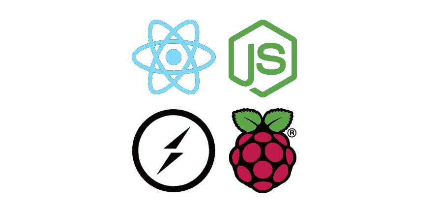
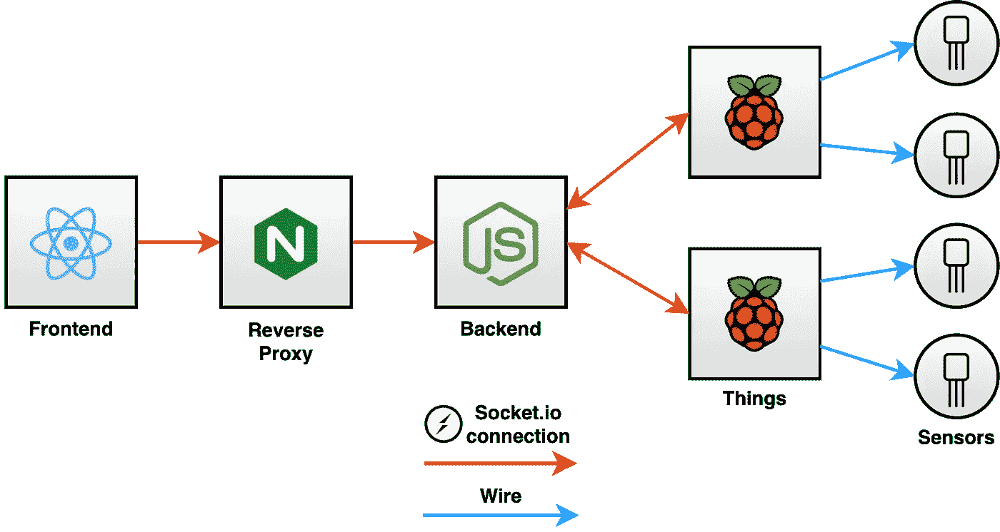
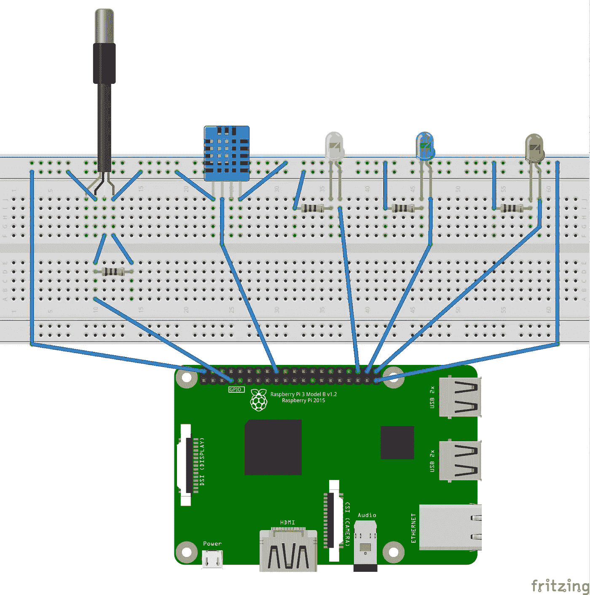

# 使用 ReactJS、NodeJS、Socket.io 和 Raspberry Pi 实现实时传感器数据可视化

> 原文：<https://itnext.io/real-time-sensor-data-visualisation-using-reactjs-nodejs-socket-io-and-raspberry-pi-d109fd5cb19d?source=collection_archive---------0----------------------->



在本文中，我们将了解我在物联网平台中实现的一个功能。它包括显示在平台注册的事物中执行的测量的实时图表。

# 体系结构

在这个例子中，一个“东西”是一个带有温度和湿度传感器的 Raspberry Pi，它通过 IP 使用套接字公开数据。

这些东西被注册在 NodeJS 后端中，它会将其信息存储在数据库中，并在 MQTT 代理中发布其测量结果。此外，后端将提供通过套接字连接到一个东西的可能性，这是我们将进一步详细了解的情况。

最后，有一个 ReactJS 前端，它将负责请求连接到一个东西，并在实时图表中呈现它的数据。



体系结构

# 给东西布线

让我们从设置硬件开始。对于此使用案例，我们需要:

*   树莓 Pi 3
*   [DHT11](https://cdn-learn.adafruit.com/downloads/pdf/dht.pdf) :温湿度传感器
*   [DS18B20](https://datasheets.maximintegrated.com/en/ds/DS18B20.pdf) :防水温度传感器。我们将用它来测量室外温度。
*   4 个 220ω电阻
*   3 个 LED(绿色=正常，红色=关闭，黄色=运行中)

我们按照下图将该硬件组件连接到 RPi 的 [GPIO](https://en.wikipedia.org/wiki/General-purpose_input/output) 引脚:



接线

# 硬件抽象@事物

抽象是一个 CS 概念，它隐藏了一个实体的细节，以便专注于解决问题。在我们的例子中，实体是硬件组件，要解决的问题是获取传感器的数据，并通过打开 led 向用户提供反馈。

我们将使用 ES6 类来包装使用 NodeJS 本地模块访问硬件的第三方库。在 DHT11 的情况下，我们可以实现类似这样的东西:

我们还需要几个类来编排这些硬件组件。`SensorHandler`和`LEDHandler`将完成这项工作。

# Socket.io server @ Thing

如前所述，事物将通过套接字公开其数据。为此，我们将在其中运行一个 Socket.io 服务器。

Socket.io 背后的主要思想是通过使用基于使用 websockets 底层事件的 API 来异步通信两台机器。`SocketHandler`将负责在配置的时间间隔内发出这些事件。注意，它们的内容将是调用`SensorHandler.read()`的结果:

# Socket.io 服务器@后端

后端也将有一个 Socket.io 服务器，它将作为客户端和对象之间的中间件。为了实现这一点，我们将在 Socket.io 实例中配置一个中间件，它将具有以下职责:

*   通过验证一个 [JWT](https://github.com/auth0/node-jsonwebtoken) 来检查认证。
*   验证并获取客户端请求连接的对象名称。
*   验证并获取客户请求的测量类型。

如果一切正常，下一步将是实际打开这个东西的套接字，并将接收到的数据转发回客户端。这个过程是在`SocketController`类中完成的，这个类与 thing 的类`SocketHandler`非常相似。

# 前端实时图表

最后但同样重要的是，前端将允许用户选择一个事物及其支持的测量类型之一，以显示实时图表。

`RealTime`组件将负责调度相应的 Redux 动作以实现该行为。具体来说，我们将使用 Redux Thunk 来简化这项任务:

在这一点上，你可能会想…但是我们实际上从哪里接收数据呢？我们认为这发生在引擎盖下:

最后，请记住，在卸载组件时关闭当前的套接字连接非常重要:

```
useEffect(() => () => store.dispatch(finishRealTimeData()), []);
```

# 包扎

我们已经建立了一个完整的 JavaScript 解决方案，允许用户可视化关于他/她的东西的实时信息。一个很酷的特性可能是触发动作，例如，通过实现一个订阅 MQTT 主题的 worker，并在获得的值达到阈值时使用 Telegram bot 发送消息。你猜怎么着？它已经完成并在 [GitHub](https://github.com/mmontes11/iot) 上可用。另一篇文章来了…大概。

此外，一个有趣的重组可能是用 gRPC[替换 Socket.io，这也允许我们拥有双向数据流。你猜怎么着？不，这还没有实现…还没有。](https://grpc.io/)

对此有什么想法吗？

# GitHub repos

*   前端+后端:[https://github.com/mmontes11/iot](https://github.com/mmontes11/iot)
*   树莓派:[https://github.com/mmontes11/iot-raspi-sensors](https://github.com/mmontes11/iot-raspi-sensors)

# 资源

*   [https://en.wikipedia.org/wiki/Internet_of_things](https://en.wikipedia.org/wiki/Internet_of_things)
*   [https://cdn-learn.adafruit.com/downloads/pdf/dht.pdf](https://cdn-learn.adafruit.com/downloads/pdf/dht.pdf)
*   [https://datasheets.maximintegrated.com/en/ds/DS18B20.pdf](https://datasheets.maximintegrated.com/en/ds/DS18B20.pdf)
*   [https://github.com/momenso/node-dht-sensor](https://github.com/momenso/node-dht-sensor)
*   [https://github.com/chamerling/ds18b20](https://github.com/chamerling/ds18b20)
*   [https://github.com/auth0/node-jsonwebtoken](https://github.com/auth0/node-jsonwebtoken)
*   [https://github.com/socketio/socket.io](https://github.com/socketio/socket.io)
*   [https://grpc.io/](https://grpc.io/)