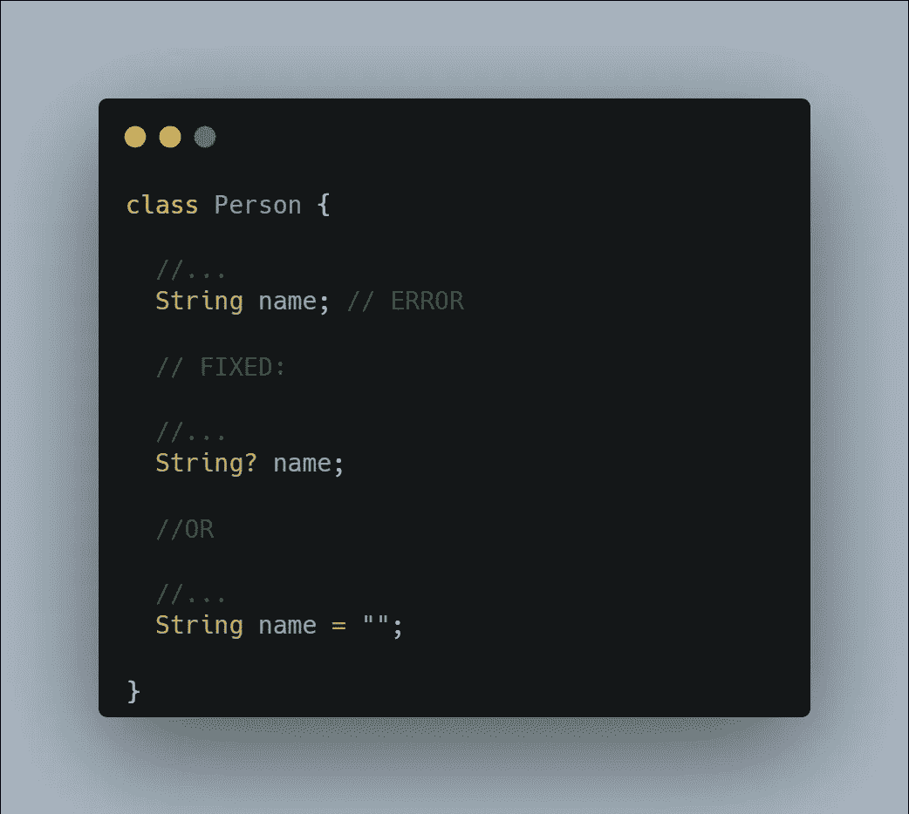
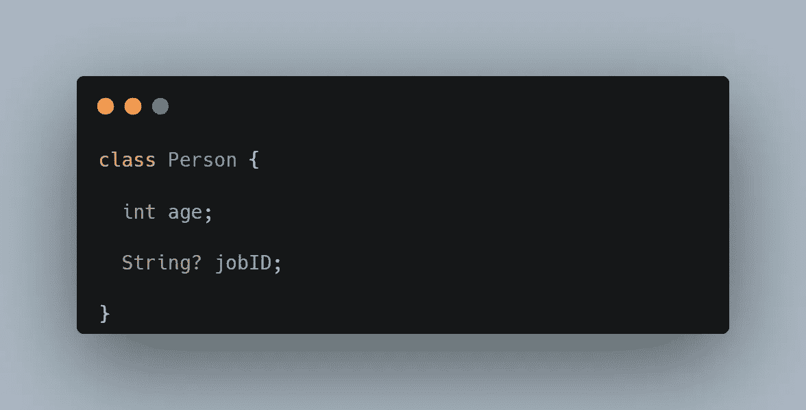
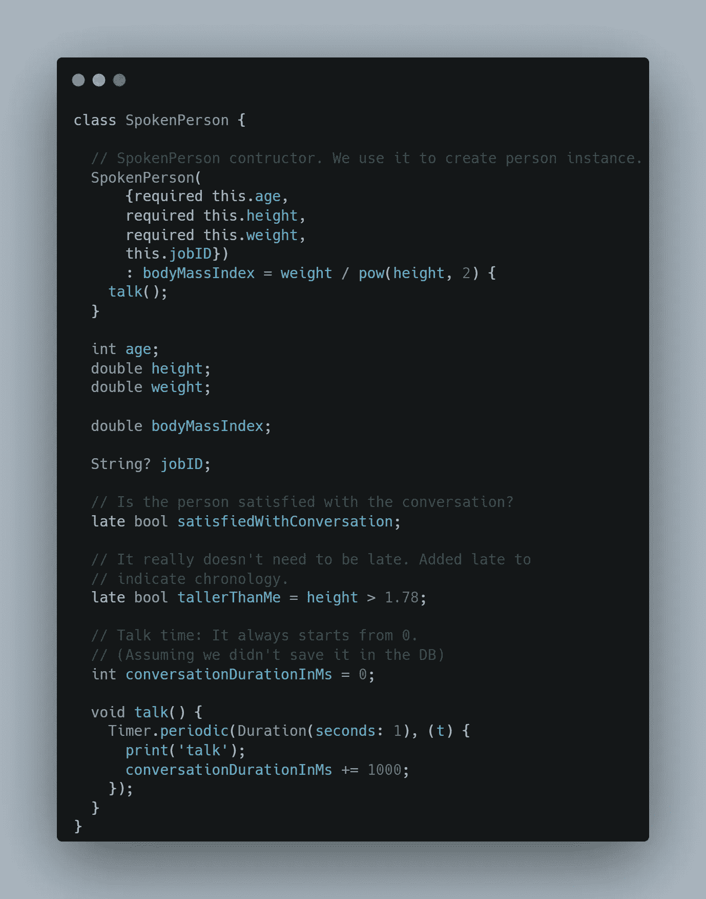
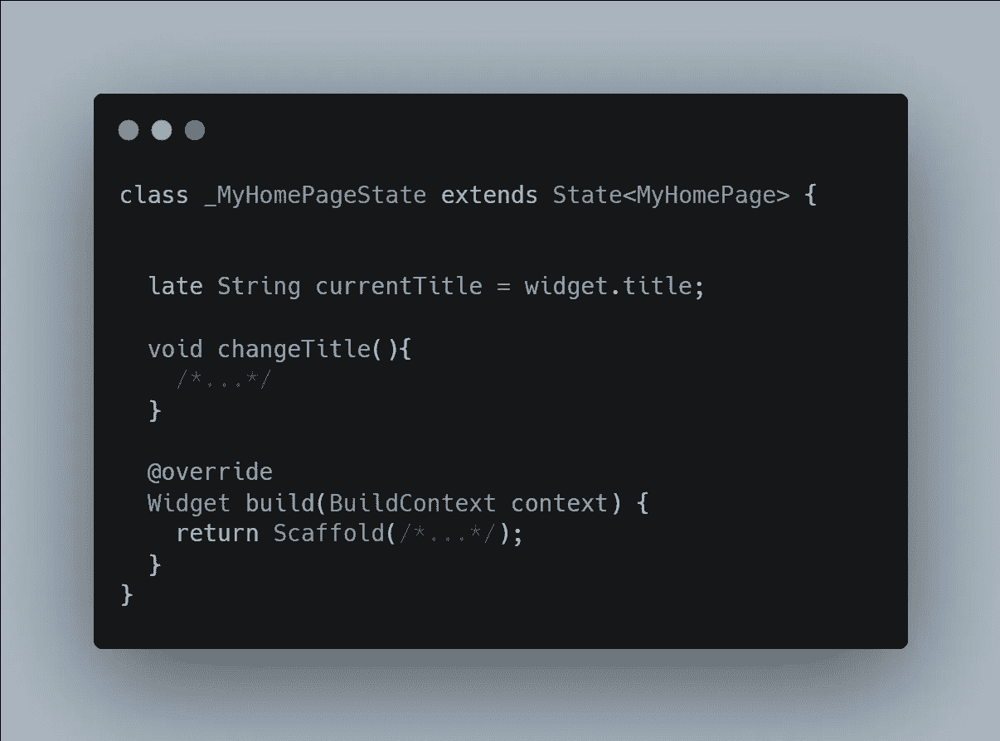
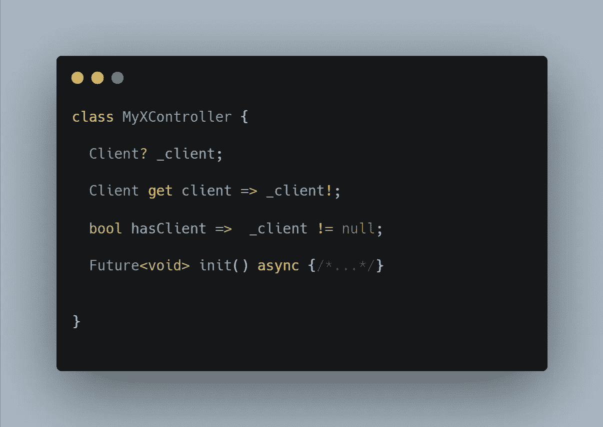

# 颤振/飞镖中的安全性真的为零

> 原文：<https://itnext.io/really-null-safety-in-flutter-dart-56e2a70a3849?source=collection_archive---------2----------------------->

亲爱的 Dart 开发者、初学者或专业人士，我认为，是时候真正理解和吸收零安全了。

我在社区和新手开发者的工作中反复看到这些误解，我尽我所能去纠正它们。当我看到许多专业人士创建的教程代码片段仍然没有很好地理解 null-safety 时，我甚至为初学者感到遗憾。

许多受到这些代码片段启发的开发人员很难采取正确的方法。我还认为堆栈溢出的旧答案或 YouTube 上的旧视频对此也有很大影响。

## 零安全额外工作还是便利？

空安全是对添加像“？”这样的额外符号的惩罚吗或者“！”？

null safety 只是一个给出更多编译时/运行时错误的工具吗？

当然不是。相反，空安全使我们避免了不必要的符号，并为我们提供了更安全的编码。

不了解 null-safety 的人首先会遇到的情况之一是:
定义了一个类成员并得到一个错误:“不可为 null 的实例字段‘x’必须初始化。”

开发人员对此错误实施了两种可能的解决方案:



这个解决方案很大程度上是一场**灾难**。实际上，这从来都不是一个解决方案。

这个方案只是多了一个(不必要的)`?`或者`“ = "" ”`，然后在用法上多了一个`!`。

**现在仔细听，去掉这些额外的工作量！**

在这篇文章中，我将解释零安全，灵感来自于代码之外的现实生活、代码中的用途以及人类思维的方式。

本文也将作为一个指南，系统化我将遵循的路径，同时向我的网络中的初学者开发者解释它。

# 1-逻辑上下文

首先，我们将在逻辑上下文中检查本文中讨论的主题，而不仅仅是在 Dart 代码中的使用。在大多数情况下，任何不符合逻辑上下文的定义都会使团队工作更加困难(即使这意味着更短的代码片段)，分散我们对灵活编码的注意力。

所以我们现在不打算学习诸如“不要得到/修复错误”、“写更短的代码”、“通常使用的途径/方法”之类的东西。

我们现在来看看零安全在现实生活中是如何工作的(在我们大脑的神经元中)。我们会意识到我们的大脑一直在做什么。因此，我们将在编码时使用这种意识。

现在，让我们来澄清一下关于零安全的最重要的问题:类

# 2-什么是阶级？

> 这不是一个关于类的教程。我只是想让你看看我们将如何处理这个问题。

在我的方法中，一个**类**是一个常见的名词。创建一个类可以称为定义/学习一个通用名称。

例如，当我们是婴儿的时候，我们学习这些常见的名字，带有一些问题，如什么是人，什么是玩具，什么是城市，以及它们的答案。当然，如果宇宙是一个代码。这些在很早以前就被定义了。

在这个学习过程中，我们心中的代码等价于:

```
class Person {
   //…
}class Toy {
    //…
}class City {
    //…
}
```

后来我们知道每个人都有一个年龄，人们会说:

```
class Person {
    //…
    int age; void talk() {
        //…
    }
}
```

作为一个普通名词，人们交谈，但是我们从某些人那里听到这些对话:

```
Person mother = Person(/*…*/)
mother.talk();
```

如果我们在想某个人，我们一定在脑海中为那个人创建了一个【人】的**实例** **(或者电脑中的 RAM)。**

# 3-类字段

正如我们上面提到的，这些在我们头脑中定义的普通名字有一些特征，比如人的年龄，名字。

**这就是空安全发挥作用的地方。**

当然，在我们的头脑或宇宙的代码中，可能有成千上万个类与一个人相关。“新认识的人”、“我的朋友”等。

但是让我们稍微简化一下。假设我们头脑中只有一个人的定义和一些属性，如年龄、姓名等。

问你一个小问题？
在遇见一个人的时候，当你问他/她年龄的时候，你有没有想过一个问题:“我想知道这个人有没有年龄？”。或者当你问别人年龄时，“我没有。”你期待这样的回答吗？

如果没有，`int age;`在 universe 的代码中**永远不能**为空。

> 可能我们还没问别人的年龄，或者他/她还没说。但在现实中，我们并不需要一个人的年龄在脑海中形成。所以让我们假设我们知道我们能知道的(现在和将来)和我们需要的一切。

另一个问题是:

当我们问一个人“你在哪里工作”这个问题的时候，你是不是总会在回答中得到一个职场信息？

如果没有，我们的`jobID`类成员是**可空的**。不是每个人都必须有工作。

是的，现在让我们用这两个属性定义一个类:



这意味着一个人可能有`jobID`，也可能没有。但是他/她肯定有`age`。

现在您在这里遇到了一个错误。你认为打破我们上面提到的关于年龄和工作 ID 的逻辑语境来解决这个错误是对的吗？

这里的`int? age`解决方案打破了我们的逻辑背景。

那么误差是什么，怎么解决呢？

让我们先处理错误的解决方案:

1-使可为空。

我们已经提到过:年龄不能为空。所以这不是办法。

2-添加`late`修改器。

在大多数情况下，这也不是正确的解决方案。人从存在的那一刻起就有了年龄。

3-给出一个默认年龄。

`int age = 0;`。如果你认为你看到/遇到/认识的每个人都是新生儿，这可能是个好办法。在你的头脑中还不知道它的年龄(也就是说，当一个人实例还没有形成的时候)并不意味着这个人的年龄是零。

**解决方案**

正如你所看到的，我们用了很多像“还没有”、“还没有”和“时刻”这样的词。存在，存在的过程及其年表有着重要的地位。

因此，让我们快速看一下实例是如何创建的。

现在我们正在为一个对话定义和创建一个 Person 类/实例。

让我们看看下面的例子，看看它们是以什么顺序工作的。



将使用这些概念:

> 代言人( <params>) : <final-initializer>{ <construction-body>}</construction-body></final-initializer></params>

所以:

1 — **在执行构造之前。**

首先，让我们考虑在创建发言人之前我们实际上可以知道什么:我们的对话持续时间是 0。在我们在头脑中创造出这个人之前，所有其他的事情都是我们永远不会知道的。

> 注意，之前知道的都不是`*static*`。对话持续时间 Ms 是关于特定发言人实例的。静态属性不是特定于某个对象实例的属性。

当我们想要使用 SpokenPerson(…)表达式创建一个实例时，“conversationDurationInMs = 0”(作为 setter)将首先运行。

2 — **<参数>**

我们需要信息来创建发言人实例。所以<params>部分起作用。这里的参数被读取，如果有的话，取默认值。“这个。”或者“超级”语句实际上是下一阶段<final-initializer>的第一部分。为了编码方便，我们只能在这个阶段使用它。</final-initializer></params>

因此，这个阶段是提出必要的问题并为创建发言人实例做必要准备的阶段。

3 — **<最终初始化式>**

这个阶段是对象的创建阶段。这个物体在这个阶段还没有成形。像胚胎一样。

这个阶段一结束，对象就会被创建。这意味着在这个阶段的最后，我们需要知道所有与对象相关的最终变量和必需变量。如果有关于上级对象的信息，必须在这里用 super 的构造函数给出。

我们以上错误的主要原因是在这个阶段或之前“年龄”是未知的。

在这里，我们不能访问实例成员。

4 — `**late**` **带值成员的修饰符。**

这是在`<final-initializer>`和`<construction-body>`之间起作用的阶段。以下部分代表这一阶段。在这里，我们可以访问实例成员。但是，从这一点开始，我们可以评估什么，并不意味着这里就一定会给出价值。该值是我们第一次使用`late` 实例成员时给出的。

`late bool tallerThanMe = height > 1.78;`

5 — **<构造体>**

此阶段是在创建对象后立即执行操作的阶段。在这里，我们可以访问实例成员。

在本例中，我们在创建实例后立即与它对话。

6 — **设置迟到成员**

如果它存在，并且我们正在设置它，我们将在末尾设置后期成员(在一个不确定的时间)。

`satisfiedWithConversation`。我们说话前不能问这个。谈完就知道了。但是和可空的不一样，聊完就能确定。

## 求解结果

1 —如果一个属性在我们的例子中不为空，我们**永远不会**使它为空。将它们作为参数请求，或者计算并给出值，这是 final-initializer 中的最新内容。

2 —如果您有一个不可为空的成员，但是在创建实例时还不知道它的值，那么使用`late`。只有当你确定在使用它之前你会欣赏它的时候才使用它。

3 —“它有这个功能吗？”如果您对问题的回答是“有时”，请将其设置为 nullable。并且在使用它之前总是询问它是否是一个现有的条件(检查 null)。

# 一些提示

## 实例成员延迟

具有后期修饰符的成员可以访问实例成员。在本例中，“widget”是一个实例成员(归 State 所有)，我们可以访问它。这在功能上类似于在 initState 中计算 currentTitle 的值。然而，我们可以在实例创建后立即对 currentTitle 变量赋值，这并不意味着它会在构造后被赋予某个值。我们第一次使用晚期成员时，它被赋予了它的值。

因此，在“State”附加到小部件之前，任何读取这个晚期变量的尝试都会导致一个**错误**。

那是我自己的政策，但是我觉得是功能性的:不要用`late`带值。

错误的方式:



## 需要初始化/连接

如果其中一个控制器需要初始化函数，或者如果一个类的实例与另一个类的实例(State-StatefulWidget、Widget-Element、Controller-Client)一起工作，那么可以建立一个结构，以便于访问这个连接/附加的实例。



根据具体情况，如果预计会有变化，检查`hasClient`，然后舒适地使用`client` 。等同于`mounted`州。