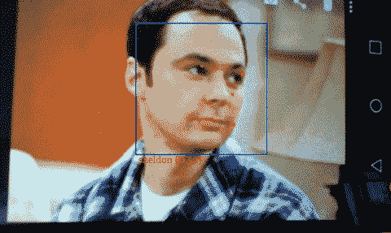
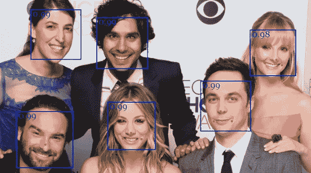
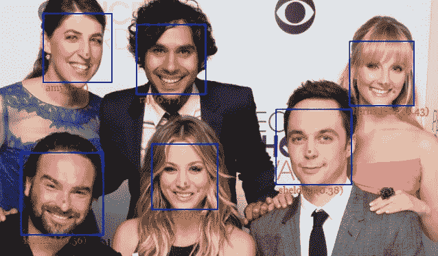

# 使用 face-api.js 的 MTCNN 人脸检测器进行实时 JavaScript 人脸跟踪和人脸识别

> 原文：<https://itnext.io/realtime-javascript-face-tracking-and-face-recognition-using-face-api-js-mtcnn-face-detector-d924dd8b5740?source=collection_archive---------0----------------------->

## 介绍用于人脸检测的 face-api.js' MTCNN 和 tensorflow.js 的 5 点人脸标志

永远不要相信劣质的 GIF！自己试试吧！

如果你现在正在阅读这篇文章，很可能你已经读过我的介绍文章( [**face-api.js —用 tensorflow.js**](/face-api-js-javascript-api-for-face-recognition-in-the-browser-with-tensorflow-js-bcc2a6c4cf07) 在浏览器中进行人脸识别的 JavaScript API)或者之前玩过 [**face-api.js**](https://github.com/justadudewhohacks/face-api.js) 。如果你还没有听说过 face-api.js，我强烈推荐你先去读一下介绍文章，看看回购！如果您想先玩一些例子，请查看 [**演示页面**](https://justadudewhohacks.github.io/face-api.js/) **！**

和往常一样，本文中有一个代码示例在等着您。我们将破解一个小应用程序，它将在浏览器中从**网络摄像头** **图像**中执行**实时人脸检测**和**人脸识别**，请继续关注我！

# 使用 face-api.js 进行人脸检测

到目前为止，face-api.js 单独实现了一个基于 **SSD Mobilenet v1** 的 CNN 进行人脸检测。虽然这是一个非常准确的人脸检测器，但 SSD 不像其他架构那样快(就推理时间而言)，并且它可能无法通过这个人脸检测器实现实时，除非你/你的 webapp 的用户在他们的机器中内置了一个不错的 GPU。

事实证明，你并不总是需要那么高的准确度，有时你宁愿用高准确度来换取更快的人脸检测器。

这就是 **MTCNN** 发挥作用的地方，现在可以在 face-api.js 中获得！MTCNN 是一个更加轻量级的人脸检测器。在下文中，我将指出它与固态硬盘 Mobilenet v1 的区别:

## **优点:**

*   推断时间更短(**检测速度更快**)
*   同时检测 **5 个人脸标志点**(免费获得人脸对齐)
*   更小的型号尺寸:与大约 6MB(量化 SSD Mobilenet v1 重量)相比，只有大约 2MB
*   **可配置:**您可以调整一些参数来提高性能，以满足您的特定需求

## 缺点:

*   不如固态硬盘 Mobilenet v1 准确

# mt CNN——同步人脸检测和地标

MTCNN(多任务级联卷积神经网络)是一种由 3 个阶段组成的算法，它检测图像中人脸的边界框及其 5 个点人脸标志( [*链接到论文*](https://kpzhang93.github.io/MTCNN_face_detection_alignment/paper/spl.pdf) *)* )。每个阶段通过将其输入传递给 CNN 来逐渐改善检测结果，CNN 返回候选边界框及其分数，随后是非最大抑制。

在阶段 1 中，输入图像被多次缩小以构建一个**图像金字塔**，并且图像的每个缩放版本通过其 CNN。在阶段 2 和 3 中，我们为每个边界框提取图像块并调整它们的大小(阶段 2 中的 **24x24** 和阶段 3 中的 **48x48** ),并通过该阶段的 CNN 转发它们。除了边界框和分数，阶段 3 还为每个边界框计算 **5 个面部标志点**。

在摆弄了一些 MTCNN 实现之后，事实证明，与 SSD Mobilenet v1 相比，即使在 CPU 上运行推理，您也可以在更低的推理时间内获得非常可靠的检测结果。作为额外的奖励，从 5 点面部标志，我们得到免费的面部对齐！这样，我们不必在计算面部描述符之前执行 68 点面部标志检测作为中间步骤。

尽管这对我来说很有希望，但我还是在 **tfjs-core 中实现了它。经过几天的努力，我终于找到了一个可行的解决方案。:)**让我们看看它的行动吧！****

# 网络摄像头人脸跟踪和人脸识别

正如承诺的那样，我们现在将看看如何使用您的网络摄像头实现面部跟踪和面部识别。在这个例子中，我将再次使用我的网络摄像头来跟踪和识别一些《生活大爆炸》主角的脸，但是当然你也可以使用这段代码来相应地跟踪和识别你自己。

要显示来自网络摄像头的帧，您只需使用视频元素，如下所示。此外，我将一个绝对定位的画布放在视频元素的顶部，具有相同的高度和宽度。我们将使用画布作为透明覆盖，稍后我们可以在上面绘制检测结果:

一旦页面被加载，我们将加载 MTCNN 模型以及人脸识别模型，以计算人脸描述符。此外，我们正在使用***navigator . getuser media***将我们的网络摄像头流附加到视频元素:

现在应该会要求您授予浏览器访问您的网络摄像头的权限。在我们为视频元素指定的 **onPlay** 回调中，我们将处理每一帧的实际处理。请注意，一旦视频开始播放，onplay 被挂接的事件就会被触发。

## 人脸检测

我说过，我们可以在这里配置一些检测参数。默认参数如下:

为了从你的摄像头跟踪人脸，我们将增加最小尺寸到至少 200 像素**。**只检测较大尺寸的面部使我们能够实现更短的推断时间，因为网络会以更大的系数缩小图像:

如您所见，我们可以简单地向它提供视频元素，就像图像或画布元素一样。

通过 MTCNN 向前传递给我们一组**面部检测**(边界框+分数)以及每个检测到的面部的**面部标记 5** 。现在，我们可以将结果绘制到覆盖图中:

仅举一个例子，到目前为止，我们将得出以下结论:

## 计算面部描述符

从我之前的教程中，你应该已经知道，在计算任何人脸描述符之前，我们希望从人脸标志的位置对齐人脸边界框。从对齐的框中，我们提取对齐的面部张量，我们可以将它们传递给面部识别网络:

如果对您来说代码太多，还有一个方便的快捷方式:

## 人脸识别

从现在开始，我们只是简单地以同样的方式进行，就像我们在之前的教程中所做的那样。回想一下，为了识别人脸，在运行主循环之前，我们必须从示例图像中预先计算(至少一个)人脸描述符，以识别我们想要识别的每个人(**参考数据**):

为了决定哪个人坐在摄像头前，我们使用 ***faceapi 计算**查询人脸描述符**到参考数据中人脸描述符的距离。再次使用 FaceMatcher* 和**并返回最相似的匹配:

如果你只是想跟踪自己，给自己拍一张照片并运行一次***faceapi . all faces***来检索你自己脸部的脸部描述符(**参考描述符**)就足够了。然后您可以使用***faceapi . euclideandrance .***直接计算查询人脸描述符与您的网络摄像头图像和参考描述符的距离

最后，我们将带有预测标签和相对于边界框位置的距离的文本再次绘制到覆盖画布上:

之后，不要忘记调用 **onPlay** 继续迭代处理最近的帧:

就这样了！

# 一些最后的评论

注意，为每一帧重新计算查询人脸描述符是一种非常幼稚的方法。显然，你可以想出一种更有效的方法，比如每隔*帧跟踪并更新你的检测结果的面部描述符。通常被跟踪的人脸的姿势在几帧内不会有太大的变化。但是为了简单起见，我就让它保持原样。记住这一点，以防你想从中挤出更多的 fps。*

*最后，请务必查看 [**示例**](https://github.com/justadudewhohacks/face-api.js/blob/master/examples/) ，当然，请继续关注进一步的更新和功能，它们可能会在未来成为 face-api.js！；)*

**如果你喜欢这篇文章，请留下一些掌声，并在 medium 和/或*[*Twitter*](https://twitter.com/justadudewhohax)*:)上关注我。也可以随意在* [***github 资源库***](https://github.com/justadudewhohacks/face-api.js) *上留下一颗星星。敬请关注更多教程！**