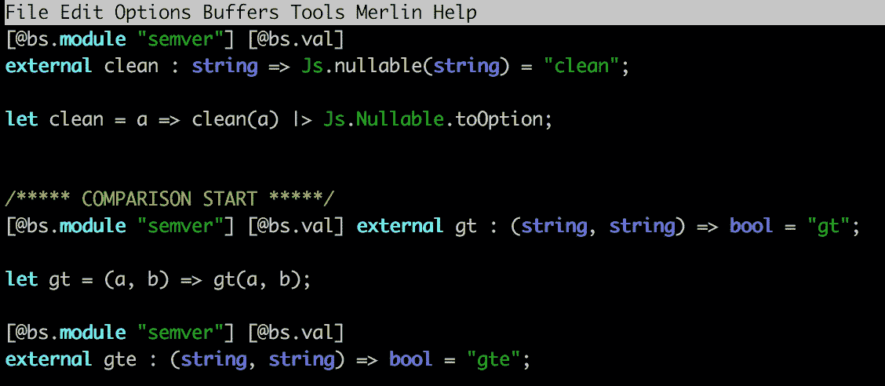
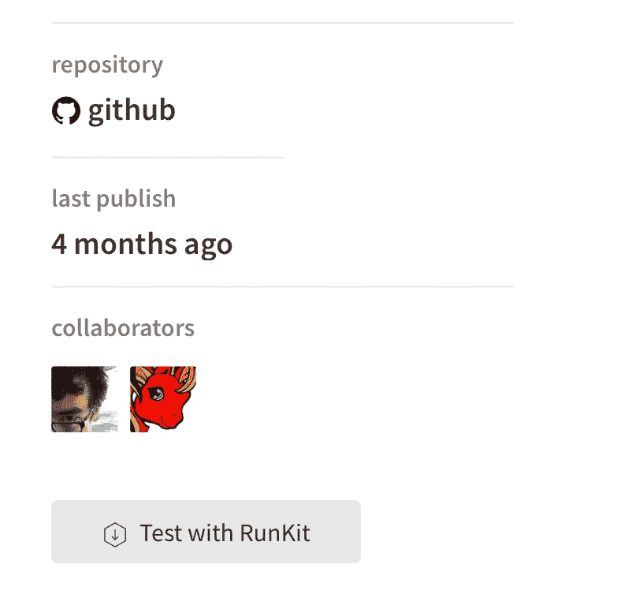

# 原因:为 NPM 包创建绑定

> 原文：<https://itnext.io/reasonml-create-bindings-for-npm-package-b8a3c6d0703e?source=collection_archive---------2----------------------->

ReasonML 正在上升。最近的 https://www.reason-conf.com/显示，许多人对这种来自脸书的语言感兴趣。

您可以非常容易地将 ReasonML 添加到现有的 JavaScript/TypeScript 项目中，并获得强类型语言的全部好处，但许多库是用 JS 编写的，并发布到 NPM。要从 ReasonML 中使用它们，您必须提供到包的绑定。有许多为不同库创建的绑定，例如:[为 MomentJS 创建的绑定。](https://github.com/reasonml-community/bs-moment)

在这篇文章中，我将向你展示如何从头开始创建绑定，以及如何在你的 ReasonML 项目中使用它们:



# 入门指南

ReasonML 提供了从 ReasonML 到/从 JavaScript world 的一个非常薄的绑定层。一个很好的起点是正式的 BuckleScript 文档。

我们将为 NPM 官方的 semver 包编写绑定。

这个包公开了不同的函数，我们还可以实例化 Semver 类，就像这个 JavaScript 示例中一样:

```
const semver **=** require('semver')semver.valid('1.2.3') *// '1.2.3'*semver.valid('a.b.c') *// null*semver.clean('  =v1.2.3   ') *// '1.2.3'*semver.satisfies('1.2.3', '1.x || >=2.5.0 || 5.0.0 - 7.2.3') *// true*
```

## 创建新的 NPM 包

运行命令

```
npm init
```

这将启动一个向导，创建一个新的 NPM 包。提供您想要的任何信息，只需给它一个带前缀“bs”(BuckleScript)的好名字。“bs”是 BuckleScript 或 ReasonML 绑定的社区约定。

创建文件夹“src”:

```
mkdir src
```

它将包含我们绑定的所有源代码。

创建文件夹“__tests__ ”:

```
mkdir __tests__
```

它将包含由 [bs-jest 库](https://github.com/glennsl/bs-jest)执行的绑定测试。

## 添加 bsconfig.json

为了让我们的包与 ReasonML 编译器一起工作，我们必须添加一个 bsconfig.json。

最重要的导入属性:

```
name: '@gladimdim/bs-semver'
```

必须与您的 package.json 中的完全相同。

```
sources: [...src....__tests__....]
```

指定将哪些文件夹编译成 JavaScript 代码。Tests 文件夹的类型是“dev ”,所以它不会出现在建议中，也不会被编译到包中。

## 编辑包. json

现在打开 package.json，我们必须向它添加一些特定于绑定的属性。

```
"scripts": {
  "clean": "bsb -clean-world", 
  "build": "bsb -make-world",
  "watch": "bsb -make-world -w",
  "test": "jest"
},
```

这些是脚本，用于构建、编译、测试和运行观察器。

提供开发部门:

```
"devDependencies": { 
  "bs-platform": "^3.0.0",  
  "jest": "22.1.2", 
  "@glennsl/bs-jest": "0.3.2" 
},
```

注意，您必须提供“真正的”JavaScript NPM 包 dep，如“jest”，因为它们包含真正的代码，这些代码将在测试或编译任务期间由“bs-jest”的绑定使用。

现在告诉 NPM 要包括哪些文件:

```
"files": [   
  "src/semver.re", 
  "bsconfig.json"
 ]
```

这是应该发布到 NPM 注册中心的内容。包含 bsconfig.json 很重要，因为最终用户的构建过程会用到它。

## 指定目标 NPM 程序包的对等依赖项

当我们为 semver 包创建绑定时，我们必须告诉 NPM 让它成为一个对等依赖。我们的软件包的最终用户必须向我们提供这种对等依赖。

```
"peerDependencies": {    "semver": "^5.5.0"  },
```

# 如何编写绑定

在 src 文件夹中，创建一个名为“semver.re”的文件。这将是我们的主要和唯一的文件绑定。

让我们为函数“clean”编写绑定，该函数作为 semver 包中的一个独立函数公开。

在我们编写 clean 函数的主体之前，我们需要深入了解 JS 的可怕世界:

你必须在运行时检查这些函数在现实生活中返回什么。

每个 npm 软件包页面都有一个“使用 RunKit 测试”按钮，您可以使用它来调用函数，而无需安装软件包:



函数“clean”的问题如下:如果它无法解析输入的 semver 版本，它可能返回有效的 semver 字符串或 null。所以，从理性的角度来看，这个函数的结果是一个选项。它要么返回字符串，要么不返回任何内容(None)。

我们使用指令 **@bs.module 和@bs.val** 来表示，下一个函数没有 ReasonML 主体。相反，它将取自 JavaScript 世界。更多信息请阅读官方文档:[https://bucklescript . github . io/docs/en/intro-to-external . html](https://bucklescript.github.io/docs/en/intro-to-external.html)

```
[@bs.module "semver"] [@bs.val] 
external **clean** : string => Js.nullable(string) = "clean";
let **clean** = a => clean(a) |> Js.Nullable.toOption;
```

第二行中的类型签名的含义如下:函数“clean”接受一个字符串作为输入参数，并输出一个字符串或 null。指令@ bs . module“SEM ver”和“clean”会将其转换为 JavaScript:

```
semver.clean() 
```

我们可以让它保持原样，但是我们想让这个函数的返回类型更加合理规范，并使用选项类型。这就是为什么在第 3 行我们有这个函数的主体。它以如下方式读取:函数“clean”获取参数 a，将其发送到“clean”(SEM ver 包中的 JavaScript 函数)，然后将其结果通过管道传输到 toOption converter。ReasonML 将从“外部清理”声明中继承类型定义，因此您不必重复它们。

我们的 ReasonML 函数“clean”的输出将是一个字符串类型的选项。

让我们编写绑定测试。在 __tests__ 文件夹中创建一个文件 semver_spec.re，其内容如下:

semver 模块将从我们的 semver.re 文件中自动加载。请记住，我们不测试 Semver 功能，我们测试我们的绑定。所以我们只需要验证，我们的绑定返回可选类型，结果是字符串。

我们可以从官方文档继续讨论其他简单的方法到 SEM ver:[https://github.com/npm/node-semver](https://github.com/npm/node-semver)

# 如何为“字符串”枚举创建类型

函数 **semver.cmp(a，c，b)** 接受 3 个参数:第一个版本，操作(字符串)，第二个版本。

绑定到它看起来像这样:

但是，第二个参数称为“操作”，它只能是特定“操作”集合中的字符串。比如:“、≤、≥、==、！== "等等。

ReasonML 中的用法如下:

```
Semver.cmp("1.5.0", "<", "2.3.5");
```

通过定义第二个参数"

```
Semver.cmp("1.5.0", "hello", "2.3.5");
```

We could leave it as a string type, but in ReasonML I always prefer to have types for such important arguments.

We have to introduce a type, which has take only valid for ‘cmp’ method strings:

```
type comparator =  | LooseEqual  | LooseNotEqual  | Equal  | Empty  | NotEqual  | Gt  | Gte  | Lt  | Lte;
```

And to write a function, which converts these types into strings, as JavaScript expects a string as an input:

Now, enhance our binding:

This ReasonML code will return a compilation error:

```
Semver.cmp("1.5.0", "hello", "2.3.0");
```

We have to reuse the provided type Semver.Gt:

```
Semver.cmp("1.5.0", Semver.Gt, "2.3.0");
```

The binding will convert Semver.Gt into “>"并将其发送给外部的' real '，JavaScript 函数。

# 为 Semver 类创建类型

Semver 包还提供了实例化 Semver 类的可能性:

```
const s = new semver("1.5.0");
s.minor(); // 5
```

我们可以在 ReasonML 中定义一个类类型来覆盖所有的“semver”对象属性:

然后，我们添加“createSemver”函数，它将帮助我们使一切都是类型安全的:

用法:

```
let a = Semver.createSemver("1.5.0");
Js.log(a##minor); // 5
```

# 摘要

我希望，这篇文章能帮助你为其他包创建你自己的类型。为[https://github.com/reasonml-community/bs-moment](https://github.com/reasonml-community/bs-moment)、[https://github.com/glennsl/bs-jest](https://github.com/glennsl/bs-jest)提供了很好的绑定。您可以查看它们的源代码，以获得关于如何编写绑定的更多见解。这其实就是我做的:-)

## 原因周刊时事通讯

要了解 ReasonML 的最新消息，您可以关注我们的 Twitter:[https://twitter.com/@WeeklyReason,](https://twitter.com/@WeeklyReason,)并订阅我们的每周简讯:[https://news . reason ml . online](http://news.reasonml.online.)。

bs-semver 绑定的 GitHub repo:[https://github.com/gladimdim/bs-semver](https://github.com/gladimdim/bs-semver)

# 谢谢

非常感谢[瑞安·塔克](https://twitter.com/RCTucker88)的指正！