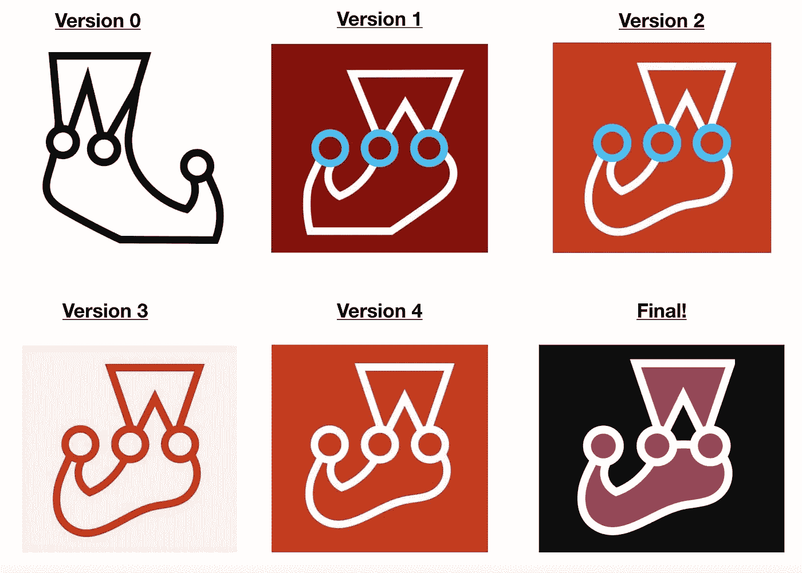
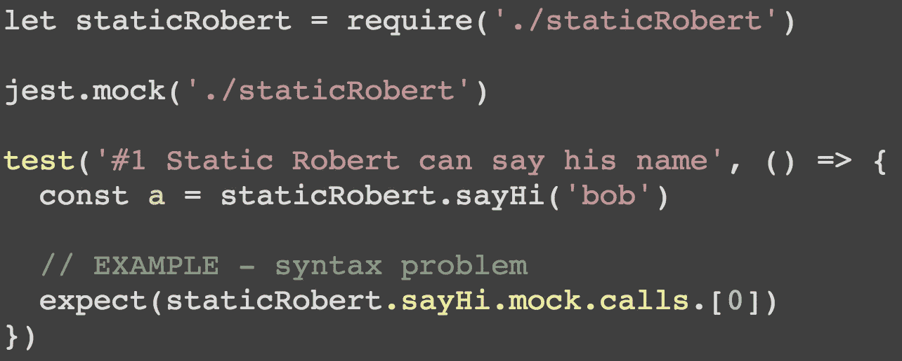
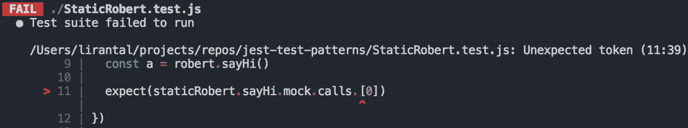
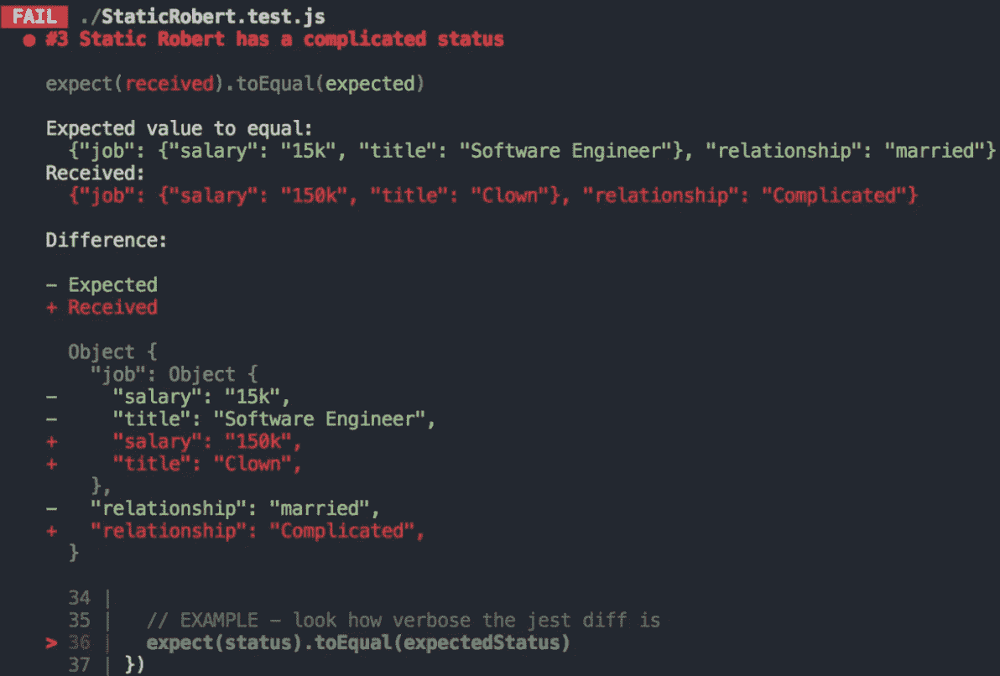
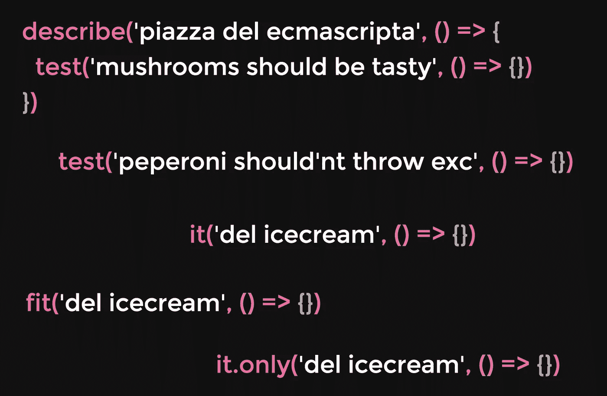
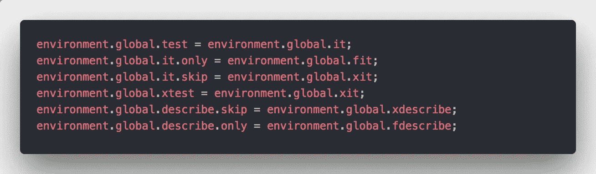
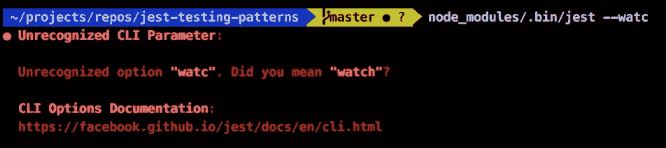
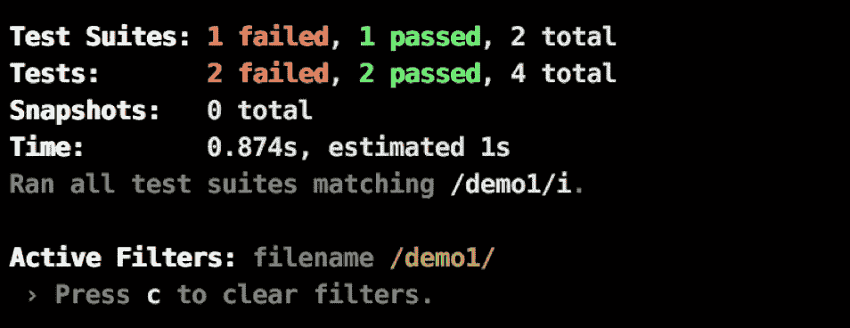
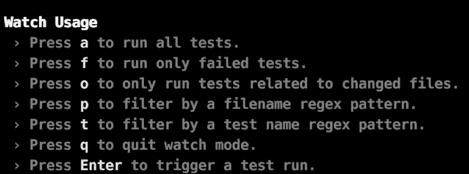

# 喜欢 Jest 的理由:开发者体验

> 原文：<https://itnext.io/reasons-to-love-jest-the-developer-experience-b00ec93df7bb?source=collection_archive---------2----------------------->

哦是的。Jest 的开发者体验正在将编写测试的行为从一件苦差事转变为一段有趣的时间，我保证！🤓

这篇文章是我上一篇关于 Jest 框架的文章的后续:

 [## 喜欢 Jest 的理由:测试框架- Liran Tal - Medium

### 我真的很喜欢编写测试，Jest 将它带到了一个全新的水平。就像我早上起来问自己…

medium.com](https://medium.com/p/ae19b49c02c3/) 

jest 的开发者体验

# 标志

啊，那个标志。不就是好吗？就像它试图告诉你“你会写测试吗？这会很有趣的！”就这样，它引诱你进入

好吧，但严重的是，我只需要在左侧的一个项目排序对齐其余的项目。请原谅我🤷‍.️

如果你愿意的话，关于这个标志的一个趣闻——
最近我听说 Jest 标志是由[詹姆斯·皮尔斯](https://medium.com/u/9d26c4a319d4?source=post_page-----b00ec93df7bb--------------------------------)在最后一分钟的草图中创造的，他在草图中重复了几个选项([推特参考](https://twitter.com/jamespearce/status/1011494561682620416))，但更有趣的是[克里斯托夫·中泽友秀](https://medium.com/u/9ea60eb6fc7c?source=post_page-----b00ec93df7bb--------------------------------)提到……彼此相邻的圆圈让他想起一个与缓慢相关的加载动画:-)

迭代 jest 徽标

# 视觉差异和有效冗长

好的开发者体验很大一部分是提高你的生产力。对于测试来说，当测试失败时，您希望快速识别测试中的错误。

以这段代码片段为例:

它在测试的源代码中有一个打印错误。
Jest 在控制台中显示错误的方式如下:

它为实际文件提供了很好的上下文、行号和指向确切问题的箭头，还用语法高亮显示代码。

你打算在你的断言中比较两个对象吗？
完全没问题。Jest 是如此冗长，以至于它会显示出这种巨大的差异，即使是在您比较的对象之间不同的嵌套键也是如此:

嵌套对象的不同断言

**补充说明** : Jest 已经非常模块化了，它的许多功能都转移到了社区可以利用的独立模块中。

如果你喜欢上面的不同，你可以在你自己的项目中使用它，请看这里:[http://jestjs.io/docs/en/jest-platform.html#jest-diff](http://jestjs.io/docs/en/jest-platform.html#jest-diff)

# 宽松的习俗

## 测试套件惯例

如果您来自不同的测试运行程序或框架，您将会知道它们在测试套件语法上有所不同。

跨框架或其版本的不同语法来编写测试

有的用*，有的则只能用 ***测试()。*** 在某些情况下，您可以通过 ***test.skip()*** 禁用测试，而在其他情况下，您可以通过 ***xit()*** *禁用测试。**

*用 Jest，没关系。它尽最大努力优化生产力，而不是墨守成规。*

*你可以编写***【test()***，或者嵌套**describe()*****test()**或者直接使用 ***it()。* 无脑。****

****

**就是管用！**

**您应该为测试使用哪种文件命名约定？谁在乎呢！😜**

**Jest 会自动拾取任何 ****.test.js*** 或 **.spec.js* 文件扩展名，以及 ***__tests__*** 目录中的任何文件。**

## **友好的 CLI**

**Jest 有一个友好的命令行界面，可以帮助你理解意大利面手指的含义:**

****

**Jest 推荐正确的命令**

**当然，这不是一次时间旅行，但它是 Jest 提高生产率和开发人员友好性的另一个基石。**

**最重要的是小事。**

## **测试双打**

**在自动化测试中，我们编写并执行单元和集成测试，通常的做法是利用不同种类的测试对来隔离系统的不同部分。**

**有不同的隔离方法，有不同的目标和行为，但都统称为测试替身。**

**Sinon 等其他库要求您为测试显式声明和选择一种类型的 test double(stub、mock、spy ),而 Jest 将所有内容封装到一个名为 Mock object (jest.fn)的入口点中。**

**通过测试代码，可以以不同的方式访问和使用 Mock，但本质上，您不需要在测试代码中为测试双精度类型的这种决定而烦恼。这是 Jest 带来的另一个生产力提升。**

**也就是说，您仍然应该理解测试原则。**

> **建议阅读马丁·福勒博客中关于测试替身的内容:[https://martinfowler.com/bliki/TestDouble.html](https://martinfowler.com/bliki/TestDouble.html)**

# **沉浸式观看模式**

**Jest 的观察模式有助于简化您的开发工作流程:**

*   **显而易见的是——当变化发生时立即运行测试(在 IDE 中，或者说您切换了一个分支)。**
*   **Jest 会为您决定自动运行哪些测试。它管理关于你的源代码的元数据，所以当一个源代码文件被改变时，它可以学习如何只运行相关的测试文件。**
*   **Jest 的互动观看模式会告诉你，如果你过滤任何文件类型。例如，如果您使用特定的 glob path 运行 jest，它会将其显示为活动过滤器:**

****

*   **不再 test.only()使它成为您的测试代码，并意外地滑入您的 PR。使用 Jest，您可以直接从控制台通过文件名或测试名轻松过滤测试运行。因此，只需通过测试名称进行过滤，只有当您对测试文件进行更改时，它才会重新运行:**

****

**您应该知道的关于测试跑步者的其他事情:**

*   **Jest 将首先运行最慢的测试，以优化并行 CPU 工作并减少总的测试运行时间。**
*   **Jest 将首先运行之前失败的测试，以提供快速的反馈循环**
*   **Jest 将选择测试运行的顺序，因此您绝对不应该期望它们会按字母顺序或其他方式运行。对你来说，它们完全是随机运行的，如果测试文件被命名为*01 _ log in fucings . spec . js*， *02_createUsers.spec.js* ，这将是一个糟糕的做法。**

**那么，您喜欢使用 Jest 时的开发人员体验吗？**