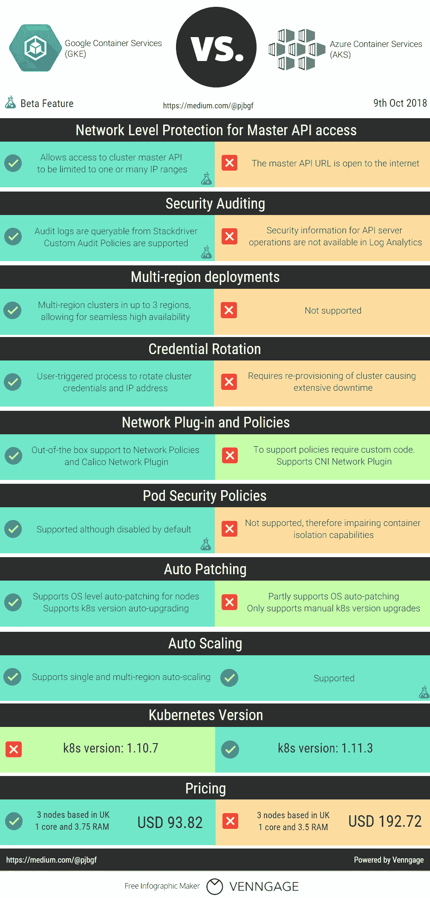

# AKS vs GKE 安全摊牌

> 原文：<https://itnext.io/reasons-why-you-should-not-settle-for-aks-before-checking-gke-aea329be1586?source=collection_archive---------5----------------------->

## 从安全角度对微软和谷歌的托管 Kubernetes 解决方案进行简单比较。

微软将 Azure Kubernetes 服务发布到公众预览版已经将近一年了。我花了相当多的时间研究 AKS 解决方案，你可以在这里阅读我的[早期帖子。](/how-a-naughty-docker-image-on-aks-could-give-an-attacker-access-to-your-azure-subscription-6d05b92bf811)

鉴于 AKS 已于几个月前在[正式上市](https://www.infoq.com/news/2018/06/kubernetes-microsoft-aks)，我想将其与其最大的竞争对手:谷歌的 GKE 进行比较，该产品现已成为生产级产品超过 3 年。

作为一名安全专家(或安全偏执者)，并考虑到两者都是托管服务，关键的比较点将围绕内置的安全特性。这是我想到的:

通过目前支持的安全功能，GKE 看起来比 AK 安全得多。在过去的 3 年里，GKE 一直在不断改进，达到了现在的水平。

在安全领域之外，新的挑战者带来了一些[有趣的功能](https://azure.microsoft.com/en-gb/blog/introducing-dev-spaces-for-aks/)和与其工具集的无缝集成[。如果微软保持良好的工作(和投资)，几年后 AKS 可能会赶上它的对手。](https://docs.microsoft.com/en-us/visualstudio/deployment/tutorial-kubernetes-tools?view=vs-2017)

就目前而言，尽管两者都被宣传为普遍可用，但很明显 AKS 需要一些严肃的安全增强措施，以使其适用于任何接近个人数据或支付卡信息的东西。

所用的价格是基于撰写本文时每个提供商的在线计算器显示的价格。有关最新数据，请查看以下链接:

[https://azure.microsoft.com/en-gb/pricing/calculator/?service=kubernetes-service](https://azure.microsoft.com/en-gb/pricing/calculator/?service=kubernetes-service)

[https://cloud.google.com/products/calculator/](https://cloud.google.com/products/calculator/)