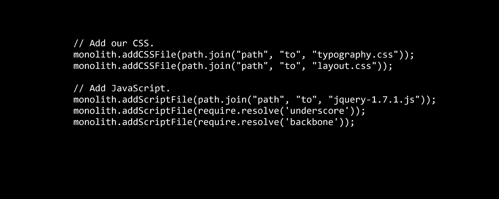

# 重建巨石柱

> 原文：<https://itnext.io/rebuilding-the-monolith-59e54614f070?source=collection_archive---------8----------------------->

当构建前端应用程序时，我们可以用一种新的、更奇特的技术来重建我们的整体。然而，没有什么花哨的时髦词汇能拯救我们免于建造一块巨石的后果。

[*点击这里在 LinkedIn* 上分享这篇文章](https://www.linkedin.com/cws/share?url=https%3A%2F%2Fitnext.io%2Frebuilding-the-monolith-59e54614f070)

在我们深入这篇文章之前，我想快速提醒一下，思考你的作品是在什么样的背景/组织和项目的哪一部分中形成的是多么重要。在某些情况下，一个整体可能是一个比替代品更好的主意。

# 代码的组织

因此，您决定为您的前端架构创建一个前端应用程序。您有一个开发团队在前端工作。项目的文件夹结构应该是什么样的？

按文件类型组织文件相当容易。在 react with redux 中，这意味着您将至少拥有文件夹:*动作、reducers、容器、组件*。在 Angular 中，您可能熟悉另一种结构:*基于组件的架构*，如 [**John Papa**](https://johnpapa.net/angular-2-styles/) **所述。**各部件遵循 [**稳固**](https://en.wikipedia.org/wiki/SOLID_(object-oriented_design)) 的原则。

基于类型的文件组织很好，因为它消除了命名组件和组织哪个文件属于哪个组件的大量开销。如果你想制作一个 MVP 或者在一个开发团队中工作，这可能是一个不错的选择。

# 在规模化环境中工作

当你在一个规模更大的环境中与多个团队一起工作时，这应该是独立的，在同一个前端应用程序上，这变得更加棘手。你可以开始将你的项目分成不同的*包*别名*大组件。*重要的是，这些*包*及其组件中的每一个都只能在一个有限的上下文中运行，就像我们从 [**领域驱动设计**](https://martinfowler.com/bliki/BoundedContext.html) 中所知道的那样。这是因为它有助于降低团队的耦合度，提高团队的自主性，但是它确实会在项目计划中增加一些时间开销。然而，在软件的整个生命周期中，以稳定的开发速度和可维护性的形式，这种规划可能是一种可靠的投资。

不做计划会导致代码腐烂，降低开发速度，最终导致整个项目被抛弃。

# 把所有的放在一起

每个*包*都可以看作是一个微服务，可以用不同的方式单独发布。一个核心项目可以通过诸如 [**Webpack**](https://webpack.js.org/) 之类的工具消费所有发布的包。一个有趣的方法是由项目 [**single-spa**](https://github.com/CanopyTax/single-spa) 完成的，它也是框架不可知的。根据你所做的，你可能会得到一个分布式的整体。然而，不同的方法和它们各自的缺陷值得一文讨论。