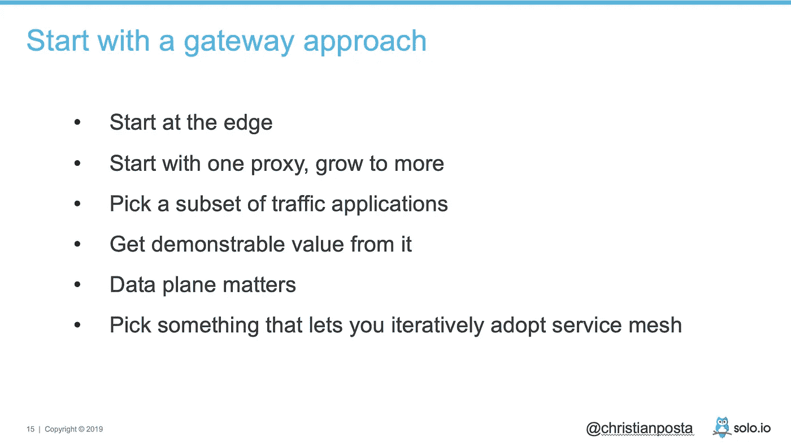
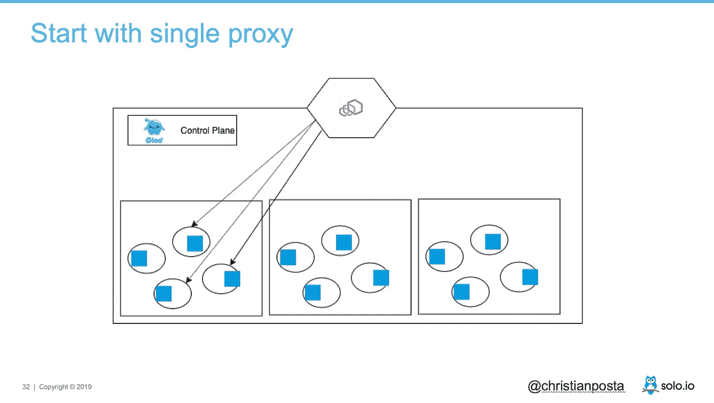
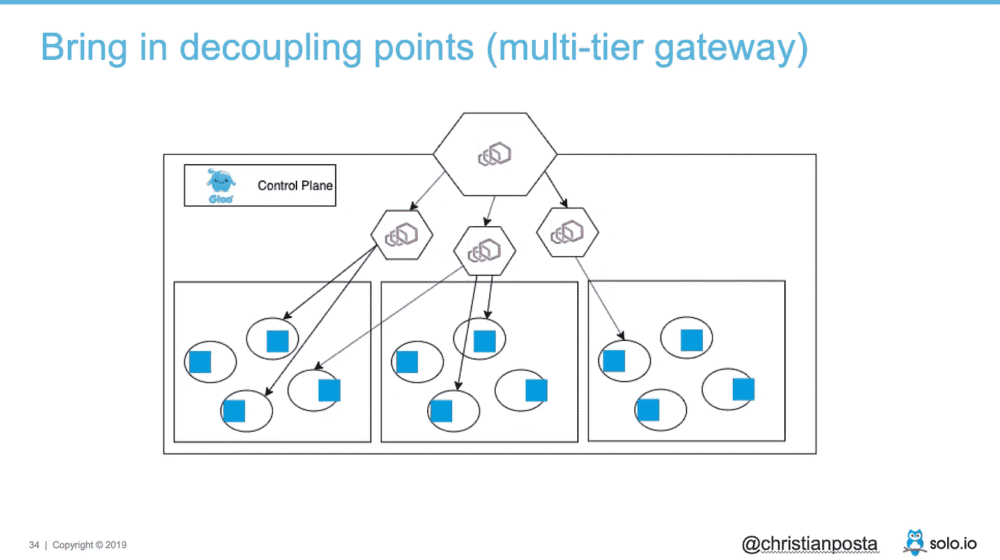
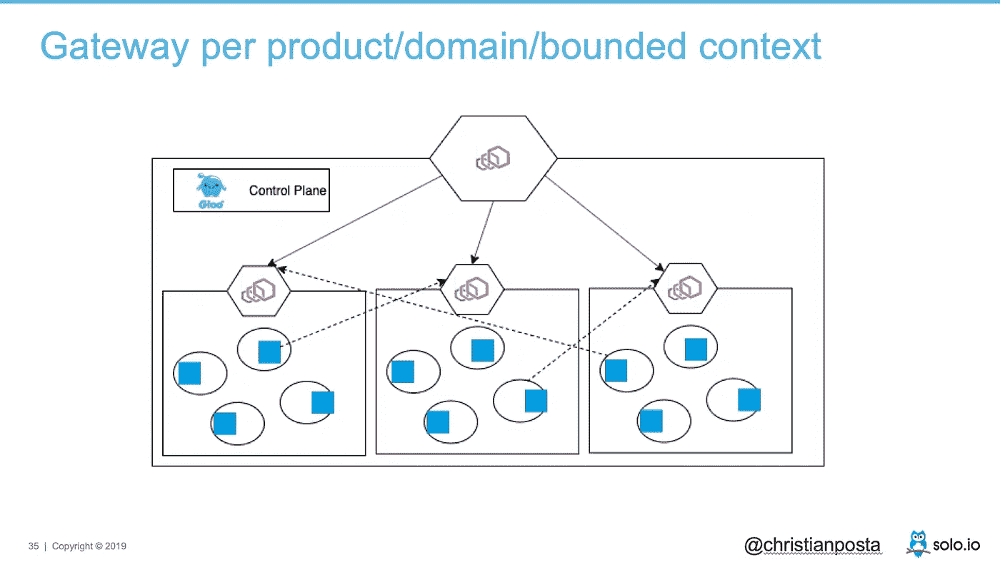
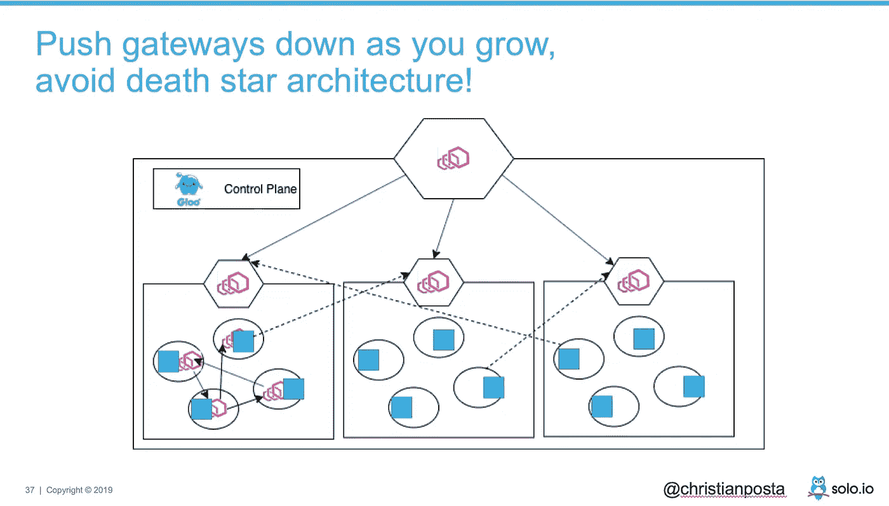
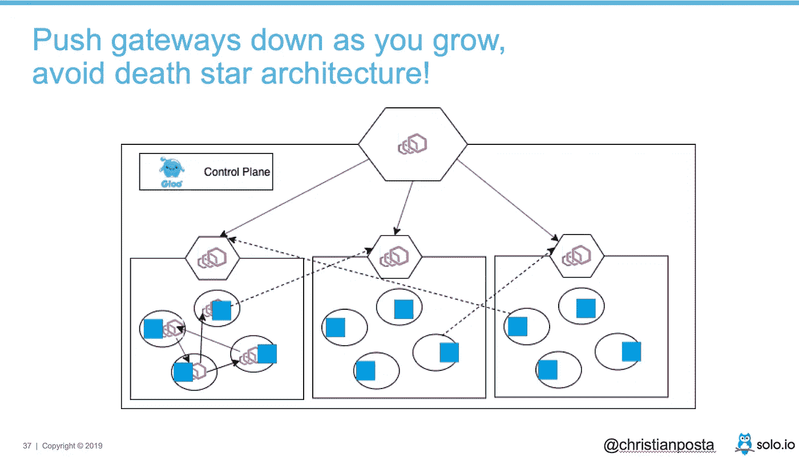
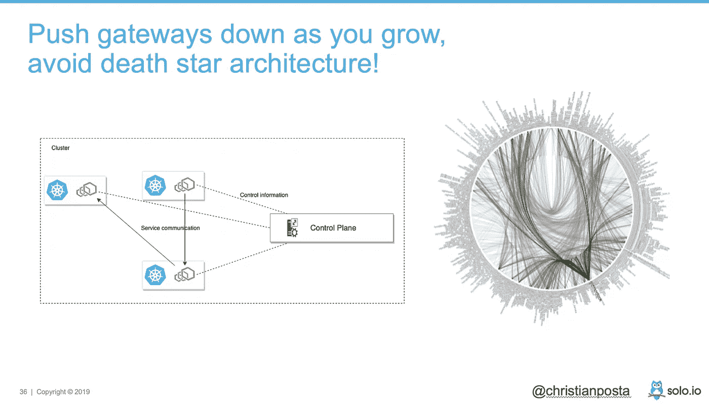

# 企业组织采用服务网格面临的挑战

> 原文：<https://itnext.io/recently-i-wrote-a-piece-for-dzone-and-their-migrating-to-microservices-report-on-the-challenges-d2165d8b9168?source=collection_archive---------1----------------------->

最近我为 DZone 和他们的迁移到微服务报告写了一篇关于在企业组织中采用服务网格的挑战的文章。在那篇文章中，我们首先要解决的问题之一是“您是否应该走上采用服务网格的道路”,我是这么说的:

> 以一个“不”的回答开始。如果您刚刚开始使用微服务和少量服务，请确保首先准备好基础部分。微服务及其相关基础设施是一种优化，使您能够更快地对应用程序进行更改。在没有服务网格的情况下，您可以朝着更快的方向大步前进。您甚至可能想要一个没有所有复杂性的服务网格带来的一些好处。看看 Gloo 之类的东西，它是一个基于 Envoy 代理的 API 网关。

我认为目前这是一个非常重要的考虑，原因有二:

1.  通常，服务网格实现还没有准备好投入生产
2.  全身心投入服务网络的复杂性仍然很高

这并不意味着有团队在成功地使用服务网格，或者你应该远离它。我确实认为，当你准备好了和你的情况可以从中受益的时候，你应该建立最终在*引入网状网络的能力。例如，在报告中，我列出了您*可能想要使用*服务网格的原因:*

*   跨多个集群大规模部署微服务
*   容器/k8 和虚拟机的混合部署
*   用于构建服务的语言的异构部署
*   网络可观测性的不完整和不一致的观点

即使这样，你也会面临这些挑战:

*   选哪个？
*   谁来支持它？
*   单个集群中的多租户问题
*   没有管理多个集群的好方法
*   适合现有服务(边车生命周期、比赛条件等)
*   开发人员和运营人员之间的界限是什么
*   非集装箱环境/混合环境
*   集权与分权

在过去两年多的时间里，我一直在帮助人们解决这些难题(顺便说一句，如果你想聊天/需要这些方面的帮助，请联系 [@christianposta](http://twitter.com/christianposta?lang=en) ),但我在我们的客户/用户中一直观察到的一件事，以及一段时间以来一直建议的一件事是，你采用服务网格应该总是从采用某种隔离级别的数据平面技术(即，单独)开始，以了解它是如何工作的

例如，在我最近的一次演讲中，我说从 Envoy 开始(Envoy 是许多服务网格实现的底层数据平面技术)。这是幻灯片:

从架构的角度来看，可能是这样的:

当然，如果你打算使用 Envoy，我[推荐从 Gloo](https://medium.com/solo-io/getting-started-with-a-service-mesh-starts-with-a-gateway-96384deedca2) 开始，它基本上是一个[企业级 Envoy 发行版，带有 edge 和 API 网关](https://gloo.solo.io/)功能，可以很好地嵌入到服务网格中。一旦您有了合适的位置，并对它感到满意，那么您就准备增加使用，甚至可能通过代理的分层引入一些隔离:

下一个连续的方法是将网关下推到您的应用程序架构中。我们看到我们的用户也采用了每个应用程序边界一个网关的方法，这开始给人一种“网状的感觉”，但对应用程序有一些结构(例如，遵循 [API 网关模式](https://medium.com/solo-io/api-gateways-are-going-through-an-identity-crisis-d1d833a313d7))。我开始称之为“路点”架构。就像飞行员使用航路点来指导他们的飞行计划一样，这些网关为您的架构增加了结构，同时解决了安全性和 API 解耦等南北交通问题，同时为成功采用服务网格奠定了基础。

最后，您可以开始在独立于边界的应用程序中引入服务网格代理，以解决服务网格最适合的棘手的服务到服务通信挑战:

这里重要的部分是网关仍然服务于一个非常有用的目的！它们向您的架构添加结构和路径点，同时在需要的地方从其余服务中分离和隐藏某些实现细节。在许多方面，这遵循了 DDD 有界上下文模型，网关提供了“反腐败”层。否则，如果您只是将所有服务视为对等，您将开始稳步向死亡之星前进:

希望这有助于通过从小处着手，在有意义的地方缓慢扩展，为服务网格的成功奠定基础，并在您能够消费并从中获得价值时，将网格的全部力量带到您的应用程序中。否则，您可能会一下子引入太多的复杂性，这将超出您对应用程序和基础架构进行现代化改造的意图。如果您有任何其他想法或评论，请联系( [@christianposta](http://twitter.com/christianposta?lang=en) )！