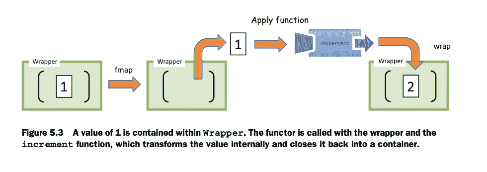

# 识别功能模式:函子

> 原文：<https://itnext.io/recognising-functional-patterns-functors-for-dummies-2a829c875767?source=collection_archive---------4----------------------->

函子是实现 map()函数的结构。它被用作用户想要转换的特定数据/结构的上下文包装器。

我们传递给函子的结构可以是任何类型，但是在这篇文章中，我将演示一个获取数据列表的函子。(函子无处不在，这里可以找到几种函子类型[)。](https://blog.ploeh.dk/2018/03/22/functors/)

我们可以将仿函数看作是一种结构，我们需要这种结构来将一个项目从一组值 A 传递到另一组值——比如说 B(我们通过使用 map()函数来实现这一点，该函数迭代给定的数据并将其转换为其他数据)。

因为仿函数返回上下文(在我的面向类的解决方案中它自己的一个新实例..)我们可以永远保持映射(或者直到我们得到想要的数据类型)

```
someArray
  .map(f1)
  .map(f2)
  .map(f3)
```

## 识别模式的用例:

我将软件 [**设计模式**](https://en.wikipedia.org/wiki/Software_design_pattern) 视为一套工具，根据需要完成的必要工作进行组合。

当编写软件时，我们可以**将**代码中的某些部分识别为设计模式候选，这可以使代码更加独立/分离、可重用和讲故事。

在面向对象的概念中，这些是**“GOF 设计模式”**，它们被分为**创造型、结构型**和**行为型**(并且要务实！在基于 lang as JS 的原型中，我们不需要全部甚至大部分。

除此之外，还有功能模式。

如果我们想到一个对**仿函数**的 OOP 引用，我们可以想到**访问者**模式，这是一种将算法与其操作的对象结构分离的方式(我喜欢这个[引用](https://github.com/thma/LtuPatternFactory#visitor--foldable))。

在 visitor 实现中，我们提供了在给定结构上操作的 visit()方法——如果该结构接受它(实现了一个调用 visitor.visit()的函数),但访问包装不会返回新的结构，它将修改现有的结构(与仿函数不同)。

当我们以迭代的方式使用 visitor 时(这通常是用例，当在树上运行时是递归的，例如“标记”节点),它会提醒函子的 map 函数。

```
**for** (**const** **orange** **of** oranges) {
        orange.accept(visitor);
    }
```

我也想到了用户赋予地图的变换函数形式的**策略**模式，但我不想误导任何人，那只是一种看法。

## 关于函数式编程的一句话:

IMO 函数式编程是关于-

*   编写总是输出结果的纯函数，这样我们就可以编写声明性的(可组合的)代码。
*   使用[高阶函数](https://en.wikipedia.org/wiki/Higher-order_function) s(抽象)。
*   保持函数没有副作用(并且在可能的情况下保持不变)。
*   编写自己的组合/管道抽象实用程序等..
*   代数数据类型帮助我们涵盖所有可能的情况(对于和与积)。
*   表达我们事业的类型/类型系统！通过定义函数的类型。

但是还有更多的基于范畴论和抽象代数的概念。

[**函子**](https://bartoszmilewski.com/2015/11/17/its-all-about-morphisms/) 就是其中之一，所以让我们尽量简化它，直到实现一个列表函子。

函子的类型定义应该是通用的，而不是像我的例子中那样绑定到某个类型。

## 函子定义

根据 Luis Atencio 的书[“JavaScript 中的函数式编程—如何改进您的 JavaScript 程序”](https://www.amazon.com/Functional-Programming-JavaScript-Javascript-Techniques/dp/B07KFPZLQ6/ref=tmm_aud_title_sr?_encoding=UTF8&qid=&sr=)

> “本质上，函子只不过是一种数据结构，您可以映射函数，目的是将值提升到包装器中，修改它们，然后
> 将它们放回包装器中。这是一种设计模式，定义了 fmap 应该如何工作的语义。下面是 fmap 的一般定义:
> fmap :: (A - > B) - >包装器(A) - >包装器(B)”

下面的插图也取自这本书:



**数组**数据结构包含 map()，(和其他用于转换的高阶函数)，使用 map 函数我们修改给定的数据并返回一个新的数组引用和修改后的数据(另一个包装器)，我们可以这样做下去！

```
**class** MyFunctorContext<T> {

    **items**: T[];

    **constructor** (items: T[]) {
        **this**.**items** = items
    }

    map(transformFn: <T, V> (arg: T) => V ): MyFunctorContext<T> {
        **const** newItems = [];

        **for** (**const** item **of this**.**items**) {
            newItems.push(transformFn(item));
        }

        **return new** MyFunctorContext(newItems);
    }
}
```

如何使用:

```
**const *bananas***: **any** = [
    {**isYellow**: **true**},
    {**isYellow**: **false**},
    {**isYellow**: **true**},
    {**isYellow**: **false**}
    ];

**const *myTypedFunctor*** = **new** MyFunctorContext(***bananas***);

**const *bestBananas*** = ***myTypedFunctor*** .map((banana: **any**) => {
    **if** (banana.**isYellow**) {
        banana.**tasty** = **true**;
        **return** banana;
    }
    banana.**tasty** = **false**;
    **return** banana;
});
```

所以理论上这很棒，但是我实际上从来没有发现使用它的需要，数组<t>让我得到了掩护..</t>

在 Haskell BTW 中，map()表示为:

```
(a -> b) -> [a] -> [b]
```

第一个参数:(a -> b)表示一个采用类型“a ”(可以是任何类型)并返回类型“b”的函数

第二个参数是“a”类型的列表

返回值是“b”类型的列表

另一个使用仿函数的例子可以在 **D3** 中找到，我用这个库做了很多工作，我似乎认识到了“**选择**API 形式的仿函数模式，查看[这篇文章](http://www.dreadedsoftware.com/blog/2016/1/16/d3js-is-a-functor-over-the-dom)。(选择总是返回选择的新引用)

以下是可运行的示例:

如果你觉得那个帖子有意思，我推荐你看看我下面的帖子:

[](/a-short-time-learning-haskell-can-shortly-improve-your-typescript-skills-523505900ac0) [## 短时间学习 Haskell 可以很快提高您的打字技能！

### 键入任意函数！仿制药太牛逼了！😎 👏哈斯克尔为了更大的利益。

itnext.i](/a-short-time-learning-haskell-can-shortly-improve-your-typescript-skills-523505900ac0) [](/exploring-the-mixin-pattern-by-code-1dbe5e3124eb) [## 探索 Mixin 模式→按代码

### 让我们混合一些类型脚本类

itnext.io](/exploring-the-mixin-pattern-by-code-1dbe5e3124eb) [](/d3-selections-in-depth-40b8b36ef738) [## D3 深度选择

### 输入→选择

itnext.io](/d3-selections-in-depth-40b8b36ef738) 

也欢迎你深入我的[游乐场回购](https://github.com/LironHazan/advanced-patterns-in-typescript/blob/master/functional/algebric-data-types.ts)来掌握一些更多的功能概念。

干杯，勒荣。