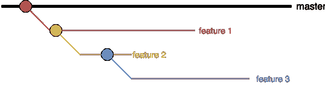

# 避免合并冲突的建议

> 原文：<https://itnext.io/recommendations-to-avoid-merge-conflicts-845ec133676e?source=collection_archive---------1----------------------->


由 [Fancycrave](https://unsplash.com/@fancycrave?utm_source=medium&utm_medium=referral) 在 [Unsplash](https://unsplash.com?utm_source=medium&utm_medium=referral) 上演的《黑色织布机》

通常当您合并两个分支时，您的版本控制系统可以解决差异并自动合并它们。然而，当分支有竞争提交时，你的版本控制系统需要**你的介入**来决定在最终的合并中合并哪些变更。打招呼合并冲突。

在这篇文章中，我讨论了一组对我很有用的建议，它们最大限度地减少了合并冲突的数量，或者至少减少了解决冲突的难度和时间。

# 那听起来不太坏

不应轻视合并冲突的几个原因是:

*   他们**花钱**。开发人员花费在解决可避免的合并冲突上的时间是浪费时间。既然时间就是金钱，合并冲突就要花钱。
*   他们制造挫败感。当合并冲突发生时，在最坏的情况下，所有这些活动可能已经发生了:

```
1\. Developer(s) has created a new feature.
2\. Other developers code reviewed that feature.
3\. Developer(s) addressed CR comments.
4\. Developer(s) tested the feature.
5\. QA tested the feature.When a merge conflict happens, the process from above needs to be re-done after the conflicts are resolved. Best case scenario it restarts from **4**, worst case scenario starts from **1** if the conflicts include conflicting business logic.
```

*   它们增加了衰退的可能性。这一点尤其重要，因为合并冲突往往发生在开发周期的末尾(如果你使用 Scrum 的话，就是 Sprint ),对问题做出反应的时间更少。
*   在分布式团队中，合并冲突更有可能发生并且更有影响。

# 哪些方面导致了合并冲突？

根据我的个人经验，以下是一些增加合并冲突可能性的非技术方面:

a.处理**大功能**。
b. **大型**开发**团队**。
c. **分发**开发**团队**。
d. **跨开发团队的无效沟通**。如果其他方面存在，这更有可能发生。

就个人而言，我必须承认，我是在一个有 a-c 存在的环境中发布后开始写这篇文章的，在那里我们也遇到过几次 d:

a.我们制作了一部主要的电影。我们是两个团队，每个团队有 5 名和 4 名开发人员(你可能会说这不是一个大团队),一起工作。我们分布在 3 个不同的时区:CST、EST 和 CEST。

# 研究

我通过两条研究路线来解决这个问题:

1.  看看是否有特定的分支策略可以缓解这个问题。为了这一部分，我查阅了脸书和微软等大型科技公司以及 Trello、Basecamp 和 Toptal 等远程公司的工程博客。
    我发现了微软的两个非常有趣的帖子，推荐阅读:i) [定义你的分支和合并策略](https://msdn.microsoft.com/en-us/library/bb668955.aspx)和 ii) [分支和合并初级读本](https://msdn.microsoft.com/en-us/library/aa730834%28v=vs.80%29.aspx)。
2.  Hudl 有很强的远程文化。我的大多数同事都有在分布式团队中工作的经历。因此，我联系了 [**Hudl**](https://www.hudl.com/) 的**其他开发人员，他们在像我这样的分布式远程环境中工作，向我学习他们的经验。如同第 1 点。找不到银弹选项。然而，这些对话促成了本文中列出的建议。**

# 研究成果

正如您可能已经意识到的那样，在消除合并冲突方面没有什么灵丹妙药。我发现的最有效的预防方法是:

1.  **尽快提高对潜在冲突领域的认识**。
2.  创建并处理**小任务**，这样发生有影响的合并冲突的几率就会降低。
3.  **经常同步**你的特色分支**。**

**在下一节中可以找到更全面的建议列表。如前所述，没有灵丹妙药。你可能知道列表中的大部分项目，如果不是全部的话。但是我仍然认为把它们放在一个地方是有用的，这样更容易参考和记忆。**

# **最小化合并冲突的发生和影响的建议**

***注意:此列表中的一些项目假设使用*[*git flow*](https://www.atlassian.com/git/tutorials/comparing-workflows/gitflow-workflow)*作为分支策略。***

*   ****未雨绸缪:**尽早识别潜在的冲突领域。如果你使用 Scrum，使用你的计划、提炼和站立来识别这些重叠的区域。如果你使用任何其他方法，无论何时你计划或思考你和你的同事下一步要做什么。**
*   **如果预见到有问题的合并冲突，评估**不同的故事/任务分解方法**是否可以避免它们。在那种情况下，你可能会发现[神盾局](https://pbs.twimg.com/media/DDwWjn_XcAEyPcW.jpg)会有所帮助。**
*   ****越小的任务&功能**，合并冲突的几率就越小。**
*   **尽快合并你的特征分支。如果他们完成了，不要让他们挂在那里。
    如果您的团队认为可以增加一项增强功能，那么合并您当前的分支(如果它已经增加了价值),并为该增强功能创建一个新的分支。**
*   ****经常将特征分支与主同步**。**
*   ****不要分支过深**。您将增加执行每个合并和解决潜在冲突的时间。意思是，避免这样的情况:**

****

**不要分支太深**

*   **构建你的分支树，这样你就**最小化了兄弟分支重叠的机会**。你的目标应该是沿着层级合并；即，将子节点合并到父节点，而不是 2 个兄弟分支。**
*   **请注意**计划并行的工作越多，合并冲突的可能性就越大。****
*   **如果合并冲突**不可避免，提前计划一些时间**以确保你正确地解决它们和它们潜在的副作用。**

**这在团队规模和分布的所有情况下对我们都很有效。什么对你很有效？请留下你的评论，一如既往，欢迎反馈！Twitter 也永远是一个选择；) [@JuanjoRamos82](https://twitter.com/JuanjoRamos82)**

***本文原贴于 Hudl* *中的* [*。*](https://medium.com/in-the-hudl/recommendations-to-avoid-merge-conflicts-62ebd73db969)**

**如果你不是这样，那就有更大的问题了。**