# 企业软件开发人员和架构师的必读书目

> 原文：<https://itnext.io/recommended-reading-list-for-enterprise-software-developers-and-architects-b77c905b2dbd?source=collection_archive---------0----------------------->

这个阅读列表的目标读者是企业软件开发人员和架构师。我选择专注于系统设计、数据建模、安全性、devops、过程、创造力和计算机科学基础，这些对大多数软件工程师来说都是必不可少且普遍有用的。对于那些对培养软技能感兴趣的人，可以看看我的另一篇文章，关于有效的架构师和开发人员的 7 个习惯。享受，快乐阅读，并让我知道你的想法！

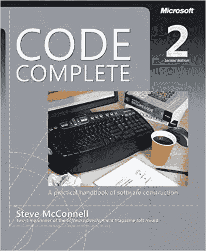

*   [**代码完成**](http://a.co/iJfYwjq) 作者[史蒂夫·麦康奈尔](https://twitter.com/stevemconstrux)——这本关于软件设计、构建和工艺的全面、经典的巨著经受住了时间的考验。McConnell 对隐喻、架构、调试、质量保证和道德规范的讨论非常精彩，在云环境中仍然具有相关性，可以对复杂系统进行故障排除，修复安全缺陷，并与不同的团队进行协作。我最喜欢的谚语是:量两次，切一次。访问 [Construx 博客](http://www.construx.com/Blog_Main/)获取更多关于培养成功的软件开发组织的信息。

*   Erich Gamma，John Vlissides 等人的 [**设计模式**](http://a.co/36jdsJS)——四人组在 20 世纪 90 年代推广了面向对象设计模式，这本书记录问题、解决方案和示例的风格被广泛复制。如果您需要用 C++、C#、Java 或 Python 等语言编写 OO API 或 SDK，您必须理解并实践这些对象创建模式(例如工厂、单例、构建器)、结构化关系(例如适配器、复合、外观)和动态行为(例如命令、解释器、中介器、观察者、策略、模板、访问者)。面试官经常会问一些关于 OODP 的问题，所以，是的，这本书会帮助你写出更好的软件，让你得到更好的工作。

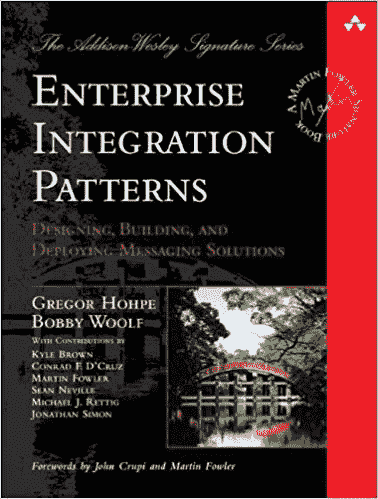

*   Gregory Hohpe 著 [**企业集成模式**](http://www.enterpriseintegrationpatterns.com/)——这本书分类介绍了集成信息系统的设计原则和实现模式，主要关注消息传递。随着越来越多的应用程序诞生在云中并与其他云系统集成，在分布式计算的[谬误的背景下，应用消息类型(如事件、文档、命令)、通道、管道、过滤器、翻译器、路由器、关联 ID、过期、回调返回地址、总线、代理、桥、包装器、规范数据模型、死信队列、窃听等概念是必不可少的。](https://en.wikipedia.org/wiki/Fallacies_of_distributed_computing)

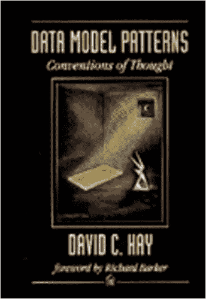

*   大卫·海的 [**数据模型模式**](http://a.co/2cbq0YQ)——这本相对不为人知的书涵盖了实体关系(ER)数据建模，并对不同的业务场景进行了分类，从会计到库存管理，再到实验室科学等等。这本书非常简洁，内容清晰，信息量大，是对逻辑数据库设计的一个很好的介绍，这是一个人软件开发生涯的长期构建模块技能。

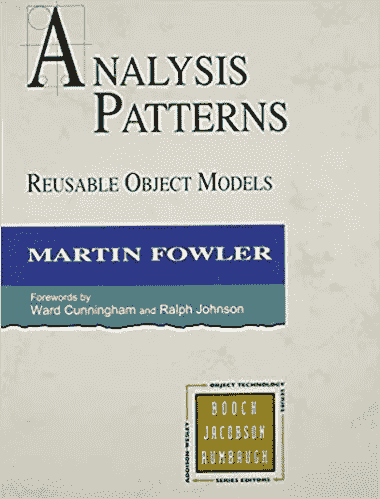

*   [**马丁·福勒的分析模式**](http://a.co/i92SpN3)—福勒已经写了许多好书，但是这最后一个关于功能系统设计的建议是特别的，因为它在不同业务领域(例如会计、库存、科学测量、交易)中的实际对象模型的目录，并且因为它强调了[坚实](https://en.wikipedia.org/wiki/SOLID_(object-oriented_design))原则的明智实践而引人注目。它是前面提到的数据模型模式一书的完美 OO 伙伴。

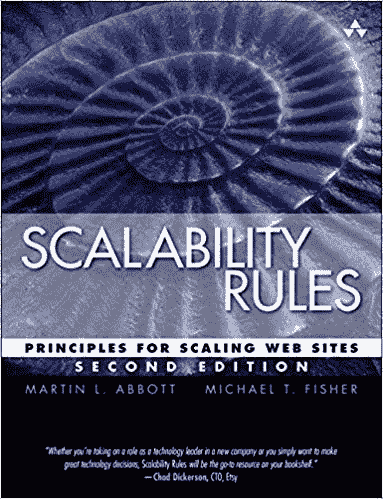

*   马蒂·阿博特[迈克尔·费舍尔](https://twitter.com/MikeFisher_Fish)的 [**可伸缩性规则**](http://a.co/dE3tqfK)——这本性能初级读本提供了关于扩展平台、人员和流程的极好建议。一些最重要的技巧是避免过度工程化，应用冗余，将功能分离到微服务中，利用缓存，设计无状态，容忍故障，异步通信，以及从错误中学习。更多详情请访问我的媒体[评论](https://medium.com/@bishr_tabbaa/book-review-scalability-rules-6f7ef5a2052a)。

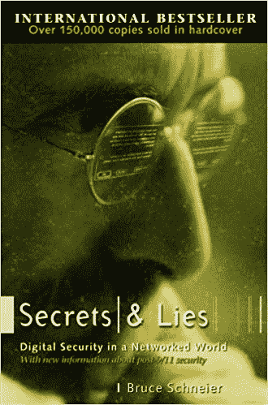

*   [**秘密与谎言**](http://a.co/5Kx81kM) 作者[Bruce Schneier](https://twitter.com/schneierblog)——自从这本出色的计算机安全入门书问世以来，安全已经从封底移到了头版。虽然它对技术、流程和人员问题的覆盖可能对某些人来说过于宽泛和过时，但 Schneier 将引导您从多个维度和层面思考安全性。

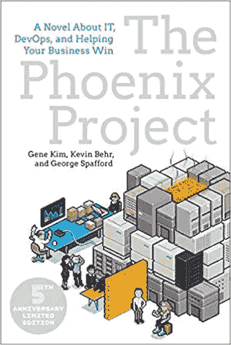

*   Gene Kim 撰写的 [**凤凰计划**](http://a.co/3CA5mGc)——这本书是一个关于敏捷、开发和精益的故事，它大致基于 Goldratt 写的目标。这既是对业务和 It 文化一致性(通常缺乏一致性)的思考，也是保持正常运转(运营的重点是可靠性、安全性和性能)与重建(业务和发展的重点是创新、增长和试验)之间的调和。虽然这个故事是虚构的，但它听起来比大多数案例研究都真实，因为它反映了在技术和组织债务的背景下，许多人都有用更少的资源做更多事情的常见摩擦经历。这是一本有趣的快速读物，将激励您改进 It 运营和业务。

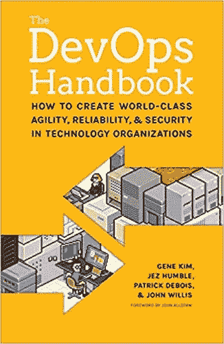

*   Gene Kim，Jez Humble 等人的《DevOps 手册》——这本书是凤凰计划的非虚构工程后续，深入探讨了三种方法的原理和实践:流动、反馈和持续学习/实验。世界顶级软件公司使用的这些实践包括按优先级选择工作，使工作可见(例如看板)，限制在制品(WIP)，使用小批量和小间隔，自动化构建、测试和部署，用遥测技术检测系统，合并假设和 A/B 测试，在整个项目中为系统评审和团队学习预留时间，以及在整个 SDLC 中集成安全性/合规性问题。

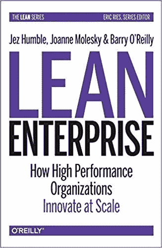

*   [**精益企业**](http://a.co/iIxDEio) 作者 [Jez Humble](https://twitter.com/jezhumble) 和 Barry O ' Reilly——将敏捷、DevOps 和精益创业原则应用于大型企业并不容易，但这本为 IT 产品所有者和服务经理编写的内容广泛的书讨论了快速探索客户问题、尝试解决方案并取得长期成功的理论和实践。

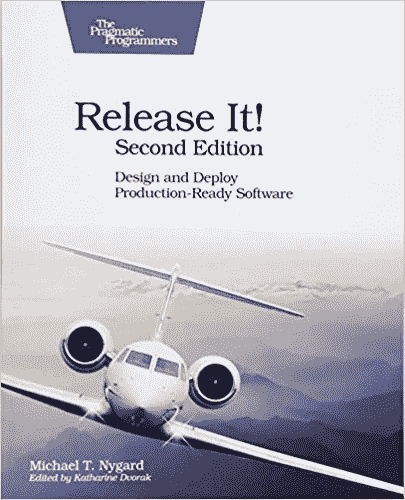

*   [**发布 It**](http://a.co/2A467o6) 作者 Michael ny gard——设计和开发 It 系统是成功的一半；另一半是在真实的生产环境中发布和操作它。如果你讨厌在凌晨 3 点或周末接到支持电话，那么这本书就是为你准备的。它对稳定性与脆弱性、模式与反模式、容量规划、联网、安全性、可用性、日志记录和管理的讨论与技术无关，值得在整个 SDLC 中重新审视。
*   Steve McConnell 的《软件项目生存指南》(Software Project Survival Guide)**——这本常青的书讨论了分阶段交付计划、全面的清单、客户和解决方案提供商的“权利法案”、项目失败的迹象、增加团队流动状态和减少干扰、镀金、不确定性的圆锥、成本-质量-进度的百慕大三角、变更控制过程、定期分享好的和坏的消息，以及需求、风险、团队人员和利益相关者沟通的持续管理，所有这些仍然是正确的。虽然与敏捷和 Scrum 的当代时尚相比，它所建议的项目仪式的级别是沉重的，并且可能太像瀑布了，但这本书里有许多明智的谚语，并且清单对技术领导和项目经理特别有帮助。**

**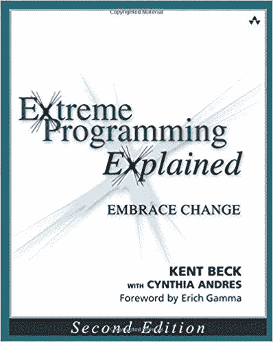**

*   **[**XP 解释**](http://a.co/iKtsPa4) 作者[肯特·贝克](https://twitter.com/KentBeck) —这句精辟深刻的格言像我职业生涯中的其他几个人一样影响了我对软件项目管理的日常思考。它从价值观(沟通、简单、反馈、勇气、尊重)开始，扩展到原则(期权理论和经济学、流程、质量、小步走、多样性、和谐、平衡)，然后阐述支持实践。虽然[有些](http://www.drdobbs.com/the-irony-of-extreme-programming/184405651)认为后者[有争议](http://www.softwarereality.com/lifecycle/xp/index.jsp)，但我的经验是，这些实践提高了生产力，减少了压力，并使工作尽可能有趣:坐在一起并保持在一起的跨职能团队，没有死亡行军的可持续工作时间表，结对编程，具有季度里程碑的双周冲刺，在截止日期前取消低优先级项目而不是铅镀，持续集成的自动化构建，测试驱动开发(TDD)，与实际客户的定期检查点，进化设计和重构，以及代码的共同责任(而不是个人所有权)。关于对文本的字面误读，我的两点看法是，2-3 个冲刺应该被记录为书面故事，应该有一些预先的设计，并谦逊地承认 ***事情会改变*** 。**

**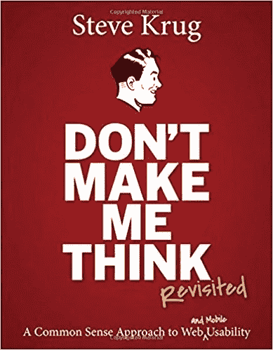**

*   **[**不要让我想到**](http://a.co/81EJiu9) 作者[史蒂夫·克鲁格](https://twitter.com/skrug)——如果你只看了一本关于可用性的书，那就翻出这本最近针对移动和可访问性问题而更新的经典著作。简短，聪明，有趣，实用，这是对以用户为中心的设计和可用性的介绍，将解释网页设计的原则，DIY UX 测试，培养用户好感，以及避免宗教辩论的提示，这些辩论会偏离 UI 需求讨论。**
*   **爱德华·德·博诺的《严肃的创造力》——作者在几十年前向大众推广了创造力的实践。横向思维、6 顶帽子、创造性停顿、挑衅(逃避、否定、扭曲、夸大、一厢情愿)、挑战、随机输入、替代方案、垫脚石、细丝和分层等概念是为业务流程和模型生成和探索新想法的结构化方法。**

****

*   **[**数据库系统概念**](http://a.co/6kAhgDk) 作者 Abraham Silberschatz——这本教科书超越了日常的 SQL 和 ERD 习惯用法，深入到 RDBMS 的内部，如存储、索引、查询处理、事务、并发控制和恢复。还有关于并行性、分布式数据库和对象数据库的高级讨论。许多云系统和开源组件使用所有这些想法，理解它们是很重要的。**

**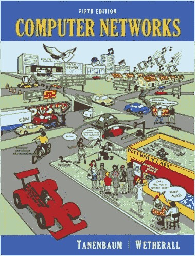**

*   **[**计算机网络**](http://a.co/9QBHmcK) 丹尼尔·坦南鲍姆(Daniel Tannenbaum)了解计算机网络是设计、交付、保护和排除高性能企业 IT 系统故障的关键技能，对于通过互联网进行交互的云中的分布式节点更是如此。本教材详细介绍了从物理层到应用层的整个 7 层堆栈、包括 DNS、HTTP、TCP/IP 和 UDP 在内的互联网、网络安全，以及物理层的不同选择(铜缆、光纤、无线电、卫星等)。**

**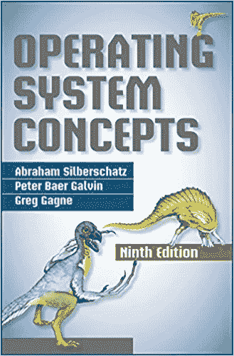**

*   **Abraham Silberschatz 的 [**操作系统**](http://a.co/c7fQoTl)——这本教科书涵盖了进程管理、内存/存储管理、I/O、并发控制、安全性和分布式系统的核心概念，然后通过一系列说明性的案例研究。在我的职业生涯中，这本优秀的书中的观点帮助了我对系统的推理。**

**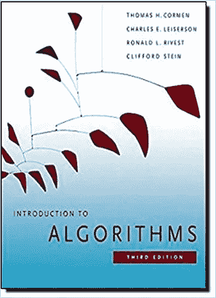**

*   **[**Cormen、Leiserson 和 Rivest 的《数据结构和算法**](http://a.co/5P0bQyJ)》——这本教科书和最终推荐数十年来也一直是顶级计算机科学课程的支柱。它涵盖了渐近符号，集合论，计数和概率，排序，哈希表，树，栈，队列，列表，图形，以及更高级的主题，如矩阵运算，数论，动态编程，贪婪算法，字符串匹配，NP-完全性，等等。在我们这个快速变化的领域中，很少有知识领域是既有用又长久的，但是这本书里的思想在我的职业生涯中帮助了我对计算的推理。**

***欣赏文章？关注我的* [*中的*](https://medium.com/@bishr_tabbaa) *和* [*推特*](https://twitter.com/bishr_tabbaa) *获取更多更新。***